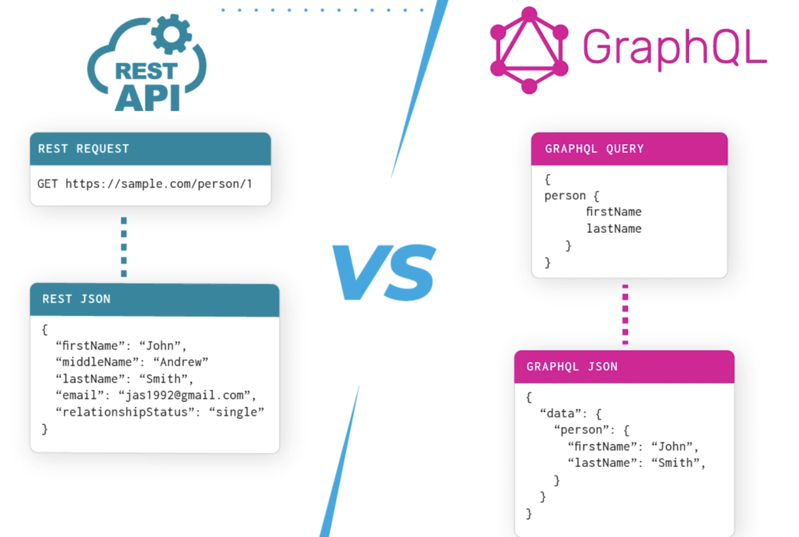

GraphQL API - это язык запросов и среда выполнения для API, который позволяет клиентам запрашивать только те данные, которые им нужны, и получать их в одном запросе. 

Его главная задача — сделать взаимодействие с API более гибким и эффективным по сравнению с традиционным REST. 


Ключевая особенность GraphQL в том, что у него единая точка доступа (один endpoint), и клиент в запросе сам описывает структуру нужных данных. В основе  строгая система типов — схема, которая определяет, какие данные доступны и в каком виде. 

Основные строительные блоки — это Query (получение данных), Mutation (изменение данных) и Subscription (подписка на обновления в реальном времени)

Технология была разработана внутри Facebook для их мобильных приложений и с 2015 года стала открытой

-------
## суть

**REST API** - У каждого  свой номер эндпоинта.
нужно узнать инфу о пользователе — ты долбишься на `/users/123`. 
хочешь его данные — идёшь на `/users/123/orders`
хочешь товары из заказа — на `/orders/456/items`
в итоге, чтобы собрать одну страницу, ты делаешь 3-4 запроса 
и получаешь всегда полное "меню": даже если тебе нужен только емейл юзера, сервер кинет тебе всю простыню — имя, дату рождения, адрес, телефон. Это называется ==over-fetching== (избыточность) 

**GraphQL** — это как шведский стол, где ты говоришь: "Мне от пользователя айди и емейл, а от его заказов — только дату и цену, и всё это за один подход"
Шлёшь один запрос на один эндпоинт (типа `/graphql`), и сервер отдаёт только то, что ты попросил
никакого перебора (over-fetching) и недобора (under-fetching) — всё четко 
жизнь стала проще, особенно для мобил, где каждый лишний байт на счету

-----
Где используется GraphQL API - ВЕЗДЕ

 GraphQL выбирают там, где важна скорость разработки, гибкость и производительность клиентских приложений (особенно мобильных) при работе со сложными и связанными данными

---------

#### пример запрос/ответ

ЗАПРОС
```http
POST /graphql HTTP/1.1
Host: your-target-site.com
Content-Type: application/json
Content-Length: 228

{
  "query": 
  
  "{\n  user(id: 123) 
  
  {
  
  \n    id
  \n    email
  \n    orders 
  
  {
  
  \n      date
  \n      total
  \n      items 
  
  {
  
  \n        name
  \n        price
  \n      }
  \n    }
  \n  }
  
  \n
  
  }"
  
}

```

ОТВЕТ
```http
HTTP/1.1 200 OK
Content-Type: application/json
Content-Length: 242

{
  "data": {
    "user": {
      "id": 123,
      "email": "wiener@example.com",
      "orders": [
        {
          "date": "2026-03-05",
          "total": 271.0,
          "items": [
            {"name": "Пиво", "price": 120.50},
            {"name": "Чипсы", "price": 150.50}
          ]
        }
      ]
    }
  }
}
```

--------




----

##  Синтаксис и Функции 

- **Три кита**: `query` (получить), `mutation` (изменить), `subscription` (подписка на обновления в реальном времени)
   
- **Поля (Fields)**: Просто имена данных, которые хочешь получить (например, `name`, `email`)
   
- **Аргументы (Arguments)**: Уточняют запрос, идут в скобках: `user(id: 123)`
   
- **Псевдонимы (Aliases)**: Позволяют запросить одно поле несколько раз с разными аргументами в одном запросе, давая им уникальные имена (например, `firstUser: user(id:1)`)
   
- **Фрагменты (Fragments)**: Наборы полей, которые можно переиспользовать в разных запросах
   
- **Переменные (Variables)**: Динамические значения, передаваемые отдельно от запроса
   
- **Introspection (Самоанализ)**: Встроенная функция для получения полной схемы API. Это главный инструмент разведки
   
- **Suggestions (Подсказки)**: Функция некоторых серверов, которая в ответе на ошибочный запрос может подсказать правильное название поля. Помогает угадывать структуру


## Способы атак - некоторые


### Общие имена конечных точек

- `   /graphql`
- `/api`
- `/api/graphql`
- `/graphql/api`
- `/graphql/graphql`

#### 1 Поиск эндпоинта

 Используй **универсальный запрос** `query{__typename}`. 
 Если в ответе есть `{"data": {"__typename": "query"}}` — ты нашел GraphQL
 `/graphql`, `/api`, `/api/graphql` и т.д. Пробуй GET и POST запросы
   

#### 2 ==IDOR== (Insecure Direct Object Reference) — через аргументы

- **Суть**: Сервер не проверяет права доступа при прямом указании объекта
   
- **Пример**: Если в ответе на запрос продуктов не хватает `product(id: 3)`, отправь этот запрос напрямую. Если сервер вернет данные — это IDOR
   
```json
   {"query": "{ product(id: 3) { id, name, listed } }"}
```
   

#### 3 ==Introspection== разведка схемой

- Зондирование: `{"query": "{__schema{queryType{name}}}"}`  проверяет, включен ли самоанализ
   
- Полный сбор данных: Используй полный introspection query (он есть в статье и в тулзах типа Burp, InQL)
- В ответе получишь ==полную схему API: все типы, поля, мутации==
- Это золотая жила для атакующего
   
- oбход защиты introspection=-
   
    - вставляй новую строку или пробел после `__schema`: `query{__schema\n{queryType{name}}}`
   
    - пробуй другой метод запроса (GET вместо POST), если защита стоит только на один метод


## один общий запрос для разведки
```json
query IntrospectionQuery { __schema { queryType { name } mutationType { name } subscriptionType { name } types { ...FullType } directives { name description args { ...InputValue } onOperation #Often needs to be deleted to run query onFragment #Often needs to be deleted to run query onField #Often needs to be deleted to run query } } } fragment FullType on __Type { kind name description fields(includeDeprecated: true) { name description args { ...InputValue } type { ...TypeRef } isDeprecated deprecationReason } inputFields { ...InputValue } interfaces { ...TypeRef } enumValues(includeDeprecated: true) { name description isDeprecated deprecationReason } possibleTypes { ...TypeRef } } fragment InputValue on __InputValue { name description type { ...TypeRef } defaultValue } fragment TypeRef on __Type { kind name ofType { kind name ofType { kind name ofType { kind name } } } }
```

http://nathanrandal.com/graphql-visualizer/   - визуализотор   GraphQL

#### 4 Suggestions — угадывание структуры

- **Суть**: Если сервер выдает подсказки вроде 
- «Ты имел в виду `productInfo`?», можно автоматизировать сбор схемы (инструментом вроде **Clairvoyance**) даже при выключенном introspection
   

#### 5. Aliases — обход rate limiting

- **Суть**: Один HTTP-запрос может содержать десятки или сотни операций, если использовать псевдонимы.
    
- **Пример**: Брутфорс промокодов в одном запросе вместо 1000 отдельных.
    
    json
    
    {
      "query": "query isValidDiscount($code: Int) { 
        isvalidDiscount(code:1111){valid},
        d2:isValidDiscount(code:2222){valid},
        d3:isValidDiscount(code:3333){valid} 
      }"
    }
    

#### 6 CSRF (Cross-Site Request Forgery)

- **Суть**: Если эндпоинт принимает запросы в формате, который легко подделать в браузере (например, GET-запросы или POST с `x-www-form-urlencoded`), злоумышленник может заставить жертву выполнить мутацию (например, сменить email).
    

### 💡 Что еще нужно знать

- **Инструменты**: Burp Suite (с расширениями типа **InQL Scanner**) умеет автоматически находить эндпоинты, проверять introspection и строить запросы
    
- **Визуализация**: Ответ introspection-запроса удобно смотреть в **GraphQL визуализаторах** , чтобы быстро понять связи в схеме
    
- **Главная защита**: В продакшене нужно отключать introspection и suggestions, валидировать аргументы (IDOR), считать сложность запросов (не только их количество) для rate limiting и использовать CSRF-токены

----------------


