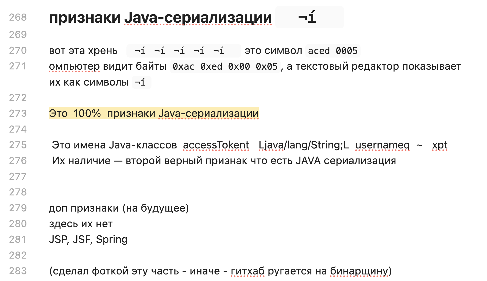

чтобы определить что есть возможность для такой уязы
нужно проверить все данные что на сайт приходят
если там есть намеки на это?
функции или десириал строки? у кажд яз свой формат

далее два подхода:

либо мы меняем обьект - редактируем байты

либо писать скрипт на данном языке который создат обьект

---

примитив пример: как можно редактировать атрибуты в байтах

сайт хранит сериализ обьект User с куками юзера этого
после расшифровки
`O:4:"User":2:{s:8:"username";s:6:"carlos";s:7:"isAdmin";b:0;}`

можно подменить 0 на 1, и типо получить доступ к админке если сайт так проверяет (что бред, но для баналь примера сойдет)

-------

представим, что у  в программе есть сложный объект (например, профиль юзера с кучей полей). 
>	**Сериализация** - это процесс превращения этого объекта в плоскую последовательность байтов (типа строки или бинарного кода), чтобы его можно было легко:

- Сохранить в файл или базу данных
    
- Передать по сети другому компоненту приложения
    

>**Десериализация** - это обратный процесс. 
	Когда программа берет этот поток байтов и восстанавливает из него точную копию исходного объекта со всеми его полями и значениями, чтобы с ним можно было работать дальше. В разных языках это называют по-разному: в Ruby — маршалинг, в Python — пиклинг
	типо парсим просто

------------------
кодирую в байты <-> декодирую обратно в обьект

----

Самая главная беда возникает, когда сайт десериализует данные, которые контролирует пользователь (например, куки, скрытые поля форм). Это дает атакующему возможность подсунуть программе специально сформированный, злой объект

--------

тут самое интересное: программа десериализует **любой** объект, класс которого есть в её распоряжении, а не только тот, который ожидала. Это называется **инъекция объектов (object injection)**.

Атака может произойти **прямо во время десериализации**, еще до того, как программа начнет использовать восстановленный объект. Поэтому даже строгая типизация языка не спасает, если код сам дергает какие-то методы в процессе восстановления

--------

### последствия

- **Удаленное выполнение кода (RCE)** — самое страшное
    
- **Эскалация привилегий** — например, можно подменить объект пользователя на админа
    
- **Доступ к файлам** — чтение или запись любых файлов на сервере
    
- **DoS-атаки** — убить сервер

-------------

### защита

Если есть возможность, ==**вообще не десериализуй данные от юзера**==. Это самый топовый совет.

либо:

1. **Проверяй целостность.** Используй цифровые подписи, чтобы убедиться, что данные не были изменены. Но проверять нужно **ДО** начала десериализации.
    
2. **Не используй стандартные методы.** Лучше написать свои методы сериализации для каждого класса, чтобы контролировать, какие поля сохраняются.
    
3. **Не пытайся залатать все гаджеты.** Это бесполезно, их слишком много. Помни: уязвимость — это сама десериализация недоверенных данных, а не наличие гаджет-чейнов.

-------------
------------
----------

тоже самое, другими словами:

### 1. Теория

Представь, что ты — великий скульптор (разработчик). Ты создал прекрасную статую (объект в памяти программы). Но тебе нужно отправить её на выставку в другой город (передать по сети) или просто убрать в гараж на хранение (сохранить в файл/базу данных). Статую целиком тащить тяжело и неудобно.

Что ты делаешь? Ты её **замораживаешь** — превращаешь в контейнер с кубиками льда (байты), который удобно грузить в фуру. (отправлять в БД в этом виде) Этот процесс превращения статуи в ледяные кубики и есть **СЕРИАЛИЗАЦИЯ

В другом городе получатель забирает контейнер, **размораживает** кубики и собирает из них точно такую же статую. Это процесс сборки из кубиков (байтов) обратно в объект — **ДЕСЕРИАЛИЗАЦИЯ**

В программировании то же самое. У нас есть сложные штуки — **объекты** (например, "Пользователь", "Корзина покупок"). Чтобы сохранить их или отправить другу, мы превращаем их в простую строку или набор байтов. Это как сериализовать статую в лего-конструктор.

**Определения для пентестa ():**

> **Сериализация** - процесс преобразования объекта (структуры данных) в формат, пригодный для хранения или передачи (байтовый поток, XML, JSON, строка PHP) 
    
> **Десериализация** - обратный процесс: восстановление объекта из этого формата 
> короч - это вид парсинга
    
> **Небезопасная десериализация** - это когда программа доверяет "контейнеру с кубиками", который пришел от пользователя, и не проверяет, не подменил ли злоумышленник ледяные кубики на взрывчатку 
    

----

если просто:

- **Сериализация** — разбор лего-замка нахуй на кирпичики (объект -> байты/строка)
    
- **Десериализация** — сборка говна обратно (байты/строка -> объект)
    
- **Небезопасная десериализация** — когда мент на границе не проверил, не подсунул ли ты вместо лего кирпичиков взрывчатку

-------
### 2. Кто есть кто: Языки и их "магические ящики" 

У каждого языка программирования есть свой любимый способ упаковывать объекты (Сериализация). Это как разные транспортные компании со своими правилами и фирменными контейнерами.

- **PHP**: 
- Его метод - тупая строка. Функция `serialize()` берет объект и хуячит в строку
- функция `serialize()`, которая превращает объект в строку вроде `O:4:"User":2:{s:3:"age";i:25;s:4:"name";s:5:"Vasya";}`
- Обратная функция — `unserialize()`. И вот это **пиздец**. Потому что дядя Петя доверяет любому, кто ему позвонит. Если звонишь ты и диктуешь: "Записывай: Объект, имя RCE, метод — system('rm -rf /')", дядя Петя послушно создаст такой объект и выполнит!

    
- **Java**: Тут серьезный подход. Объекты упаковываются в бинарный формат через `ObjectOutputStream.writeObject()`. 
- На входе - `ObjectInputStream.readObject()` . 
- Самый сок - это когда они используют "магические" библиотеки вроде `CommonsCollections`, которые становятся частью нашей атаки.
	Самое жирное в Java — **Gadget Chains** (цепочки гаджетов). Представь, что ты собираешь бомбу не из тротила, а из канцелярских скрепок, которые лежат в каждом офисе. По отдельности скрепка — хуйня. Но если их правильно соединить, можно хуякнуть так, что полрайона вздрогнет. В Java есть библиотеки типа Apache Commons Collections, которые работают как эти скрепки. Ты их собираешь в ysoserial (спец-инструмент) и получаешь пейлоад, который при десериализации выполняет твою команду

    
- **Python**: Тут свой ящик под названием **`pickle`**  
- Да, блядь, называется "рассол".
- Процесс называется "пиклинг" (pickling) и "анпиклинг" (unpickling). Python также любит играться с YAML (`PyYAML`), что тоже может быть опасно 
    ы делаешь `pickle.dumps(obj)` и получаешь байты. Потом `pickle.loads(байты)`. Звучит безобидно, но если ты скормишь `loads` злой байт-код, он выполнит всё, что там написано. Python — он доверчивый, как ребенок
    Еще Python любит YAML. Библиотека `PyYAML` с опцией `yaml.load()` (без SafeLoader) - это тоже открытый люк для ракеты.

- **Ruby**: Их ящик называется `Marshal` . Команды `Marshal.dump()` и `Marshal.load()`.
Работает примерно так же, как у других. Найдешь `load` от юзера — считай, зашел.

	
- **.NET**: У них есть `BinaryFormatter`, а также `JSON.NET` с опцией `TypeNameHandling`, которая превращает JSON в настоящую бомбу замедленного действия 
    

### 3. В чем тут опасность 

Если разработчик просто взял и разобрал (десериализовал) данные, которые прислал пользователь, не проверив их, то для взлома это открывает широчайший простор для творчества 

типо можно в байтах целую прогу передать 

Какие атаки можно провернуть?

1. **Изменение данных (Object Injection)**: Самый простой пример. Представь, что сайт хранит в куке твои права доступа в сериализованном виде. Ты находишь эту куку, десериализуешь ее (мысленно), видишь внутри что-то типа `s:8:"isAdmin";b:0;` (isAdmin = false), меняешь 0 на 1, сериализуешь обратно, подсовываай сайту - и вуаля, ты админ! 
    
2. **Удаленное выполнение кода (RCE)**: Это высший пилотаж. Ты создаешь свой хитрый сериализованный объект, который, при разборе его программой, заставит ее выполнить твою команду, например, `calc.exe` или `rm -rf /`. Как это работает? В дело вступают **Gadget Chains** (цепочки гаджетов).
    

### 4. "Gadget Chains" — Цепочки, ведущие к RCE 

Ты не можешь просто так взять и запихнуть в объект функцию `exec()`. Она там не сработает. Вместо этого ты используешь кусочки кода, которые **УЖЕ ЕСТЬ** в самом приложении или в библиотеках, которые оно использует (например, в Apache Commons Collections для Java). Эти кусочки называются **гаджетами (gadgets)** 

По отдельности каждый гаджет делает что-то безобидное. Но если их собрать в правильную цепочку (chain), они приведут к выполнению системной команды. Это как собрать бомбу из деталей детского конструктора, которые валяются в каждой песочнице

**Примерная цепочка (упрощенно для Java):**  
Один гаджет умеет вызывать метод, второй =выполнять рефлексию, третий - запускать процесс. Ты собираешь объект так, что при его десериализации автоматически дергается первый гаджет, тот дергает второй, второй - третий, и БАХ - на сервере выполняется твоя команда.

### 5. Как искать и чем ломать 

**Как найти уязвимость:**

- **Ищи подозрительные строки/байты**: В HTTP-запросах ищи бинарные данные (в Java они часто начинаются с `rO0AB...` в base64) или специфические строки, как в PHP  Смотри на куки, скрытые поля (`hidden`), параметры, которые выглядят как сериализованные данные.
    
- **Смотри исходники**: Если есть доступ, ищи функции типа `unserialize()`, `readObject()`, `pickle.loads()`, `Yaml.load()`. Проверяй, откуда берутся данные для этих функций.
    
- **Используй сканеры**: Есть крутые бурп-расширения, например, **Java Deserialization Scanner Они помогут автоматически определить, есть ли дыра.
    

**Чем ломать:**

- **ysoserial**: Для Java это священный грааль. Тула, которая генерирует пейлоады под разные гаджет-чейны 
    
- **PHPGGC**: То же самое, но для PHP.
    
- **ysoserial.net**: Соответственно, для .NET.
    

Ты просто подсовываешь сгенерированный пейлоад в уязвимый параметр и ждешь результата.

### 6. Итого

> Небезопасная десериализация — это не просто "баг", это **портал в ад**, который разработчики оставляют открытым. Она позволяет атакующему превратить безобидную, казалось бы, операцию "разморозки" объекта в тотальный контроль над сервером.

#### ПРИМЕРЫ

## PHP

В PHP строковый формат, в котором 
буквы обозначают тип данных,  
цифры — длину каждой записи

----------пример---------

до
$user->name = "carlos"; 
$user->isLoggedIn = true;

после
O:4:"User":2:{s:4:"name":s:6:"carlos";s:10:"isLoggedIn":b:1;}

разбор
- `O:4:"User"` - Объект с 4-символьным именем класса `"User"`
- `2` - Объект имеет 2 атрибута
- `s:4:"name"` - Ключ первого атрибута — 4-символьная строка `"name"`
- `s:6:"carlos"` - Значение первого атрибута — 6-символьная строка `"carlos"`
- `s:10:"isLoggedIn"` - Ключ второго атрибута — 10-символьная строка `"isLoggedIn"`
- `b:1` - Значение второго атрибута — логическое значение `true`

---------

## Java

в Java используют двоичные форматы сериализации. 
Их сложнее читать
характерные признаки:

сериализованные объекты Java всегда начинаются с одних и тех же байтов, которые кодируются как `ac ed` в шестнадцатеричном формате и `rO0` в формате Base64

Любой класс, реализующий интерфейс `java.io.Serializable`, может быть сериализован и десериализован

readObject() -  для чтения и десериализации данных из InputStream

## Главные правила защиты:

1. **Никогда не доверяй данным от юзера!** Не десериализуй ничего, что пришло от него, без суровой проверки 
    
2. **Используй подписи**: Если очень надо, подписывай сериализованные данные, чтобы убедиться, что их не подменили 
    
3. **Allowlist**: Если без десериализации не обойтись, разрешай разбирать только строго определенные типы объектов. Все остальное — мимо кассы 
    
4. **Не используй нативные форматы**: По возможности, пользуйся простыми форматами вроде JSON и XML без расширенных возможностей по смене типа

#### Инструментарий

- **Java**: ysoserial ( [https://github.com/frohoff/ysoserial](https://github.com/frohoff/ysoserial) ) — священный грааль. Генерит пейлоады под все популярные гаджеты.
    
- **PHP**: PHPGGC ( [https://github.com/ambionics/phpggc](https://github.com/ambionics/phpggc) ) — то же самое, но для PHP.
    
- **.NET**: [ysoserial.net](https://ysoserial.net/)
    
- **Burp Suite**: Расширение **Java Deserialization Scanner** — оно само найдет дыру и даже подберет пейлоад

-----------

## признаки Java-сериализации  (вот этот символ)

(сделал фоткой эту часть - иначе - гитхаб ругается на бинарщину)

-----
