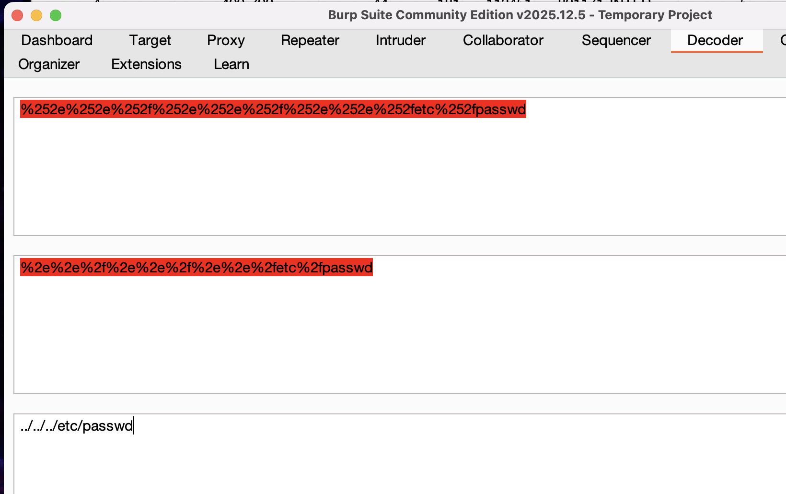

https://portswigger.net/web-security/file-path-traversal/lab-superfluous-url-decode

в этой лабе нужно также достать файл /etc/passwd
но теперь тут более умный фильтр который неплохо фильрует все варинты!
и потребует обфускация!
я как раз подготовил пейлоад список для такого случая!

мой пейлоад сразу нашел уязвимые пейлоады
```
GET /image?filename=%252e%252e%252f%252e%252e%252f%252e%252e%252fetc%252fpasswd
```

и такой 

```
GET /image?filename=%252e%252e%252f%252e%252e%252f%252e%252e%252fetc%252fpasswd
```


сработало простое двойное кодирование!



сервер позволил с приличной скоростью перебирать, и не заблокировал меня!

смысл лабы в том, что двойная URL кодировка иногда может сработать!
